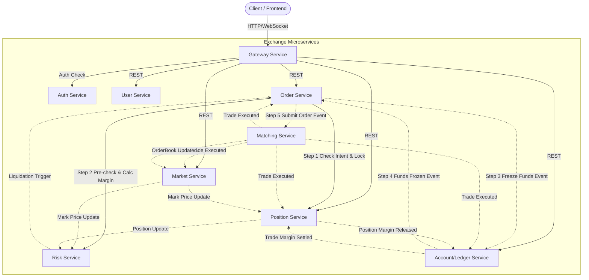

# Open Exchange Core - 虛擬貨幣合約交易所核心系統

本專案是一個專為高併發、低延遲場景設計的金融交易核心系統。透過自主研發的分散式協議與內存撮合技術，解決了現代交易所面臨的一致性、擴展性與稽核痛點。

## 🚀 核心技術特性

### ⚡ 極致效能與確定性鏈路
* **LMAX 確定性撮合引擎**：採用 **LMAX Disruptor** 架構模式，透過無鎖隊列 (Lock-free Buffer) 極大化單核吞吐量，達成微秒級的確定性撮合延遲。
* **單次 WAL 寫入與快照恢復**：優化 IO 鏈路實現 **單次 WAL (Write-Ahead Logging) 順序寫入**，在確保強持久化的同時，將磁碟 IO 影響降至最低。結合快照機制，達成秒級容災恢復。
    * 🎥 [WAL 容災測試演示](https://www.youtube.com/watch?v=ZWwiQsdZz84)
* **高併發與架構解耦**：核心鏈路（撮合、結算、風控、一致性）全面解耦，支援行情與資產服務橫向擴展交易集群。
    * 🎥 [自動化整合測試交易鏈路演示](https://www.youtube.com/watch?v=dn5fbFdlFOQ)

### 🤖 AI 親和 SDK 架構 (AI-Driven Architecture)
* **Context 負載極小化**：將複雜的框架配置與底層邏輯封裝於 SDK 內部。AI Agent 僅需理解簡潔的規範介面即可編寫代碼，大幅節省 Token 消耗並提升生成準確度。
* **結構化數據關聯**：全面採用規範化 Event 封裝與自動 Trace ID 注入。透過建立數據間的關聯性，協助 AI 更精準地理解業務流程並進行自動化故障定位。
* **單一事實來源介面 (SSOT)**：透過 Interface 共享技術，達成客戶端與服務端校驗規則 100% 同步，減少 AI 在跨服務開發時的重覆理解與溝通成本。
* **高階邏輯抽象 (Task Wrapper)**：提供專門的 `task-service` 封裝分佈式事務狀態管理，讓 AI 專注於開發核心業務邏輯，而不受繁雜的狀態流轉干擾。
    * 🎥 [AI 時代下的架構設計：SDK 如何成為核心](https://www.youtube.com/watch?v=yHxeaZEK_t0)

### 💰 金融級會計與動態資產負債建模
* **動態資產負債表建模**：內置交易所級金流會計模組，支援多種數位資產動態建模。此架構能透過數據關聯主動定位異常，將「事後審計」轉化為「即時風控」。
    * 🎥 [實時資產負債表操作演示](https://www.youtube.com/watch?v=MYQobecR8DA)
* **多維度自動對帳 (Future-Ready)**：已建置深層數據關聯基礎，支持未來擴展至包含撮合流水、錢包餘額、帳務分錄與第三方結算的多層次核對，實現數據一致性自癒。
* **專業審計與查帳賦能**：提供專業會計所需的查帳工具，支援利用複式簿記技巧進行深度追蹤，可重建任一時刻的財務快照，確保 100% 數據完整性與可追溯性。
* **全場景帳戶視圖**：針對多幣種、多倉位資產提供高度結構化的全景展示，協助財務團隊達成秒級對帳，大幅降低人工稽核成本至趨近於零。

### 🛡️ 分散式一致性：自研 Flip Protocol
* **終結資源爭搶的「隱形調度」**：實作基於 **Flip 邏輯** 的分散式事務協議，專門對付分散式環境中最棘手的 **Resource Stealing (資源衝突/竊取)** 困境。它能像智慧大腦一樣，在毫秒間化解多節點對同一資源的爭奪。
    * 🎥 [Flip Protocol 邏輯解析與實作](https://youtu.be/R9S6q3e9xgw)
* **打破效能瓶頸的最終一致性**：不同於傳統共識協議的沉重負擔，Flip Protocol 在維持金融級 **最終一致性** 與 **交易原子性** 的同時，仍能保持驚人的吞吐量。

### 🌐 響應式 Web 交易終端 (Web Trading Terminal)
* **現代化交易體驗**：基於 **React 19**、**Ant Design 5** 與 **Tailwind CSS** 打造的高性能交易介面，支援響應式佈局與深色模式。
* **簡潔高效的交互**：透過優化後的 REST 輪詢機制實現數據同步，確保在最小化系統負擔的同時維持良好的數據即時性。
    * 🎥 [Web 交易終端演示 (React / Ant Design)](https://www.youtube.com/watch?v=MYQobecR8DA&t=67s)

### ☸️ 雲原生自動化運維 (DevOps)
* **極致開發體驗**：提供一鍵 K8s 集群建置、IDEA 直連遠端 K8s 調試、全環境統一配置與智能 CI/CD 流程。
    * 🎥 [K8s 集群快速建置實戰](https://www.youtube.com/watch?v=kvOtuF93q2s&t=1896s)
* **極致資源控制**：經過深層優化，整個集群僅需 [**8.3 GB 內存**](https://1drv.ms/i/c/095e0f59106abb25/IQC4eVXKMxlLQYRJIKax9TRiAem6GldZCpNL-5IgXm8Gz2A?e=2ccROi) 即可穩定運行。
* **全面觀測能力**：集成高效能監控 SDK、自動化告警與擴容機制，全面覆蓋撮合情境與資產帳戶核對。
    * 🎥 [高效能全棧監控與指標治理](https://www.youtube.com/watch?v=t4foO-PD3eI)

---

## 🏗️ 系統架構圖 (System Architecture)

本系統採用異步事件驅動與強一致性協議（Flip Protocol）建構，確保交易鏈路的高吞吐與資產安全。



## 📦 核心微服務清單 (Core Services)

| 服務名稱 | 職責描述 |
| :--- | :--- |
| **`Matching`** | **核心撮合引擎**：基於 LMAX Disruptor 的高性能內存撮合系統。 |
| **`Order`** | **訂單管理**：處理訂單生命週期、委託檢核與狀態流轉。 |
| **`User / Auth`** | **用戶與認證**：使用者資料管理與基於 JWT 的安全認證中心。 |
| **`Account`** | **資產帳務**：負責清算、結算與金融級複式簿記帳務處理。 |
| **`Position`** | **倉位管理**：維護使用者持倉、強平價格計算與保證金校驗。 |
| **`Risk`** | **風險控制**：動態計算帳戶風險指標，執行強平指令與風控預警。 |
| **`Market`** | **行情服務**：聚合成交數據，提供 K 線、訂單簿與標記價格推送。 |
| **`Gateway`** | **統一網關**：請求路由、負載均衡、CORS 處理與限流。 |

---

## 🛠️ 如何開始與建置環境

本專案提供高度自動化的建置腳本，僅需少許步驟即可在本地端拉起完整的交易所基礎設施。

### 1. 準備環境
* **操作系統**：建議使用 Linux 或 macOS (Windows 用戶請使用 WSL2)。
* **必要工具**：
    * **JDK 21+** (建議使用 Temurin)。
    * **Docker** 與 **kind** (用於建立本地 K8s 集群)。
    * **kubectl**

### 2. 快速啟動集群
```bash
# 1. 建立 K8s 集群
kind create cluster --name exchange

# 2. 執行一鍵啟動腳本
bash ./script/cluster-up.sh
```
腳本執行時提供以下選項（可組合輸入，如 `123`）：
* **選項 1：基礎設施 (Default Infra)** - 自動建置 Ingress, Nacos, MySQL, Redis, Kafka 等。
    * *依賴工具*：`kubectl`, `docker`
* **選項 2：持續部署 (ArgoCD)** - 自動安裝與配置 GitOps 環境。
    * *依賴工具*：`kubectl`, `argocd` CLI, `nc` (netcat)
* **選項 3：全棧監控 (Monitoring)** - 部署 Prometheus、Grafana 與 Alertmanager。
    * *依賴工具*：`kubectl`

> 💡 **提示**：詳細步驟可參閱 [手動建置文件](doc/手動建置.md)。
### 3. 本地直連 K8S 調試 (Telepresence)
為了讓開發機直接訪問 K8S 內網服務（如 `*.cluster.local`）並從 IDE 直接調試，建議安裝 Telepresence：
* **安裝 (Linux)**：
  ```bash
  sudo curl -fL https://app.getambassador.io/download/tel2/linux/amd64/latest/telepresence -o /usr/local/bin/telepresence
  sudo chmod a+x /usr/local/bin/telepresence
  ```
* **部署 Traffic Manager 到叢集**：
  ```bash
  telepresence helm install
  ```
* **連接集群**：
  ```bash
  telepresence connect
  ```
* **效果**：連接後，您可直接訪問 `http://infra-nacos.default.svc.cluster.local:8848` 或在本地 IDE 執行服務並直連 K8S 內的資料庫與中間件。

### 4. 啟動 WEB 服務與訪問
1. **進入前端目錄**：`cd service/exchange/exchange-web`。
2. **快速啟動**：執行 `bash quick-start.sh`。該腳本會自動安裝依賴並引導您設定後端 API 地址（預設為 `http://localhost:12345`）。
3. **瀏覽訪問**：開啟 `http://localhost:5173` 即可進入交易所操作介面。
4. **演示連結**：🎥 [Web 交易終端交互演示 (React)](https://www.youtube.com/watch?v=MYQobecR8DA&t=67s)

### 5. 訪問監控儀表板
啟動 Telepresence 後，可直接透過以下網址訪問（無需額外配置 Hosts）：
* **Grafana**: `http://grafana.monitoring.svc.cluster.local:3000` (帳密: `admin/admin123`)
* **Prometheus**: `http://prometheus.monitoring.svc.cluster.local:9090`
* **Nacos**: `http://infra-nacos.default.svc.cluster.local:8848`
* **Redpanda (Kafka UI)**: `http://redpanda-console.default.svc.cluster.local:8080`


---

## 📄 開源協議
本專案採用 [Apache-2.0 License](LICENSE.md) 授權。