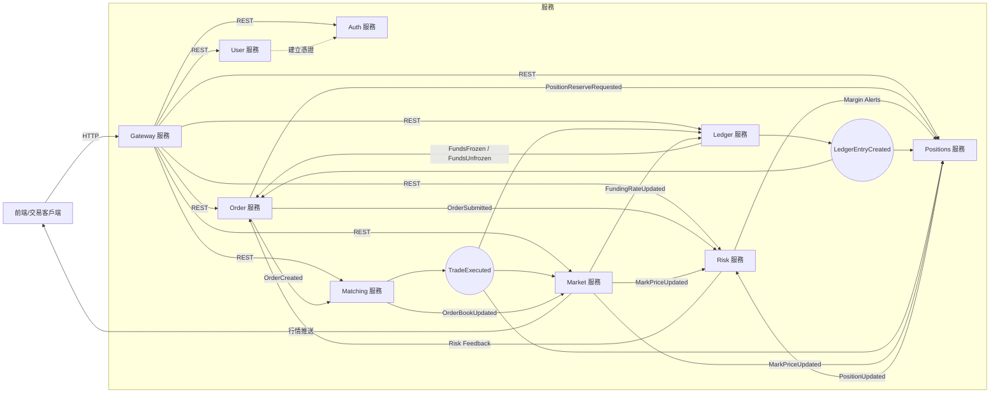
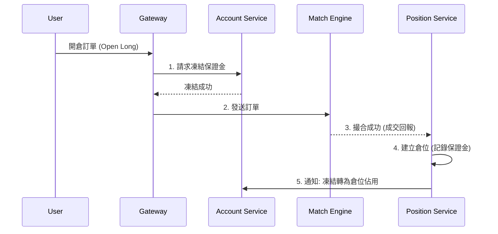
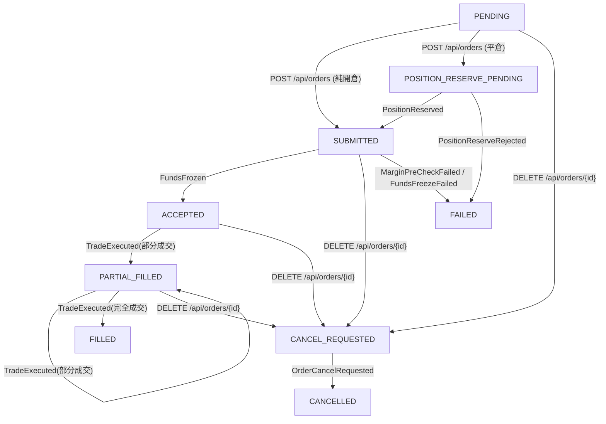
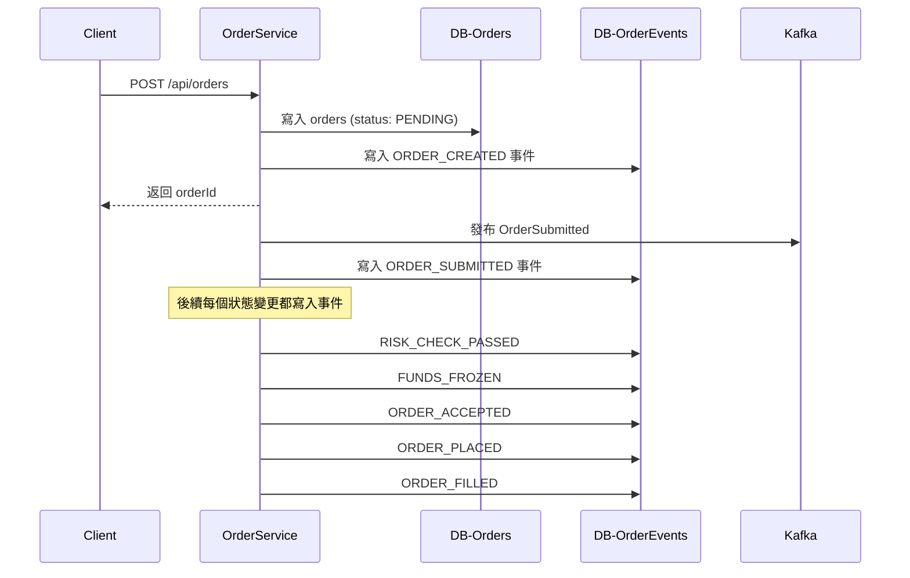
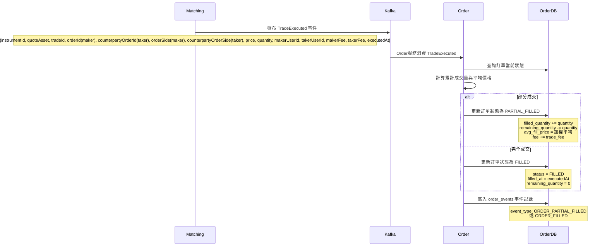
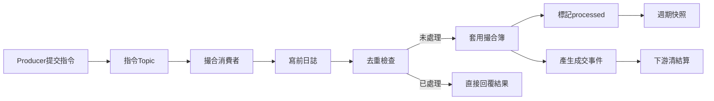

# 目錄結構

```
open.vincentf13/
├─ sdk/                          # 聚合所有橫切關注點 (cross-cutting concerns)，如日誌、監控、追蹤、資料庫存取等，以 Spring Boot Starter 的形式提供給業務服務使用。
│  ├─ sdk-core/                         # 核心工具包：提供共用常數、工具類 (Guava, Vavr)、DTO 映射 (MapStruct)、標準化 Log4j2 配置與 Prometheus 指標。
│  ├─ sdk-core-test/                    # 測試基礎設施：整合 JUnit、Testcontainers，提供對 MySQL、Redis、Kafka 的容器化測試支援。
│  ├─ sdk-spring-mvc/                   # Spring MVC 增強：提供統一的 RESTful API 回應結構、全域異常處理與 Web 相關配置。
│  ├─ sdk-auth/                         # 認證與授權基座：定義安全註解 (@PublicApi,@PrivateApi, @Jwt)，並整合 Spring Security 提供基礎安全配置。
│  ├─ sdk-auth-jwt/                     # JWT 解決方案：提供 JWT 的生成、解析與驗證過濾器，並整合 Redis 進行 Session 狀態管理。
│  ├─ sdk-auth-server/                  # 認證服務端實現：基於 sdk-auth，提供登入、登出、刷新 Token 等標準認證流程的 Controller 實作範本。
│  ├─ sdk-spring-session/               # Spring Session 整合：自動配置 Spring Session 使用 Redis 作為會話存儲。
│  ├─ sdk-spring-cloud-gateway/         # Spring Cloud Gateway 增強：提供共用的 Gateway Filter，如 JWT 驗證、路由與負載均衡配置。
│  ├─ sdk-spring-cloud-openfeign/       # OpenFeign 增強：整合 OpenFeign 客戶端、負載均衡與 Resilience4j 熔斷機制。
│  ├─ sdk-spring-cloud-alibaba-nacos/   # Nacos 整合：提供服務發現與配置中心的自動化配置。
│  ├─ sdk-infra-mysql/                  # MySQL 基礎設施：整合 MyBatis、PageHelper 與動態資料源，簡化資料庫操作。
│  ├─ sdk-infra-redis/                  # Redis 基礎設施：整合 Spring Data Redis 與 Redisson，提供快取、分布式鎖等功能。
│  ├─ sdk-infra-kafka/                  # Kafka 基礎設施：提供 Spring Kafka 的 Producer/Consumer 標準化配置。
│  └─ sdk-library-resilience4j/         # Resilience4j 整合：提供斷路器、速率限制器、重試等彈性模式的自動化配置。
├─ sdk-contract/                        # API 契約與客戶端聚合
│  └─ exchange-sdk/                     
│      ├─ exchange-user-sdk/            
│      │   ├─ rest-api/                 
│      │   └─ rest-client/             
│      ├─ exchange-auth-sdk/           
│      │   ├─ rest-api/                 
│      │   └─ rest-client/             
│      └─ exchange-order-sdk/
│          ├─ exchange-order-sdk-rest-api/      # Order REST 契約與 DTO 定義、共用枚舉
│          ├─ exchange-order-sdk-rest-client/   # Order REST Feign 客戶端
│          │     └─ ExchangeOrderClient.java    # 基於 OrderApi 的 FeignClient，透過 sdk-spring-cloud-openfeign 共用攔截與錯誤處理
│          └─ exchange-order-sdk-mq/            # Order 事件 Payload 與 Topic 常數（Outbox → Kafka 共用）
└─ services/                            # 具體業務服務
   ├─ pom.xml                           
   ├─ service-user/                     # 使用者域服務
   │   ├─ domain/                       # 聚合根、領域服務、錯誤碼
   │   │   ├─ model/                    # Domain Model (Aggregate / Value Object)
   │   │   └─ service/                  # Domain Service 協調領域規則
   │   │       └─ UserDomainService.java  
   │   ├─ infra/                        
   │   │   └─ persistence/              # 持久層實作（Mapper + Repository）
   │   │       ├─ mapper/UserMapper.java     # MyBatis Mapper 介面，依靠全域 camelCase 與 Enum TypeHandler 自動對應欄位
   │   │       ├─ po/UserPO.java             # 資料庫表映射物件，欄位與 users 表一一對應
   │   │       └─ repository/                # Repository 介面集合，返回 Domain 實體
   │   │           └─ UserRepository.java             # 使用者主檔存取介面     
   │   ├─ service/                      # Application Service（用例編排，遵循 CQRS 切分）
   │   │   ├─ UserCommandService.java   # Command：registerUser、狀態更新；定義交易邊界與事件發布
   │   │   └─ UserQueryService.java     # Query：getMe、findByEmail；僅負責讀模型與 DTO 裝配
   │   └─ controller/                   # REST Controller / API 實作
   │       └─ UserController.java       # REST Controller
   ├─ service-auth/                    # 認證域服務，Application 層同樣分為 Command/Query
   ├─ service-order/                   # 訂單域服務，Application 層提供 OrderCommandService / OrderQueryService
   ├─ service-position/                # 倉位域服務，提供 PositionCommandService / PositionQueryService 與事件協調
   │   ├─ domain/
   │   ├─ infra/
   │   ├─ service/             
   │   └─ controller/

```

# 特點

- order
    - 下單 ：
        - 限價單、市價單
        - 開倉 (多/空)、平倉、撤銷委託
    - 使用 saga 模式進行下單流程
    - event sourcing
- 帳務
    - 下單預扣
    - 根據成交、強平、~~資金費率~~ 事件調整帳務。
    - 公司帳目對映會計科目，雙分錄記帳法
- 撮合
    - 單線程 order book ，內存撮合
    - 每個交易對維護獨立的 Order Book
    - 價格優先、時間優先 (Price-Time Priority) 的撮合算法
    - WAL
- 行情
    - 消費成交、掛撤單事件，更新 Ticker、深度、K 線
    - ~~根據多家外部交易所的現貨價格，計算出公允的指數價格與標記價格，並推送行情事件~~
    - K 線圖查詢:
        - 提供多種時間週期 (1m, 5m, 1h, 1d 等) 的 K 線數據。
        - 支援 REST API 查詢歷史 K 線。
    - ~~資金費率~~
        - ~~定期 (如每 8 小時) 計算並結算多空雙方的資金費用，費率計算應基於標記價格與指數價格的價差。~~
- 倉位
    - 平倉預扣
    - 消費成交、帳務、行情事件，即時更新倉位信息
    - 槓桿倍數調整接口
    - 單向持倉
    - event sourcing
    - 用戶可以查看所有持倉的詳細資訊，包括倉位數量、開倉均價、未實現盈虧、保證金、強平價格等。
- 風控
    - 下單預檢，根據倉位大小和槓桿，計算初始保證金與維持保證金。
    - 逐倉保證金模式
    - 當用戶的保證金率低於維持保證金率時，系統自動執行強制平倉流程。
        - 採用標記價格觸發強平，以避免市場插針造成的異常波動。

- ~~系統調整 (Manual Adjustments / ADL)~~
- 交易歷史: 用戶可以查詢歷史委託、歷史成交與資金流水記錄。
- 註冊：透過 Email 進行註冊
- 登入：支援 JWT (Access/Refresh Token) 機制，管理用戶會話。可以踢下線

# 

# 服務依賴關係圖



# 流程檢核表

## 帳號

- ✔️ 註冊：[`POST /api/users`：註冊](#`POST%20/api/users`：註冊)
- ✔️ 登入、refresh token、登出：[[#POST `/api/auth/login`：登入]]

## 帳戶、出入金

## 調整槓桿

- 倉位
    - ✔️ [POST `/api/positions/{instrumentId}/leverage`](#POST%20`/api/positions/{instrumentId}/leverage`)
- 風控
    - ✔️ [`POST /api/risk/precheck/leverage`](#`POST%20/api/risk/precheck/leverage`)

## 下單

- **下單**：
    - Order
        - [`POST /api/orders`](#`POST%20/api/orders`)
        - POST  `/api/positions/intent`
    - 倉位
        - [Event Input：`PositionReserveRequested`](#Event%20Input：`PositionReserveRequested`)
            - 發布`PositionReserved`
            - 發布`PositionReserveRejected`
    - 風控
        - [Event Input： `OrderSubmitted`](#Event%20Input：%20`OrderSubmitted`)
            - 發布 `MarginPreCheckPassed`
            - 發布 `MarginPreCheckFailed`
    - 帳務
        - [Event Input：MarginPreCheckPassed](#Event%20Input：MarginPreCheckPassed)
            - 發佈`FundsFrozen`
            - 發佈`FundsUnfrozen`
- **撮合**
    - [Event Input：`OrderCreated`](#Event%20Input：`OrderCreated`)
- **行情**：`market-data
    - ✔️依 `OrderBookUpdated` 更新深度與最佳價
    - ✔️依 `TradeExecuted` 更新 Ticker、K 線、markPrice
    - ✔️以 `MarkPriceUpdated` 等事件推送給 `positions`、`risk-margin`
- **帳務**：`account-ledger`
    - 消費 `TradeExecuted`
        - 發佈 `LedgerEntryCreated` ，將資金變動同步到 order 與 positions 形成閉環
    - 消費 `LiquidationTriggered`
- **倉位**：`positions`
    - 消費`TradeExecuted`
    - 消費`LedgerEntryCreated`
    - 消費`MarkPriceUpdated`

## 強平

- 風控
    - 消費 `PositionUpdated`
    - 消費`MarkPriceUpdated` ，更新 `risk_snapshots`，決定是否限制下單或觸發強平
    - 當 `margin_ratio` 低於門檻，寫入 `liquidation_queue` 並透過清算流程，發布 `LiquidationTriggered`

# 開平倉下單流程

這是一個基於**微服務架構**，針對**逐倉保證金 (Isolated Margin)** 與 **單向持倉 (One-Way Mode)** 的完整開平倉下單流程設計。

我們將流程分為三大場景：**開倉 (Open)**、**平倉 (Close)**、以及單向持倉特有的**反手 (Flip)**。

---

### 1. 開倉流程 (Open Position)

**核心原則**：先凍結資金，確保償付能力，再建立倉位。

#### 流程步驟：

1. **下單請求 (Request)**
    - 用戶發送訂單（例如：買入做多 1 BTC）。
        
2. **風控檢查 (Risk Check)**
    - 檢查用戶狀態、槓桿倍數限制。
    - 計算 **所需凍結金額** = `(訂單價值 / 槓桿) + 預估手續費`。
        
3. **資金凍結 (Account Service)**
    - **Action**: Account 服務扣減 `Available Balance`，增加 `Order Frozen`。
    - 若餘額不足，直接拒單。
        
4. **撮合 (Matching Engine)**
    - 訂單進入 Order Book，撮合成功，生成成交回報 (Trade Execution)。
        
5. **結算與建倉 (Settlement & Position Service)**
    - 收到成交回報。
    - **Action 1 (Account)**: 將 `Order Frozen` 轉為 `Realized Deduct` (實際扣除)，這筆錢在邏輯上已經離開錢包，進入了倉位。
	- **Action 2 (Position)**: 建立新倉位記錄 (Position ID)。
        - 記錄 `Entry Price` (開倉均價)。
        - 記錄 `Isolated Margin` (將 Account 凍結的錢，正式劃歸為此倉位的保證金)。
        

程式碼片段



---

### 2. 平倉流程 (Close Position)

**核心原則**：先由倉位計算盈虧，再通知帳戶入帳。

#### 流程步驟：

1. **下單請求 (Request)**
    - 用戶發送平倉單（例如：持有 1 BTC 多單，賣出 1 BTC 平倉）。
        
2. **持倉檢查 (Position Check)**
    - 檢查是否有對應的持倉？數量是否足夠？
    - **注意**：平倉單**不需要**凍結新的資金（除非是虧損導致穿倉，但那是極端情況），相反，它會釋放資金。
        
3. **撮合 (Matching Engine)**
    - 撮合成功，生成成交回報。
        
4. **結算與平倉 (Settlement & Position Service)**
    - **Action 1 (Position - 計算)**:
        - 計算 **已實現盈虧 (Realized PnL)** = `(平倉價 - 開倉均價) * 數量 * 方向`。
        - 計算 **應釋放保證金** = 該逐倉倉位原本鎖定的保證金。
        - 計算 **總返還金額 (Payout)** = `應釋放保證金 + PnL - 手續費`。
        - 更新倉位：將數量歸零（或減少），標記為關閉。
    - **Action 2 (Account - 入帳)**:
        - Position 服務發送 `Payout` 指令給 Account。
        - Account 增加用戶的 `Available Balance`。
            

程式碼片段

```
sequenceDiagram
    participant User
    participant Gateway
    participant Position as Position Service
    participant Match as Match Engine
    participant Account as Account Service

    User->>Gateway: 平倉訂單 (Close Long)
    Gateway->>Position: 1. 檢查持倉 & 可平量
    Position-->>Gateway: 檢查通過
    Gateway->>Match: 2. 發送訂單
    Match-->>Position: 3. 撮合成功 (成交回報)
    Position->>Position: 4. 計算盈虧 & 應退金額 (PnL Calc)
    Position->>Account: 5. 執行入帳 (Add Balance)
```

---

### 3. 反手流程 (The Flip - 單向持倉特有)

場景：用戶持有 10 個多單，下了一個 賣出 15 個空單 的指令。

邏輯：系統需將其拆解為「平掉 10 個多單」+「新開 5 個空單」。

#### 流程步驟：

1. **下單與預檢查**
    - 系統識別出 `訂單數量 (15) > 持倉數量 (10)` 且方向相反。
    - 計算「超出的 5 個空單」所需的保證金。
    - **Account Service**: 檢查用戶餘額是否足夠支付這 **5 個新空單** 的保證金，並進行凍結。
        
2. **撮合**
    - Match Engine 不管邏輯，直接成交 15 個單位的 Sell。
        
3. **複雜結算 (Settlement)**
    - Position Service 收到 15 個 Sell 成交回報，讀取當前持倉 (10 Long)。
    - **Step A: 執行平倉 (Close Logic)**
        - 使用 10 個成交量平掉舊倉位。
        - 計算 10 個 Long 的 PnL 和保證金釋放。
        - 通知 Account Service 入帳 (這筆錢回流到餘額)。
    - **Step B: 執行開倉 (Open Logic)**
        - 使用剩餘的 5 個成交量建立新倉位 (Short)。
        - 使用第 1 步凍結的資金作為新倉位的逐倉保證金。
        - 記錄新倉位的 Entry Price。
            

---

### 總結對比表

|**階段**|**動作**|**負責服務**|**資金流向**|
|---|---|---|---|
|**開倉 (Open)**|1. 凍結資金|**Account**|`Available` $\to$ `Frozen`|
||2. 建立倉位|**Position**|記錄倉位保證金，綁定 Position ID|
||3. 確認扣款|**Account**|`Frozen` $\to$ `Deducted` (錢進入倉位)|
|**平倉 (Close)**|1. 撮合成交|**Match**|生成成交數據|
||2. 計算結算|**Position**|算出 PnL，決定該還給用戶多少錢|
||3. 資金入帳|**Account**|`None` $\to$ `Available` (錢回到錢包)|

這個流程設計確保了：

1. **資金安全**：開倉前錢就被鎖住了，不會發生「開了倉卻沒錢付保證金」的情況。
    
2. **帳目清晰**：平倉時由 Position 清楚算出賺賠，Account 只負責執行加錢，職責分離。

# 開平倉結算流程

您的理解在邏輯上是完全正確的。在分佈式系統或模組化設計的交易系統中，資金流（Account）與倉位流（Position）的處理順序確實遵循這個原則，以確保**「資金安全（Solvency）」**和**「數據一致性（Consistency）」**。

我們將這兩個流程拆解開來，解釋為什麼這樣設計是合理的，以及中間可能涉及的細節（特別是「凍結」與「結算」的區別）：

---

### 1. 開倉 (Open Position)：先扣款，後給貨

**邏輯：Account (資金凍結/扣除) $\rightarrow$ Position (建立倉位/寫入保證金)**

在開倉時，系統必須確保用戶有足夠的錢來承擔風險。如果先建立倉位再扣款，一旦扣款失敗，用戶就會擁有一個「無擔保」的倉位，這在金融系統中是嚴重漏洞。
- **詳細流程：**
    
    1. **下單階段 (Pre-Trade)**：
        - **Account Service**：用戶下單瞬間，Risk Engine 會先檢查餘額，並通知 Account Service **「凍結 (Freeze)」** 起始保證金 + 手續費。此時錢還在用戶帳戶裡，只是變成不可用 (Frozen)。
            
    2. **成交階段 (Post-Trade)**：
        - **Match Engine**：撮合成功，生成成交回報。
        - **Settlement (結算)**：收到成交回報後。
        - **Account Service**：將原本「凍結」的資金正式**「扣除」**（或轉移至保證金池）。
        - **Position Service**：接收到資金確認後，**「寫入」** 倉位數據，記錄該倉位的 `Isolated Margin`（逐倉保證金）和 `Entry Price`（開倉價）。
            

> **結論**：資金的鎖定必須發生在倉位產生之前。

---

### 2. 平倉 (Close Position)：先算帳，後還錢

**邏輯：Position (計算盈虧與釋放金額) $\rightarrow$ Account (入帳)**

在平倉時，Account Service 並不知道這筆交易賺了多少錢，也不知道這個逐倉倉位當時到底鎖了多少保證金。這些數據都在 Position Service 身上。
- **詳細流程：**
    
    1. **成交階段 (Post-Trade)**：
        - **Match Engine**：撮合平倉單，生成成交回報。
            
    2. **結算階段 (Settlement)**：
        - **Position Service**：它是「唯一真理來源」。
            - 計算 **已實現盈虧 (Realized PnL)**：`(平倉價 - 開倉均價) * 數量`。
            - 計算 **應釋放保證金**：查詢該逐倉當前鎖定的保證金金額。
            - 計算 **返還總額 (Payout)**：`原保證金 + PnL` (若虧損則扣除)。
            - **更新倉位**：將倉位數量歸零或減少，並由 Position Service 發出「結算完成事件」。
        - **Account Service**：收到 Position Service 算好的 `Payout` 金額，將這筆錢**「加回」** 用戶的可用餘額 (Available Balance)。
            

> **結論**：必須先由倉位系統結算績效，資金系統才知道該加減多少錢。

---

### 3. 系統設計上的補充建議 (如果是微服務架構)

雖然邏輯順序是這樣，但在實作上（特別是資料庫層面），這通常需要由一個 **結算服務 (Settlement Service)** 來協調，或者使用 **TCC (Try-Confirm-Cancel)** 模式來保證原子性 (Atomicity)：

1. **冪等性 (Idempotency)**：
    - 平倉時，Position Service 計算完發送給 Account Service 的請求必須帶有唯一的 `TradeID`。如果 Account Service 因為網路抖動收到兩次請求，不能加兩次錢。
        
2. **強平與穿倉 (Liquidation & Bankruptcy)**：
    - 在平倉計算 PnL 時，如果虧損超過了保證金（穿倉），Position Service 計算出的 `Payout` 會是負數。
    - 這時傳給 Account Service 的邏輯不是「從用戶錢包扣錢」（因為逐倉不負債），而是該筆損失需標記為「穿倉損失」，由**風險準備金 (Insurance Fund)** 帳戶進行填補，Account Service 僅需將用戶該逐倉保證金歸零即可。
        

### 總結圖示
- **開倉**：💰 Account (鎖定) $\rightarrow$ 🤝 Match $\rightarrow$ 📝 Position (記錄)
- **平倉**：🤝 Match $\rightarrow$ 🧮 Position (計算 PnL) $\rightarrow$ 💰 Account (解鎖/入帳)
    

您的設計思路完全正確。
# 

# Gateway 服務

**職責**: 統一入口、JWT驗證、路由轉發

| HTTP Method | Endpoint | 說明           | 調用者    | 授權  | 轉發至  | DB操作 | 緩存操作                                                                | 服務調用 | 補償機制 |
|-------------|----------|--------------|--------|-----|------|------|---------------------------------------------------------------------|------|------|
| -           | -        | JWT驗證、路由所有請求 | Client | jwt | 各微服務 | -    | Redis get `open:vincentf13:security:sessions:{sessionId}` 驗證Session | -    | -    |

---

## gateway

- 對接外部流量，統一執行 JWT 驗證~~、節流、設備指紋檢查。~~
- 管理路由策略~~、A/B 測試、灰度/Canary 發佈，並整合觀測性管線。~~
- 提供健康檢查~~、錯誤轉換、~~安全標頭注入。

# Auth 服務

## 職責

- 支援密碼、~~OTP、FIDO、社群登入等多種認證方式，維護登入審計。~~
- 維護會話、刷新權杖、踢下線、~~裝置綁定與登入通知~~。
- ~~發布登入/登出事件給風控、報表與通知模組。

## endpoint

| 完成 | HTTP Method | Endpoint                  | 說明      | 調用者     | 授權      | 輸入                             | 輸出                             | 事件發布                 | DB操作                                                                                                                                   | 緩存操作                                                                     | 服務調用 | 補償機制 |
|----|-------------|---------------------------|---------|---------|---------|--------------------------------|--------------------------------|----------------------|----------------------------------------------------------------------------------------------------------------------------------------|--------------------------------------------------------------------------|------|------|
| ✔️ | POST        | `/api/auth/credentials`   | 建立憑證    | user    | private | AuthCredentialCreateRequest    | AuthCredentialResponse         | -                    | select `auth_credentials`<user_id, credential_type><br/>insert `auth_credentials`<user_id, credential_type, secret_hash, salt, status> | -                                                                        | -    | -    |
| ✔️ | POST        | `/api/auth/login`         | 登入      | gateway | public  | LoginRequest (email, password) | JWT (Access/Refresh Token)     | -                    | select `auth_credentials`<user_id, credential_type>                                                                                    | Redis set `open:vincentf13:security:sessions:{sessionId}`                | -    | -    |
|    | POST        | `/api/auth/token/refresh` | 刷新Token | gateway | jwt     | RefreshToken                   | JWT (new Access/Refresh Token) | -                    | -                                                                                                                                      | Redis get/set `open:vincentf13:security:sessions:{sessionId}` 延展TTL      | -    | -    |
|    | POST        | `/api/auth/logout`        | 登出      | gateway | jwt     | -                              | -                              | `AuthSessionRevoked` | -                                                                                                                                      | Redis markRevoked+delete `open:vincentf13:security:sessions:{sessionId}` | -    | -    |

## events

**事件發布**:

| 完成 | 發布場景            | Topic                | 事件名稱                 | 事件內容                      | 消費者           |
|----|-----------------|----------------------|----------------------|---------------------------|---------------|
|    | 使用者主動登出或被風控強制登出 | auth.session-revoked | `AuthSessionRevoked` | sessionId, userId, reason | gateway, 其他服務 |

> Kafka Topic 一律以 Enum 定義（欄位包含 topic 字串與對應 Event 類別），服務端需使用 `.getTopic()` 取得實際名稱，避免魔術字串與
> Topic/Event 映射失調。

---

## 資料表 DDL

#### `auth_credentials` - 登入憑證資料

```sql
CREATE TABLE `auth_credentials`
(
    `id`              BIGINT       NOT NULL COMMENT '憑證主鍵',
    `user_id`         BIGINT       NOT NULL COMMENT '對應使用者 ID',
    `credential_type` VARCHAR(32)  NOT NULL COMMENT '憑證型別（PASSWORD / API_KEY / FIDO 等）',
    `secret_hash`     VARCHAR(255) NOT NULL COMMENT '憑證雜湊值',
    `salt`            VARCHAR(255) NOT NULL COMMENT '雜湊鹽值',
    `status`          VARCHAR(32)  NOT NULL DEFAULT 'ACTIVE' COMMENT '憑證狀態',
    `expires_at`      TIMESTAMP    NULL COMMENT '可選的到期時間',
    `created_at`      TIMESTAMP    NOT NULL DEFAULT CURRENT_TIMESTAMP COMMENT '建立時間',
    PRIMARY KEY (`id`),
    UNIQUE KEY `uk_auth_credentials_user_type` (`user_id`, `credential_type`),
    CONSTRAINT `fk_auth_credentials_user`
        FOREIGN KEY (`user_id`) REFERENCES `users` (`id`)
            ON UPDATE CASCADE ON DELETE CASCADE
) ENGINE = InnoDB
  DEFAULT CHARSET = utf8mb4 COMMENT = '登入憑證資料表';

-- 索引建議
CREATE INDEX idx_user_id ON auth_credentials (user_id) COMMENT '查詢用戶所有憑證';
CREATE INDEX idx_status ON auth_credentials (status) COMMENT '查詢特定狀態憑證 (如LOCKED)';
CREATE INDEX idx_expires_at ON auth_credentials (expires_at) COMMENT '定期清理過期憑證';
```

#### ~~`refresh_tokens` - JWT 會話持久化~~

```sql
CREATE TABLE refresh_tokens
(
    token_id         VARCHAR(64)  NOT NULL COMMENT 'Refresh Token UUID',
    user_id          BIGINT       NOT NULL COMMENT '用戶ID',
    session_id       VARCHAR(64)  NOT NULL COMMENT '會話ID (對應 Redis session)',
    access_token_jti VARCHAR(64)  NULL COMMENT '對應的 Access Token JTI (可選)',
    issued_at        DATETIME     NOT NULL COMMENT '簽發時間',
    expires_at       DATETIME     NOT NULL COMMENT '過期時間',
    is_active        BOOLEAN      NOT NULL DEFAULT TRUE COMMENT '是否有效 (FALSE表示已撤銷)',
    revoked_at       DATETIME     NULL COMMENT '撤銷時間',
    revoked_reason   VARCHAR(100) NULL COMMENT '撤銷原因: USER_LOGOUT, SECURITY_RISK, ADMIN_FORCE',
    ip_address       VARCHAR(45)  NULL COMMENT '簽發時的IP地址',
    user_agent       VARCHAR(255) NULL COMMENT '簽發時的User-Agent',
    version          INT          NOT NULL DEFAULT 0 COMMENT '樂觀鎖版本號 (防止併發刷新)',
    created_at       DATETIME     NOT NULL DEFAULT CURRENT_TIMESTAMP COMMENT '創建時間',
    PRIMARY KEY (token_id)
) ENGINE = InnoDB
  DEFAULT CHARSET = utf8mb4
  COLLATE = utf8mb4_unicode_ci COMMENT ='Refresh Token持久化表';

-- 索引建議
CREATE INDEX idx_user_id ON refresh_tokens (user_id) COMMENT '查詢用戶所有token';
CREATE INDEX idx_session_id ON refresh_tokens (session_id) COMMENT '會話管理';
CREATE INDEX idx_expires_at ON refresh_tokens (expires_at) COMMENT '定期清理過期token';
CREATE INDEX idx_is_active_expires ON refresh_tokens (is_active, expires_at) COMMENT '查詢有效且未過期的token';
```

#### ~~`login_audits` - 登入審計記錄~~

```sql
CREATE TABLE login_audits
(
    id                 BIGINT       NOT NULL AUTO_INCREMENT COMMENT '審計記錄ID',
    user_id            BIGINT       NULL COMMENT '用戶ID (登入失敗時可能為NULL)',
    email              VARCHAR(255) NULL COMMENT '嘗試登入的郵箱',
    credential_type    VARCHAR(20)  NOT NULL COMMENT '使用的憑證類型',
    result             VARCHAR(20)  NOT NULL COMMENT '登入結果: SUCCESS, FAILED',
    failure_reason     VARCHAR(100) NULL COMMENT '失敗原因: WRONG_PASSWORD, ACCOUNT_LOCKED, CREDENTIAL_EXPIRED',
    ip_address         VARCHAR(45)  NOT NULL COMMENT '登入IP地址',
    user_agent         VARCHAR(500) NULL COMMENT 'User-Agent字串',
    device_fingerprint VARCHAR(64)  NULL COMMENT '裝置指紋 (可選)',
    geo_location       VARCHAR(100) NULL COMMENT '地理位置 (國家/城市)',
    session_id         VARCHAR(64)  NULL COMMENT '成功時的會話ID',
    logged_at          DATETIME     NOT NULL DEFAULT CURRENT_TIMESTAMP COMMENT '登入嘗試時間',
    PRIMARY KEY (id)
) ENGINE = InnoDB
  DEFAULT CHARSET = utf8mb4
  COLLATE = utf8mb4_unicode_ci COMMENT ='登入審計記錄表';

-- 索引建議
CREATE INDEX idx_user_id_logged ON login_audits (user_id, logged_at DESC) COMMENT '用戶登入歷史';
CREATE INDEX idx_result_logged ON login_audits (result, logged_at DESC) COMMENT '失敗登入分析';
CREATE INDEX idx_ip_logged ON login_audits (ip_address, logged_at DESC) COMMENT 'IP行為分析';
CREATE INDEX idx_logged_at ON login_audits (logged_at DESC) COMMENT '時間範圍查詢';
```

#### ~~`auth_providers` - 第三方登入綁定~~

```sql
CREATE TABLE auth_providers
(
    id               BIGINT       NOT NULL COMMENT '綁定ID (Snowflake)',
    user_id          BIGINT       NOT NULL COMMENT '用戶ID',
    provider         VARCHAR(50)  NOT NULL COMMENT '提供商: GOOGLE, FACEBOOK, GITHUB',
    provider_user_id VARCHAR(255) NOT NULL COMMENT '第三方平台的用戶ID',
    provider_email   VARCHAR(255) NULL COMMENT '第三方平台的郵箱',
    access_token     TEXT         NULL COMMENT '第三方 Access Token (加密存儲)',
    refresh_token    TEXT         NULL COMMENT '第三方 Refresh Token (加密存儲)',
    token_expires_at DATETIME     NULL COMMENT 'Token過期時間',
    linked_at        DATETIME     NOT NULL DEFAULT CURRENT_TIMESTAMP COMMENT '綁定時間',
    last_used_at     DATETIME     NULL COMMENT '最後使用時間',
    PRIMARY KEY (id),
    UNIQUE KEY uk_provider_user (provider, provider_user_id) COMMENT '同一提供商的用戶ID唯一'
) ENGINE = InnoDB
  DEFAULT CHARSET = utf8mb4
  COLLATE = utf8mb4_unicode_ci COMMENT ='第三方登入綁定表';

-- 索引建議
CREATE INDEX idx_user_id ON auth_providers (user_id) COMMENT '查詢用戶綁定的所有第三方帳號';
```

## 

## `POST /api/auth/credentials`：建立憑證

## POST `/api/auth/login`：登入

- 由 `sdk-auth-server` 提供預設實作；服務引入該模組後即可直接啟用。

登入流程

- `POST /api/auth/login`：
    - Gateway 將請求轉給 `auth`。
    - `auth` 依 credential type 讀取 `auth_credentials`，以 `BCrypt`/`Argon2` 驗證密碼並檢查狀態（LOCKED、EXPIRED 等），必要時追加
      OTP/FIDO 二次驗證。
    - 驗證成功後寫入 `login_audits`、`auth_sessions`，並在 Redis 建立 `auth:session:{sessionId}`（含
      userId、roles、IP、裝置指紋、TTL）。
    - 回傳 Access/Refresh Token，JWT 內含 `sessionId`、`authContext`，供下游服務解析。
- 請求授權：後續所有 API 由 Gateway 的 JWT Filter 驗證 Access Token，並以 `sessionId` 查詢 Redis（或本地快取）確認會話仍有效；若不存在或標記
  `revoked` 即拒絕。
- Token 續期：Access Token 過期時，前端呼叫 `POST /api/auth/token/refresh`，`auth` 驗證 Refresh Token 是否仍 active，使用樂觀鎖（
  `refresh_tokens.version`）避免重放，成功則簽發新 Access/Refresh 並延長 Redis session TTL。
- 登出/失效：`POST /api/auth/logout` 或風控事件會標記 Refresh Token 為 `revoked`、刪除 Redis session，並發布
  `AuthSessionRevoked` 事件；Gateway 或服務側可立即終止該會話。
- 下游使用：各服務的安全 Filter 解析 JWT，將 `OpenJwtUser`（userId、roles、scopes、sessionId）放入 ThreadLocal 或 Reactor
  Context，支援審計與授權判定。

## POST `/api/auth/token/refresh`：refresh token

- 使用 Refresh Token 取得新的 Access Token，並延長 Redis session 到期時間。
- 由 `sdk-auth-server` 提供預設實作；服務引入該模組後即可直接啟用。

## POST `/api/auth/logout`：使 token 失效

- 作廢 Refresh Token/Session（刪除 Redis session）。
-
    - 由 `sdk-auth-server` 提供預設實作；服務引入該模組後即可直接啟用。

# User 服務

## 職責

- 維護使用者主檔、~~偏好設定、語系與通知訂閱，管理 KYC 流程。~~
- ~~管理角色、權限與範圍（scope），提供 RBAC/ABAC 查詢介面。

## endpoint

| 完成 | HTTP Method | Endpoint        | 說明         | 調用者     | 授權     | 輸入                                    | 輸出           | 事件發布 | DB操作                                                                                                                                                                                                                      | 緩存操作 | 服務調用                               | 補償機制                                                                   |
|----|-------------|-----------------|------------|---------|--------|---------------------------------------|--------------|------|---------------------------------------------------------------------------------------------------------------------------------------------------------------------------------------------------------------------------|------|------------------------------------|------------------------------------------------------------------------|
| ✔️ | POST        | `/api/users`    | 用戶註冊       | gateway | public | UserRegisterRequest (email, password) | UserResponse | -    | insert `users`<external_id,email,status><br/>insert `auth_credentials_pending`<user_id, credential_type, secret_hash, salt, status, retry_count><br/>update `auth_credentials_pending`<status, last_error, next_retry_at> | -    | Auth: `POST /api/auth/credentials` | `UserRegistrationResumer` 排程任務：掃描 `auth_credentials_pending`，重試失敗的憑證建立 |
| ✔️ | GET         | `/api/users/me` | 查詢當前用戶基本資料 | gateway | jwt    | -                                     | UserResponse | -    | select `users`<id>                                                                                                                                                                                                        | -    | -                                  | -                                                                      |

---

## 資料表 DDL

### `users` - 使用者主檔

```sql
CREATE TABLE `users`
(
    `id`          BIGINT       NOT NULL COMMENT '平台內部使用者主鍵',
    `external_id` VARCHAR(64)           DEFAULT NULL COMMENT '外部系統引用用戶 ID（可選）',
    `email`       VARCHAR(255) NOT NULL COMMENT '登入/通知用 Email，唯一',
    `status`      VARCHAR(32)  NOT NULL DEFAULT 'ACTIVE' COMMENT '使用者狀態（ACTIVE / LOCKED / DISABLED）',
    `created_at`  TIMESTAMP    NOT NULL DEFAULT CURRENT_TIMESTAMP COMMENT '建立時間',
    `updated_at`  TIMESTAMP    NOT NULL DEFAULT CURRENT_TIMESTAMP ON UPDATE CURRENT_TIMESTAMP COMMENT '最後更新時間',
    PRIMARY KEY (`id`),
    UNIQUE KEY `uk_users_email` (`email`),
    UNIQUE KEY `uk_users_external` (`external_id`)
) ENGINE = InnoDB
  DEFAULT CHARSET = utf8mb4 COMMENT = '使用者主檔';

-- 索引建議
CREATE INDEX idx_status ON users (status) COMMENT '查詢特定狀態用戶';
CREATE INDEX idx_created_at ON users (created_at DESC) COMMENT '按註冊時間排序';
```

### ~~`user_profiles` - 個資與偏好~~

```sql
CREATE TABLE user_profiles
(
    user_id      BIGINT       NOT NULL COMMENT '用戶ID (外鍵)',
    display_name VARCHAR(100) NULL COMMENT '顯示名稱/暱稱',
    first_name   VARCHAR(50)  NULL COMMENT '名字',
    last_name    VARCHAR(50)  NULL COMMENT '姓氏',
    country      VARCHAR(2)   NULL COMMENT '國家代碼 (ISO 3166-1 alpha-2)',
    language     VARCHAR(10)  NOT NULL DEFAULT 'zh-TW' COMMENT '語言偏好 (zh-TW, en-US)',
    timezone     VARCHAR(50)  NOT NULL DEFAULT 'Asia/Taipei' COMMENT '時區',
    avatar_url   VARCHAR(500) NULL COMMENT '頭像URL',
    bio          TEXT         NULL COMMENT '個人簡介',
    created_at   DATETIME     NOT NULL DEFAULT CURRENT_TIMESTAMP COMMENT '創建時間',
    updated_at   DATETIME     NOT NULL DEFAULT CURRENT_TIMESTAMP ON UPDATE CURRENT_TIMESTAMP COMMENT '更新時間',
    PRIMARY KEY (user_id),
    CONSTRAINT fk_profiles_user FOREIGN KEY (user_id) REFERENCES users (id) ON DELETE CASCADE
) ENGINE = InnoDB
  DEFAULT CHARSET = utf8mb4
  COLLATE = utf8mb4_unicode_ci COMMENT ='用戶個資與偏好設定表';

-- 索引建議
CREATE INDEX idx_country ON user_profiles (country) COMMENT '按國家統計用戶分佈';
```

### `auth_credentials_pending` - 註冊補償表

```sql
CREATE TABLE auth_credentials_pending
(
    id              BIGINT UNSIGNED PRIMARY KEY AUTO_INCREMENT,
    user_id         BIGINT UNSIGNED NOT NULL,
    credential_type VARCHAR(32)     NOT NULL COMMENT '憑證型別（PASSWORD / API_KEY ...）',
    secret_hash     VARCHAR(512)    NOT NULL COMMENT '已經由 auth 算好的 hash',
    salt            VARCHAR(128)    NOT NULL,
    status          VARCHAR(32)     NOT NULL COMMENT 'PENDING / COMPLETED / FAILED',
    retry_count     INT UNSIGNED    NOT NULL DEFAULT 0 COMMENT '已重試次數',
    next_retry_at   DATETIME        NULL COMMENT '下次排程可撿起的時間',
    last_error      VARCHAR(512)    NULL COMMENT '最近一次失敗訊息',
    created_at      DATETIME        NOT NULL,
    updated_at      DATETIME        NOT NULL,
    UNIQUE KEY uk_user_type (user_id, credential_type)
) ENGINE = InnoDB
  DEFAULT CHARSET = utf8mb4;

-- 索引建議
CREATE INDEX idx_status_created ON user_registration_prepare (status, created_at) COMMENT '排程掃描PREPARE記錄';
```

### ~~`kyc_records` - 身分驗證紀錄~~

```sql
CREATE TABLE kyc_records
(
    id                 BIGINT       NOT NULL COMMENT '記錄ID (Snowflake)',
    user_id            BIGINT       NOT NULL COMMENT '用戶ID',
    tier               INT          NOT NULL COMMENT '申請等級: 1=基礎, 2=進階',
    status             VARCHAR(20)  NOT NULL COMMENT '狀態: PENDING, APPROVED, REJECTED',
    document_type      VARCHAR(50)  NULL COMMENT '證件類型: PASSPORT, ID_CARD, DRIVER_LICENSE',
    document_number    VARCHAR(100) NULL COMMENT '證件號碼 (加密存儲)',
    document_front_url VARCHAR(500) NULL COMMENT '證件正面照片URL',
    document_back_url  VARCHAR(500) NULL COMMENT '證件背面照片URL',
    selfie_url         VARCHAR(500) NULL COMMENT '自拍照URL',
    submitted_at       DATETIME     NOT NULL DEFAULT CURRENT_TIMESTAMP COMMENT '提交時間',
    approved_at        DATETIME     NULL COMMENT '審核通過時間',
    rejected_at        DATETIME     NULL COMMENT '拒絕時間',
    rejected_reason    VARCHAR(500) NULL COMMENT '拒絕原因',
    reviewer_id        BIGINT       NULL COMMENT '審核人員ID',
    PRIMARY KEY (id)
) ENGINE = InnoDB
  DEFAULT CHARSET = utf8mb4
  COLLATE = utf8mb4_unicode_ci COMMENT ='KYC身分驗證記錄表';

-- 索引建議
CREATE INDEX idx_user_id_submitted ON kyc_records (user_id, submitted_at DESC) COMMENT '用戶KYC歷史';
CREATE INDEX idx_status ON kyc_records (status) COMMENT '待審核列表';
```

### ~~`role_assignments` - 角色權限授權~~

```sql
CREATE TABLE role_assignments
(
    id         BIGINT       NOT NULL COMMENT '授權ID (Snowflake)',
    user_id    BIGINT       NOT NULL COMMENT '用戶ID',
    role       VARCHAR(50)  NOT NULL COMMENT '角色: ADMIN, SUPPORT, TRADER, VIP',
    scope      VARCHAR(100) NULL COMMENT '權限範圍 (可選, 如特定交易對)',
    granted_by BIGINT       NOT NULL COMMENT '授權者ID',
    granted_at DATETIME     NOT NULL DEFAULT CURRENT_TIMESTAMP COMMENT '授權時間',
    expires_at DATETIME     NULL COMMENT '過期時間 (NULL表示永久)',
    PRIMARY KEY (id),
    UNIQUE KEY uk_user_role_scope (user_id, role, scope) COMMENT '用戶角色範圍組合唯一'
) ENGINE = InnoDB
  DEFAULT CHARSET = utf8mb4
  COLLATE = utf8mb4_unicode_ci COMMENT ='角色權限授權表 - RBAC';

-- 索引建議
CREATE INDEX idx_user_id ON role_assignments (user_id) COMMENT '查詢用戶所有角色';
CREATE INDEX idx_role ON role_assignments (role) COMMENT '查詢特定角色的所有用戶';
```

### ~~`notification_preferences` - 通知訂閱設定~~

```sql
CREATE TABLE notification_preferences
(
    id         BIGINT      NOT NULL AUTO_INCREMENT COMMENT '偏好ID',
    user_id    BIGINT      NOT NULL COMMENT '用戶ID',
    channel    VARCHAR(20) NOT NULL COMMENT '通知通道: EMAIL, SMS, PUSH, WEBHOOK',
    event_type VARCHAR(50) NOT NULL COMMENT '事件類型: ORDER_FILLED, PRICE_ALERT, SECURITY',
    is_enabled BOOLEAN     NOT NULL DEFAULT TRUE COMMENT '是否啟用',
    config     JSON        NULL COMMENT '額外配置 (如價格閾值)',
    created_at DATETIME    NOT NULL DEFAULT CURRENT_TIMESTAMP COMMENT '創建時間',
    updated_at DATETIME    NOT NULL DEFAULT CURRENT_TIMESTAMP ON UPDATE CURRENT_TIMESTAMP COMMENT '更新時間',
    PRIMARY KEY (id),
    UNIQUE KEY uk_user_channel_event (user_id, channel, event_type) COMMENT '用戶通道事件組合唯一'
) ENGINE = InnoDB
  DEFAULT CHARSET = utf8mb4
  COLLATE = utf8mb4_unicode_ci COMMENT ='通知訂閱設定表';

-- 索引建議
CREATE INDEX idx_user_id ON notification_preferences (user_id) COMMENT '查詢用戶所有通知設定';
```

## 

## `POST /api/users`：註冊

- 前端呼叫 `user` 服務的 `POST /api/users`（由 Gateway 轉發）。
- `user-service` 驗證信箱是否已存在，建立 `User` 主檔，與在 `user_registration_prepare` 表寫入一筆 `PREPARE` 狀態的註冊工作（包含
  userId、email、重試次數等欄位）。
- 建立成功後呼叫 `auth` 服務，傳入 `AuthCredentialCreateRequest`（帶入 userId、型別、密碼雜湊與鹽值）；`auth` 寫入
  `auth_credentials`，並回報成功以更新註冊工作狀態為 `COMPLETED`。
- 若憑證建立失敗或 `auth` 暫時不可用，`user-service` 會保留 `PREPARE` 狀態並回傳 `RemoteServiceError`，以便稍後重試。
- **排程補償**：`UserRegistrationResumer`（Spring Scheduling/Quartz Job）每分鐘掃描 `user_registration_prepare`，對停留在
  `PREPARE` 的記錄重新呼叫 `auth` 建憑證；成功後標記 `COMPLETED`，連續 N 次失敗則標記 `FAILED` 並發送告警通知營運處理。

## `GET /api/users/me`：查詢基本資料

# Order 服務

## 職責

- 統一下單入口，支援市價/限價/~~條件單~~等多種委託型別。
- 提供單筆與批次撤單、委託查詢、歷史訂單匯出。
- 寫入訂單事件（event sourcing）供撮合、報表與重播。

## endpoint

| 完成 | HTTP Method | Endpoint                | 說明   | 調用者                          | 授權            | 輸入                                                              | 輸出                                                           | 事件發布                                                                    | DB操作                                                                                                                                                                                                        | 緩存操作 | 服務調用                                      | 補償機制 |
|----|-------------|-------------------------|------|------------------------------|---------------|-----------------------------------------------------------------|--------------------------------------------------------------|-------------------------------------------------------------------------|-------------------------------------------------------------------------------------------------------------------------------------------------------------------------------------------------------------|------|-------------------------------------------|------|
|    | POST        | `/api/orders`           | 建立委託 | gateway / liquidation-worker | jwt / private | OrderCreateRequest (instrument_id, side, type, price, quantity) | OrderResponse (orderId, status, intent, closeCostPrice, ...) | Saga：最初 `PositionReserveRequested` / `OrderSubmitted`，最終 `OrderCreated` | insert `orders`<order_id,user_id,instrument_id,client_order_id,side,intent,close_cost_price,type,status,price,quantity,filled_quantity,remaining_quantity,avg_fill_price,fee,version,created_at,updated_at> | -    | positions: `POST` `/api/positions/intent` | -    |
|    | DELETE      | `/api/orders/{orderId}` | 撤銷委託 | gateway                      | jwt           | orderId                                                         | -                                                            | `OrderCancelRequested`                                                  | update `orders`<status, cancelled_at>                                                                                                                                                                       | -    | -                                         | -    |
| ✔️ | GET         | `/api/orders/{orderId}` | 查詢訂單 | gateway , account-ledger     | jwt,private   | orderId                                                         | OrderResponse                                                | -                                                                       | select `orders`<全部欄位>                                                                                                                                                                                       | -    | -                                         | -    |

## events

**事件消費**:

| 完成 | 來源服務           | Topic                      | 事件                        | 處理邏輯                                        | 事件發布             | DB操作                                                                                                              | 緩存操作 | 服務調用 | 補償機制 |
|----|----------------|----------------------------|---------------------------|---------------------------------------------|------------------|-------------------------------------------------------------------------------------------------------------------|------|------|------|
| ✔️ | positions      | positions.reserved         | `PositionReserved`        | 預凍結成功 → 訂單 `SUBMITTED` 並補發 `OrderSubmitted` | `OrderSubmitted` | update `orders`<status, submitted_at, updated_at, version, close_cost_price>                                      | -    | -    | -    |
| ✔️ | positions      | positions.reserve-rejected | `PositionReserveRejected` | 預凍結失敗 → 訂單 `FAILED`                         | -                | update `orders`<status, updated_at, version>                                                                      | -    | -    | -    |
|    | risk-margin    | risk.margin-check-failed   | `MarginPreCheckFailed`    | 風控拒絕 → 訂單 `FAILED`                          | -                | update `orders`<status, updated_at, version>                                                                      | -    | -    | -    |
|    | account-ledger | ledger.funds-frozen        | `FundsFrozen`             | 資金凍結成功 → 訂單 `ACCEPTED` 並發布 `OrderCreated`   | `OrderCreated`   | update `orders`<status, submitted_at, updated_at, version>                                                        | -    | -    | -    |
|    | account-ledger | ledger.funds-freeze-failed | `FundsFreezeFailed`       | 資金凍結失敗 → 訂單 `FAILED`                        | -                | update `orders`<status, updated_at, version>                                                                      | -    | -    | -    |
|    | account-ledger | ledger.funds-unfrozen      | `FundsUnfrozen`           | 訂單狀態改為 `CANCELLED`                          | -                | update `orders`<status, updated_at, version>                                                                      | -    | -    | -    |
|    | matching       | matching.trade-executed    | `TradeExecuted`           | 訂單更新成交量、均價、手續費與 `filled_at`                 | -                | update `orders`<status, filled_quantity, remaining_quantity, avg_fill_price, fee, filled_at, updated_at, version> | -    | -    | -    |

**事件發布**:

| 完成  | 發布場景             | Topic                            | 事件名稱                       | 事件內容                                                               | 消費者         |
| --- | ---------------- | -------------------------------- | -------------------------- | ------------------------------------------------------------------ | ----------- |
| ✔️  | 平倉訂單需預先鎖倉        | order.position-reserve-requested | `PositionReserveRequested` | orderId, userId, instrumentId, side, intent, quantity, requestedAt | positions   |
| ✔️  | 收到用戶/強平委託並完成基本校驗 | order.submitted                  | `OrderSubmitted`           | orderId, userId, instrumentId, side, type, price, quantity         | risk-margin |
|     | 保證金凍結成功、委託正式建檔   | order.created                    | `OrderCreated`             | orderId, userId, instrumentId, side, type, price, quantity         | matching    |
|     | 用戶或系統請求撤單        | order.cancel-requested           | `OrderCancelRequested`     | orderId                                                            | matching    |

---

## 資料表DDL

### orders 表

```sql
CREATE TABLE orders
(
    order_id           BIGINT         NOT NULL COMMENT '訂單ID (Snowflake)',
    user_id            BIGINT         NOT NULL COMMENT '用戶ID (外鍵關聯 users.id)',
    instrument_id      BIGINT         NOT NULL COMMENT '交易對ID (外鍵關聯 instruments.id)',
    client_order_id    VARCHAR(64)    NULL COMMENT '客戶端訂單ID (用於冪等性去重)',

    # 訂單
    side               VARCHAR(10)    NOT NULL COMMENT '訂單方向: BUY, SELL.  開多/平空=BUY, 開空/平多=賣',
    intent             VARCHAR(20)    NULL COMMENT '開倉/減倉/平倉意圖: INCREASE, REDUCE, CLOSE，由 position 服務判斷後回寫',
    close_cost_price   DECIMAL(20, 8) NULL COMMENT '平倉鎖倉時返回的平均開倉成本，用於事後盈虧計算',
    type               VARCHAR(20)    NOT NULL COMMENT '訂單類型: LIMIT, MARKET, STOP_LIMIT, STOP_MARKET',
    price              DECIMAL(20, 8) NULL COMMENT '委託價格 (市價單為 NULL)',
    quantity           DECIMAL(20, 8) NOT NULL COMMENT '委託數量',
    leverage           INT            NULL COMMENT '槓桿倍數',


    # 成交
    filled_quantity    DECIMAL(20, 8) NOT NULL DEFAULT 0 COMMENT '已成交數量',
    remaining_quantity DECIMAL(20, 8) NOT NULL COMMENT '剩餘數量 (quantity - filled_quantity)',
    avg_fill_price     DECIMAL(20, 8) NULL COMMENT '平均成交價格',
    fee                DECIMAL(20, 8) NOT NULL DEFAULT 0 COMMENT '手續費總額',

    # 狀態
    status             VARCHAR(20)    NOT NULL DEFAULT 'PENDING' COMMENT '訂單狀態: PENDING, SUBMITTED, ACCEPTED , PARTIAL_FILLED, FILLED, CANCEL_REQUESTED, CANCELLED, REJECTED, FAILED, EXPIRED',
    rejected_reason    VARCHAR(255)   NULL COMMENT '拒絕原因 (風控/餘額不足等)',

    # 時間
    created_at         DATETIME       NOT NULL DEFAULT CURRENT_TIMESTAMP COMMENT '創建時間',
    updated_at         DATETIME       NOT NULL DEFAULT CURRENT_TIMESTAMP ON UPDATE CURRENT_TIMESTAMP COMMENT '更新時間',
    submitted_at       DATETIME       NULL COMMENT '提交到撮合引擎時間',
    filled_at          DATETIME       NULL COMMENT '完全成交時間',
    cancelled_at       DATETIME       NULL COMMENT '取消時間',

    version            INT            NOT NULL DEFAULT 0 COMMENT '樂觀鎖版本號 (併發控制)',

    PRIMARY KEY (order_id),
    UNIQUE KEY uk_client_order (user_id, client_order_id) COMMENT '防止客戶端重複提交'
) ENGINE = InnoDB
  DEFAULT CHARSET = utf8mb4
  COLLATE = utf8mb4_unicode_ci COMMENT ='訂單主檔 - 委託生命週期核心資料';

CREATE INDEX idx_user_status ON orders (user_id, status) COMMENT '查詢用戶活動訂單';
CREATE INDEX idx_instrument_status ON orders (instrument_id, status) COMMENT '查詢交易對活動訂單';
CREATE INDEX idx_status_created ON orders (status, created_at) COMMENT '按狀態與時間查詢 (如待撮合訂單)';
CREATE INDEX idx_created_at ON orders (created_at DESC) COMMENT '歷史訂單時序查詢';
```

#### 如何知道開/平倉?

靠倉位判斷。

`orders.side` 只有 BUY/SELL，無法直接表示開倉或平倉。  
撮合後由倉位服務決定結果。

流程

- BUY
    - 若原本是空倉 → 平空
    - 若原本無倉或多倉 → 開多
- SELL
    - 若原本是多倉 → 平多
    - 若原本無倉或空倉 → 開空

#### type

LIMIT  
指定價格或更好價格成交

- 價格 = 使用者指定
- 可掛簿
- 不保證成交

MARKET  
以市場最優價格立即成交

- 價格 = 市價
- 不掛簿
- 保證盡量成交，但最終成交價不確定

STOP_LIMIT  
觸發價 + 限價

- 市價到達「觸發價」時，轉為 LIMIT 單掛出
- 可能因限價成交不到而失效

STOP_MARKET  
觸發價 + 市價

- 市價到達「觸發價」時，轉為 MARKET 單
- 會盡量立即成交

### order_events 表

```sql
CREATE TABLE order_events
(
    event_id        BIGINT       NOT NULL COMMENT '事件ID (Snowflake)',
    user_id         BIGINT       NOT NULL COMMENT '用戶ID (冗餘欄位便於查詢)',
    instrument_id   BIGINT       NOT NULL COMMENT '交易對ID (冗餘欄位便於查詢)',
    order_id        BIGINT       NOT NULL COMMENT '訂單ID (外鍵關聯 orders.order_id)',

    # 事件    
    event_type      VARCHAR(80)  NOT NULL COMMENT '事件類型',
    sequence_number BIGINT       NOT NULL COMMENT '同一訂單內的事件序號 (確保順序性)',

    payload         JSON         NOT NULL COMMENT '事件內容 (狀態變更的具體數據)',

    # 來源
    reference_type  VARCHAR(50)  NULL COMMENT '用來描述這筆事件是因何而發生、關聯到哪個外部實體或動作。通常用於冪等性控制 或 跨系統追蹤: TRADE, CANCEL_REQUEST, RISK_CHECK ..',
    reference_id    BIGINT       NULL COMMENT '關聯ID (trade_id 等, 用於冪等性檢查)',
    actor           VARCHAR(100) NOT NULL COMMENT '操作人: USER:{userId}, RISK_SERVICE, LEDGER_SERVICE, MATCHING_ENGINE, SYSTEM(定時或自動規則不屬於特定服務)',


    occurred_at     DATETIME(6)  NOT NULL COMMENT '原始事件的「真實發生時間」 (微秒精度)',
    created_at      DATETIME     NOT NULL DEFAULT CURRENT_TIMESTAMP COMMENT '記錄創建時間',
    PRIMARY KEY (event_id),
    UNIQUE KEY uk_order_sequence (order_id, sequence_number) COMMENT '確保同一訂單事件順序唯一',
    UNIQUE KEY uk_idempotent (order_id, reference_type, reference_id) COMMENT '防止重複處理同一業務事件 (reference_id 非 NULL 時)'
) ENGINE = InnoDB
  DEFAULT CHARSET = utf8mb4
  COLLATE = utf8mb4_unicode_ci COMMENT ='訂單事件溯源表 - Event Sourcing 模式';

CREATE INDEX idx_order_occurred ON order_events (order_id, occurred_at ASC) COMMENT '查詢訂單事件歷史 (按時間順序)';
CREATE INDEX idx_user_occurred ON order_events (user_id, occurred_at DESC) COMMENT '查詢用戶訂單事件';
CREATE INDEX idx_event_type_occurred ON order_events (event_type, occurred_at DESC) COMMENT '按事件類型統計分析';
CREATE INDEX idx_actor ON order_events (actor, occurred_at DESC) COMMENT '按操作主體查詢';
CREATE INDEX idx_reference ON order_events (reference_type, reference_id) COMMENT '通過業務關聯ID查找事件';
CREATE INDEX idx_occurred_at ON order_events (occurred_at DESC) COMMENT '時序查詢所有訂單事件';
```

#### 事件類型 (`event_type`)、reference_type、reference_id、Actor

| 事件類型                    | reference_type | reference_id | Actor            |
|-------------------------|----------------|--------------|------------------|
| OrderApi.create         |                |              | USER:{userId}    |
| PositionReserved        |                |              | POSITION_SERVICE |
| PositionReserveRejected |                |              | POSITION_SERVICE |
| MarginPreCheckFailed    |                |              | RISK_SERVICE     |
| FundsFrozen             |                |              | LEDGER_SERVICE   |
| FundsFreezeFailed       |                |              | LEDGER_SERVICE   |
| FundsUnfrozen           |                |              | LEDGER_SERVICE   |
| TradeExecuted           |                |              | MATCHING_ENGINE  |
| OrderApi.cancel         |                |              | USER:{userId}    |
| OrderCancelRequested    |                |              | MATCHING_ENGINE  |

event_type
在 Order 服務中：

- **事件驅動**：使用事件名稱（PositionReserved、FundsFrozen、TradeExecuted…）。
- **介面觸發**：使用 `介面類別.方法`（OrderApi.create、OrderCommandService.requestCancel…）。

---

reference_type

- 意指要用哪個字段當冪等鍵

---

reference_id
reference_id 型別與生成策略

- 由「請求的發起方」生成並隨事件流傳遞：
    - 風控請求由 `risk` 服務發 ID。
    - 凍結請求由 `account-ledger` 發 ID；若要在提交前先綁定，可由 `order` 預先生成並作為冪等鍵傳給帳本。

### order_tasks 表 - 異步指令佇列

```sql
CREATE TABLE order_tasks
(
    task_id       BIGINT      NOT NULL COMMENT '任務ID (Snowflake)',
    order_id      BIGINT      NULL COMMENT '關聯訂單ID (批次操作時為 NULL)',
    user_id       BIGINT      NOT NULL COMMENT '發起用戶ID',
    task_type     VARCHAR(50) NOT NULL COMMENT '任務類型: CANCEL_ORDER, BATCH_CANCEL, STRATEGY_ORDER, SCHEDULED_ORDER',
    payload       JSON        NOT NULL COMMENT '任務參數 (JSON格式存儲)',
    status        VARCHAR(20) NOT NULL DEFAULT 'PENDING' COMMENT '任務狀態: PENDING, PROCESSING, COMPLETED, FAILED, CANCELLED',
    priority      INT         NOT NULL DEFAULT 5 COMMENT '優先級 (1-10, 數字越小優先級越高)',
    retry_count   INT         NOT NULL DEFAULT 0 COMMENT '已重試次數',
    max_retries   INT         NOT NULL DEFAULT 3 COMMENT '最大重試次數',
    scheduled_at  DATETIME    NOT NULL COMMENT '計劃執行時間 (支援延遲執行)',
    started_at    DATETIME    NULL COMMENT '實際開始執行時間',
    completed_at  DATETIME    NULL COMMENT '完成時間',
    error_message TEXT        NULL COMMENT '失敗原因詳情',
    result        JSON        NULL COMMENT '執行結果 (成功時記錄)',
    created_at    DATETIME    NOT NULL DEFAULT CURRENT_TIMESTAMP COMMENT '創建時間',
    updated_at    DATETIME    NOT NULL DEFAULT CURRENT_TIMESTAMP ON UPDATE CURRENT_TIMESTAMP COMMENT '更新時間',
    PRIMARY KEY (task_id)
) ENGINE = InnoDB
  DEFAULT CHARSET = utf8mb4
  COLLATE = utf8mb4_unicode_ci COMMENT ='異步指令佇列 - 批次撤單、策略單等非即時操作';

CREATE INDEX idx_status_scheduled ON order_tasks (status, scheduled_at) COMMENT '查詢待執行任務 (排程器使用)';
CREATE INDEX idx_user_status ON order_tasks (user_id, status) COMMENT '查詢用戶任務狀態';
CREATE INDEX idx_order_id ON order_tasks (order_id) COMMENT '查詢特定訂單相關任務';
CREATE INDEX idx_priority_scheduled ON order_tasks (priority ASC, scheduled_at ASC) COMMENT '按優先級與時間排序';
CREATE INDEX idx_created_at ON order_tasks (created_at DESC) COMMENT '任務歷史查詢';
```

## 

## Core

### Order 狀態機



### 時間戳記更新

- `submitted_at`: 在ACCEPTED狀態，發布 `OrderCreated` 事件給 Matching 時記錄
- `filled_at`: 當 `remaining_quantity == 0` 時記錄當前時間
- `cancelled_at`: 在處理撤單時記錄

### 狀態一致性保證

- **最終一致性**: 訂單狀態通過事件驅動最終與撮合結果保持一致
- **狀態校驗**: 定時任務掃描長時間停留在 `PARTIAL_FILLED` 的訂單
- **對賬機制**: 與 Matching 引擎的 `trade_tickers` 表進行定期對賬

### Event Sourcing：`order_events`

`order_events` 表實現**事件溯源 (Event Sourcing)** 模式，記錄委託在整個生命週期中的所有狀態變更與關鍵操作。

#### 核心職責

1. **完整審計追蹤**：記錄訂單從創建到完成/取消的所有狀態轉換
2. **故障恢復**：系統故障時可從事件流重建訂單狀態
3. **行為分析**：供風控與報表系統分析用戶交易行為
4. **合規要求**：滿足金融監管對交易記錄的完整性要求

#### 寫入時機與流程



#### 使用示例

**1. 冪等性檢查（避免重複處理 TradeExecuted）**

```sql
-- 檢查 trade 是否已處理
SELECT COUNT(*)
FROM order_events
WHERE order_id = ?
  AND reference_type = 'TRADE'
  AND reference_id = ?;
-- trade_id

-- 若 COUNT = 0，則處理；否則跳過
```

**2. 計算訂單事件序號**

```sql
-- 插入新事件時自動計算 sequence_number
INSERT INTO order_events (event_id, order_id, user_id, instrument_id, event_type,
                          payload, actor, occurred_at, sequence_number)
SELECT ?,
       ?,
       ?,
       ?,
       ?,
       ?,
       ?,
       ?,
       COALESCE(MAX(sequence_number), 0) + 1
FROM order_events
WHERE order_id = ?;
```

**3. 查詢訂單完整生命週期**

```sql
SELECT event_type,
       payload,
       actor,
       occurred_at,
       sequence_number
FROM order_events
WHERE order_id = ?
ORDER BY sequence_number ASC;
```

**4. 重放事件重建訂單狀態**

```java
public Order rebuildOrderFromEvents(Long orderId) {
    // 按序號順序加載所有事件
    List<OrderEvent> events = jdbcTemplate.query(
            "SELECT * FROM order_events WHERE order_id = ? ORDER BY sequence_number ASC",
            new Object[]{orderId},
            orderEventRowMapper
                                                );
    
    // 初始化訂單對象
    Order order = new Order();
    
    // 逐一應用事件重建狀態
    for (OrderEvent event : events) {
        order.applyEvent(event);
    }
    
    return order;
}
```

#### 使用範例

**1. 查詢訂單完整歷史**

```sql
SELECT event_type, payload, occurred_at, actor
FROM order_events
WHERE order_id = ?
ORDER BY occurred_at ASC;
```

**2. 重建訂單狀態（事件重播）**

```java
public Order rebuildOrderFromEvents(String orderId) {
    List<OrderEvent> events = orderEventRepository.findByOrderId(orderId);
    Order order = new Order();
    
    for (OrderEvent event : events) {
        order.apply(event); // 逐一套用事件重建狀態
    }
    
    return order;
}
```

**3. 風控分析：統計用戶頻繁撤單行為**

```sql
SELECT user_id, COUNT(*) as cancel_count
FROM order_events
WHERE event_type = 'ORDER_CANCEL_REQUESTED'
  AND occurred_at > NOW() - INTERVAL 1 HOUR
GROUP BY user_id
HAVING cancel_count > 10;
```

**4. 合規報表：導出特定時段所有訂單事件**

```sql
SELECT oe.*, o.user_id, o.instrument_id
FROM order_events oe
         JOIN orders o ON oe.order_id = o.order_id
WHERE oe.occurred_at BETWEEN '2024-01-01' AND '2024-01-31'
ORDER BY oe.occurred_at;
```

#### 設計原則

1. **不可變性 (Immutable)**：事件一旦寫入，永不修改或刪除
2. **順序性 (Sequential)**：同一訂單的事件按時間順序寫入
3. **冪等性 (Idempotent)**：重複寫入同一事件不影響系統狀態
4. **完整性 (Complete)**：所有狀態變更都必須記錄事件
5. **輕量化 Payload**：只記錄變更部分，避免冗餘完整訂單數據

### 事件保留策略

- **熱數據**：最近 3 個月的事件保留在主表
- **冷數據**：3 個月以上的事件歸檔至 `order_events_archive` 表
- **壓縮存儲**：歷史事件可使用 JSON 壓縮存儲節省空間
- **合規要求**：至少保留 7 年的完整交易記錄

## `POST /api/orders`

Saga 流程詳解

1. **快速響應**:
    * `Order` 服務收到請求後僅做 DTO 驗證
    * 同步呼叫 `PositionQueryService` 的 `/api/positions/intent`，根據 (userId, instrumentId, side, quantity) 取得
      `PositionIntentType`：`INCREASE`（純開倉）、`REDUCE`（部分平倉）、`CLOSE`（全部平倉）。
    * 若:

    - **Intent = INCREASE**：
        - 立即以 `SUBMITTED` 狀態寫入 `orders` 表並回傳 `orderId`。再透過 Outbox 發布 `OrderSubmitted`。
        * `Risk-Margin` 消費 `OrderSubmitted` 完成預檢並發 `MarginPreCheckPassed`；
        * `Account-Ledger` 預扣保證金後發 `FundsFrozen`；
        * `Order` 消費 `FundsFrozen` 將訂單狀態改為 `ACCEPTED` 並推送 `OrderCreated` 至 `Matching`。
    - **Intent = REDUCE/CLOSE**：
        - 立即以 `PENDING` 狀態寫入 `orders` 表並回傳 `orderId`。
        * `Order` 服務將該訂單轉為 Position Saga，寫入 Outbox 發送`PositionReserveRequested)`
        * `Positions` 服務消費後檢查倉位可關數量；若成功凍結則回覆 `PositionReserved`，包含平均開倉成本用於計算盈虧使用，若不足則回覆
          `PositionReserveRejected`。
        * `Order` 服務新增的 Kafka Consumer 會：
            * 收到 `PositionReserved` 時更新訂單狀態為 `SUBMITTED` 並補發 `OrderSubmitted`（此時才允許進入風控/撮合流程）。
            * 收到 `PositionReserveRejected` 時立即將訂單標記為 `FAILED`，原因寫入事件供報表/前端查詢使用。

3. **補償與失敗處理**:
    * 若風控或資金凍結失敗，`Order` 消費 `MarginPreCheckFailed`、`FundsFreezeFailed` 將訂單置為 `FAILED`。平倉訂單若在倉位預凍結階段失敗，
      `PositionReserveRejected` 會觸發同樣的補償並記錄拒絕原因。

## Event Input：`TradeExecuted`

Order 服務需要消費 Matching 引擎發布的 `TradeExecuted` 事件，以更新訂單的成交狀態、累計成交量、平均成交價格和手續費等關鍵欄位。

### 消費流程



### 更新邏輯

**1. 訂單狀態轉換**

```
SUBMITTED → PARTIAL_FILLED → FILLED
         ↘                 ↗
           (多次部分成交)
```

**2. 累計成交量計算**

```java
order.filled_quantity +=trade.quantity;
order.remaining_quantity =order.quantity -order.filled_quantity;
```

**3. 平均成交價格計算（加權平均）**

```java
// 累計成交總金額
total_value +=(trade.price *trade.quantity);
// 計算加權平均價格
order.avg_fill_price =total_value /order.filled_quantity;
```

**4. 手續費累計**

```java
order.fee +=trade.fee;
```

### 冪等性保證

為避免重複消費導致數據錯誤，Order 服務應：

1. **檢查 trade_id**: 在 `order_events` 表中記錄已處理的 `trade_id`
   ```sql
   SELECT COUNT(*) FROM order_events
   WHERE order_id = ? AND reference_id = ?  -- reference_id 存 trade_id
   ```

2. **使用樂觀鎖**: 通過 `version` 欄位或 `updated_at` 確保並發安全
   ```sql
   UPDATE orders
   SET filled_quantity = ?, avg_fill_price = ?, fee = ?, version = version + 1
   WHERE order_id = ? AND version = ?  -- 樂觀鎖
   ```

3. **事務性寫入**: 訂單更新 + 事件記錄必須在同一事務中完成
   ```java
   @Transactional
   public void handleTradeExecuted(TradeExecutedEvent event) {
       // 1. 冪等性檢查
       if (isTradeAlreadyProcessed(event.getTradeId())) {
           return;
       }

       // 2. 更新訂單狀態
       Order order = orderRepository.findById(event.getOrderId());
       order.applyTrade(event);
       orderRepository.save(order);

       // 3. 記錄事件
       orderEventRepository.save(new OrderEvent(
           event.getOrderId(),
           order.isFilled() ? "ORDER_FILLED" : "ORDER_PARTIAL_FILLED",
           event.getTradeId(),
           event.getOccurredAt()
       ));
   }
   ```

### 欄位填充對照表

| 欄位                   | 填充時機                | 數據來源                       | 說明         |
|----------------------|---------------------|----------------------------|------------|
| `submitted_at`       | 發布 OrderCreated 事件時 | Order 服務本地時鐘               | 提交到撮合引擎的時間 |
| `filled_quantity`    | 消費 TradeExecuted 事件 | 累加 trade.quantity          | 已成交總量      |
| `remaining_quantity` | 消費 TradeExecuted 事件 | quantity - filled_quantity | 剩餘未成交量     |
| `avg_fill_price`     | 消費 TradeExecuted 事件 | 加權平均計算                     | 平均成交價      |
| `fee`                | 消費 TradeExecuted 事件 | 累加 trade.fee               | 手續費總額      |
| `filled_at`          | 訂單完全成交時             | trade.executedAt           | 完全成交時間     |
| `cancelled_at`       | 處理撤單請求時             | Order 服務本地時鐘               | 撤單時間       |

## ~~`DELETE /api/orders/{orderId}`~~

- `order-service` 發送 `OrderCancelRequested`。
- `matching` 接收後從訂單簿移除，發布 `OrderCancelled`。
- `account-ledger` 消費後解凍資金，發布 `FundsUnfrozen`。

## ~~**狀態校驗**: 定時任務掃描長時間未達最終狀態的訂單~~

最終狀態 FILLED, CANCELLED, REJECTED, FAILED

## ~~**對賬機制**: 與 Matching 引擎的 `trade_tickers` 表進行定期對賬~~

# Matching 服務

## **職責**

- 是撮合核心，維護每個交易對的訂單簿。
- 主要任務是：接收委託事件 → 進入訂單簿 → 撮合成交 -> 產生成交紀錄與行情報價來源 → **發布所有影響訂單簿的事件**。
- 將撮合結果推送給 ledger、positions、market-data。

## endpoint

| 完成 | HTTP Method | Endpoint               | 說明      | 調用者 | 授權      | 輸入      | 輸出 | 事件發布             | DB操作 | 緩存操作            | 服務調用 | 補償機制 |
|----|-------------|------------------------|---------|-----|---------|---------|----|------------------|------|-----------------|------|------|
|    | (可選) POST   | `/api/matching/cancel` | 撮合層執行撤單 | -   | private | orderId | -  | `OrderCancelled` | -    | 內存訂單簿刪除 orderId | -    | -    |

## events

**事件消費**:

| 完成 | 來源服務  | Topic         | 事件             | 處理邏輯            | 事件發布                                 | DB操作 | 緩存操作          | 服務調用 | 補償機制 |
|----|-------|---------------|----------------|-----------------|--------------------------------------|------|---------------|------|------|
|    | order | order.created | `OrderCreated` | 將委託放入訂單簿並觸發撮合流程 | `OrderBookUpdated` / `TradeExecuted` | -    | 內存訂單簿新增/匹配/刪除 | -    | -    |

**事件發布**:

| 完成  | 發布場景       | Topic                      | 事件名稱               | 事件內容                                                                                                                                                                                           | 消費者                                    |
| --- | ---------- | -------------------------- | ------------------ | ---------------------------------------------------------------------------------------------------------------------------------------------------------------------------------------------- | -------------------------------------- |
|     | 訂單簿產生任何變化  | matching.orderbook-updated | `OrderBookUpdated` | instrumentId, bids[], asks[], bestBid, bestAsk, midPrice, updatedAt（由撮合即時計算最佳價並封包）                                                                                                                 | market-data                            |
|     | 撮合成交產生成交明細 | matching.trade-executed    | `TradeExecuted`    | instrumentId, quoteAsset, tradeId, orderId(maker), counterpartyOrderId(taker), orderSide(maker), counterpartyOrderSide(taker), price, quantity, makerUserId, takerUserId, makerFee, takerFee, executedAt | account-ledger, positions, market-data |

---

## 資料表DDL

### trade_tickers 表 - 成交紀錄

```sql
CREATE TABLE trade_tickers
(
    trade_id                 BIGINT         NOT NULL COMMENT '成交ID (Snowflake)',
    instrument_id            BIGINT         NOT NULL COMMENT '交易對ID (外鍵關聯 instruments.id)',
    order_id                 BIGINT         NOT NULL COMMENT 'Maker訂單ID (掛單方)',
    counterparty_order_id    BIGINT         NOT NULL COMMENT 'Taker訂單ID (吃單方)',
    order_side               VARCHAR(10)    NOT NULL COMMENT 'Maker訂單方向: BUY, SELL',
    counterparty_order_side  VARCHAR(10)    NOT NULL COMMENT 'Taker訂單方向: BUY, SELL',
    maker_user_id            BIGINT         NOT NULL COMMENT 'Maker用戶ID',
    taker_user_id            BIGINT         NOT NULL COMMENT 'Taker用戶ID',
    price                    DECIMAL(20, 8) NOT NULL COMMENT '成交價格',
    quantity                 DECIMAL(20, 8) NOT NULL COMMENT '成交數量',
    maker_fee                DECIMAL(20, 8) NOT NULL DEFAULT 0 COMMENT 'Maker手續費',
    taker_fee                DECIMAL(20, 8) NOT NULL DEFAULT 0 COMMENT 'Taker手續費',
    total_value              DECIMAL(20, 8) NOT NULL COMMENT '成交總價值 (price * quantity)',
    trade_type               VARCHAR(20)    NOT NULL DEFAULT 'NORMAL' COMMENT '成交類型: NORMAL, LIQUIDATION, ADL',
    executed_at              DATETIME       NOT NULL COMMENT '成交時間 (微秒精度)',
    created_at               DATETIME       NOT NULL DEFAULT CURRENT_TIMESTAMP COMMENT '記錄創建時間',
    PRIMARY KEY (trade_id)
) ENGINE = InnoDB
  DEFAULT CHARSET = utf8mb4
  COLLATE = utf8mb4_unicode_ci COMMENT ='成交紀錄表 - 撮合輸出供報表與事件回放';

CREATE INDEX idx_instrument_executed ON trade_tickers (instrument_id, executed_at DESC) COMMENT '查詢交易對歷史成交';
CREATE INDEX idx_order_id ON trade_tickers (order_id) COMMENT '查詢特定訂單所有成交';
CREATE INDEX idx_counterparty_order ON trade_tickers (counterparty_order_id) COMMENT '查詢對手訂單成交';
CREATE INDEX idx_maker_user ON trade_tickers (maker_user_id, executed_at DESC) COMMENT '查詢用戶作為Maker的成交';
CREATE INDEX idx_taker_user ON trade_tickers (taker_user_id, executed_at DESC) COMMENT '查詢用戶作為Taker的成交';
CREATE INDEX idx_executed_at ON trade_tickers (executed_at DESC) COMMENT '全市場成交時序查詢';
```

#### taker / maker

Taker / Maker 是撮合時兩種角色的簡單分類。

Maker

- 先把訂單掛在 order book
- 等別人來成交
- 被動
- 提供流動性
- 通常手續費較低或返傭
  例
- 我掛一張 LIMIT BUY 100 等人賣給我 → 我是 Maker
  Taker
- 主動吃掉 order book 上的訂單
- 立即成交
- 消耗流動性
- 通常手續費較高
  例
- 市價買入，撮合到對手價格 → 我是 Taker
- 或用限價單但價格越過行情直接成交 → 還是 Taker

---
判斷方式

- 先在簿上等待 → Maker
- 單子一進場就立即成交 → Taker
  關鍵
- **只有 Taker 會決定成交方向**
- Maker 是否買賣不影響 `trade.side` 定義
  簡表
- Maker = 掛單
- Taker = 吃單

#### side

成交方向 = 以 **Taker 的買賣方向** 表示這筆成交是 **買入(BUY)** 還是 **賣出(SELL)**。

## Core

### 冪等

結論：用「可持久去重鍵」與「寫前日誌加快照」確保冪等。只用內存去重不夠。重放時要能從持久狀態判斷並忽略重複指令。

關鍵做法

- 全域唯一鍵
    - orderId 由上游產生並保證唯一
    - 每筆指令再帶 idempotencyKey 例如 clientId 加 seq
- 指令順序與版本
    - 對每個 client 維護 lastAppliedSeq
    - 低於或等於 lastAppliedSeq 的指令直接丟棄
    - 修改與取消用版本號 CAS 流程
- 持久化去重狀態
    - 選一個具持久性的 KV
        - RocksDB 內嵌檔案加 AOF 快照
        - Redis 開啟 AOF 或 RDB
        - 交易型資料庫具有唯一約束
    - 結構示例
        - processed:{idempotencyKey} 存處理結果摘要
        - lastSeq:{clientId} 存最後套用序號
- 寫前日誌與快照
    - 先把 Command 追加到 WAL
    - 再在內存撮合簿套用
    - 週期寫快照 加上 WAL 截斷
    - 重啟時先載入快照 再回放 WAL 並依 processed 或 lastSeq 免重複
- 資料庫友好路徑
    - 下單用 INSERT 依賴唯一鍵 order_id
        - 遇到 duplicate key 視為冪等成功 回傳既有狀態
    - 撤單改單用 UPDATE ... WHERE order_id 與 expected_version
        - 影響列數為 0 視為重放或競態 直接讀當前狀態回傳
- Kafka 路徑
    - 指令 topic 使用 key 等於 clientId 或 orderId 保序
    - 使用交易與 EOSv2
        - read process write 在單一交易內
        - offset 與結果同交易提交
    - 另建 compacted topic processed 用於去重與恢復
- 重試設計
    - 客戶端重試必須重送同一 idempotencyKey
    - 伺服端對相同 key 回傳相同結果

最小落地方案

- 在撮合服務加入 RocksDB
    - 表一 processed key idempotencyKey value resultHash
    - 表二 lastSeq key clientId value lastAppliedSeq
- 引入 WAL
    - 先 append 再 apply 再標記 processed
- 每 5 到 30 秒做快照
    - 存 orderbook 與去重兩張表的 checkpoint

事件流範例



資料庫範例片段

- 下單冪等
    - orders 表設唯一鍵 order_id
    - duplicate key 視為冪等成功
- 撤單冪等
    - unique key order_id 加 version
    - UPDATE orders SET status CANCELED, version = version + 1 WHERE order_id = ? AND version = ?

常見坑

- 只在記憶體去重
- 先提交 offset 再寫 WAL 導致丟紀錄
- 無 per client 序號導致亂序重放
- 修改與撤單未做條件更新導致重複生效

### 線程模型

- 高併發下使用 per-instrument 單執行緒模型確保順序與一致性。

### Order Book

訂單簿是撮合引擎的核心數據結構，它實時記錄了特定交易對所有未成交的限價委託。一個訂單簿通常分為買盤 (Bids) 和賣盤 (Asks)
兩部分，分別代表了買方和賣方的掛單意願。

#### 數據結構

每個交易對維護一個獨立的訂單簿，其內部結構通常為兩個有序的價格層級列表：

Ask orders (喊價)

- **賣盤 (Asks)**: 賣方掛單列表，按價格從低到高排序。每個價格層級包含該價格上的總掛單數量和所有訂單的詳細信息。
  ```
  Asks: [
    { price: P_sell_min, quantity: Q_total_sell_min, orders: [Order5, Order6...] },
    { price: P_sell_next, quantity: Q_total_sell_next, orders: [Order7, Order8...] },
    ...
  ]
  ```

Bid orders (出價)

- **買盤 (Bids)**: 買方掛單列表，按價格從高到低排序。每個價格層級包含該價格上的總掛單數量和所有訂單的詳細信息 (
  如訂單ID、用戶ID、時間戳)。
  ```
  Bids: [
    { price: P_buy_max, quantity: Q_total_buy_max, orders: [Order1, Order2...] },
    { price: P_buy_next, quantity: Q_total_buy_next, orders: [Order3, Order4...] },
    ...
  ]
  ```

#### 核心概念

- **價格層級 (Price Level)**: 訂單簿中特定價格上的所有掛單的集合。
- **最佳買價 (Best Bid)**: 買盤中價格最高的掛單價格。
- **最佳賣價 (Best Ask)**: 賣盤中價格最低的掛單價格。
- **價差 (Spread)**: 最佳賣價與最佳買價之間的差額 (Best Ask - Best Bid)。
- **流動性 (Liquidity)**: 訂單簿中各個價格層級上的掛單數量，反映了市場的深度和交易的便利性。

#### 訂單簿操作

- **掛單 (Place Order)**: 新的限價單進入訂單簿，增加對應價格層級的數量。
- **撤單 (Cancel Order)**: 訂單從訂單簿中移除，減少對應價格層級的數量。
- **撮合 (Match Order)**: 當買賣雙方價格滿足撮合條件時，訂單從訂單簿中移除並生成成交。

訂單簿的實時更新是撮合引擎和行情服務的基礎，確保了交易的公平性和市場信息的透明性。

### 撮合

• 訂單簿與資料取得

- 每個交易對維護各自的訂單簿，內含買盤（高→低）與賣盤（低→高）的價格層級，層級中記錄總量與同價位的訂單佇列；撮合前先依
  instrumentId 抓出這個結構，才能正確辨識最佳買價/賣價與流動性來源
- 撮合引擎以價格優先、時間優先處理：同一價格層級內，最早進入的訂單會先被抓出與新來的對手方撮合，確保公平

判斷撮合或掛單

- 所有訂單透過 OrderCreated 事件進入撮合層；收到後立即定位訂單簿並依方向（BUY 掛在買盤、SELL 掛在賣盤）放入暫存結構
  design/exchange/整體設計.md:1252.
- 市價單不檢查價格門檻，直接啟動撮合迴圈；限價單先比較 buy.price ≥ bestSell 或 sell.price ≤ bestBuy，滿足才進入撮合，
  否則在對應價格層級掛單等待
- 若掛單，會同步根據最新 bids/asks 計算最佳價並發布 `OrderBookUpdated` 事件，供行情系統即時刷新訂單簿視圖

| 條件                         | 行為   |
|----------------------------|------|
| buy.price ≥ bestSell.price | 成交   |
| sell.price ≤ bestBuy.price | 成交   |
| 其他                         | 掛單等待 |

撮合迴圈與成交產出

- 撮合時總是從訂單簿拿「最佳」對手單：BUY 單對上目前最便宜的 ASK；SELL 單對上最貴的 BID。每輪計算 tradeQty = min(新單
  剩餘, 對手單剩餘)，成交價取對手單價格（maker 價），再生成 TradeExecuted 事件與必需的 WAL/DB 記錄 design/exchange/整
  體設計.md:1238、design/exchange/整體設計.md:3037.
- 對手單被完全吃完即從訂單簿移除並再次發布 `OrderBookUpdated`（表示掛單被撮合完並刷新深度）；新單若還有剩餘，繼續拉下一
  個價格層級重複迴圈，直到新單完全成交或沒有可成交的對手單 design/exchange/整體設計.md:3044.
- 剩餘未成交部位會以最新剩餘量掛回訂單簿，並依加入時間排在該價位的尾端，待未來對手單補上後再被優先撮合。

撮合演算法

```
while (對手單存在 && 尚未完全成交):
    tradeQty = min(委託剩- 剩餘量, 對手單剩餘量)
    tradePrice = 對手單價格
    生成 TradeExecuted 事件
    更新雙方剩餘量與狀態
    若對手單完成則移出訂單簿
```

事件與狀態更新

- 每次訂單簿變更都要發布 `OrderBookUpdated`（包含雙邊深度及 bestBid/bestAsk/midPrice），成交仍透過 `TradeExecuted` 告知下
  游模組；行情、帳務、倉位、風控等模組依這兩種事件保持一致性 design/exchange/整體設計.md:1259.
- TradeExecuted 由 ledger/positions/risk/market-data 並行消費，完成資金扣解凍、倉位調整與行情推播；
  訂單狀態也會從 CREATED → PARTIALLY_FILLED → FILLED 或 CANCELLED 的流程演進

### WAL

撮合引擎是整個交易鏈路的最終事實來源，因此必須在「修改訂單簿之前」先把即將執行的操作寫入 Write-Ahead Log，確保可重放、可追
溯。建議的 WAL 欄位與流程如下：

---

- **序列與事件時間**：WAL `seq` (遞增序號) + `logged_at`，保證跨節點合併時仍能以時間/順序重建訂單簿。

| WAL seq    | 撮合引擎內       | 重建訂單簿 / 撮合步驟順序 |
|------------|-------------|----------------|
| trade seq  | 撮合引擎 / 成交事件 | 成交事件順序         |
| outbox seq | Outbox      | 事件發布順序         |

WAL seq 應由 **撮合引擎本身產生**

- 單調遞增
- 不可由 DB auto-inc 分散生成
- 不可由多服務共同產生
- 可以是 Snowflake，但要確保時間順序 OK
- 更常見：**全局遞增 long**（match engine 內部計數器）

---

- **動作類型**：`type` 取值 `PLACE`、`MATCH`、`CANCEL`、`REDUCE`，清楚描述該筆操作對訂單簿的影響。

PLACE
→ 對訂單簿：增加掛單

MATCH
撮合發生  
• 撞到對手單  
• 產生成交（trade）  
• 更新成交量與剩餘量
→ 對訂單簿：產生成交 + 更新剩餘掛單

CANCEL
使用者或系統取消訂單  
• 將訂單從簿中移除  
• 更新狀態為 CANCELED
→ 對訂單簿：刪除掛單

REDUCE
部分減少掛單數量  
• 例如下游因可用金額不足而需調整可下單量  
• 或 API 主動 `reduceOnly`  
• 或系統自動減量
→ 對訂單簿：更新掛單剩餘量（非成交）
> 註：`REDUCE` 不等同 `MATCH`  
> Match = 成交造成的數量減少  
> Reduce = 外在原因造成的數量減少

---

- **訂單/交易內容**：記錄 `orderId`、`side`、`price`、`remainingQuantity`，
  若為撮合則附上 `counterOrderId`、`tradeQty`與 `tradePrice`，同時存下 maker/taker userId 方便帳務追溯。

---

- **持久化與刷盤**：寫入 WAL 後才對記憶體訂單簿套用變更

---

- 在成功發布 `TradeExecuted` 事件後標記該 WAL 條目已完成（供 壓縮/截斷）。

---

- checkpoint + 增量 WAL
    - **Checkpoint**：記錄「某時刻整個訂單簿的完整快照」
    - **增量 WAL**：checkpoint 之後產生的 WAL

---

- **重播策略**：撮合服務啟動時先讀 WAL → 重建各交易對訂單簿；
- 若遇到「已寫 WAL 但事件尚未發布」的條目，需重新執行並補發事件，確保下游最終一致。

- **append-only WAL → 啟動時 replay → 還原簿**。
- replay：從 WAL 最前面或 checkpoint，依 seq 遞增重放 PLACE / MATCH / CANCEL / REDUCE，重建 bids / asks 結構
- 壓縮：以 “checkpoint + 增量 WAL” 模式

依此設計，即使撮合進程異常退出或發生主備切換，新的實例也能以 WAL 為基準完成恢復，避免遺失成交或產生雙重撮合。

## Event Input：`OrderCreated`

- 消費 `OrderCreated` 事件。
- 根據 `instrument_id` 取得對應訂單簿。
- 按方向掛入：`BUY` 掛買盤（高價優先），`SELL` 掛賣盤（低價優先）。
- 市價單則立即撮合。

### 核心事件輸出

為確保下游數據的完整性（特別是 `Market-Data` 的深度圖），`Matching` 引擎必須在**任何改變訂單簿狀態的操作**後發布對應事件。

| 事件                     | 觸發時機          | 核心內容                                                                                                                                                                                                                       | 主要消費者                                        |
|:-----------------------|:--------------|:---------------------------------------------------------------------------------------------------------------------------------------------------------------------------------------------------------------------------|:---------------------------------------------|
| **`OrderBookUpdated`** | 訂單簿出現新增/刪除/調整 | `instrumentId`, `bids[]`, `asks[]`, `bestBid`, `bestAsk`, `midPrice`, `updatedAt`                                                                                                                                          | `Market-Data`                                |
| **`TradeExecuted`**    | 兩筆訂單撮合成交      | `instrumentId`, `quoteAsset`, `tradeId`, `orderId`(maker), `counterpartyOrderId`(taker), `orderSide`(maker), `counterpartyOrderSide`(taker), `price`, `quantity`, `makerUserId`, `takerUserId`, `makerFee`, `takerFee`, `executedAt` | `Market-Data`, `Account-Ledger`, `Positions` |

### 撮合後事件流

`TradeExecuted` 被多模組平行消費：

| 模組             | 處理                                                                       |
|----------------|--------------------------------------------------------------------------|
| account-ledger | 雙分錄記帳、扣除凍結、計算手續費、發布 `LedgerEntryCreated`                                 |
| positions      | 更新倉位與平均成本、盈虧                                                             |
| risk-margin    | 更新維持保證金與強平價                                                              |
| market-data    | **根據 `TradeExecuted` 更新 Ticker/K 線；<br>根據 `OrderBookUpdated` 更新深度圖與最佳價** |

### 撮合後資金與狀態演進

開倉

| 階段    | Order 狀態         | Ledger 動作 | Positions |
|-------|------------------|-----------|-----------|
| 下單    | CREATED          | 凍結保證金     | 無         |
| 撮合中   | PARTIALLY_FILLED | 部分扣款與解凍   | 倉位增加      |
| 撮合完成  | FILLED           | 全部結算與解凍   | 倉位完成更新    |
| 撤單或失敗 | CANCELLED        | 解凍保證金     | 不變        |

## ~~`POST /api/matching/cancel`~~

- `order-service` 發送 `OrderCancelRequested`。
- `matching` 接收後從訂單簿移除，發布 `OrderCancelled`。
- `account-ledger` 消費後解凍資金，發布 `FundsUnfrozen`。

## 撮合引擎結構建議

```
MatchingEngine
 ├─ OrderBookManager
 │   ├─ Map<InstrumentId, OrderBook>
 │   └─ SnapshotService（定期持久化快照）
 ├─ EventListener
 │   └─ consume(OrderCreated)
 ├─ TradePublisher
 │   └─ publish(TradeExecuted)
 └─ Persistence
     └─ trade_tickers 表 (成交紀錄)
```

## 資料一致性與重放

- 撮合結果是唯一真實成交來源。
- `TradeExecuted` 應使用 Kafka exactly-once 模式發布。
- 撮合引擎應保存 WAL（write-ahead log），以便重啟重放。

# Market-Data 服務

## 職責

- `market-data` 模組是整個交易所的**行情引擎與資料分發層**，負責從撮合結果 (`TradeExecuted`) 生成並廣播可觀察行情：最新價、成交量、K
  線、深度、Funding Rate 等。 它不參與資金結算，也不直接持倉，只聚焦「市場資訊的生成、儲存與推送」。
- 轉換撮合輸出為行情快照、K 線、深度資料和統計指標。
- 提供 REST API 與快取服務給前端與夥伴（使用者透過手動刷新取得最新資料）。

| 功能類別      | 說明                                                  |
|-----------|-----------------------------------------------------|
| **行情生成**  | 從 `TradeExecuted` 事件更新最新價、24h 漲跌、成交量等 Ticker 資訊     |
| **深度圖構建** | **消費 `OrderBookUpdated` 事件，實時、完整地在內存中重建訂單簿深度圖與最佳價** |
| **行情快照**  | REST 直接從 in-memory 緩存讀取最新行情資料                       |
| **資料分發**  | 透過 REST API 提供最新行情、深度、K 線供前端手動刷新                    |
| **衍生資料**  | 針對不同派生資料訂定觸發事件與生成流程（詳見下節）                           |
| **外部訂閱**  | 為前端、風控、報表模組提供行情訂閱介面                                 |

## endpoint

| 完成 | HTTP Method | Endpoint                                | 說明          | 調用者                     | 授權     | 輸入                    | 輸出                                                                                                                      | DB操作 | 緩存操作         | 服務調用 | 補償機制 |
|----|-------------|-----------------------------------------|-------------|-------------------------|--------|-----------------------|-------------------------------------------------------------------------------------------------------------------------|------|--------------|------|------|
| ✔️ | GET         | `/api/market/tickers/{instrumentId}`    | 最新行情資訊      | gateway                 | public | instrumentId          | TickerResponse(lastPrice, volume24h, turnover24h, high24h, low24h, open24h, priceChange24h, priceChangePct, capturedAt) | -    | 讀取內存行情快照     | -    | -    |
| ✔️ | GET         | `/api/market/orderbook/{instrumentId}`  | 當前訂單簿深度與最佳價 | gateway                 | public | instrumentId          | OrderBookResponse(bids[], asks[], bestBid, bestAsk, midPrice, updatedAt)                                                | -    | 讀取內存訂單簿      | -    | -    |
| ✔️ | GET         | `/api/market/kline`                     | K線查詢        | gateway                 | public | symbol, period, limit | KlineResponse[](period, bucketStart, bucketEnd, open, high, low, close, volume, turnover)                               | -    | 讀取內存 K線cache | -    | -    |
| ✔️ | GET         | `/api/market/mark-price/{instrumentId}` | 讀取最新標記價     | risk-margin / positions | public | instrumentId          | MarkPriceSnapshot(markPrice, calculatedAt)                                                                              | -    | 讀取行情快取       | -    | -    |

## events

**事件消費**:

| 完成 | 來源服務     | Topic                      | 事件                 | 處理邏輯                                            | 事件發布                               | DB操作 | 緩存操作         | 服務調用 | 補償機制 |
|----|----------|----------------------------|--------------------|-------------------------------------------------|------------------------------------|------|--------------|------|------|
| ✔️ | matching | matching.orderbook-updated | `OrderBookUpdated` | 重建指定 instrument 的買賣盤深度、bestBid/bestAsk/midPrice | -                                  | -    | 更新內存深度快照     | -    | -    |
| ✔️ | matching | matching.trade-executed    | `TradeExecuted`    | 更新Ticker、生成K線、推送成交                              | `MarkPriceUpdated` / `KlineClosed` | -    | 更新行情/成交/K線快取 | -    | -    |

**事件發布**:

| 完成 | 發布場景           | Topic                   | 事件名稱                     | 事件內容                                                                                     | 消費者                    |
|----|----------------|-------------------------|--------------------------|------------------------------------------------------------------------------------------|------------------------|
| ✔️ | 標記價格重新計算完成     | market.mark-price       | `MarkPriceUpdated`       | instrumentId, indexPrice, markPrice, fairPrice, premiumIndex, fundingBasis, calculatedAt | positions, risk-margin |
|    | ~~定期產出新的資金費率~~ | ~~market.funding-rate~~ | ~~`FundingRateUpdated`~~ | ~~instrumentId, rate, effectiveAt~~                                                      | ~~account-ledger~~     |
|    | ~~K線週期結束~~     | ~~market.kline~~        | ~~`KlineClosed`~~        | ~~instrumentId, period, open, high, low, close, volume, timestamp~~                      | ~~reporting, 前端~~      |

---

## 資料表DDL

### kline_buckets 表 - K線

```sql
CREATE TABLE kline_buckets
(
    bucket_id          BIGINT          NOT NULL COMMENT 'K線記錄ID (Snowflake)',
    instrument_id      BIGINT          NOT NULL COMMENT '交易對ID',
    period VARCHAR (10) NOT NULL COMMENT '週期: 1m/5m/1h/1d ...',
    bucket_start       DATETIME        NOT NULL COMMENT 'K線時間窗口起始 (含)',
    bucket_end         DATETIME        NOT NULL COMMENT 'K線時間窗口結束 (不含)',

    open_price         DECIMAL(20, 8)  NOT NULL COMMENT '開盤價',
    high_price         DECIMAL(20, 8)  NOT NULL COMMENT '最高價',
    low_price          DECIMAL(20, 8)  NOT NULL COMMENT '最低價',
    close_price        DECIMAL(20, 8)  NOT NULL COMMENT '收盤價',
    volume             DECIMAL(30, 12) NOT NULL DEFAULT 0 COMMENT '成交量 (以 base asset 計)',
    turnover           DECIMAL(30, 12) NOT NULL DEFAULT 0 COMMENT '成交額 (以 quote asset 計)',
    trade_count        INT             NOT NULL DEFAULT 0 COMMENT '成交筆數',
    taker_buy_volume   DECIMAL(30, 12) NULL COMMENT '吃單方成交量 (多頭)',
    taker_buy_turnover DECIMAL(30, 12) NULL COMMENT '吃單方成交額 (多頭)',

    is_closed          BOOLEAN         NOT NULL DEFAULT TRUE COMMENT '是否完整收斂 (避免延遲成交補寫)',
    created_at         DATETIME        NOT NULL DEFAULT CURRENT_TIMESTAMP COMMENT '創建時間',
    updated_at         DATETIME        NOT NULL DEFAULT CURRENT_TIMESTAMP ON UPDATE CURRENT_TIMESTAMP COMMENT '更新時間',
    PRIMARY KEY (bucket_id),
    UNIQUE KEY uk_instrument_period_start (instrument_id, period, bucket_start) COMMENT '單商品+週期+起始時間唯一'
) ENGINE = InnoDB
  DEFAULT CHARSET = utf8mb4
  COLLATE = utf8mb4_unicode_ci COMMENT ='K線聚合資料表 - 供 REST 查詢的歷史 OHLC';

CREATE INDEX idx_instrument_period ON kline_buckets (instrument_id, period, bucket_start DESC) COMMENT '查詢交易對指定週期歷史K線';
CREATE INDEX idx_period_time ON kline_buckets (period, bucket_start DESC) COMMENT '按週期倒序遍歷';
```

### mark_price_snapshots 表 - index_price / mark_price

```sql
CREATE TABLE mark_price_snapshots
(
    snapshot_id       BIGINT         NOT NULL COMMENT '快照ID (Snowflake)',
    instrument_id     BIGINT         NOT NULL COMMENT '交易對ID',
    mark_price        DECIMAL(20, 8) NOT NULL COMMENT '標記價 = 最新成交價',
    trade_id          BIGINT         NOT NULL COMMENT '來源交易 ID',
    trade_executed_at DATETIME       NOT NULL COMMENT '成交時間',
    calculated_at     DATETIME       NOT NULL COMMENT '寫入/計算時間',
    created_at        DATETIME       NOT NULL DEFAULT CURRENT_TIMESTAMP COMMENT '建立時間',
    updated_at        DATETIME       NOT NULL DEFAULT CURRENT_TIMESTAMP ON UPDATE CURRENT_TIMESTAMP COMMENT '更新時間',
    PRIMARY KEY (snapshot_id),
    UNIQUE KEY uk_instrument_calculated (instrument_id, calculated_at)
) ENGINE = InnoDB
  DEFAULT CHARSET = utf8mb4
  COLLATE = utf8mb4_unicode_ci COMMENT ='標記價快照表 (以最新成交價為基準)';

CREATE INDEX idx_mark_price_snapshot ON mark_price_snapshots (instrument_id, calculated_at DESC);
```

### ~~funding_rates 表 - 資金費率~~

```sql
CREATE TABLE funding_rates
(
    id               BIGINT         NOT NULL COMMENT '記錄ID (Snowflake)',
    instrument_id    BIGINT         NOT NULL COMMENT '交易對ID',

    rate             DECIMAL(12, 8) NOT NULL COMMENT '資金費率 (正數多頭付空頭)',
    premium_index    DECIMAL(12, 8) NOT NULL DEFAULT 0 COMMENT '該期平均溢價指數',
    interest_rate    DECIMAL(12, 8) NOT NULL DEFAULT 0 COMMENT '計價資產利率 (折算本期)',
    borrow_rate      DECIMAL(12, 8) NOT NULL DEFAULT 0 COMMENT '基礎資產借貸率 (折算本期)',
    mark_price       DECIMAL(20, 8) NOT NULL COMMENT '結算時標記價',
    index_price      DECIMAL(20, 8) NOT NULL COMMENT '結算時指數價',
    funding_interval INT            NOT NULL DEFAULT 8 COMMENT '資金費間隔 (小時)',

    effective_at     DATETIME       NOT NULL COMMENT '資金費生效時間',
    calculated_at    DATETIME       NOT NULL COMMENT '計算完成時間',
    settled          BOOLEAN        NOT NULL DEFAULT FALSE COMMENT '是否已由結算服務入賬',
    settled_at       DATETIME       NULL COMMENT '實際結算時間',
    source_status    VARCHAR(32)    NOT NULL DEFAULT 'NORMAL' COMMENT '輸入狀態: NORMAL/DEGRADED/STALE',

    created_at       DATETIME       NOT NULL DEFAULT CURRENT_TIMESTAMP COMMENT '創建時間',
    updated_at       DATETIME       NOT NULL DEFAULT CURRENT_TIMESTAMP ON UPDATE CURRENT_TIMESTAMP COMMENT '更新時間',
    PRIMARY KEY (id),
    UNIQUE KEY uk_instrument_effective (instrument_id, effective_at)
) ENGINE = InnoDB
  DEFAULT CHARSET = utf8mb4
  COLLATE = utf8mb4_unicode_ci COMMENT ='資金費率紀錄，供結算與報表使用';

CREATE INDEX idx_funding_calc ON funding_rates (instrument_id, calculated_at DESC) COMMENT '查詢最新資金費率';
CREATE INDEX idx_funding_settled ON funding_rates (settled, effective_at DESC) COMMENT '查詢待結算/已結算紀錄';
```

## 

## 主流程

`market-data` 模組流程簡述

```
TradeExecuted
  ↓
更新即時行情與深度
  ↓
聚合生成 K 線 / 指數價 
  ↓
更新行情快取
  ↓
透過 REST 提供快照並發布 MarkPriceUpdated
  ↓
positions / risk-margin 消費更新
```

它是整個交易系統的「行情心臟」，  
負責把撮合結果轉化為市場資訊，驅動用戶端畫面、風控與倉位估值。

## Event Input：`OrderBookUpdated`

### 消費事件

- **消費 `OrderBookUpdated`**:
    - 這是構建**實時市場深度 (Order Book)** 的唯一準確數據源。
    - `Market-Data` 在內存中維護每個交易對的訂單簿，收到 `OrderBookUpdated` 時直接覆寫相關 instrument 的 bids/asks 以及
      bestBid/bestAsk/midPrice，避免靠差分推導造成漂移。

--- 

### 深度資料處理主流程

```
OrderBookUpdated
  ↓
Market-Data Consumer
  ↓
更新內存中的訂單簿 (深度圖)
  ↓
視需求更新行情快取
```

---

### 更新內存中訂單簿 、最佳買價/賣價/中間價

- 來源：matching 透過 `OrderBookUpdated` 推送的訂單簿快照。
- 資料結構：

    ```
    bids: [(price, qty)...]  # 高→低
    asks: [(price, qty)...]  # 低→高
    ```
- 每次更新
    - 最佳買價 / 賣價 (`best_bid`, `best_ask`)
    - 中間價 (`mid_price = (bid + ask)/2`)

## Event Input：`Matching`

### 消費事件

- **消費 `TradeExecuted`**:
    - 用於更新 Ticker 資訊：最新成交價、24h 成交量、漲跌幅等。
    - 作為 K 線聚合的數據源（不同週期的 open/high/low/close 資料皆由成交事件推導）。

---

### 成交資料處理主流程

```
TradeExecuted
  ↓
Market-Data Consumer
  ↓
更新 Ticker 與成交序列緩存
  ↓
生成衍生資料 (K 線、指數價、Funding Rate、標記價)
  ↓
更新快照資料庫
```

---

### 更新內存中最新成交價、24H 成交量/成交額/高低價

接收到成交後：

```
last_price = trade.price
volume_24h += trade.quantity
turnover_24h += trade.price * trade.quantity
high_24h = max(high_24h, trade.price)
low_24h  = min(low_24h, trade.price)
price_change_24h = (last_price - open_24h) / open_24h
```

結果存入 `ticker_cache[instrument_id]`，供 REST 查詢使用（使用者手動刷新頁面）。

---

### 衍生資料生成

| 衍生資料類型                | 觸發來源 / 時機                                     | 產出事件與目的                                                                                  |
|-----------------------|-----------------------------------------------|------------------------------------------------------------------------------------------|
| **K 線 (Candlestick)** | 每個時間窗（1m/5m/1h…）有成交 (`TradeExecuted`) 聚滿或時間到期 | `KlineClosed` → 寫入 `market.kline` topic，供前端繪圖、歷史回放，並同步 flush 至 `kline_buckets` 資料表       |
| **指數價 (Index Price)** | 外部行情聚合器輪詢/推送新報價或偵測到顯著價差                       | `IndexPriceUpdated` → 廣播於 `market.index-price` topic，作為標記價、清算引擎的基準；同時緩存在 Redis 供即時查詢     |
| **標記價 (Mark Price)**  | 指數價更新或 Premium Index / Funding Basis 變動       | `MarkPriceUpdated`（已含 index/mark/fair price）→ 讓 `positions`/`risk-margin` 重新計算未實現盈虧與保證金率 |
| **Funding Rate**      | 每個結算周期（預設 8h）計算最新資金費率                         | `FundingRateUpdated` → 寫入 `market.funding-rate` topic，供結算服務發放資金費；同時記錄於 `funding_rates` 表 |

--- 

#### K 線生成（1m/5m/1h…），發布事件

1. **定義 K 線桶**：每組 `instrumentId + period` 維護一個 bucket，以 `(instrumentId, period, bucket_start)` 為 key，內含 K
   線欄位：

```
    open_price          DECIMAL(20,8)   NOT NULL COMMENT '開盤價'
    high_price          DECIMAL(20,8)   NOT NULL COMMENT '最高價'
    low_price           DECIMAL(20,8)   NOT NULL COMMENT '最低價'
    close_price         DECIMAL(20,8)   NOT NULL COMMENT '收盤價'
    volume              DECIMAL(30,12)  NOT NULL DEFAULT 0 COMMENT '成交量 (以 base asset 計)'
    turnover            DECIMAL(30,12)  NOT NULL DEFAULT 0 COMMENT '成交額 (以 quote asset 計)'
    trade_count         INT             NOT NULL DEFAULT 0 COMMENT '成交筆數'
    taker_buy_volume    DECIMAL(30,12)  NULL     COMMENT '吃單方成交量 (多頭)'
    taker_buy_turnover  DECIMAL(30,12)  NULL     COMMENT '吃單方成交額 (多頭)'
```

3. **收集成交**：每筆 `TradeExecuted` 依 `instrumentId + period + bucket_start` 投入 in-memory bucket（
   `bucket_start = floor(tradeTime, period)`），即時更新 OHLCV 與量能欄位，確保所有成交按時間窗聚合。

4. **時間窗閉合**：排程於每個 period 結束時檢查 bucket；若該窗無成交，仍補上一根“空白 K 線”（沿用上一根 close 作為
   open/high/low/close，量能為 0）以維持圖表連續。

5. ~~**補寫延遲成交**：bucket 關閉後仍保持 `is_closed = FALSE` 一段緩衝時間，若收到落在該時間窗的延遲成交就重新計算
   OHLCV；確認不再有補件後才設成 TRUE，避免遺漏成交又不必重建整張表。~~

6. **持久化**：當前 bucket 完成（或補寫完成）即 upsert 至 `kline_buckets`，欄位包含
   `instrument_id, period, bucket_start/end, open/high/low/close, volume, turnover, taker_buy_*`，主鍵可用 Snowflake 或
   `(instrumentId, period, bucket_start)`。

7. **事件與快取**：寫入成功後發布 `KlineClosed` 事件供報表/下游重算；常用週期（1m/5m/1h/1d）亦將最近 N 根緩存在 Redis/LRU，供
   REST 查詢時直接讀取（使用者需手動刷新）。

> 以上流程讓每個週期都有一致的 OHLCV，支援延遲補件並以事件 + REST 查詢輸出。


---

#### 內存生成  Mark Price（取最新成交價），發布事件

- **資料來源**：Market 服務消費 `TradeExecuted` 事件後，把該 instrument 的最後成交價寫進 in-memory cache（可為
  `ConcurrentHashMap` 或 Redis）。最新一筆成交價即為該標的的 Mark Price。
- **持久化**：每次收到成交時，若 price 變動或距上一筆超過設定間隔，就把
  `instrumentId / markPrice / tradeId / tradeExecutedAt` upsert 至 `mark_price_snapshots`，保留追溯紀錄。
- **事件推播**：更新成功後發布 `MarkPriceUpdated`（topic: `market.mark-price`），payload 僅包含必要欄位：

```json
{
  "instrumentId": "BTCUSDT-PERP",
  "markPrice": 63980.45,
  "tradeId": 123456789,
  "executedAt": "2024-05-07T10:15:30.000Z"
}
```

- **使用方式**：Positions / Risk 服務僅需取這個最新成交價作為 Mark Price，即可驅動強平或盈虧計算，省去外部指數或 premium
  推導流程。

補償機制

- 若讀取內存時，沒有數據，就查 `mark_price_snapshots` 該 instrumentId 最後一筆數據使用，若沒有最後一筆數據，生成一筆默認數據插入，並使用默認數據。

---

#### ~~生成 Funding Rate，發布事件~~

資金費率的計算是「每個 funding interval（預設 8 小時，可調 1 小時等）」跑一次批次流程，會針對該區間內的行情資料做彙整後再計算：

- premium_index：不是取單一時刻，而是對最近一段時間（常見為最後 1～5 分鐘，或整個 8 小時的加權平均）做平均，讓資料不會被瞬時尖峰影響。實作上可以直接從
  `mark_price_snapshots` 取該區間的 `fair_price、index_price` 計算後平均，或在行情計算階段就持續維護一個滑動平均。
- interest_rate、borrow_rate：通常以外部或內部配置的年化利率為基礎，再換算成本期（8 小時）的值。如果你希望反映過去 8
  小時的市場變化，也可以取該期間的平均利率（例如對每次更新的利率快照做平均），但多數平台直接使用當前配置值即可。
- 以上資料整備好後，就用 `funding_rate` `=` `clamp(premium_index` `+` `clamp(interest_rate_diff,` `…))` 等公式算出本期資金費率，寫入
  funding_rates 並發布 `FundingRateUpdated`。


1. **調度計算**：依 `funding_interval`（預設 8h，可配置 1h）啟動批次任務，收集近期 `mark_price_snapshots`、計算`premium_index`
   平均值
2. **推導利率差**：

    ```
    interest_rate = quote_asset_annual_rate / (365 * 24 / funding_interval_hours)
    borrow_rate   = base_asset_annual_rate / (365 * 24 / funding_interval_hours)
    interest_rate_diff = interest_rate - borrow_rate
    ```

   兩個年化利率來自外部借貸市場或內部設定，可 per instrument 覆寫。

3. **計算資金費率與費用**：

    ```
    funding_rate = clamp(premium_index + clamp(interest_rate_diff, -0.0005, 0.0005), -0.0075, 0.0075)
    funding_fee  = position_notional * funding_rate
    ```

   `premium_index` 取近 1~5 分鐘平均，避免瞬時異常；clamp 數值可依營運策略調整。

4. **寫入 `funding_rates` 表**：
    - Upsert 欄位：
      `instrument_id, rate, premium_index, interest_rate, borrow_rate, mark_price, index_price, effective_at, calculated_at, funding_interval`。
    - 預設 `settled = FALSE`，待 account-ledger 完成扣補後由結算服務設為 `TRUE` 並填 `settled_at`。
    - 若輸入不完整，沿用上一期並在紀錄上標記 `source_status = 'DEGRADED'` 以利監控。
5. **發布事件**：

    ```
    FundingRateUpdated {
      instrumentId,
      rate,
      premiumIndex,
      interestRate,
      borrowRate,
      effectiveAt,
      fundingInterval
    }
    ```

   positions、account-ledger 消費用於計算用戶應收付資金費；報表/監控則繪製歷史曲線並觸發告警。
6. **對帳與監控**：結算後比對 `funding_rates` 與實際收付，若差異 > X bp 立即告警；同時監控利率資料是否過期，確保下一期計算輸入完整。

# Account-Ledger 服務

## 職責

- 帳務管理
- 以雙分錄維護資產變動，確保借貸平衡並支援審計。
- 產生結算、利息、資金費率、手續費等財務事件。

## endpoint

| 完成  | HTTP Method | Endpoint                              | 說明                   | 調用者               | 授權          | 輸入                                                                                                   | 輸出                                                                                                                                                                                                        | DB操作                                                                                               | 緩存操作 | 服務調用 | 補償機制                                   |
|-----|-------------|---------------------------------------|----------------------|-------------------|-------------|------------------------------------------------------------------------------------------------------|-----------------------------------------------------------------------------------------------------------------------------------------------------------------------------------------------------------|----------------------------------------------------------------------------------------------------|------|------|----------------------------------------|
| ✔️  | GET         | `/api/ledger/balances?userId=&asset=` | 查詢 SPOT_MAIN 餘額/可用資金 | gateway,risk      | jwt,private | asset（必填，僅限幣別）<br/>userId（可從 JWT 取得）                                                                 | LedgerBalanceResponse(userId, snapshotAt, balances[accountId, accountType, instrumentId, asset, balance, available, reserved, totalDeposited, totalWithdrawn, totalPnl, lastEntryId, version, updatedAt]) | -                                                                                                  | -    | -    | -                                      |
| ✔️  | POST        | `/api/ledger/deposits`                | 鏈上/法幣儲值入帳            | wallet-sync,admin | private     | LedgerDepositRequest(userId, asset, amount, accountType, txId, creditedAt)                           | LedgerDepositResponse(depositId, entryId, status, balanceAfter, creditedAt, userId, asset, amount, txId)                                                                                                  | insert `ledger_entries`<deposit><br/>update `ledger_balances`<balance,available,total_deposited>   | -    | -    | 依 txId 做冪等／補償檢查                        |
| ✔️️ | POST        | `/api/ledger/withdrawals`             | 出金申請與扣帳              | wallet,admin      | private     | LedgerWithdrawalRequest(userId, asset, amount, fee, destination, externalRef, requestedAt, metadata) | LedgerWithdrawalResponse(withdrawalId, reservedEntryId, status, balanceAfter, requestedAt, userId, asset, amount, fee, externalRef)                                                                       | insert `ledger_entries`<withdraw><br/>update `ledger_balances`<available,reserved,total_withdrawn> | -    | -    | 鏈上失敗需補償釋放 reserved 並發布 `FundsUnfrozen` |

## events

**事件消費**:

| 完成  | 來源服務            | Topic                        | 事件                       | 處理邏輯               | 事件發布                                 | DB操作                                                                     | 緩存操作  | 服務調用  | 補償機制  |
| --- | --------------- | ---------------------------- | ------------------------ | ------------------ | ------------------------------------ | ------------------------------------------------------------------------ | ----- | ----- | ----- |
| ✔️  | risk-margin     | risk.margin-check-passed     | `MarginPreCheckPassed`   | 凍結保證金並記錄資產變動       | `FundsFrozen`<br>`FundsFreezeFailed` | insert `ledger_entries`<freeze><br/>update `accounts`<reserved_balance>  | -     | -     | -     |
|     | matching        | matching.trade-executed      | `TradeExecuted`          | 扣除凍結、計算手續費、進行雙分錄記帳 | `LedgerEntryCreated`                 | insert `ledger_entries`<trade><br/>update `accounts`<available/reserved> | -     | -     | -     |
|     | ~~matching~~    | ~~matching.order-cancelled~~ | ~~`OrderCancelled`~~     | ~~解凍對應資金並回補餘額~~    | ~~`FundsUnfrozen`~~                  | ~~update `accounts`<reserved_balance>~~                                  | ~~-~~ | ~~-~~ | ~~-~~ |
|     | ~~market-data~~ | ~~market.funding-rate~~      | ~~`FundingRateUpdated`~~ | ~~依資金費率結算多空支付~~    | ~~`LedgerEntryCreated`~~             | ~~insert `ledger_entries`<funding>~~                                     | ~~-~~ | ~~-~~ | ~~-~~ |

**事件發布**:

| 完成 | 發布場景             | Topic                      | 事件名稱                 | 事件內容                                                                                | 消費者       |
|----|------------------|----------------------------|----------------------|-------------------------------------------------------------------------------------|-----------|
|    | 依風險檢查結果完成資金凍結    | ledger.funds-frozen        | `FundsFrozen`        | orderId, userId, asset, amount                                                      | order     |
|    | 凍結資金失敗並需通知訂單服務   | ledger.funds-freeze-failed | `FundsFreezeFailed`  | orderId, reason                                                                     | order     |
|    | ~~撤單或結算後釋放凍結資金~~ | ~~ledger.funds-unfrozen~~  | ~~`FundsUnfrozen`~~  | ~~orderId, userId, asset, amount~~                                                  | ~~-~~     |
|    | 記錄任一資產異動         | ledger.entry-created       | `LedgerEntryCreated` | userId, instrumentId, asset, deltaBalance, balanceAfter, referenceType, referenceId | positions |
|    |                  |                            |                      |                                                                                     |           |

---

## 資料表DDL

### ledger_balances 表

```sql
CREATE TABLE ledger_balances
(
    id              BIGINT         NOT NULL COMMENT '記錄ID (Snowflake)',
    account_id      BIGINT         NOT NULL COMMENT '帳戶ID',
    user_id         BIGINT         NOT NULL COMMENT '用戶ID',
    account_type    VARCHAR(32)    NOT NULL COMMENT '帳戶類型: SPOT_MAIN, ISOLATED_MARGIN',
    instrument_id   BIGINT         NULL COMMENT '逐倉倉位對應的 instrumentId，僅 account_type=ISOLATED_MARGIN 時使用',
    asset           VARCHAR(20)    NOT NULL COMMENT '資產類型: USDT, BTC, ETH等',
    balance         DECIMAL(20, 8) NOT NULL DEFAULT 0 COMMENT '總餘額',
    available       DECIMAL(20, 8) NOT NULL DEFAULT 0 COMMENT '可用餘額 (balance - reserved)',
    reserved        DECIMAL(20, 8) NOT NULL DEFAULT 0 COMMENT '凍結餘額 (訂單保證金、風險準備金)',
    total_deposited DECIMAL(20, 8) NOT NULL DEFAULT 0 COMMENT '累計充值金額',
    total_withdrawn DECIMAL(20, 8) NOT NULL DEFAULT 0 COMMENT '累計提現金額',
    total_pnl       DECIMAL(20, 8) NOT NULL DEFAULT 0 COMMENT '累計已實現盈虧',
    version         INT            NOT NULL DEFAULT 0 COMMENT '樂觀鎖版本號',
    last_entry_id   BIGINT         NULL COMMENT '最後更新的分錄ID (冪等性檢查)',
    created_at      DATETIME       NOT NULL DEFAULT CURRENT_TIMESTAMP COMMENT '帳戶創建時間',
    updated_at      DATETIME       NOT NULL DEFAULT CURRENT_TIMESTAMP ON UPDATE CURRENT_TIMESTAMP COMMENT '最後更新時間',
    PRIMARY KEY (id),
    UNIQUE KEY uk_user_scope (user_id, account_type, instrument_id, asset) COMMENT '每個用戶在相同帳戶範圍/資產僅一筆紀錄'
) ENGINE = InnoDB
  DEFAULT CHARSET = utf8mb4
  COLLATE = utf8mb4_unicode_ci COMMENT ='帳戶餘額表 - 提供資產查詢與風控試算';

CREATE INDEX idx_user_asset ON ledger_balances (user_id, asset) COMMENT '查詢用戶所有資產';
CREATE INDEX idx_instrument_type ON ledger_balances (account_type, instrument_id) COMMENT '查詢某合約逐倉帳戶';
CREATE INDEX idx_available ON ledger_balances (asset, available DESC) COMMENT '按資產排序可用餘額';
CREATE INDEX idx_updated_at ON ledger_balances (updated_at DESC) COMMENT '最近更新的帳戶';
```

### ledger_entries 表

```sql
CREATE TABLE ledger_entries
(
    entry_id           BIGINT         NOT NULL COMMENT '分錄ID Snowflake',
    owner_type         VARCHAR(10)    NOT NULL COMMENT 'USER / PLATFORM',
    account_id         BIGINT         NOT NULL COMMENT '帳戶ID - 用戶對應 ledger_balances.account_id，平台對應 platform_accounts.account_id',
    user_id            BIGINT         NULL COMMENT '用戶ID',

    asset              VARCHAR(20)    NOT NULL COMMENT 'USDT BTC ETH',
    amount             DECIMAL(20, 8) NOT NULL COMMENT '正加 負減',
    direction          VARCHAR(10)    NOT NULL COMMENT 'DEBIT / CREDIT',
    counterparty_entry BIGINT         NULL COMMENT '對手分錄ID',
    balance_after      DECIMAL(20, 8) NOT NULL COMMENT '本次變動後餘額',

    reference_type     VARCHAR(50)    NOT NULL COMMENT '事件來源',
    reference_id       VARCHAR(64)    NOT NULL COMMENT '寫入交易/儲值/出金等業務鍵 (例如 tradeId / txId)',
    entry_type         VARCHAR(50)    NOT NULL COMMENT '業務原因分類',

    description        VARCHAR(255)   NULL COMMENT '給營運或後台 UI 顯示簡短的文字，協助理解這筆分錄的原因，例如「平倉釋放保證金」「撮合扣除 taker 手續費」',
    metadata           JSON           NULL,

    event_time         DATETIME       NOT NULL COMMENT '這筆資金分錄在帳務系統中生效的業務時間，通常使用來源事件的 executedAt/occurredAt。例如撮合成交時用 TradeExecuted.executedAt、資金費率結算用 FundingRate.settledAt',
    created_at         DATETIME       NOT NULL DEFAULT CURRENT_TIMESTAMP,

    # owner_pk 的目的就是把「這筆分錄屬於哪個 owner」統一抽象出來：owner_type='USER' 時直接填 user_id，owner_type='PLATFORM' 則能填平台科目 ID（或留空），再用 idx_owner_asset_time(owner_type, owner_pk, asset, event_time) 這類   # 索引一次查完同一 owner 名下所有帳戶的分錄。對前台查詢「顯示用戶 123 的資金流水」或稽核「平台保險基金的所有借貸」時，就不用知道底層拆成多少帳戶。
    owner_pk           BIGINT GENERATED ALWAYS AS (
        CASE owner_type
            WHEN 'USER' THEN user_id
            ELSE NULL
            END
        ) STORED,

    PRIMARY KEY (entry_id)
)
    ENGINE = InnoDB
    DEFAULT CHARSET = utf8mb4
    COLLATE = utf8mb4_unicode_ci
    COMMENT ='雙分錄紀錄表 支持公司帳戶';

CREATE INDEX idx_account_asset ON ledger_entries (account_id, asset, event_time DESC);
CREATE INDEX idx_owner_asset_time ON ledger_entries (owner_type, owner_pk, asset, event_time DESC);
CREATE INDEX idx_user_asset ON ledger_entries (user_id, asset, event_time DESC);
CREATE INDEX idx_reference ON ledger_entries (reference_type, reference_id);
CREATE INDEX idx_entry_type ON ledger_entries (entry_type, event_time DESC);
CREATE INDEX idx_counterparty ON ledger_entries (counterparty_entry);
CREATE INDEX idx_event_time ON ledger_entries (event_time DESC);


```

#### reference_type 與 entry_type

reference_type 事件來源

- ORDER

- TRADE

- DEPOSIT

- WITHDRAWAL
  entry_type 業務原因分類
- TRADE_SETTLEMENT_SPOT_MAIN
- TRADE_SETTLEMENT_ISOLATED_MARGIN
- FEE

二者關係
同一 reference 事件可拆成多個 entry_type ，例：成交 → 手續費 + 成交結算

用法差異

- reference_type + reference_id  
  查「由這筆事件產生的所有分錄」
- entry_type  
  查「此類財務行為的所有分錄」

### platform_accounts

平台科目表

`platform_accounts` 是平台「自己」的帳戶（會計科目）清單。  
用來代表：保險基金、平台收入、手續費池、熱錢包、清算科目等。  
不屬於用戶。

```
CREATE TABLE platform_accounts (
  account_id     BIGINT       NOT NULL COMMENT '平台科目ID',
  account_code   VARCHAR(64)  NOT NULL COMMENT '科目代碼（唯一）',
  category       VARCHAR(32)  NOT NULL COMMENT 'ASSET LIABILITY REVENUE EXPENSE EQUITY',
  name           VARCHAR(128) NOT NULL COMMENT '顯示名稱',
  status         VARCHAR(16)  NOT NULL COMMENT 'ACTIVE / INACTIVE',
  created_at     DATETIME     NOT NULL DEFAULT CURRENT_TIMESTAMP,
  PRIMARY KEY (account_id),
  UNIQUE KEY uk_code (account_code)
) ENGINE=InnoDB DEFAULT CHARSET=utf8mb4 COLLATE=utf8mb4_unicode_ci COMMENT='平台科目清單';

```

#### account_code

平台科目代碼。 唯一。  
例

- EXCHANGE_LIABILITY
- HOT_WALLET
- INSURANCE_FUND
- FEE_REVENUE

#### category

會計科目類型：

- ASSET
- LIABILITY
- EQUITY
- REVENUE
- EXPENSE

根據 category 決定借貸方向

```
User: CREDIT  USDT
Platform FEE_REVENUE: DEBIT
```

```
User: DEBIT  USDT
Platform EXCHANGE_LIAB: CREDIT
```

#### name

顯示名稱。  
例
`平台欠用戶 平台熱錢包 保險基金 平台手續費收入`

#### 範例

| account_code     | category  | name       |
| ---------------- | --------- | ---------- |
| FEE_REVENUE      | REVENUE   | 手續費收入      |

### platform_balances表

```sql
-- 平台餘額彙總：公司/保險基金/費用收入等平台科目
CREATE TABLE platform_balances
(
    id            BIGINT          NOT NULL COMMENT '主鍵 Snowflake',
    account_id    BIGINT          NOT NULL COMMENT '平台科目ID（對應維表 platform_accounts.account_id）',
      account_code     VARCHAR(64)   NOT NULL COMMENT '平台科目代碼 例: FEE_REVENUE',
    asset         VARCHAR(20)     NOT NULL COMMENT 'USDT BTC ..',
    balance       DECIMAL(38, 18) NOT NULL DEFAULT 0 COMMENT '餘額',
    reserved      DECIMAL(38, 18) NOT NULL DEFAULT 0 COMMENT '凍結金額（若需）',
    version       INT             NOT NULL DEFAULT 0 COMMENT '樂觀鎖版本',
    last_entry_id BIGINT          NULL COMMENT '最後套用的分錄ID',
    created_at    DATETIME        NOT NULL DEFAULT CURRENT_TIMESTAMP,
    updated_at    DATETIME        NOT NULL DEFAULT CURRENT_TIMESTAMP ON UPDATE CURRENT_TIMESTAMP,
    PRIMARY KEY (id),
    UNIQUE KEY uk_platform_account_asset (account_id, asset),
    KEY idx_code_asset (account_code, asset)
) ENGINE = InnoDB
  DEFAULT CHARSET = utf8mb4
  COLLATE = utf8mb4_unicode_ci COMMENT ='Platform 餘額彙總（公司/基金/科目）';

```

### ~~funding_rates 表 - 資金費率~~

```sql
CREATE TABLE funding_rates
(
    id               BIGINT         NOT NULL COMMENT '記錄ID (Snowflake)',
    instrument_id    BIGINT         NOT NULL COMMENT '交易對ID (外鍵關聯 instruments.id)',
    rate             DECIMAL(10, 6) NOT NULL COMMENT '資金費率 (正數為多頭付空頭, 負數反之)',
    premium_index    DECIMAL(10, 6) NOT NULL DEFAULT 0 COMMENT '溢價指數',
    interest_rate    DECIMAL(10, 6) NOT NULL DEFAULT 0 COMMENT '利率',
    mark_price       DECIMAL(20, 8) NOT NULL COMMENT '結算時的標記價格',
    index_price      DECIMAL(20, 8) NOT NULL COMMENT '結算時的指數價格',
    funding_interval INT            NOT NULL DEFAULT 8 COMMENT '資金費率結算間隔 (小時)',
    effective_at     DATETIME       NOT NULL COMMENT '生效時間',
    calculated_at    DATETIME       NOT NULL COMMENT '計算時間',
    settled          BOOLEAN        NOT NULL DEFAULT FALSE COMMENT '是否已結算',
    settled_at       DATETIME       NULL COMMENT '結算完成時間',
    created_at       DATETIME       NOT NULL DEFAULT CURRENT_TIMESTAMP COMMENT '記錄創建時間',
    PRIMARY KEY (id),
    UNIQUE KEY uk_instrument_effective (instrument_id, effective_at) COMMENT '每個交易對每個時間點唯一'
) ENGINE = InnoDB
  DEFAULT CHARSET = utf8mb4
  COLLATE = utf8mb4_unicode_ci COMMENT ='資金費率表 - 供費率結算與倉位估值';

CREATE INDEX idx_instrument_effective ON funding_rates (instrument_id, effective_at DESC) COMMENT '查詢交易對歷史費率';
CREATE INDEX idx_effective_settled ON funding_rates (effective_at, settled) COMMENT '查詢待結算費率';
CREATE INDEX idx_settled_at ON funding_rates (settled_at DESC) COMMENT '結算歷史查詢';
```

## 

## Core

### direction

**DEBIT = 借方**  (非指借錢)、**CREDIT = 貸方**  (非指貸款)

- 僅是**左右欄位名稱**
- 是**會計記帳方向**，不是「加減」本身。是否增加或減少，要看是哪一種科目。
- 每筆分錄都必須同時有 DEBIT 與 CREDIT（借貸必相等）。

| 科目 | DEBIT 借 | CREDIT 貸 | 科目 | DEBIT 借 | CREDIT 貸 |
|----|---------|----------|----|---------|----------|
| 資產 | 增       | 減        | 負債 | 減       | 增        |
|    |         |          | 權益 | 減       | 增        |
|    |         |          |    |         |          |
| 費用 | 增       | 減        | 收入 | 減       | 增        |

### 分錄

以下給「**最小化、平台常用（只記 User 資產側）**」的 **借貸方向**。  
重點：**User Balance = 資產科目 → DEBIT=增加，CREDIT=減少**  
平台側（對手科目）給簡化名稱即可。

---

#### DEPOSIT（用戶對平台入金 → 進入 SPOT_MAIN）

| 動作      | 借 DEBIT            | 貸 CREDIT             |
|---------|--------------------|----------------------|
| 用戶充值至平台 | Spot Main Wallet + | Exchange Liability + |

若只記用戶：
→ **DEBIT Spot Main Wallet**

---

#### WITHDRAWAL（用戶從 SPOT_MAIN 提現）

| 動作        | 借 DEBIT              | 貸 CREDIT           |
|-----------|----------------------|--------------------|
| 平台放款/負債調整 | Exchange Liability – | Spot Main Wallet – |

若只記用戶：
→ **CREDIT Spot Main Wallet**

---

#### 下單預扣

事件：`MarginPreCheckPassed`（風控試算通過）  
行為：在同一 SPOT_MAIN 帳戶內，把可用餘額轉為預留，採雙分錄並以 counterpartyEntryId 互相對應。

| 動作    | 借 DEBIT                                  | 貸 CREDIT                                | 說明                                                              |
|-------|------------------------------------------|-----------------------------------------|-----------------------------------------------------------------|
| 預扣保證金 | Spot Main Reserved +（EntryType.RESERVED） | Spot Main Available –（EntryType.FREEZE） | 不跨帳戶，只是科目重分類；兩筆分錄互指 counterpartyEntryId，amount 為 requiredMargin |

#### TRADE_SETTLEMENT（永續合約逐倉）

撮合成交後，資金會在 `SPOT_MAIN`（現貨主帳戶）和 `ISOLATED_MARGIN`（逐倉保證金帳戶）之間流動，並處理已實現盈虧和手續費。依交易意圖（開倉或平倉）區分情境：

| 情境                    | 資金變動說明                                                                                                                    | 帳務類型（`EntryType`）                                                                                            |
|-----------------------|---------------------------------------------------------------------------------------------------------------------------|--------------------------------------------------------------------------------------------------------------|
| **開倉 (INCREASE)**     | - SPOT_MAIN 扣除：開倉成本 + 開倉手續費<br>- ISOLATED_MARGIN 增加：開倉成本                                                                  | `TRADE_SETTLEMENT_SPOT_MAIN` (Debit)   <br/> `TRADE_SETTLEMENT_ISOLATED_MARGIN` (Credit) <br/> `FEE` (Debit) |
| **平倉 (REDUCE/CLOSE)** | - ISOLATED_MARGIN Debit：開倉成本<br>- SPOT_MAIN Credit：開倉成本<br>- SPOT_MAIN Credit or Debit：已實現盈虧<br>- SPOT_MAIN Debit：平倉手續費續費 | `TRADE_SETTLEMENT_ISOLATED_MARGIN` (Debit) <br/> `TRADE_SETTLEMENT_SPOT_MAIN` (Credit)   <br/> `FEE` (Debit) |
|                       |                                                                                                                           |                                                                                                              |

#### FEE

（交易手續費）

| 動作    | 借 DEBIT              | 貸 CREDIT         | 說明                |
|-------|----------------------|------------------|-------------------|
| 用戶手續費 | 用戶 ISOLATED_MARGIN - | 平台 FEE_REVENUE + | 從用戶逐倉保證金扣除，作為平台收入 |

#### LIQUIDATION

| 動作      | 借 DEBIT               | 貸 CREDIT                |
|---------|-----------------------|-------------------------|
| 用戶損失    | Liquidation Expense + | Isolated Margin –       |
| 盈餘返還主帳戶 | User Main Wallet +    | Isolated Margin –       |
| 穿倉入保險基金 | Insurance Fund +      | Isolated Margin –（不足部分） |

若只記用戶倉位：

- 損 → **CREDIT Isolated Margin**
- 贏 → **DEBIT User Main Wallet**（返還）

---

#### FUNDING_RATE

永續合約逐倉模式：資金費率直接在該倉位的保證金帳戶收付。

| 動作 | 借 DEBIT                 | 貸 CREDIT                |
|----|-------------------------|-------------------------|
| 多方 | Funding Expense +       | Isolated Margin –（多方倉位） |
| 空方 | Isolated Margin +（空方倉位） | Funding Income +        |

若只記用戶：

- 多方 → **CREDIT Isolated Margin**
- 空方 → **DEBIT Isolated Margin**

---

### 用戶不分科

用戶只記資產 balance，費用只在分錄中當作一個科目去紀錄，方便彙總統計

一般情況下，手續費只是 ledger 的一筆分錄（借記費用、貸記用戶資產）。如果之後要在 database 裡追蹤用戶歷史費用，可以在
ledger_entries 或報表表格上標註 reference_type = FEE 之類的欄位，而不是另開一張「費用帳戶」表。因此你看到的描述只是一個會計概念，實務上仍是記在
ledger entries 或帳本系統裡。

## Event Input：MarginPreCheckPassed

## Event Input：`TradeExecuted`

來源事件：`TradeExecuted`（由 matching 發布）

`account-ledger` 消費這個事件後，開始進行「雙分錄」結算。

---
處理目標

- 對買賣雙方進行資金移轉（可用 → 實際結算）
- 扣除或返還凍結資金
- 記錄手續費、盈虧
- 發布新的「資產異動事件」供倉位與風控更新

---

### 接收事件

Kafka consumer 收到 `TradeExecuted` → 開啟交易（@Transactional）

### 查詢開/平倉、平倉成本

用Order ID 回查Order服務， GET  `/api/orders/{orderId}` ，其中 intent 為交易類型，close_cost_price 為 平均開倉價
若 intent=INCREASE ⇒ 從 Spot Main Reserved 轉到 Isolated Margin（建倉）；
若 intent=REDUCE/CLOSE ⇒ 從 Isolated Margin 釋放到 Spot Main Wallet 並處理已實現盈虧。
確認為平倉後，帳本依照交易價值、原先凍結的保證金以及方向來做雙分錄，釋放逐倉餘額並同時計算盈虧；
以Order.closeCostPrice 作為平均開倉價格
實現盈虧 = (平倉成交價 - 平均開倉價) × 平倉數量（依多空決定正負），算出的結果會反映在 LedgerEntryCreated 事件的
deltaAvailable/deltaReserved，供 positions 服務落實 realized_pnl 並在數量歸零時關倉

### 讀取基礎資料

- 驗證撮合結果是否已處理過（根據 tradeId 去重，確保冪等）
- 查詢雙方的帳戶餘額 (`ledger_balances`)

### 操作資金變化

以 BTCUSDT 永續合約為例：

| 角色   | 動作       | 資金方向                          | 備註                          |
|------|----------|-------------------------------|-----------------------------|
| 多方開倉 | 支付成交名義價值 | 從 Isolated Margin Reserved 扣除 | 使用凍結保證金結算，轉入 Margin Balance |
| 平倉   | 收到成交金額   | 增加 USDT                       | 結算入帳                        |
| 系統帳戶 | 收取手續費    | 增加 USDT                       | maker/taker 費率              |

---

### 執行雙分錄記帳

以「借貸必平衡」原則進行三組分錄：

**1. 資金結算**
**2. 手續費**
**3. 解凍 / 結餘調整**

---

### 更新餘額表

- `ledger_balances`：更新 balance / available / reserved 欄位。
- `ledger_entries`：插入雙分錄交易明細。

---

### 發布資產異動事件

每筆交易完成後，發出：`LedgerEntryCreated`


---

### 提交交易

- 整個過程包在同一個資料庫交易中。
- 成功後提交並確認事件 Outbox → Kafka（確保 exactly-once）。
- 若中途失敗則 rollback，確保資產不亂動。

## Event Input：OrderCancelled

## ~~Event Input：FundingRateUpdated~~

## Event Output：`LedgerEntryCreated`

# Positions 服務

## 職責

- `positions` 模組負責維護每個用戶在各交易對 (`instrument_id`) 上的**持倉、平均成本、未實現盈虧、強平價、破產價**等資訊。
  它不處理金流，只根據成交與資產事件來更新倉位。

| 類別   | 功能                                                                     |
|------|------------------------------------------------------------------------|
| 狀態維護 | 維護每個用戶在各交易對的倉位方向、數量、均價、未實現損益、強平價                                       |
| 事件驅動 | 消費 `TradeExecuted`、`LedgerEntryCreated`、`MarkPriceUpdated` 等事件來更新倉位與盈虧 |
| 風險回饋 | 將更新後的風險指標（margin ratio、liquidation price）發送給 `risk-margin`             |
| 倉位溯源 | 維護 `position_events` 表供稽核與重放                                           |
|      |                                                                        |

## 啟動流程

### 服務啟動時初始化 Instrument 與 RiskLimit 快取


-- 臨時代碼 --

Positions 服務在啟動時需要加載所有交易對的基礎配置與風控配置到本地快取，以支援後續的倉位計算與風險評估。

**執行流程**：

1. **服務啟動觸發**：應用啟動完成後（`ApplicationReadyEvent`），執行初始化邏輯
2. **查詢所有交易對**：
   - 調用 Admin 服務接口：`GET /api/admin/instruments`
   - 獲取所有 `InstrumentSummaryResponse` 列表
   - 包含欄位：`instrumentId`, `symbol`, `instrumentType`, `status` 等
3. **查詢每個交易對的風控配置**：
   - 遍歷所有 `instrumentId`
   - 調用 Risk 服務接口：`GET /api/risk/limits/{instrumentId}`
   - 獲取 `RiskLimitResponse`
   - 包含欄位：`initialMarginRate`, `maxLeverage`, `maintenanceMarginRate`, `liquidationFeeRate`, `positionSizeMin`, `positionSizeMax`, `maxPositionValue`, `maxOrderValue` 等
4. **寫入本地快取**：
   - 將 Instrument 數據存入快取（key: `instrument:{instrumentId}`）
   - 將 RiskLimit 數據存入快取（key: `riskLimit:{instrumentId}`）
   - 快取實現可使用 `ConcurrentHashMap` 或 `Caffeine Cache`
5. **錯誤處理**：
   - 若 Admin 服務調用失敗，記錄錯誤並延遲重試（最多重試 3 次）
   - 若某個 instrumentId 的 RiskLimit 查詢失敗（404），記錄警告並跳過該交易對
   - 若整體初始化失敗超過閾值，阻止服務正常啟動（拋出異常）

**實現要點**：

- 使用 `@EventListener(ApplicationReadyEvent.class)` 監聽應用啟動事件
- 使用 Feign Client 調用 Admin 和 Risk 服務
- 快取更新策略：
  - 啟動時全量加載
  - 後續可透過定時任務（如每 5 分鐘）增量更新
  - 或訂閱 `InstrumentUpdated`、`RiskLimitUpdated` 事件進行即時更新
- 快取結構建議：
  ```java
  // Instrument 快取
  Map<Long, InstrumentSummaryResponse> instrumentCache;

  // RiskLimit 快取
  Map<Long, RiskLimitResponse> riskLimitCache;
  ```

**快取使用場景**：

- 計算倉位保證金時，從 `riskLimitCache` 獲取 `initialMarginRate` 和 `maxLeverage`
- 計算強平價格時，從 `riskLimitCache` 獲取 `maintenanceMarginRate` 和 `liquidationFeeRate`
- 驗證倉位大小限制時，從 `riskLimitCache` 獲取 `positionSizeMin` 和 `positionSizeMax`
- 檢查交易對狀態時，從 `instrumentCache` 獲取 `status`

## endpoint

| 完成  | HTTP Method | Endpoint                                 | 說明                     | 調用者           | 授權      | 輸入                                                                   | 輸出                                                                                        | DB操作                                     | 緩存操作 | 服務調用                                  | 補償機制 |     |
| --- | ----------- | ---------------------------------------- | ---------------------- | ------------- | ------- | -------------------------------------------------------------------- | ----------------------------------------------------------------------------------------- | ---------------------------------------- | ---- | ------------------------------------- | ---- | --- |
| ✔️  | POST        | `/api/positions/intent`                  | 判斷 LONG/SHORT 是否為加倉/平倉 | order-service | jwt     | PositionIntentRequest(userId,instrumentId,side(LONG/SHORT),quantity) | PositionIntentResponse(intentType, existingQty, requiresReserve)                          | -                                        | -    | -                                     | -    |     |
| ✔️  | GET         | `/api/positions/{userId}/{instrumentId}` | 即時倉位快照                 | risk-margin   | private | path 參數 userId、instrumentId                                          | PositionSnapshot（side, quantity, leverage, margin, closingReservedQuantity, updatedAt...） | -                                        | -    | -                                     | -    |     |
|     | POST        | `/api/positions/{instrumentId}/leverage` | 調整倉位槓桿倍數               | risk-margin   | private | path instrumentId、body: targetLeverage（userId 取自 JWT）                | PositionLeverageResponse（appliedLeverage, effectiveAt）                                    | update `positions`<leverage, updated_at> | -    | 呼叫 risk `/api/risk/precheck/leverage` | -    |     |
|     |             |                                          |                        |               |         |                                                                      |                                                                                           |                                          |      |                                       |      |     |

## events

**事件消費**:

| 完成  | 來源服務           | Topic                            | 事件                         | 處理邏輯                                                       | 事件發布                                           | DB操作                                                                         | 緩存操作 | 服務調用 | 補償機制 |
| --- | -------------- | -------------------------------- | -------------------------- | ---------------------------------------------------------- | ---------------------------------------------- | ---------------------------------------------------------------------------- | ---- | ---- | ---- |
| ✔️  | matching       | matching.trade-executed          | `TradeExecuted`            | 調整倉位數量、均價與未實現盈虧                                            | `PositionUpdated` / `PositionClosed`           | update `positions`<quantity, entry_price, unrealized_pnl, liquidation_price> | -    | -    | -    |
| ✔️  | order          | order.position-reserve-requested | `PositionReserveRequested` | 平倉前凍結倉位 (userId, instrumentId, side, quantity, intentType) | `PositionReserved` / `PositionReserveRejected` | update `positions`<closing_reserved_quantity>                                |      |      | -    |
|     | account-ledger | ledger.entry-created             | `LedgerEntryCreated`       | 依資產結算結果更新已實現盈虧並關閉倉位                                        | `PositionUpdated` / `PositionClosed`           | update `positions`<realized_pnl, status>                                     | -    | -    | -    |
|     | market-data    | market.mark-price                | `MarkPriceUpdated`         | 以最新標記價格重算未實現盈虧與強平價                                         | `PositionUpdated`                              | update `positions`<mark_price, unrealized_pnl>                               | -    | -    | -    |

**事件發布**:

| 完成  | 發布場景           | Topic                      | 事件名稱                      | 事件內容                                                                                         | 消費者                    |
| --- | -------------- | -------------------------- | ------------------------- | -------------------------------------------------------------------------------------------- | ---------------------- |
| ✔️  | 平倉鎖倉成功         | positions.reserved         | `PositionReserved`        | orderId, userId, instrumentId, intentType, reservedQuantity, avgOpenPrice, reservedAt        | order-service          |
| ✔️  | 平倉鎖倉失敗         | positions.reserve-rejected | `PositionReserveRejected` | orderId, userId, instrumentId, intentType, reason, rejectedAt                                | order-service          |
|     | 倉位數量/價格/風險指標更新 | positions.updated          | `PositionUpdated`         | userId, instrumentId, side, quantity, entryPrice, markPrice, unrealizedPnl, liquidationPrice | risk-margin, reporting |
|     | 倉位完全關閉         | positions.closed           | `PositionClosed`          | userId, instrumentId                                                                         | reporting              |

---

## 資料表DDL

### positions 表

```sql
CREATE TABLE positions
(
    position_id               BIGINT         NOT NULL COMMENT '倉位ID (Snowflake)',
    user_id                   BIGINT         NOT NULL COMMENT '用戶ID (外鍵關聯 users.id)',
    instrument_id             BIGINT         NOT NULL COMMENT '交易對ID (外鍵關聯 instruments.id)',

    leverage                  INT            NOT NULL DEFAULT 40 COMMENT '槓桿倍數',

    # 每次開倉更新
    margin                    DECIMAL(20, 8) NOT NULL DEFAULT 0 COMMENT '倉位保證金',

    # 持倉    
    side                      VARCHAR(10)    NOT NULL COMMENT '倉位方向: LONG, SHORT',
    entry_price               DECIMAL(20, 8) NOT NULL COMMENT '平均開倉價格',
    quantity                  DECIMAL(20, 8) NOT NULL DEFAULT 0 COMMENT '持倉數量 (絕對值)',
    closing_reserved_quantity DECIMAL(20, 8) NOT NULL DEFAULT 0 COMMENT '預先凍結用於平倉的數量',

    # 行情更新
    mark_price                DECIMAL(20, 8) NOT NULL COMMENT '標記價格 (用於計算未實現盈虧)',
    margin_ratio              DECIMAL(10, 4) NOT NULL DEFAULT 0 COMMENT '保證金率 (equity / market_notional) = (margin_balance + unrealized_pnl ) / (mark_price * quantity)',
    unrealized_pnl            DECIMAL(20, 8) NOT NULL DEFAULT 0 COMMENT '未實現盈虧',
    # 平倉更新
    realized_pnl              DECIMAL(20, 8) NOT NULL DEFAULT 0 COMMENT '已實現盈虧 (累計)',


    liquidation_price         DECIMAL(20, 8) NULL COMMENT '預估強平價格',


    status                    VARCHAR(20)    NOT NULL DEFAULT 'ACTIVE' COMMENT '倉位狀態: ACTIVE, LIQUIDATING, CLOSED',
    version                   INT            NOT NULL DEFAULT 0 COMMENT '樂觀鎖版本號',
    created_at                DATETIME       NOT NULL DEFAULT CURRENT_TIMESTAMP COMMENT '開倉時間',
    updated_at                DATETIME       NOT NULL DEFAULT CURRENT_TIMESTAMP ON UPDATE CURRENT_TIMESTAMP COMMENT '最後更新時間',
    closed_at                 DATETIME       NULL COMMENT '平倉時間',
    PRIMARY KEY (position_id),
    UNIQUE KEY uk_user_instrument (user_id, instrument_id) COMMENT '每個用戶每個交易對只能有一個倉位'
) ENGINE = InnoDB
  DEFAULT CHARSET = utf8mb4
  COLLATE = utf8mb4_unicode_ci COMMENT ='倉位主檔 - 倉位快照與估值資料';

CREATE INDEX idx_user_status ON positions (user_id, status) COMMENT '查詢用戶活動倉位';
CREATE INDEX idx_instrument_status ON positions (instrument_id, status) COMMENT '查詢交易對活動倉位';
CREATE INDEX idx_margin_ratio ON positions (margin_ratio ASC) COMMENT '風控監控低保證金率倉位';
CREATE INDEX idx_status_updated ON positions (status, updated_at DESC) COMMENT '查詢特定狀態倉位';
```

### position_events 表 - 倉位事件溯源

```sql
CREATE TABLE position_events
(
    event_id              BIGINT         NOT NULL COMMENT '事件ID (Snowflake)',
    position_id           BIGINT         NOT NULL COMMENT '倉位ID (外鍵關聯 positions.position_id)',
    user_id               BIGINT         NOT NULL COMMENT '用戶ID (冗餘欄位便於查詢)',
    instrument_id         BIGINT         NOT NULL COMMENT '交易對ID (冗餘欄位便於查詢)',
    event_type            VARCHAR(50)    NOT NULL COMMENT '事件類型: MARGIN_ADJUSTED, POSITION_OPENED, POSITION_INCREASED, POSITION_DECREASED, POSITION_RESERVED, POSITION_CLOSED, REALIZED_PNL_ADJUSTED, LIQUIDATION_TRIGGERED, MARK_PRICE_UPDATED',
    delta_quantity        DECIMAL(20, 8) NOT NULL DEFAULT 0 COMMENT '數量變化 (正數增加, 負數減少)',
    delta_pnl             DECIMAL(20, 8) NOT NULL DEFAULT 0 COMMENT '盈虧變化',
    new_quantity          DECIMAL(20, 8) NOT NULL COMMENT '事件後的新數量',
    new_reserved_quantity DECIMAL(20, 8) NOT NULL COMMENT '事件後的預留平倉凍結數量',
    new_entry_price       DECIMAL(20, 8) NOT NULL COMMENT '事件後的新均價',
    new_leverage          DECIMAL(10, 2) NOT NULL COMMENT '事件後的新槓桿倍數',
    new_margin            DECIMAL(20, 8) NOT NULL COMMENT '事件後的倉位保證金',
    new_unrealized_pnl    DECIMAL(20, 8) NOT NULL COMMENT '事件後的未實現盈虧',
    reference_id          BIGINT         NULL COMMENT '關聯ID (trade_id, liquidation_id等)',
    reference_type        VARCHAR(50)    NULL COMMENT '關聯類型: TRADE, LIQUIDATION, MARK_PRICE_UPDATE',
    metadata              JSON           NULL COMMENT '額外元數據 (事件詳情)',
    occurred_at           DATETIME       NOT NULL COMMENT '事件發生時間',
    created_at            DATETIME       NOT NULL DEFAULT CURRENT_TIMESTAMP COMMENT '記錄創建時間',
    PRIMARY KEY (event_id)
) ENGINE = InnoDB
  DEFAULT CHARSET = utf8mb4
  COLLATE = utf8mb4_unicode_ci COMMENT ='倉位事件溯源表 - 追蹤倉位變化與強平歷程';

CREATE INDEX idx_position_occurred ON position_events (position_id, occurred_at DESC) COMMENT '查詢倉位歷史事件';
CREATE INDEX idx_user_occurred ON position_events (user_id, occurred_at DESC) COMMENT '查詢用戶倉位歷史';
CREATE INDEX idx_event_type ON position_events (event_type, occurred_at DESC) COMMENT '按事件類型查詢';
CREATE INDEX idx_reference ON position_events (reference_type, reference_id) COMMENT '通過關聯ID查找事件';
CREATE INDEX idx_occurred_at ON position_events (occurred_at DESC) COMMENT '時序查詢所有倉位事件';
```

## 

## Core

### 內部邏輯狀態轉換

| 事件       | 狀態變化                     | 說明          |
|----------|--------------------------|-------------|
| 開倉成交     | 無 → `ACTIVE`             | 建立新倉位       |
| 加倉成交     | `ACTIVE` → `ACTIVE`      | 增加數量，重算均價   |
| 減倉（平倉部分） | `ACTIVE` → `ACTIVE`      | 減少數量，部分結算   |
| 觸發強平     | `ACTIVE` → `LIQUIDATING` | 進入強平流程      |
| 強平完成     | `LIQUIDATING` → `CLOSED` | 強平完成        |
| 全平       | `ACTIVE` → `CLOSED`      | 倉位清零，記錄實現盈虧 |

### 不重用已平倉倉位，應加開新倉

專業系統通常這樣做：

- position 只要 size 變為 0
    - 狀態設為 CLOSED
    - 寫入 closed_at
    - 不再接受任何變更
- 新開倉永遠建立新 position_id
- 若是部分平倉
    - position 持續存在
    - 更新平均價與未實現損益

### 倉位市場名義價值（Notional）

`market_notional = abs(mark_price * quantity)`，代表倉位以最新標記價計算的市場曝險。此值用於風控模組的保證金比例、維持保證金與強平檢查。

### 倉位成本價值（Cost Basis）

`cost_basis = abs(entry_price * quantity)`，記錄倉位以平均開倉價計算的歷史成本；positions 以此推導倉位實際已占用的初始保證金。

### leverage

- positions.`leverage` 是倉位自己的欄位。
    - 用戶在下單/調整槓桿時會把希望的倍數帶到 order → risk-margin 的預檢流程；
    - risk-margin 會根據 instrument_metadata.max_leverage 與該交易對的risk_limits.max_leverage
      驗證合法性，兩者都定義了每個商品/風險等級允許的最大槓桿 。
    - 預檢通過後，positions 在建立/調整倉位時就把這個倍數落到 leverage 欄位，
    - 後續若使用者在 UI 變更槓桿，同樣走預檢並更新這個欄位。

### margin

- 倉位保證金欄位: 一旦預檢完成且帳本凍結成功，positions 收到成交事件後查倉位、計算新 quantity/entry_price，再依
  `margin = cost_basis / leverage` 算出倉位占用的初始保證金，並將 `margin_ratio = equity / market_notional` 作為槓桿安全度指標。

### equity

逐倉模式
equity = margin_balance + unrealized_pnl，而 margin_balance 等同該倉位自有保證金

### margin_ratio

`margin_ratio = equity / market_notional`，行情或保證金變動時皆需更新。

(margin_balance + unrealized_pnl ) / abs(mark_price * quantity)`

### liquidation_price

變數定義

- `entryPrice`  
  開倉價格（每一單位標的的價格）
- `positionQuantity`  
  倉位數量（例如合約張數、BTC 數量等）
- `isolatedMarginAmount`  
  分配給此逐倉倉位的保證金總金額
- `maintenanceMarginRate`  
  維持保證金率（例如 0.005 代表 0.5%）
- `marginPerUnit`  
  每一單位標的對應的保證金金額

---

每單位保證金金額

```text
marginPerUnit = isolatedMarginAmount / positionQuantity
```

---

多單強平價格公式

多單逐倉倉位的強平價格：

```text
liquidationPrice_Long = (entryPrice - marginPerUnit) / (1 - maintenanceMarginRate)
```

---

空單強平價格公式

空單逐倉倉位的強平價格：

```text
liquidationPrice_Short = (entryPrice + marginPerUnit) / (1 + maintenanceMarginRate)
```

---

### 實現與未實現盈虧計算

未實現盈虧（浮動盈虧）

- 公式：

  ```
  unrealized_pnl = (mark_price - entry_price) * position_qty * contract_size
  ```

- `mark_price` 來自最新的 `MarkPriceUpdated` 事件，`entry_price` 為倉位加權成本；`contract_size` 視永續合約面額決定（例：1
  USD 或 0.001 BTC）。
- `positions` 會維護 `MarkPriceCache`，事件到達後立即刷新 `mark_price` 與 `unrealized_pnl`，並將結果寫入資料庫與後續事件。
- 多倉：價格上漲 → 盈利；下跌 → 虧損。
- 空倉：價格上漲 → 虧損；下跌 → 盈利（計算時 `position_qty` 為負值，自然反映方向）。

---

實現盈虧（平倉時）

```
realized_pnl = (close_price - entry_price) * closed_qty
```

更新後：

```
position_qty -= closed_qty
entry_price 保持或重新計算
```

## ✔️POST `/api/positions/{instrumentId}/leverage`

Position 服務收到此請求時，會呼叫 `POST /api/risk/precheck/leverage` 進行預檢，確認目標槓桿符合 `risk_limits` 與保證金要求；
僅在風控允許時更新 `positions.leverage` 並寫入事件


## ✔️Event Input：`PositionReserveRequested`

平倉委託預先凍結倉位，positions 服務接獲請求後會：

1. 驗證當前倉位可用數量 (`quantity - closing_reserved_quantity`) 是否足夠。
2. 通過樂觀鎖或行級鎖更新 `closing_reserved_quantity`，以記錄本次平倉占用的倉位數量。
3. 在 `position_events` 中新增一筆 `POSITION_RESERVED` 或對應事件，寫入最新的 `new_reserved_quantity`，供之後恢復或稽核。

若平倉委託取消或失敗，Saga/補償流程需要對應釋放 `closing_reserved_quantity`，同樣落庫事件。

## ✔️Event Input：`TradeExecuted`

當 `matching` 撮合成功發布成交事件後，`positions` 消費它來更新倉位的：`
`margin、side、entry_price、quantity、mark_price、margin_ratio、unrealized_pnl、liquidation_price`

開/平倉處理流程:

- 消費事件: positions 服務監聽並接收到 TradeExecuted 事件
- 查找或建立倉位:
    * 根據事件中的 `userId`, `instrument_id` (交易對) 和 `side` (方向，多/空)，查找對應的現有倉位。
    * 如果倉位不存在 (即為開倉交易)，則建立一筆新的倉位紀錄。
 * 更新數量: 
        * 開倉 ：`quantity` `=` `舊數量` `+` `本次開倉數量` 
        * 平倉：`quantity` `=` `舊數量` `-` `本次平倉數量`  
- 開倉更新平均開倉價格
        * `entry_price` `=` `(舊開倉價` `*` `舊數量` `+` `本次成交價` `*` `本次成交數量)` `/` `新數量`
- 平倉：
    - closing_reserved_quantity 的數量若足夠，就將 quantity 與 closing_reserved_quantity 都扣除平倉數量
    - 檢查若倉位數量為0 ，將該倉位狀態更新為 CLOSED。並發佈`PositionClosed`  事件
- 更新 `margin = cost_basis / leverage = abs(entry_price * quantity) / leverage`
- 計算`未實現盈虧` `(Unrealized` `PNL)、margin_ratio`:
    * 從本地 `MarkPriceCache` 中讀取最新的標記價格 (`Mark Price`) (該價格由 `MarkPriceUpdated` 事件更新)。
    * 若暫無資料則保留上一筆標記價，則不處理，跳過以下計算，待事件抵達時再刷新。
    * `未實現盈虧` `=` `(標記價格` `-` `新平均開倉價)` `*` `新數量` `*` `合約面值`
    * 計算`margin_ratio`：`margin_ratio = (equity / market_notional) = (margin + unrealized_pnl ) / (mark_price * quantity)`
- 重新計算強平價 (`Liquidation` `Price`): 根據更新後的倉位、槓桿和保證金率，重新計算強平價格。
	- 每單位保證金金額：marginPerUnit = isolatedMarginAmount / positionQuantity
	- 多單逐倉倉位的強平價格：liquidationPrice_Long = (entryPrice - marginPerUnit) / (1 - maintenanceMarginRate)
	- 空單強平價格公式：liquidationPrice_Short = (entryPrice + marginPerUnit) / (1 + maintenanceMarginRate)
- 持久化儲存:
    * 將更新後的倉位資訊 (數量、均價、未實現盈虧等) 儲存到 `positions` 資料表中。
    * 在 `position_events` 表中新增一筆事件紀錄，用於審計和追蹤。
- 發布 `PositionUpdated` 事件: 倉位狀態更新後，發布 PositionUpdated 事件，


## ✔️Event Input：`LedgerEntryCreated`

成交事件

- `EntryType` ：`TRADE_SETTLEMENT_SPOT_MAIN_PNL`
- 更新倉位的：`已實現盈虧`
- 紀錄 position_event


---

資金費率結算 (Funding Fee Settlement)

* `referenceType`: `FUNDING_FEE`
* 核心目的: 處理多空雙方之間定期支付的資金費用。這是一筆直接的現金轉移，會直接影響倉位的總盈虧。
* Positions 服務的處理:
    * 根據事件中的金額 (正數或負數)，直接累加到倉位的已實現盈虧 (`realized_pnl`) 上。
    * 注意: 資金費率不影響倉位的平均開倉價 (entry_price)，但它會改變倉位的總體盈利狀況。
    * 記錄一筆新的 position_events，類型為 FUNDING，並立即標記為 SETTLED。

強制平倉結算 (Liquidation Settlement)

* `referenceType`: `LIQUIDATION`
* 核心目的: 確認一筆強平訂單的最終財務結果，這通常包括額外的強平費用。
* Positions 服務的處理:
    * 這本質上也是一筆交易，所以會像處理 TRADE 類型一樣，計算已實現盈虧。
    * LedgerEntryCreated 事件會反映出扣除強平費用 (liquidation fee) 後的最終金額。positions 服務應使用這個最終金額來計算
      PNL，以確保數據的準確性。
    * 觸發 tryToClosePosition() 檢查，這幾乎總會導致倉位關閉。

保險基金注入或爪回 (Insurance Fund Activity)

* `referenceType`: `INSURANCE_FUND`
* 核心目的: 在發生穿倉損失 (用戶餘額變為負數) 時，由保險基金填補虧損。反之，如果強平後有剩餘，可能會注入保險基金。
* Positions 服務的處理:
    * 這是一筆直接的 PNL 調整。positions 服務需要根據事件金額，更新倉位的已實現盈虧 (`realized_pnl`)，以反映這筆來自系統的注入或扣除。

系統手動調整 (Manual Adjustments / ADL)

* `referenceType`: `MANUAL_ADJUSTMENT` 或 `ADL`
* 核心目的: 處理運營人員的手動資金調整，或自動減倉系統 (ADL) 觸發的平倉。
* Positions 服務的處理:
    * 與其他類型類似，這也是對 PNL 的直接調整。positions 服務必須更新 realized_pnl 以保持與帳本的同步。

## ✔️Event Input：`MarkPriceUpdated`

- `positions` 以 `instrument_id` 為 key 消費 `market.mark-price` topic
- 更新緩存的：
	- `mark_price`
	- 將標記價寫入本地 `MarkPriceCache`，並記錄事件時間（防止舊價覆蓋新價）。

- 更新 `instrument_id` 所有仍為 `OPEN`倉位 的：
	* `未實現盈虧` `=` `(標記價格` `-` `新平均開倉價)` `*` `新數量` `*` `合約面值`
    * 計算`margin_ratio`：`margin_ratio = (equity / market_notional) = (margin + unrealized_pnl ) / (mark_price * quantity)`

- 更新 `positions` 表與 `position_events`，僅在盈虧超過閾值（如 notional 0.01%）時落庫，以減少寫入壓力。
- 發布 `PositionUpdated` 事件供風控、報表使用。
- 事件處理與成交事件分開執行，確保行情與倉位計算互不阻塞；若行情延遲，倉位會保留上一次標記價與盈虧。

## Event Output：`PositionUpdated`

無論是成交事件還是 `MarkPriceUpdated` 事件造成倉位狀態或盈虧變化，只要超過發布閾值即會發布：

```
PositionUpdated {
  userId,
  instrumentId,
  side,
  quantity,
  
  entryPrice,
  markPrice,
  unrealizedPnl,
  liquidationPrice,
  
  timestamp
}
```

消費方：

- **risk-margin**：更新風險係數、強平條件。
- **reporting**：寫入歷史與監控系統。
- **market-data**（可選）：提供倉位聚合資訊（多空比）。

---


# Risk-Margin 服務

## 職責

- `risk-margin` 模組負責整個交易系統的**風險計算與保證金控制**， 它連接撮合層與倉位層，是實時監控「每位用戶能否承擔風險」的核心。
  在撮合成交後，`risk-margin` 會根據實際成交與倉位變化動態調整各項風險指標。
- 計算保證金與風險指標、提供下單前限額校驗。
- 維護風控規則版本、建立強平佇列與風險告警。
- 執行強平

| 類別     | 職責                                     |
|--------|----------------------------------------|
| **事前** | 消費 `OrderSubmitted` 事件進行下單前預檢、計算需凍結保證金 |
| **事後** | 根據持倉與標記價格即時監控槓桿、維持保證金率與強平條件            |

## endpoint

| 完成  | HTTP Method | Endpoint                          | 說明             | 調用者       | 授權      | 輸入                                                                                               | 輸出                                                          | 服務調用 | 補償機制 |
| --- | ----------- | --------------------------------- | -------------- | --------- | ------- | ------------------------------------------------------------------------------------------------ | ----------------------------------------------------------- | ---- | ---- |
| ✔️  | POST        | `/api/risk/precheck/leverage`     | 槓桿調整預檢，回傳允許與缺口 | positions | private | LeveragePrecheckRequest(positionId,instrumentId,userId,targetLeverage,quantity,margin,markPrice) | LeveragePrecheckResponse(allow, deficit, suggestedLeverage) | -    | -    |
| ✔️  | GET         | `/api/risk/limits/{instrumentId}` | 查詢指定交易對的風險限制配置 | positions | private | path: instrumentId                                                                               | RiskLimitResponse                                           | -    | -    |

## events

**事件消費**:

| 完成 | 來源服務        | Topic             | 事件                 | 處理邏輯           | 事件發布                                            | DB操作 | 緩存操作 | 服務調用 | 補償機制 |
|----|-------------|-------------------|--------------------|----------------|-------------------------------------------------|------|------|------|------|
|    | order       | order.submitted   | `OrderSubmitted`   | 根據委託資訊試算保證金與風險 | `MarginPreCheckPassed` / `MarginPreCheckFailed` | -    | -    | -    | -    |
|    | positions   | positions.updated | `PositionUpdated`  | 更新用戶風險指標與狀態    | `RiskUpdate`                                    | -    | -    | -    | -    |
|    | market-data | market.mark-price | `MarkPriceUpdated` | 重新計算維持保證金率與強平價 | `RiskUpdate` / `LiquidationTriggered`           | -    | -    | -    | -    |

**事件發布**:

| 完成 | 發布場景      | Topic                      | 事件名稱                   | 事件內容                                                        | 消費者                                  |
|----|-----------|----------------------------|------------------------|-------------------------------------------------------------|--------------------------------------|
|    | 下單前風險檢查通過 | risk.margin-check-passed   | `MarginPreCheckPassed` | orderId, requiredMargin                                     | account-ledger                       |
|    | 下單前風險檢查失敗 | risk.margin-check-failed   | `MarginPreCheckFailed` | orderId, reason                                             | order                                |
|    | 重新計算風險指標  | risk.update                | `RiskUpdate`           | userId, instrumentId, marginRatio, liquidationPrice, status | order, liquidation-worker, reporting |
|    | 觸發強平流程    | risk.liquidation-triggered | `LiquidationTriggered` | positionId, userId, instrumentId, reason                    | liquidation-worker                   |

---

## 資料表DDL

### risk_limits 表

```sql
CREATE TABLE risk_limits
(
    id                      BIGINT         NOT NULL COMMENT '記錄ID (Snowflake)',
    instrument_id           BIGINT         NOT NULL COMMENT '交易對ID (外鍵關聯 instruments.id)',

    # 開倉
    initial_margin_rate     DECIMAL(10, 4) NOT NULL COMMENT '初始保證金率 (開倉所需, 如0.01表示1%)',
    max_leverage            INT            NOT NULL COMMENT '最大槓桿倍數',

    # 強平
    maintenance_margin_rate DECIMAL(10, 4) NOT NULL COMMENT '維持保證金率 (低於此值觸發強平, 如0.005表示0.5%)',
    liquidation_fee_rate    DECIMAL(10, 4) NOT NULL DEFAULT 0.005 COMMENT '強平手續費率',

    # 倉位限制
    position_size_min       DECIMAL(20, 8) NOT NULL DEFAULT 0 COMMENT '倉位規模下限 (USDT)',
    position_size_max       DECIMAL(20, 8) NULL COMMENT '倉位規模上限 (USDT, NULL表示無上限)，限制單帳戶最大持倉量，與價格無關。',
    max_position_value      DECIMAL(20, 8) NULL COMMENT '單一倉位最大名義價值限制，已有倉位，不因上漲而被強制減倉，禁止再增加倉位',
    max_order_value         DECIMAL(20, 8) NULL COMMENT '單筆訂單最大名義價值限制',

    is_active               BOOLEAN        NOT NULL DEFAULT TRUE COMMENT '是否啟用',
    created_at              DATETIME       NOT NULL DEFAULT CURRENT_TIMESTAMP COMMENT '創建時間',
    updated_at              DATETIME       NOT NULL DEFAULT CURRENT_TIMESTAMP ON UPDATE CURRENT_TIMESTAMP COMMENT '更新時間',
    PRIMARY KEY (id),
    UNIQUE KEY uk_instrument (instrument_id) COMMENT '同一交易對僅有一條規則'
) ENGINE = InnoDB
  DEFAULT CHARSET = utf8mb4
  COLLATE = utf8mb4_unicode_ci COMMENT ='風控參數表 - 下單前保證金與限額判斷依據';

CREATE INDEX idx_instrument_active ON risk_limits (instrument_id, is_active) COMMENT '查詢交易對有效風控參數';
```

僅提供查詢
寫入用SQL人工插入

### risk_snapshots 表

```sql
CREATE TABLE risk_snapshots
(
    id                      BIGINT          NOT NULL COMMENT '記錄ID (Snowflake)',
    user_id                 BIGINT          NOT NULL COMMENT '用戶ID',
    risk_version            BIGINT          NULL COMMENT '命中的風控規則版本 (risk_limits.id)',
    account_id              BIGINT          NULL COMMENT '帳戶ID (衍生交易帳本)',
    instrument_id           BIGINT          NOT NULL COMMENT '交易對ID',
    maintenance_margin_rate DECIMAL(10, 4)  NOT NULL COMMENT '維持保證金率快照',

    # position 事件更新
    position_id             BIGINT          NULL COMMENT '倉位ID (可選, 方便追蹤)',
    used_margin             DECIMAL(30, 12) NOT NULL COMMENT '實際佔用保證金',
    equity                  DECIMAL(30, 12) NOT NULL COMMENT 'equity = margin_balance + unrealized_pnl；margin_balance 等同該倉位自有保證金',
    notional_value          DECIMAL(30, 12) NOT NULL COMMENT 'market_notional = abs(mark_price * quantity)',
    margin_ratio            DECIMAL(18, 8)  NOT NULL COMMENT '保證金率 (equity / market_notional)',
    liquidation_price       DECIMAL(30, 12) NULL COMMENT '預估強平價',


    status                  VARCHAR(32)     NOT NULL COMMENT 'NORMAL/ALERT/MARGIN_CALL/LIQUIDATION_PENDING',

    snapshot_source         VARCHAR(32)     NOT NULL DEFAULT 'POSITION_UPDATED' COMMENT '快照來源事件',
    snapshot_at             DATETIME        NOT NULL COMMENT '快照時間 (事件時間戳)',
    created_at              DATETIME        NOT NULL DEFAULT CURRENT_TIMESTAMP COMMENT '創建時間',
    updated_at              DATETIME        NOT NULL DEFAULT CURRENT_TIMESTAMP ON UPDATE CURRENT_TIMESTAMP COMMENT '更新時間',
    PRIMARY KEY (id),
    UNIQUE KEY uk_user_instrument (user_id, instrument_id) COMMENT '同一用戶+交易對僅保留最新紀錄'
) ENGINE = InnoDB
  DEFAULT CHARSET = utf8mb4
  COLLATE = utf8mb4_unicode_ci COMMENT ='保證金與風險指標快照';

CREATE INDEX idx_user_status ON risk_snapshots (user_id, status, snapshot_at DESC) COMMENT '查詢用戶風險狀態';
CREATE INDEX idx_instrument_snapshot ON risk_snapshots (instrument_id, snapshot_at DESC) COMMENT '交易對風險監控';
CREATE INDEX idx_snapshot_source ON risk_snapshots (snapshot_source, snapshot_at DESC) COMMENT '依事件來源追蹤快照';
```

#### status

- NORMAL  
  保證金率高於維持保證金率。安全。
    - 允許下單
    - 允許加倉
    - 不動作
- ALERT  
  保證金率接近維持保證金率。提醒。
    - 允許下單
    - 強制提示
    - 不強平
- MARGIN_CALL  
  保證金率低於維持保證金率。需補保。
    - 禁止加倉
    - 僅允許減倉
    - 提示補保
- LIQUIDATION_PENDING  
  觸發強平。等待處理。
    - 調用清算
    - 必要時部分或全倉強平

### liquidation_queue 表 - 強平佇列

```sql
CREATE TABLE liquidation_queue
(
    id                BIGINT         NOT NULL COMMENT '強平任務ID (Snowflake)',
    position_id       BIGINT         NOT NULL COMMENT '倉位ID (外鍵關聯 positions.position_id)',
    user_id           BIGINT         NOT NULL COMMENT '用戶ID (冗餘欄位便於查詢)',
    instrument_id     BIGINT         NOT NULL COMMENT '交易對ID (冗餘欄位便於查詢)',

    # 強平狀態
    status            VARCHAR(20)    NOT NULL DEFAULT 'PENDING' COMMENT '狀態: PENDING, PROCESSING, COMPLETED, FAILED, CANCELLED',
    liquidation_type  VARCHAR(20)    NOT NULL COMMENT '強平類型: MARGIN_CALL, FORCED_LIQUIDATION, ADL',
    priority          INT            NOT NULL DEFAULT 5 COMMENT '優先級 (1-10, 數字越小優先級越高)',
    queued_at         DATETIME       NOT NULL COMMENT '加入佇列時間',

    # 強平息息
    trigger_price     DECIMAL(20, 8) NOT NULL COMMENT '觸發強平時的標記價格',
    position_quantity DECIMAL(20, 8) NOT NULL COMMENT '待強平數量',
    margin_ratio      DECIMAL(10, 4) NOT NULL COMMENT '觸發時的保證金率',
    reason            VARCHAR(255)   NOT NULL COMMENT '強平原因',

    # 處理信息
    started_at        DATETIME       NULL COMMENT '開始處理時間',
    processed_at      DATETIME       NULL COMMENT '完成處理時間',
    liquidation_price DECIMAL(20, 8) NULL COMMENT '實際強平成交價格',
    liquidation_pnl   DECIMAL(20, 8) NULL COMMENT '強平盈虧',
    error_message     TEXT           NULL COMMENT '失敗原因',
    retry_count       INT            NOT NULL DEFAULT 0 COMMENT '重試次數',
    max_retries       INT            NOT NULL DEFAULT 3 COMMENT '最大重試次數',

    created_at        DATETIME       NOT NULL DEFAULT CURRENT_TIMESTAMP COMMENT '記錄創建時間',
    updated_at        DATETIME       NOT NULL DEFAULT CURRENT_TIMESTAMP ON UPDATE CURRENT_TIMESTAMP COMMENT '更新時間',
    PRIMARY KEY (id)
) ENGINE = InnoDB
  DEFAULT CHARSET = utf8mb4
  COLLATE = utf8mb4_unicode_ci COMMENT ='強平佇列表 - 追蹤強平排程與處理狀態';

CREATE INDEX idx_status_priority ON liquidation_queue (status, priority ASC, queued_at ASC) COMMENT '強平引擎按優先級處理';
CREATE INDEX idx_position ON liquidation_queue (position_id, status) COMMENT '查詢倉位強平狀態';
CREATE INDEX idx_user_status ON liquidation_queue (user_id, status) COMMENT '查詢用戶強平歷史';
CREATE INDEX idx_instrument_queued ON liquidation_queue (instrument_id, queued_at DESC) COMMENT '查詢交易對強平記錄';
CREATE INDEX idx_queued_at ON liquidation_queue (queued_at DESC) COMMENT '時序查詢強平事件';
```

## risk_limits 表 配置

### 初始保證金  >= 維持保證金率

### 槓桿倍數 max_leverage ≈ 1 / 初始保證金

- 這句話的意思是：當商品設定的初始保證金率（Initial Margin Rate）為 IMR（例如 5%），同一檔商品所允許的最大槓桿 max_leverage
  會近似等於 1 / IMR（約 20倍）。
- 原理：開倉需求的保證金 = 倉位名義價值 × 初始保證金率，而槓桿 = 倉位名義價值 ÷ 保證金。如果把這兩個公式互換，就有
  required_margin = notional / leverage和 required_margin = notional * IMR，若風控希望「以目標槓桿計算出的保證金不低於初始保證金率」，就讓
  notional / max_leverage ≈ notional * IMR，化簡後即max_leverage ≈ 1 / IMR。
- 這只是一種常見配置方式：確保使用者把槓桿拉到上限時，最低要放的保證金仍等於初始保證金率。實際上可以保留緩衝（例如
  max_leverage <= 0.9 / IMR），或讓不同風險分層調整比例，但在設計上用這個關係方便直觀地推導可用的槓桿上限。

## 

## `POST /api/risk/precheck/leverage`

1. Position 服務將目標槓桿、用戶/商品（userId + instrumentId）、倉位數量以及最新 `margin`、`markPrice` 一併帶入
   `LeveragePrecheckRequest`。
2. `risk-margin` 依照 `risk_limits` 重新計算：
    - 先驗證目標槓桿是否在 `max_leverage` 允許範圍內。
    - `notional = markPrice * quantity`
    - 以`requiredMargin = max(notional / targetLeverage, notional * initial_margin_rate)` 計算需求。
    - 模擬 `requiredMargin / notional` 是否仍高於 `maintenance_margin_rate + buffer`。
    - 以上二式，代表調整槓桿後不得低於維持保證金率，且初始保證金率需高於維持保證金率
3. 若任一步驟不符，回傳 `allow=false` 並附缺口／建議槓桿；通過則 `allow=true`，Position 得以更新 `positions.leverage`。
4. 當 `notional` = 0 時，代表首次開倉前配置的槓桿，回傳通過 `allow=true`
5. positions.margin 被視為衍生欄位：當真正發生成交、倉位數量／均價改變時，Position 服務才會依
   `margin = abs(entry_price * quantity) / leverage`（亦即 `cost_basis / leverage`）重新計算並入庫，同步更新
   `margin_ratio = equity / market_notional`。單純修改槓桿並不會驅動這個流程，因此不會自動調整 margin。
6. 資金釋放／佔用的實際結果由帳本（ledger）負責；若沒有透過成交、撤單或其他 ledger 指令去改變凍結額，Position
   服務也無從把差額「退回帳戶」。因此「提高槓桿就釋放保證金」需要額外的帳本交易與事件配合，目前的程式與規格都還沒有這段流程。

## Event Input： `OrderSubmitted`

1. **接收事件**：listener 取得 `OrderSubmitted` payload（包含 userId、instrumentId、price/quantity、side、type 等）。
2. **取得風控基準**： `risk_limits`
3. 取得倉位快照： POSITION `/api/positions/{userId}/{instrumentId}`，並讀取倉位當前的 `leverage`。
4. **驗證槓桿**：若該倉位的 `leverage` 超出 `risk_limits.max_leverage` 立即回覆 `MarginPreCheckFailed`。
5. **計算委託名義價值**：`order_notional = price * quantity`（市價單改用最新 `mark_price`）。
    - `mark_price`：呼叫 `GET /api/market/mark-price/{instrumentId}` 取得即時標記價。
6. 試算預扣保證金：以倉位既有 `leverage` 作為 `current_leverage`，計算
   `required_margin = max(order_notional / current_leverage, order_notional * initial_margin_rate)`。
7. 試算手續費，訪問Admin GET   `/api/admin/instruments/{instrumentId}` ，
   取得手續費率，只有限價單會是MAKER，市價跟限價都可能是TAKER
   手續費都先以 `taker_fee_rate` 計算，先凍結，成交後若為MAKER 再釋放多餘凍結金額
   `fee` = `taker_fee_rate` * `order_notional`
8. 查詢 `account` 服務接口 GET `/api/ledger/balances?userId=` 或使用 `risk_snapshots.equity` 快照評估`保證金餘額` `>`
   `required_margin` `+` `fee` ，若不足則拒絕。
9. `simulated_equity` = `倉位的` `margin` `+` `unrealized_pnl` ，加上 `required_margin`
10. 試算成交後指標：
    - 最新倉位市場名義價值： `simulated_notional = current_market_notional + order_notional`，其中
      `current_market_notional = abs(mark_price * current_quantity)`。
    - `simulated_margin_ratio = simulated_equity / simulated_notional`；若低於 `maintenance_margin_rate + buffer` 則拒絕。
11. **發布結果事件**：

- 檢核通過 → 發布 `MarginPreCheckPassed`（orderId, requiredMargin），由 account-ledger 負責凍結資金。
- 檢核失敗 → 發布 `MarginPreCheckFailed`（orderId, reasonCode, deficit）。

1. 目前連續下單有開倉即爆倉風險，需實現 `simulated_margin_ratio` 計算時，考慮到在途訂單。

## Event Input：`PositionUpdated`

```
PositionUpdated 事件發布
   ↓
Risk-Margin 消費事件
   ↓
讀取最新倉位信息
   ↓
計算名義價值與實際保證金佔用
   ↓
更新 risk snapshot、發布 RiskUpdate
```

---

### 接收倉位更新事件 `PositionUpdated`

Kafka Consumer 收到 `PositionUpdated` 後執行：

- 根據 `instrument_id` 查找對應的 `risk_limits`（初始 / 維持保證金率、最大槓桿）。
- 從事件或 positions 查出對應用戶的倉位基礎資訊（`quantity,` `magin,` `mark_price,` `leverage,` `unrealized_pnl` ）。
- 再結合既有的保證金餘額快照計算可用槓桿與風險比率。
- **初始化 `risk_snapshots`**：
    1. 以 `user_id + instrument_id` 進行 `SELECT ... FOR UPDATE`；若無資料代表首次接觸該商品。
    2. 依當前倉位計算初始指標：
        - `notional_value = abs(mark_price * quantity)`（市場名義價值）；若為 0 則設定為 1 以避免除以 0。
        - `used_margin = notional_value / max(leverage, 1)`；若 `leverage` 為 NULL 則以 `risk_limits.max_leverage` 值。
        - `equity = margin_balance + unrealized_pnl`，其中 `margin_balance` 來源為 account-ledger 或 risk
          模組維護的錢包快照；查無資料時以 0 並標記 `status = NORMAL`。
        - `margin_ratio = equity / notional_value`；若 `notional_value = 0` 則預設 1。
        - `liquidation_price` 依逐倉公式計算。
    3. 根據 `margin_ratio` 決定初始狀態：`NORMAL`、`ALERT`（落在 `maintenance_margin_rate * 1.2` 以內）、`MARGIN_CALL` 或
       `LIQUIDATION_PENDING`。
    4. 寫入 `risk_snapshots` 新紀錄並把 `risk_version = risk_limits.id`、`snapshot_source = 'POSITION_UPDATED'`、
       `snapshot_at = eventTimestamp`；之後同一組合即走 `UPDATE` 流程。

---

### 更新佔用保證金與保證金率

| 指標                  | 計算方式                         | 含義       |
|---------------------|------------------------------|----------|
| **market_notional** | `abs(mark_price * quantity)` | 倉位市場名義價值 |
| **used_margin**     | `market_notional / leverage` | 倉位佔用保證金  |
| **margin_ratio**    | `(equity / market_notional)` | 保證金率     |

`equity = margin_balance + unrealized_pnl`（逐倉模式下 margin_balance 即該倉位實際佔用的保證金）

若倉位擴大或槓桿調整：

- 更新該用戶該 `instrument_id` 的 `used_margin`。
- 若超過風控規則（如槓桿上限），標記為 `RISK_ALERT`。

---

### 根據 mark_price 實時更新風險指標 margin_ratio 與 liquidation_price

| 指標                    | 計算公式                                                                                                                                                                                       | 意義           |
|-----------------------|--------------------------------------------------------------------------------------------------------------------------------------------------------------------------------------------|--------------|
| **unrealized_pnl**    | `(mark_price - entry_price) * qty`                                                                                                                                                         | 未實現盈虧        |
| **margin_ratio**      | `(margin_balance + unrealized_pnl) / market_notional`（亦即 `equity / market_notional`）                                                                                                       | 維持比率         |
| **liquidation_price** | 逐倉公式：`Long = (entryPrice - marginPerUnit)/(1 - mmr)`、`Short = (entryPrice + marginPerUnit)/(1 + mmr)`，其中 `marginPerUnit = isolatedMarginAmount / quantity`、`mmr = maintenance_margin_rate` | 強平價（依倉位方向計算） |

---

### 更新 risk 狀態表與指標快照

寫入或更新：

```
risk_snapshots {
  user_id,
  instrument_id,
  notional_value,
  used_margin,
  equity,
  margin_ratio,
  liquidation_price,
  status,
  updated_at
}
```

狀態可能為：

- `NORMAL`
- `ALERT`（接近維持保證金）
- `MARGIN_CALL`
- `LIQUIDATION_PENDING`

---

### 發布 RiskUpdate 事件

風控結果會以事件形式廣播：

```
RiskUpdate {
  userId,
  instrumentId,
  marginRatio,
  liquidationPrice,
  status,
  timestamp
}
```

下游處理：[STATUS](#STATUS)
消費者：

- **order-service**：若風險過高，暫停新委託。
- **risk-liquidation-worker**：自動強平執行（發起 `liquidation_queue`）。
- **monitor/reporting**：更新風險面板與報表。

## Event Input ：`MarkPriceUpdated`

```
MarkPriceUpdated 事件發布
   ↓
Risk-Margin 消費事件
   ↓
帶入既有倉位快照
   ↓
重新計算未實現損益、維持保證金比率與強平價
   ↓
更新 risk snapshot、發布 RiskUpdate / Liquidation 指令
```

行情事件處理的重點在於「即時調整」：每筆標記價格更新都會重新計算倉位風險，即便倉位數量不變，也能在價格急速變動時觸發強平或通知。

## Liquidation 強平

## 關鍵特性

- **風險指標來源**：以 `positions` 倉位快照與行情標記價為主，搭配風控模組自身維護的保證金餘額快照。
- **mark_price 驅動**：所有風控以標記價為準。
- **事件驅動更新**：不輪詢，而是消費倉位更新與行情推送。
- **即時警戒**：margin_ratio 低於閾值時可主動通知 order-service 禁止加倉。
- **持久化快照**：所有風險變化寫入 `risk_snapshots`，可回放與監控。

# Admin 服務

## 職責

Admin 服務是所有交易商品（Instrument）資訊的唯一來源。
短期內僅提供給其他服務的查詢 API，任何商品的新增/調整/下線都透過 DBA 直接操作資料庫，並由 change management 流程控管。
在實際上線後，可再逐步補齊後台 UI 與審批流程。

## endpoint

| 完成  | HTTP Method | Endpoint                                | 說明        | 調用者                              | 授權     | 輸入                          | 輸出                  | 事件發布 | DB操作                                                    | 緩存操作 | 服務調用 | 補償機制 |
| --- | ----------- | --------------------------------------- | --------- | -------------------------------- | ------ | --------------------------- | ------------------- | ---- | ------------------------------------------------------- | ---- | ---- | ---- |
| ✔️  | GET         | `/api/admin/instruments`                | 查詢可交易商品列表 | order / risk / market / matching | public | status, instrumentType (可選) | InstrumentSummary[] | -    | select `instrument`<status,instrument_type,is_tradable> | -    | -    | -    |
| ✔️  | GET         | `/api/admin/instruments/{instrumentId}` | 查詢單一商品細節  | order / risk / market / matching | public | instrumentId                | InstrumentDetail    | -    | select `instrument`<instrument_id>                      | -    | -    | -    |

> **運維說明**: 目前 Admin 服務僅提供查詢功能；Instrument 的新增/異動/下線透過 DBA 直接操作資料庫，並由變更流程控管。

## 資料表 DDL

### instrument 表 - 交易商品設定

```sql
CREATE TABLE instrument
(
    instrument_id      BIGINT         NOT NULL COMMENT '交易對ID (Snowflake)',
    symbol             VARCHAR(50)    NOT NULL COMMENT '交易對代碼 (如 BTCUSDT, ETHUSDT)',
    name               VARCHAR(100)   NOT NULL COMMENT '交易對名稱',
    base_asset         VARCHAR(20)    NOT NULL COMMENT '基礎資產 (如 BTC, ETH)',
    quote_asset        VARCHAR(20)    NOT NULL COMMENT '計價資產 (如 USDT, USD)',
    instrument_type    VARCHAR(20)    NOT NULL COMMENT '商品類型: SPOT(現貨), PERPETUAL(永續合約), FUTURES(期貨), OPTION(選擇權)',
    status             VARCHAR(20)    NOT NULL DEFAULT 'ACTIVE' COMMENT '狀態: ACTIVE, SUSPENDED, DELISTED, COMING_SOON',

    # 訂單限制
    tick_size          DECIMAL(20, 8) NOT NULL COMMENT '最小價格變動單位 (如 0.01)',
    lot_size           DECIMAL(20, 8) NOT NULL COMMENT '最小下單數量單位 (如 0.001)',
    min_order_value    DECIMAL(20, 8) NOT NULL COMMENT '最小訂單名義價值 (USDT)',
    max_order_value    DECIMAL(20, 8) NULL COMMENT '最大訂單名義價值限制',

    # 成交
    min_notional       DECIMAL(20, 8) NOT NULL DEFAULT 0 COMMENT '最小成交額 (用於市價單)',
    price_precision    INT            NOT NULL DEFAULT 8 COMMENT '價格小數位數',
    quantity_precision INT            NOT NULL DEFAULT 8 COMMENT '數量小數位數',

    # 手續費
    maker_fee_rate     DECIMAL(10, 4) NOT NULL DEFAULT 0.0002 COMMENT 'Maker手續費率 (如 0.0002 = 0.02%)',
    taker_fee_rate     DECIMAL(10, 4) NOT NULL DEFAULT 0.0005 COMMENT 'Taker手續費率 (如 0.0005 = 0.05%)',

    # 合約配置
    contract_size      DECIMAL(20, 8) NULL COMMENT '合約面值 (合約專用)',
    settlement_asset   VARCHAR(20)    NULL COMMENT '結算資產 (合約專用)',
    max_leverage       INT            NOT NULL DEFAULT 1 COMMENT '最大槓桿倍數',
    maintenance_margin DECIMAL(10, 4) NOT NULL DEFAULT 0.005 COMMENT '維持保證金率',

    launch_at          DATETIME       NOT NULL COMMENT '上線時間',
    delist_at          DATETIME       NULL COMMENT '下線時間 (NULL表示未下線)',
    display_order      INT            NOT NULL DEFAULT 0 COMMENT '前端顯示排序 (數字越小越靠前)',
    is_tradable        BOOLEAN        NOT NULL DEFAULT TRUE COMMENT '是否可交易',
    is_visible         BOOLEAN        NOT NULL DEFAULT TRUE COMMENT '是否前端可見',
    description        TEXT           NULL COMMENT '商品描述',
    metadata           JSON           NULL COMMENT '額外配置 (風險參數、特殊規則等)',
    created_at         DATETIME       NOT NULL DEFAULT CURRENT_TIMESTAMP COMMENT '創建時間',
    updated_at         DATETIME       NOT NULL DEFAULT CURRENT_TIMESTAMP ON UPDATE CURRENT_TIMESTAMP COMMENT '更新時間',
    PRIMARY KEY (instrument_id),
    UNIQUE KEY uk_symbol (symbol) COMMENT '交易對代碼唯一'
) ENGINE = InnoDB
  DEFAULT CHARSET = utf8mb4
  COLLATE = utf8mb4_unicode_ci COMMENT ='交易商品設定表 - 供所有交易模組共用的靜態資訊';

CREATE INDEX idx_status_tradable ON instrument_metadata (status, is_tradable, display_order) COMMENT '查詢可交易商品列表';
CREATE INDEX idx_base_asset ON instrument_metadata (base_asset, status) COMMENT '按基礎資產查詢';
CREATE INDEX idx_quote_asset ON instrument_metadata (quote_asset, status) COMMENT '按計價資產查詢';
CREATE INDEX idx_instrument_type ON instrument_metadata (instrument_type, status) COMMENT '按商品類型查詢';
CREATE INDEX idx_launch_at ON instrument_metadata (launch_at DESC) COMMENT '按上線時間排序';
CREATE INDEX idx_display_order ON instrument_metadata (display_order ASC, symbol) COMMENT '前端顯示排序';
```

#### 假數據示例（PERPETUAL 合約）

```sql
INSERT INTO instrument (instrument_id, symbol, base_asset, quote_asset, instrument_type, status,
                        tick_size, lot_size, min_order_value, max_order_value, min_notional,
                        price_precision, quantity_precision, maker_fee_rate, taker_fee_rate,
                        contract_size, settlement_asset, max_leverage, maintenance_margin,
                        launch_at, delist_at, display_order, is_tradable, is_visible, description, metadata,
                        created_at, updated_at)
VALUES (10001, 'BTCUSDT-PERP', 'BTC', 'USDT', 'PERPETUAL', 'ACTIVE',
        0.1, 0.001, 5, 500000, 5,
        2, 3, 0.0002, 0.0005,
        1, 'USDT', 50, 0.005,
        '2024-01-01 00:00:00', NULL, 1, TRUE, TRUE, 'Demo perpetual pair', '{"funding_interval":8}',
        NOW(), NOW());
```
