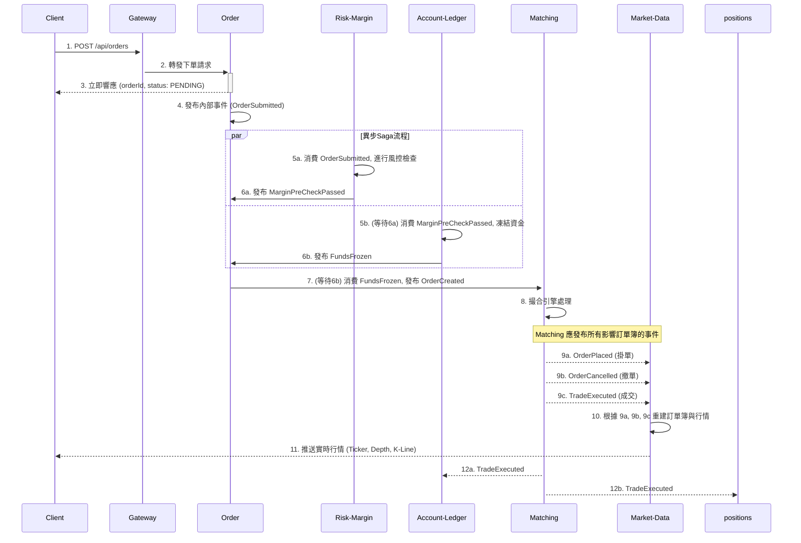

# 業務概述

本文件旨在闡述一個面向雲原生部署的高性能、高可靠性的數位資產合約交易平台。系統的核心目標是為專業交易員與機構用戶提供一個安全、低延遲且功能豐富的永續合約交易環境。

平台採用微服務架構，基於 Java、Spring Cloud 與 Kubernetes 構建，旨在實現快速迭代、水平擴展與高度自動化的維運。透過事件驅動與異步化設計（Saga 模式），本平台致力於在保證數據最終一致性的前提下，最大化核心交易路徑的吞吐量與可用性。

---

# 功能性需求

系統功能圍繞永續合約交易的核心生命週期，涵蓋用戶、交易、資產、行情與風控五大領域。

### 用戶與帳戶管理 (User & Account)
- **用戶註冊**: 支援透過 Email 進行註冊。
- **用戶登入**:
    - 提供標準的密碼登入驗證。
    - 支援 JWT (Access/Refresh Token) 機制，管理用戶會話。可以踢下線。
    - ~~規劃支援多因子認證 (MFA)，如 OTP、FIDO。~~
- ~~**安全管理**: 用戶可以管理登入密碼、綁定 MFA 設備。~~
- ~~**KYC 驗證**: 規劃不同等級的身份驗證流程，以解鎖相應的交易與提現權限。~~
- ~~**權限管理 (RBAC)**: 系統應具備角色與權限分離的設計，支援後台管理員、客服、風控等不同角色。~~

### 核心交易功能 (Trading)
- **交易對**: 支援多種永續合約交易對 (如 BTCUSDT-PERP)。
- **委託類型**:
    - **限價單 (Limit Order)**: 指定價格與數量的委託。
    - **市價單 (Market Order)**: 以市場最優價立即成交的委託。
    - ~~**條件單 (Conditional Order)**: 規劃支援止盈、止損等進階委託類型。~~
- **下單操作**: 提供開倉 (多/空)、平倉、撤銷委託等標準功能。
- **倉位管理**:
    - 用戶可以查看所有持倉的詳細資訊，包括倉位數量、開倉均價、未實現盈虧、保證金、強平價格等。
    - 支援調整槓桿倍數。
- **撮合引擎**:
    - 應採用價格優先、時間優先 (Price-Time Priority) 的撮合演算法。
    - 需為每個交易對維護獨立的訂單簿 (Order Book)。
- **交易歷史**: 用戶可以查詢歷史委託、歷史成交與資金流水記錄。

### 資產與資金管理 (Ledger & Funding)
- ~~**資金劃轉**: 規劃支援用戶在不同帳戶（如現貨、合約）之間的資金劃轉。~~
- **帳本系統**:
    - 採用雙分錄記帳法，確保所有資金變動的準確性與可審計性。
    - 精確記錄每筆交易的結算、手續費、已實現盈虧。
- **資金費率**:
    - ~~定期 (如每 8 小時) 計算並結算多空雙方的資金費用。~~
    - ~~費率計算應基於標記價格與指數價格的價差。~~

### 行情數據 (Market Data)
- **即時行情**:
    - 透過 WebSocket 推送即時的 Ticker 資訊 (最新價、24h 漲跌幅、成交量等)。
    - 推送即時的成交紀錄。
- **市場深度**: 透過 WebSocket 推送即時的訂單簿深度數據。
- **K 線圖**:
    - 提供多種時間週期 (1m, 5m, 1h, 1d 等) 的 K 線數據。
    - 支援 REST API 查詢歷史 K 線。
- **指數與標記價格**:
    - 聚合多家外部交易所的現貨價格，計算出公允的「指數價格」。
    - 基於指數價格和資金費率計算「標記價格」，用於計算未實現盈虧和觸發強平。

### 風險控制 (Risk Management)
- **保證金制度**:
    - ~~採用逐倉或全倉保證金模式。
	    - 採用全倉保證金模式
    - 根據倉位大小和槓桿，計算初始保證金與維持保證金。
- **強制平倉**:
    - 當用戶的保證金率低於維持保證金要求時，系統將自動執行強制平倉流程。
    - 採用標記價格觸發強平，以避免市場插針造成的異常波動。
- ~~**風險限額**: 規劃支援對單一用戶的持倉量、委託數量進行限制。~~
- ~~**保險基金**: 規劃設立保險基金，用於彌補穿倉損失。~~

---

# 非功能性需求

為滿足金融級交易系統的要求，系統在性能、可用性、擴展性、一致性、安全性與可觀測性方面需達到以下標準。

### 高性能 (High Performance)
- **低延遲**:
    - **下單延遲**: 核心下單流程採用 Saga 異步模式，用戶請求的 P99 響應時間應在 10ms 以內。
    - **撮合延遲**: 內存撮合引擎的處理能力應達到百萬級 TPS，單筆撮合延遲應在 1ms 以內。
    - **行情延遲**: 從成交到客戶端收到 WebSocket 行情推送的端到端延遲應在 100ms 以內。
- **高吞吐量**: 系統應能應對市場劇烈波動時的流量洪峰，支持每秒上萬筆的委託請求。

### 高可用性 (High Availability)
- **服務容錯**: 所有服務均以多副本形式部署在 Kubernetes 叢集中，單一節點或服務實例故障不影響整體可用性。
- **基礎設施容災**: 核心基礎設施 (如 Kafka, MySQL, Redis) 均需採用高可用架構（主從、集群），並具備跨可用區部署能力。
- **無單點故障**: 系統設計應避免任何單點故障，特別是在交易和結算等核心路徑上。
- **系統可用性**: 核心交易系統的年化可用性目標為 99.99%。

### 高擴展性 (High Scalability)
- **服務水平擴展**: 無狀態服務（如 Gateway、Controller）應能根據負載自動水平擴展。
- ~~**撮合引擎擴展**: 撮合引擎應按交易對進行分片 (Sharding)，允許透過增加撮合服務實例來支持更多的交易市場。~~
- **數據庫擴展**: 數據庫應具備水平分片或讀寫分離的能力，以應對不斷增長的數據量。

### 數據一致性 (Data Consistency)
- **最終一致性**: 對於非核心路徑，如用戶註冊，可接受最終一致性，並透過異步補償任務確保數據完整。
- **強一致性**:
    - **帳本**: 核心的 `account-ledger` 模組必須保證數據的強一致性，所有資產變動採用資料庫事務和雙分錄記帳法。
    - **冪等性**: 所有涉及資金變動的接口和事件消費，都必須設計為冪等的，防止因重試導致的重複記帳。
- **事件溯源**: 關鍵業務（如委託、倉位）的狀態變更應記錄事件流，便於審計、追蹤和故障恢復。

### 安全性 (Security)
- **身份與授權**:
    - 採用 OIDC 等標準協議，實現統一的身份認證。
    - API 需進行嚴格的 JWT 驗證與權限校驗。
- **風險控制**:
    - ~~在 Gateway 層實現 WAF、DDoS 防護與請求節流。~~
    - 核心交易操作需進行簽名驗證，防止重放攻擊。
- **資產安全**:
    - 敏感數據（如密碼、API Key）需加密存儲。
    - 帳本服務保留完整的審計軌跡。
- **合規性**: 系統需提供完整的操作日誌與交易數據，以滿足監管與合規報表的需求。

### 可觀測性 (Observability)
- **日誌 (Logging)**: 所有服務需輸出結構化的日誌，便於集中收集與查詢分析。
- **指標 (Metrics)**:
    - 核心服務需透過 Micrometer 暴露 Prometheus 格式的性能指標（延遲、吞吐量、錯誤率）。
    - 應包含 JVM、資料庫連接池、Kafka Lag 等基礎設施指標。
- ~~**追蹤 (Tracing)**: 規劃引入 OpenTelemetry，實現跨服務的分布式鏈路追蹤，快速定位性能瓶頸與故障點。~~
- **告警 (Alerting)**: 基於 Prometheus 指標建立核心業務與系統資源的告警規則，及時通知維運團隊。

### 可維護性 (Maintainability)
- **契約先行 (Contract-First)**: 服務間通信優先定義 OpenAPI/AsyncAPI 契約，並自動生成客戶端代碼。
- **自動化 (Automation)**: 透過 GitHub Actions 實現 CI/CD，自動完成從代碼提交到 Kubernetes 部署的完整流程。
- **模組化**: 高度可複用的功能（如日誌、數據庫訪問、認證）應沉澱到 `sdk` 模組中，以 Spring Boot Starter 的形式提供給業務服務使用。
# 
# 目錄結構

```
open.vincentf13/
├─ sdk/                          # 聚合所有橫切關注點 (cross-cutting concerns)，如日誌、監控、追蹤、資料庫存取等，以 Spring Boot Starter 的形式提供給業務服務使用。
│  ├─ sdk-core/                         # 核心工具包：提供共用常數、工具類 (Guava, Vavr)、DTO 映射 (MapStruct)、標準化 Log4j2 配置與 Prometheus 指標。
│  ├─ sdk-core-test/                    # 測試基礎設施：整合 JUnit、Testcontainers，提供對 MySQL、Redis、Kafka 的容器化測試支援。
│  ├─ sdk-spring-mvc/                   # Spring MVC 增強：提供統一的 RESTful API 回應結構、全域異常處理與 Web 相關配置。
│  ├─ sdk-auth/                         # 認證與授權基座：定義安全註解 (@PublicApi,@PrivateApi, @Jwt)，並整合 Spring Security 提供基礎安全配置。
│  ├─ sdk-auth-jwt/                     # JWT 解決方案：提供 JWT 的生成、解析與驗證過濾器，並整合 Redis 進行 Session 狀態管理。
│  ├─ sdk-auth-server/                  # 認證服務端實現：基於 sdk-auth，提供登入、登出、刷新 Token 等標準認證流程的 Controller 實作範本。
│  ├─ sdk-spring-session/               # Spring Session 整合：自動配置 Spring Session 使用 Redis 作為會話存儲。
│  ├─ sdk-spring-cloud-gateway/         # Spring Cloud Gateway 增強：提供共用的 Gateway Filter，如 JWT 驗證、路由與負載均衡配置。
│  ├─ sdk-spring-websocket/             # WebSocket 增強：提供 WebSocket/STOMP 的標準化配置。
│  ├─ sdk-spring-cloud-openfeign/       # OpenFeign 增強：整合 OpenFeign 客戶端、負載均衡與 Resilience4j 熔斷機制。
│  ├─ sdk-spring-cloud-alibaba-nacos/   # Nacos 整合：提供服務發現與配置中心的自動化配置。
│  ├─ sdk-infra-mysql/                  # MySQL 基礎設施：整合 MyBatis、PageHelper 與動態資料源，簡化資料庫操作。
│  ├─ sdk-infra-redis/                  # Redis 基礎設施：整合 Spring Data Redis 與 Redisson，提供快取、分布式鎖等功能。
│  ├─ sdk-infra-kafka/                  # Kafka 基礎設施：提供 Spring Kafka 的 Producer/Consumer 標準化配置。
│  └─ sdk-library-resilience4j/         # Resilience4j 整合：提供斷路器、速率限制器、重試等彈性模式的自動化配置。
├─ sdk-contract/                        # API 契約與客戶端聚合
│  └─ exchange-sdk/                     
│      ├─ exchange-user-sdk/            # user 子模組（REST 契約與客戶端）
│      │   ├─ rest-api/                 # OpenAPI 契約、DTO、Controller 介面（含 UserStatus 等共用枚舉）
│      │   └─ rest-client/              # 依契約生成的 Feign/HTTP 客戶端
│      │       └─ ExchangeUserClient.java # 基於 UserApi 的 FeignClient，透過 sdk-spring-cloud-openfeign 共用攔截與錯誤處理
│      └─ exchange-auth-sdk/           
│          ├─ rest-api/                 
│          └─ rest-client/             
└─ services/                            # 具體業務服務
   ├─ pom.xml                           
   ├─ service-user/                     # 使用者域服務
   │   ├─ domain/                       # 聚合根、領域服務、錯誤碼
   │   │   ├─ model/                    # Domain Model (Aggregate / Value Object)
   │   │   │   ├─ User.java                  # 使用者實體（目前為單表主檔，提供狀態判斷）
   │   │   │   ├─ UserErrorCode.java         # 使用者領域錯誤碼
   │   │   │   └─ (Enum via contract)        # UserStatus 等共用枚舉由 sdk-contract 契約提供
   │   │   └─ service/                  # Domain Service 協調領域規則
   │   │       └─ UserDomainService.java    # 領域服務：集中業務不變性（例：註冊時正規化 Email、驗證憑證唯一性）
   │   │                                    # Stateless，避免 @Transactional；由 Application Service 傳入聚合與外部資料
   │   │                                    # 典型場景：變更使用者狀態前先調用風控規則，再委派給聚合執行狀態切換
   │   ├─ infra/                        # Repository / Mapper / PO（資料庫表對應）
   │   │   └─ persistence/              # 持久層實作（Mapper + Repository）
   │   │       ├─ mapper/UserMapper.java     # MyBatis Mapper 介面，依靠全域 camelCase 與 Enum TypeHandler 自動對應欄位
   │   │       ├─ po/UserPO.java             # 資料庫表映射物件，欄位與 users 表一一對應
   │   │       └─ repository/                # Repository 介面集合，返回 Domain 實體
   │   │           └─ UserRepository.java             # 使用者主檔存取介面
   │   │               └─ UserRepositoryImpl.java     
   │   ├─ service/                      # Application Service（用例編排，DTO 與 Entity 映射）
   │   │   └─ UserService.java          # Application Service：用例入口，包裝 @Service + @Transactional 邊界
   │   │                                # 將 REST DTO 轉為 Domain Command，調用 Repository/Domain Service，處理事件發布
   │   │                                # 典型場景：registerUser() 內建立交易型 @Transactional，先查重 → 執行 Domain 規則 → 持久化 → 回傳 DTO
   │   └─ controller/                   # REST Controller / API 實作
   │       └─ UserController.java       # REST Controller
   ├─ service-auth/                    
   ├─ service-order/                    
   │   ├─ domain/
   │   ├─ infra/
   │   ├─ service/
   │   └─ controller/

```

# 共用原則

為確保程式碼的可維護性、可擴展性與業務核心的穩定性，所有業務服務 (`service-*`) 均遵循基於領域驅動設計 (DDD) 的四層架構。各層職責明確，嚴格遵守依賴倒置原則，確保上層模組不依賴於下層模組的具體實現。

### Controller (介面層)
- **職責**: 作為系統的入口，負責處理外部請求，是使用者介面 (UI) 或第三方服務的直接對接口。
- **核心任務**:
    - **契約實現**: Controller 嚴格實現 `sdk-contract` 中定義的 exchange-{service name}-rest-api 定義的 OpenAPI 介面。
	    - client端在 exchange-{service name}-rest-client中繼承，自動實現 client 端的接口調用。 
    - **請求處理**: 接收 HTTP 請求，並對請求參數 (DTOs) 進行基礎的格式驗證。
    - **安全過濾**: 配合 `sdk-auth` 提供的註解 (`@Jwt`, `@PublicApi` 等) 進行初步的認證與授權檢查。
    - **委派任務**: 將通過驗證的請求數據轉換為應用層的 Command 或 Query 物件，並委派給 `Service` 層進行處理。
    - **回應格式化**: 將 `Service` 層返回的結果（通常是 DTO）封裝成標準的 API 回應格式（由 `sdk-spring-mvc` 提供支援）。
- **設計原則**:
    - **保持輕薄**: Controller 層不應包含任何業務邏輯，僅作為請求的轉發與數據的初步轉換層。
    - **無狀態**: Controller 自身不應維護任何狀態。

### Service (應用層)
- **職責**: 負責編排與協調領域層的物件來完成一個完整的業務用例 (Use Case)。
- **核心任務**:
    - **交易管理**: 是事務邊界的起點與終點。通常在 `Service` 層的方法上聲明 `@Transactional`。
    - **用例協調**: 協調多個領域物件 (`Domain` 層) 或基礎設施 (`Infra` 層) 來完成一項業務功能。例如，一個註冊服務會協調 `User` 聚合根和 `UserRepository`。
    - **DTO 與領域物件轉換**: 負責將 Controller 傳入的 DTO 轉換為領域物件，或將領域物件轉換為 DTO 返回給 Controller。推薦使用 `MapStruct` (`sdk-core` 內建) 自動完成此轉換。
    - **應用事件發布**: 在完成一個業務流程後，可以發布應用級別的事件（例如，`UserRegisteredEvent`）。
- **設計原則**:
    - **聚焦業務流程**: 應用層的核心是「流程」，它定義了「如何做」，但不關心「業務規則細節」。
    - **依賴抽象**: 應依賴於 `Domain` 層和 `Infra` 層定義的介面，而非具體實現。

### Domain (領域層)
- **職責**: 包含所有核心的業務邏輯、規則與不變性 (Invariants)，是整個系統的心臟。
- **核心任務**:
    - **領域模型**: 包含聚合根 (Aggregate)、實體 (Entity)、值物件 (Value Object)。這些物件封裝了業務狀態和與之緊密相關的行為。
    - **領域服務 (Domain Service)**: 當某個業務邏輯不適合放在任何一個聚合或實體中時（例如，需要協調多個聚合的操作），可以使用領域服務。
    - **業務規則執行**: 負責執行最核心的業務規則，例如，一筆訂單的金額不能為負數，用戶的狀態只能從「正常」變為「凍結」。
- **設計原則**:
    - **純粹與獨立**: 領域層應是純粹的業務模型，不應包含任何與基礎設施相關的代碼或依賴（如資料庫、快取、框架註解）。
    - **高內聚**: 相關的業務邏輯和狀態應被封裝在同一個聚合內。
    - **富模型 (Rich Model)**: 鼓勵將業務邏輯作為方法實現在領域物件中，而不是將其暴露給 `Service` 層來處理（避免貧血模型）。

### Infra (基礎設施層)
- **職責**: 為其他各層提供技術實現，負責與外部世界（如資料庫、消息隊列、快取、第三方 API）進行交互。
- **核心任務**:
    - **Repository 實現**: 實現 `Domain` 層定義的 Repository 介面，負責領域物件的持久化與檢索。
        - **PO-Domain 轉換**: 在此層完成持久化物件 (PO) 與領域物件之間的轉換，推薦使用 `MapStruct`。
        - **數據庫操作**: 內部使用 MyBatis Mapper (`sdk-infra-mysql` 提供支援) 或 JPA 等技術與資料庫交互。
	        - Mybatis Mapper優先使用 insertSelective / updateSelective / findBy(PO) / batchInsert / batchUpdate 模板，避免重工
    - **訊息發布**: 實現訊息發布的介面，將事件發送到 Kafka (`sdk-infra-kafka`)。
    - **外部服務調用**: 透過 Feign Client (`sdk-spring-cloud-openfeign`) 調用外部微服務。
    - **快取實現**: 實現快取介面，使用 Redis (`sdk-infra-redis`) 進行數據快取。
- **設計原則**:
    - **實現驅動**: 這一層是所有技術細節的實現之地。
    - **依賴 SDK**: 大量依賴 `sdk-*` 模組，以標準化和簡化基礎設施的整合與配置。
    - **防腐層 (Anti-Corruption Layer)**: 在與外部系統交互時，Infra 層也扮演著防腐層的角色，防止外部系統的數據模型污染內部的領域模型。
# 


# 流程
- 註冊
- 登入
- 下單
- 強平
- 資金費率
- 保險基金注入或爪回 (Insurance Fund Activity)
- 系統手動調整 (Manual Adjustments / ADL)


# 
# gateway
  - 對接外部流量，統一執行 JWT 驗證~~、節流、設備指紋檢查。~~
  - 管理路由策略~~、A/B 測試、灰度/Canary 發佈，並整合觀測性管線。~~
  - 提供健康檢查~~、錯誤轉換、~~安全標頭注入。
# auth
  - 支援密碼、~~OTP、FIDO、社群登入等多種認證方式，維護登入審計。~~
  - 維護會話、刷新權杖、踢下線、~~裝置綁定與登入通知~~。
  - ~~發布登入/登出事件給風控、報表與通知模組。~~


| 表名                  | 用途        | 主要欄位                                                                                               | 備註                       |
| ------------------- | --------- | -------------------------------------------------------------------------------------------------- | ------------------------ |
| `auth_credentials`* | 登入憑證資料    | `id (PK)`, `user_id`, `credential_type`, `secret_hash`, `salt`, `status`, `expires_at`             | 支援密碼、API Key、FIDO 等多元憑證。 |
| `auth_providers`    | 第三方登入綁定   | `id (PK)`, `user_id`, `provider`, `provider_user_id`, `linked_at`                                  | 儲存社群/外部身份對應。             |
| `refresh_tokens`    | JWT 會話持久化 | `token_id (PK)`, `user_id`, `session_id`, `issued_at`, `expires_at`, `is_active`, `revoked_reason` | 搭配權杖刷新、強制登出與風險登入鎖定。      |
| `login_audits`      | 登入審計記錄    | `id (PK)`, `user_id`, `ip`, `user_agent`, `result`, `failure_reason`, `logged_at`                  | 供風控、合規、行為分析使用。           |

## `POST /api/auth/credentials`：建立憑證
## POST `/api/auth/login`：登入
 - 簽發 Access/Refresh Token，同時在 Redis 建立 session（`sessionId`、`userId`、到期時間等）。
 - 由 `sdk-auth-server` 提供預設實作；服務引入該模組後即可直接啟用。

登入流程
   - `POST /api/auth/login`：
	- Gateway 將請求轉給 `auth`。
	- `auth` 依 credential type 讀取 `auth_credentials`，以 `BCrypt`/`Argon2` 驗證密碼並檢查狀態（LOCKED、EXPIRED 等），必要時追加 OTP/FIDO 二次驗證。
	- 驗證成功後寫入 `login_audits`、`auth_sessions`，並在 Redis 建立 `auth:session:{sessionId}`（含 userId、roles、IP、裝置指紋、TTL）。
	- 回傳 Access/Refresh Token，JWT 內含 `sessionId`、`authContext`，供下游服務解析。
   - 請求授權：後續所有 API 由 Gateway 的 JWT Filter 驗證 Access Token，並以 `sessionId` 查詢 Redis（或本地快取）確認會話仍有效；若不存在或標記 `revoked` 即拒絕。
   - Token 續期：Access Token 過期時，前端呼叫 `POST /api/auth/token/refresh`，`auth` 驗證 Refresh Token 是否仍 active，使用樂觀鎖（`refresh_tokens.version`）避免重放，成功則簽發新 Access/Refresh 並延長 Redis session TTL。
   - 登出/失效：`POST /api/auth/logout` 或風控事件會標記 Refresh Token 為 `revoked`、刪除 Redis session，並發布 `AuthSessionRevoked` 事件；Gateway 或服務側可立即終止該會話。
   - 下游使用：各服務的安全 Filter 解析 JWT，將 `OpenJwtUser`（userId、roles、scopes、sessionId）放入 ThreadLocal 或 Reactor Context，支援審計與授權判定。

## POST `/api/auth/token/refresh`：refresh token
- 使用 Refresh Token 取得新的 Access Token，並延長 Redis session 到期時間。
 - 由 `sdk-auth-server` 提供預設實作；服務引入該模組後即可直接啟用。
## POST `/api/auth/logout`：使 token 失效
-  作廢 Refresh Token/Session（刪除 Redis session）。
- - 由 `sdk-auth-server` 提供預設實作；服務引入該模組後即可直接啟用。

## Event Output：`AuthSessionRevoked`
 強制登出或風險事件時發布，Gateway/周邊可中止會話
# user
  - 維護使用者主檔、~~偏好設定、語系與通知訂閱，管理 KYC 流程。~~
  - ~~管理角色、權限與範圍（scope），提供 RBAC/ABAC 查詢介面。~~

| 表名                       | 用途          | 主要欄位                                                                                 | 備註                                |
| -------------------------- | ------------- | ---------------------------------------------------------------------------------------- | ----------------------------------- |
| `users`*                   | 使用者主檔    | `id (PK)`, `external_id`, `email`, `status`, `created_at`, `updated_at`                  | 其他資料表以`user_id` 外鍵串聯。    |
| `user_profiles`            | 個資與偏好    | `user_id (PK/FK users)`, `display_name`, `country`, `language`, `timezone`               | 與`users` 1:1，儲存顯示與通知設定。 |
| `kyc_records`              | 身分驗證紀錄  | `id (PK)`, `user_id`, `tier`, `status`, `submitted_at`, `approved_at`, `rejected_reason` | 支援多次送審與審核歷程。            |
| `role_assignments`         | 角色/權限授權 | `id (PK)`, `user_id`, `role`, `scope`, `granted_by`, `granted_at`, `expires_at`          | RBAC 核心資料表。                   |
| `notification_preferences` | 通知訂閱設定  | `id (PK)`, `user_id`, `channel`, `is_enabled`, `updated_at`                              | 控制 Email、SMS、Push 等通路。      |

## `POST /api/users`：註冊


   - 前端呼叫 `user` 服務的 `POST /api/users`（由 Gateway 轉發）。
   - `user-service` 驗證信箱是否已存在，建立 `User` 主檔，同步在 `user_registration_prepare` 表寫入一筆 `PREPARE` 狀態的註冊工作（包含 userId、email、重試次數等欄位）。
   - 建立成功後呼叫 `auth` 服務，傳入 `AuthCredentialCreateRequest`（帶入 userId、型別、密碼雜湊與鹽值）；`auth` 寫入 `auth_credentials`，並回報成功以更新註冊工作狀態為 `COMPLETED`。
   - 若憑證建立失敗或 `auth` 暫時不可用，`user-service` 會保留 `PREPARE` 狀態並回傳 `RemoteServiceError`，以便稍後重試。
   - **排程補償**：`UserRegistrationResumer`（Spring Scheduling/Quartz Job）每分鐘掃描 `user_registration_prepare`，對停留在 `PREPARE` 的記錄重新呼叫 `auth` 建憑證；成功後標記 `COMPLETED`，連續 N 次失敗則標記 `FAILED` 並發送告警通知營運處理。

## `GET /api/users/me`：查詢基本資料
# order
  - 統一下單入口，支援市價/限價/~~條件單~~等多種委託型別。
  - 提供單筆與批次撤單、委託查詢、歷史訂單匯出。
  - 寫入訂單事件（event sourcing）供撮合、報表與重播。


| 表名             | 用途     | 主要欄位                                                                                                                                                       | 備註              |
| -------------- | ------ | ---------------------------------------------------------------------------------------------------------------------------------------------------------- | --------------- |
| `orders`*      | 委託主檔   | `order_id (PK)`, `user_id`, `instrument_id`, `client_order_id`, `side`, `type`, `price`, `quantity`, `status`, `time_in_force`, `created_at`, `updated_at` | 委託生命週期的核心資料。    |
| `order_events` | 委託事件溯源 | `event_id (PK)`, `order_id`, `event_type`, `payload`, `occurred_at`, `actor`                                                                               | 支援重播、稽核與行為分析。   |
| `order_tasks`  | 異步指令佇列 | `task_id (PK)`, `order_id`, `task_type`, `payload`, `status`, `retry_count`, `scheduled_at`                                                                | 批次撤單、策略單等非即時動作。 |


## `POST /api/orders` ：建立委託（限價/市價/買賣方向）


為追求極致的低延遲與高可用性，下單流程採用 Saga 異步模式，避免對下游服務的同步調用阻塞用戶請求。



### Saga 流程詳解

1.  **快速響應**:
    *   `Order` 服務收到請求後，僅做基礎驗證，立即在 `orders` 表中創建一筆 `PENDING` 狀態的訂單。
    *   **立刻返回 `orderId` 給用戶**，告知「訂單已提交」，此時用戶體驗延遲極低。
    *   `Order` 服務隨後發布 `OrderSubmitted` 事件，啟動後續流程。

2.  **異步執行**:
    *   `Risk-Margin` 消費 `OrderSubmitted`，進行保證金試算。通過則發布 `MarginPreCheckPassed`。
    *   `Account-Ledger` 消費 `MarginPreCheckPassed`，執行資金凍結。成功則發布 `FundsFrozen`。
    *   `Order` 服務消費 `FundsFrozen`，將訂單狀態更新為 `ACCEPTED`，並最終發布 `OrderCreated` 事件給 `Matching` 撮合引擎。

3.  **補償與失敗處理**:
    *   如果在風控檢查或資金凍結環節失敗（例如，`Risk-Margin` 發布 `MarginPreCheckFailed`），Saga 將觸發補償流程。
    *   `Order` 服務會將訂單狀態更新為 `FAILED`，並可通過 WebSocket 將失敗原因實時通知給用戶。

### 優勢
- **低延遲**：用戶下單幾乎瞬時完成。
- **高可用**：下游任何服務的短暫抖動或不可用，都不會阻塞用戶提交訂單，Saga 流程會通過內置的重試機制確保最終一致性。
- **高彈性**：各服務解耦，可以獨立擴展和部署。
    

## `DELETE /api/orders/{orderId}`：撤銷委託

- `order-service` 發送 `OrderCancelRequested`。
- `matching` 接收後從訂單簿移除，發布 `OrderCancelled`。
- `account-ledger` 消費後解凍資金，發布 `FundsUnfrozen`。
    
## `GET /api/orders/{orderId}`：查詢委託狀態與細節
## Event Output：`OrderCreated`、`OrderCancelled` 發布到事件匯流排
# matching
  - 是撮合核心，維護每個交易對的訂單簿。
  - 主要任務是：接收委託事件 → 進入訂單簿 → 撮合成交 -> 產生成交紀錄與行情報價來源 → **發布所有影響訂單簿的事件**。
  - 將撮合結果推送給 ledger、positions、market-data。


| 表名               | 用途   | 主要欄位                                                                                            | 備註             |
| ---------------- | ---- | ----------------------------------------------------------------------------------------------- | -------------- |
| `trade_tickers`* | 成交紀錄 | `trade_id (PK)`, `order_id`, `counterparty_order_id`, `price`, `quantity`, `fee`, `executed_at` | 撮合輸出，供報表與事件回放。 |
## Event Input：`OrderCreated`（掛單/撮合）
- 消費 `OrderCreated` 事件。
- 根據 `instrument_id` 取得對應訂單簿。
- 按方向掛入：`BUY` 掛買盤（高價優先），`SELL` 掛賣盤（低價優先）。
- 市價單則立即撮合。


### 撮合規則

|條件|行為|
|---|---|
|buy.price ≥ bestSell.price|成交|
|sell.price ≤ bestBuy.price|成交|
|其他|掛單等待|

撮合演算法：

```
while (對手單存在 && 尚未完全成交):
    tradeQty = min(委託剩- 剩餘量, 對手單剩餘量)
    tradePrice = 對手單價格
    生成 TradeExecuted 事件
    更新雙方剩餘量與狀態
    若對手單完成則移出訂單簿
```


### 核心事件輸出
為確保下游數據的完整性（特別是 `Market-Data` 的深度圖），`Matching` 引擎必須在**任何改變訂單簿狀態的操作**後發布對應事件。

| 事件                   | 觸發時機       | 核心內容                                                        | 主要消費者                                        |
| :------------------- | :--------- | :---------------------------------------------------------- | :------------------------------------------- |
| **`OrderPlaced`**    | 新訂單成功掛入訂單簿 | `orderId`, `side`, `price`, `quantity`                      | `Market-Data`                                |
| **`OrderCancelled`** | 訂單成功從訂單簿移除 | `orderId`                                                   | `Market-Data`, `Account-Ledger`              |
| **`TradeExecuted`**  | 兩筆訂單撮合成交   | `tradeId`, `buyOrderId`, `sellOrderId`, `price`, `quantity` | `Market-Data`, `Account-Ledger`, `Positions` |

### 撮合後事件流

`TradeExecuted` 被多模組平行消費：

| 模組             | 處理                                                                           |
| -------------- | ---------------------------------------------------------------------------- |
| account-ledger | 雙分錄記帳、扣除凍結、計算手續費、發布 `LedgerEntryCreated`                                     |
| positions      | 更新倉位與平均成本、盈虧                                                                 |
| risk-margin    | 更新維持保證金與強平價                                                                  |
| market-data    | **根據 `TradeExecuted` 更新 Ticker；<br>根據 `OrderPlaced`/`OrderCancelled` 更新深度圖** |

### 撮合後資金與狀態演進

開倉

| 階段    | Order 狀態         | Ledger 動作 | Positions |
| ----- | ---------------- | --------- | --------- |
| 下單    | CREATED          | 凍結保證金     | 無         |
| 撮合中   | PARTIALLY_FILLED | 部分扣款與解凍   | 倉位增加      |
| 撮合完成  | FILLED           | 全部結算與解凍   | 倉位完成更新    |
| 撤單或失敗 | CANCELLED        | 解凍保證金     | 不變        |


## Event Output：`TradeExecuted`（成交事件，含價格/數量/對手單/手續費等）
## （可選）`POST /api/matching/cancel`：撮合層執行撤單。
- `order-service` 發送 `OrderCancelRequested`。
- `matching` 接收後從訂單簿移除，發布 `OrderCancelled`。
- `account-ledger` 消費後解凍資金，發布 `FundsUnfrozen`。
    
## 撮合引擎結構建議

```
MatchingEngine
 ├─ OrderBookManager
 │   ├─ Map<InstrumentId, OrderBook>
 │   └─ SnapshotService（定期持久化快照）
 ├─ EventListener
 │   └─ consume(OrderCreated)
 ├─ TradePublisher
 │   └─ publish(TradeExecuted)
 └─ Persistence
     └─ trade_tickers 表 (成交紀錄)
```

## 線程模型
- 高併發下使用 per-instrument 單執行緒模型確保順序與一致性。

## 資料一致性與重放
- 撮合結果是唯一真實成交來源。
- `TradeExecuted` 應使用 Kafka exactly-once 模式發布。
- 撮合引擎應保存 WAL（write-ahead log），以便重啟重放。

# account-ledger
  - 以雙分錄維護資產變動，確保借貸平衡並支援審計。
  - 產生結算、利息、資金費率、手續費等財務事件。

| 表名              | 用途       | 主要欄位                                                                                                      | 備註                     |
| ----------------- | ---------- | ------------------------------------------------------------------------------------------------------------- | ------------------------ |
| `ledger_entries`* | 雙分錄紀錄 | `entry_id (PK)`, `account_id`, `asset`, `amount`, `direction`, `reference_type`, `reference_id`, `event_time` | 借貸必須平衡，支援審計。 |
| `ledger_balances` | 帳戶餘額   | `id (PK)`, `account_id`, `asset`, `balance`, `available`, `reserved`, `updated_at`                            | 提供資產查詢與風控試算。 |
| `funding_rates`   | 資金費率   | `id (PK)`, `instrument_id`, `rate`, `effective_at`, `calculated_at`                                           | 供費率結算與倉位估值。   |
## Event Input：`TradeExecuted`（記帳）
來源事件：`TradeExecuted`（由 matching 發布）  

事件內容包括：
- `instrumentId`
- `buyOrderId`, `sellOrderId`
- `price`, `quantity`
- `buyerUserId`, `sellerUserId`
- `fee`
- `executedAt`
    
`account-ledger` 消費這個事件後，開始進行「雙分錄」結算。

---
處理目標
- 對買賣雙方進行資金移轉（可用 → 實際結算）
- 扣除或返還凍結資金
- 記錄手續費、盈虧
- 發布新的「資產異動事件」供倉位與風控更新
    
---
處理步驟

接收事件
Kafka consumer 收到 `TradeExecuted` → 開啟交易（@Transactional）

---
讀取基礎資料
- 查詢雙方的帳戶餘額 (`ledger_balances`)
- 查詢交易商品參數 (`instrument_metadata`)
- 驗證撮合結果是否已處理過（根據 tradeId 去重，確保冪等）
---
計算資金變化

以 BTCUSDT 永續合約為例：

| 角色   | 動作     | 資金方向    | 備註             |
| ---- | ------ | ------- | -------------- |
| 開倉   | 支付成交金額 | 扣除 USDT | 使用凍結保證金結算      |
| 平倉   | 收到成交金額 | 增加 USDT | 結算入帳           |
| 系統帳戶 | 收取手續費  | 增加 USDT | maker/taker 費率 |

---

### 執行雙分錄記帳

以「借貸必平衡」原則進行三組分錄：

**1. 資金結算**

---

**雙方開倉** 

多方（開多）

```
借：保證金 reserved 減少
貸：持倉 margin_used 增加
```

空方（開空）

```
借：保證金 reserved 減少 
貸：持倉 margin_used 增加
```
→ 二邊都「增加持倉佔用額」，但這是各自帳內的轉換，沒有對方參與。

---

**平倉或強平時才有對向結算**

假設多方平倉時價格高於開倉價（盈利）：

```
借：Short margin_used 減少（虧損方） 
貸：Long margin_used 減少（盈利方） 
貸：Buyer available 增加（實現收益）
```

相反，若多方虧損、空方盈利，方向對調。  
這時才會發生「盈虧轉移」，即從虧損方的保證金扣減，轉給盈利方。


**2. 手續費**

```
借：Buyer or Seller 帳戶（依角色扣費）
貸：Exchange Fee 帳戶（平台收入）
```

**3. 解凍 / 結餘調整**  
若委託未全成交或撤單，將剩餘凍結部分解凍：

```
借：保證金 reserved 減少
貸：保證金 available 增加
```

---

### 更新餘額表
- `ledger_balances`：更新 balance / available / reserved 欄位。
- `ledger_entries`：插入雙分錄交易明細。  

    欄位示例：
    
    ```
    entry_id, account_id, asset, amount, direction, reference_type='TRADE',
    reference_id=tradeId, event_time=executedAt
    ```
    

---

### 發布資產異動事件

每筆交易完成後，發出：

```
LedgerEntryCreated {
  userId,
  instrumentId,
  asset,
  deltaAvailable,
  deltaReserved,
  balanceAfter,
  referenceType = TRADE,
  referenceId = tradeId
}
```

供下游模組使用：
- `risk-margin` 更新風險與維持保證金；
- `reporting` 寫入審計或報表。
    

---

### 提交交易
- 整個過程包在同一個資料庫交易中。
- 成功後提交並確認事件 Outbox → Kafka（確保 exactly-once）。
- 若中途失敗則 rollback，確保資產不亂動。
    

---

### 關鍵要點
- `account-ledger` 是整個系統的**資產真實源**（source of truth）。
- 每個事件皆以**雙分錄**確保會計平衡。
- 結算與發佈事件需使用 Outbox 以保證最終一致性。
- 所有金額欄位需使用 Decimal128 或 BigDecimal 精確運算。

## Event Output：`LedgerEntryCreated`（資產異動事件）


## `GET /api/ledger/balances?userId=`：查詢餘額/可用資金（供前端或風控使用）
# positions
- `positions` 模組負責維護每個用戶在各交易對 (`instrument_id`) 上的**持倉、平均成本、未實現盈虧、強平價、破產價**等資訊。   它不處理金流，只根據成交與資產事件來更新倉位。  

| 類別   | 功能                                                                     |
| ---- | ---------------------------------------------------------------------- |
| 狀態維護 | 維護每個用戶在各交易對的倉位方向、數量、均價、未實現損益、強平價                                       |
| 事件驅動 | 消費 `TradeExecuted`、`LedgerEntryCreated`、`MarkPriceUpdated` 等事件來更新倉位與盈虧 |
| 風險回饋 | 將更新後的風險指標（margin ratio、liquidation price）發送給 `risk-margin`             |
| 倉位溯源 | 維護 `position_events` 表供稽核與重放                                           |
|      |                                                                        |

| 表名                | 用途     | 主要欄位                                                                                                                                                 | 備註           |
| ----------------- | ------ | ---------------------------------------------------------------------------------------------------------------------------------------------------- | ------------ |
| `positions`*      | 倉位主檔   | `position_id (PK)`, `user_id`, `instrument_id`, `side`, `quantity`, `entry_price`, `mark_price`, `unrealized_pnl`, `liquidation_price`, `updated_at` | 倉位快照與估值資料。   |
| `position_events` | 倉位事件溯源 | `event_id (PK)`, `position_id`, `event_type`, `delta_qty`, `delta_pnl`, `reference_id`, `occurred_at`                                                | 追蹤倉位變化與強平歷程。 |
## Event Input：`TradeExecuted`

當 `matching` 撮合成功發布成交事件後，`positions` 消費它來更新倉位：

核心職責: 即時更新倉位的狀態，包括數量和成本。

開平倉處理流程:

   1. 消費事件: positions 服務監聽並接收到 TradeExecuted 事件。
   2. 查找或建立倉位:
       * 根據事件中的 `userId`, `instrument_id` (交易對) 和 `side` (方向，多/空)，查找對應的現有倉位。
       * 如果倉位不存在 (即為開倉交易)，則建立一筆新的倉位紀錄。
   3. 更新倉位細節:
       * 更新數量: 將本次成交數量累加到現有倉位數量上。
           * `新數量` `=` `舊數量` `+` `本次成交數量`
       * 重新計算平均開倉價: 根據新的總數量和總成本，計算加權平均開倉價。
           * `新平均開倉價` `=` `(舊開倉價` `*` `舊數量` `+` `本次成交價` `*` `本次成交數量)` `/` `新數量`
   4. 計算未實現盈虧 (Unrealized PNL):
       * 從本地 `MarkPriceCache` 中讀取最新的標記價格 (`Mark Price`) (該價格由 `MarkPriceUpdated` 事件更新)。
         若暫無資料則保留上一筆標記價，待事件抵達時再刷新。
       * 根據新的倉位狀態計算浮動盈虧。
           * `未實現盈虧` `=` `(標記價格` `-` `新平均開倉價)` `*` `新數量` `*` `合約面值`
   5. 重新計算強平價 (`Liquidation` `Price`): 根據更新後的倉位、槓桿和保證金率，重新計算強平價格。
   6. 持久化儲存:
       * 將更新後的倉位資訊 (數量、均價、未實現盈虧等) 儲存到 `positions` 資料表中。
       * 在 `position_events` 表中新增一筆事件紀錄，用於審計和追蹤。
   7. 發布 `PositionUpdated` 事件: 倉位狀態更新後，發布 PositionUpdated 事件，
      通知 risk-margin (風控) 等下游服務進行相應的風險計算更新。
   8. 平倉時，檢查若倉位數量為0 且 若已消費 `LedgerEntryCreated` 而有已實現盈虧，將該倉位狀態更新為 CLOSED。並發佈 `PositionClosed`  事件

## Event Input：`LedgerEntryCreated`

 此事件由 account-ledger (帳本) 服務在完成一筆交易的資金結算後發布。用於處理平倉和確保與帳務的最終一致性。

核心職責: 確認資金結算的最終結果，並據此更新已實現盈虧、正式關閉倉位。

平倉處理流程:

   1. 消費事件: positions 服務監聽並接收到 `LedgerEntryCreated` 事件。
   2. 確認資金結算: 此事件是對一筆交易資金轉移的最終確認。TradeExecuted 更新了倉位的「狀態」，
      而 LedgerEntryCreated 則確認了其「財務結果」。
   3. 處理平倉邏輯:
       * 更新實現盈虧
           * 已實現盈虧 = (平倉價格 - 平均開倉價) * 平倉數量
       * 如果倉位數量歸零，則將該倉位狀態更新為 CLOSED。這會將其從活躍的盈虧與強平監控中移除。
   4. (可選) 發布 `PositionClosed` 事件: 當倉位完全關閉時，可以發布一個更明確的 PositionClosed
      事件，通知相關服務此倉位生命週期已結束。
---

 資金費率結算 (Funding Fee Settlement)
   * `referenceType`: `FUNDING_FEE`
   * 核心目的: 處理多空雙方之間定期支付的資金費用。這是一筆直接的現金轉移，會直接影響倉位的總盈虧。
   * Positions 服務的處理:
       * 根據事件中的金額 (正數或負數)，直接累加到倉位的已實現盈虧 (`realized_pnl`) 上。
       * 注意: 資金費率不影響倉位的平均開倉價 (entry_price)，但它會改變倉位的總體盈利狀況。
       * 記錄一筆新的 position_events，類型為 FUNDING，並立即標記為 SETTLED。

  強制平倉結算 (Liquidation Settlement)
   * `referenceType`: `LIQUIDATION`
   * 核心目的: 確認一筆強平訂單的最終財務結果，這通常包括額外的強平費用。
   * Positions 服務的處理:
       * 這本質上也是一筆交易，所以會像處理 TRADE 類型一樣，計算已實現盈虧。
       * LedgerEntryCreated 事件會反映出扣除強平費用 (liquidation fee) 後的最終金額。positions 服務應使用這個最終金額來計算
         PNL，以確保數據的準確性。
       * 觸發 tryToClosePosition() 檢查，這幾乎總會導致倉位關閉。

保險基金注入或爪回 (Insurance Fund Activity)
   * `referenceType`: `INSURANCE_FUND`
   * 核心目的: 在發生穿倉損失 (用戶餘額變為負數) 時，由保險基金填補虧損。反之，如果強平後有剩餘，可能會注入保險基金。
   * Positions 服務的處理:
       * 這是一筆直接的 PNL 調整。positions 服務需要根據事件金額，更新倉位的已實現盈虧
         (`realized_pnl`)，以反映這筆來自系統的注入或扣除。

  系統手動調整 (Manual Adjustments / ADL)
   * `referenceType`: `MANUAL_ADJUSTMENT` 或 `ADL`
   * 核心目的: 處理運營人員的手動資金調整，或自動減倉系統 (ADL) 觸發的平倉。
   * Positions 服務的處理:
       * 與其他類型類似，這也是對 PNL 的直接調整。positions 服務必須更新 realized_pnl 以保持與帳本的同步。

## Event Input：`MarkPriceUpdated`

- `positions` 以 `instrument_id` 為 key 消費 `market.mark-price` topic：
    1. 將標記價寫入本地 `MarkPriceCache`，並記錄事件時間（防止舊價覆蓋新價）。
    2. 查詢所有在該 `instrument_id` 上仍為 `OPEN` 的倉位。
    3. 逐筆重算：

        ```
        unrealized_pnl = (mark_price - entry_price) * position_qty * contract_size
        mark_price_field = mark_price
        ```

    4. 更新 `positions` 表與 `position_events`，僅在盈虧或標記價變化超過閾值（如 notional 0.01%）時落庫，以減少寫入壓力。
    5. 發布 `PositionUpdated` 事件（詳見下節）供風控、報表使用。
- 事件處理與成交事件分開執行，確保行情與倉位計算互不阻塞；若行情延遲，倉位會保留上一次標記價與盈虧。


## Event Output：`PositionUpdated`（倉位、市值、未實現損益）

無論是成交事件還是 `MarkPriceUpdated` 事件造成倉位狀態或盈虧變化，只要超過發布閾值即會發布：

```
PositionUpdated {
  userId,
  instrumentId,
  side,
  quantity,
  entryPrice,
  markPrice,
  unrealizedPnl,
  liquidationPrice,
  timestamp
}
```

消費方：

- **risk-margin**：更新風險係數、強平條件。
- **reporting**：寫入歷史與監控系統。
- **market-data**（可選）：提供倉位聚合資訊（多空比）。

---

## Event Output： `PositionClosed` (倉位、已實現損益)
## `GET /api/positions?userId=`：查詢當前倉位與損益

## 內部邏輯狀態轉換

|事件|狀態變化|說明|
|---|---|---|
|開倉成交|`NONE` → `OPEN`|建立新倉位|
|加倉成交|`OPEN` → `OPEN`|增加數量，重算均價|
|減倉（平倉部分）|`OPEN` → `PARTIALLY_CLOSED`|減少數量，部分結算|
|全平|`OPEN` → `CLOSED`|倉位清零，記錄實現盈虧|

## 實現與未實現盈虧計算

未實現盈虧（浮動盈虧）

- 公式：

  ```
  unrealized_pnl = (mark_price - entry_price) * position_qty * contract_size
  ```

- `mark_price` 來自最新的 `MarkPriceUpdated` 事件，`entry_price` 為倉位加權成本；`contract_size` 視永續合約面額決定（例：1 USD 或 0.001 BTC）。
- `positions` 會維護 `MarkPriceCache`，事件到達後立即刷新 `mark_price` 與 `unrealized_pnl`，並將結果寫入資料庫與後續事件。
- 多倉：價格上漲 → 盈利；下跌 → 虧損。
- 空倉：價格上漲 → 虧損；下跌 → 盈利（計算時 `position_qty` 為負值，自然反映方向）。

---

實現盈虧（平倉時）

```
realized_pnl = (close_price - entry_price) * closed_qty
```

更新後：

```
position_qty -= closed_qty
entry_price 保持或重新計算
```


---

## 關鍵特性

- 所有倉位狀態源自成交事件，**不依賴帳務表進行計算**。
- 每筆變化寫入 `position_events`，可支援**重放與恢復**。
- 倉位更新為**純計算行為，不進行資金轉移**。
- 與 `ledger`、`risk` 分層隔離：
    - ledger 管金流
    - positions 管數量與盈虧
    - risk 管安全線與槓桿限制
        
簡言之，`positions` 模組是交易引擎的**倉位記錄器**，  
它依據撮合與帳務事件計算每位用戶的持倉與盈虧，  
不動資金、不簽帳，只維護真實狀態與可計算指標，  
並將結果回饋給風控與報表系統形成完整閉環。

# risk-margin
- `risk-margin` 模組負責整個交易系統的**風險計算與保證金控制**，  它連接撮合層與倉位層，是實時監控「每位用戶能否承擔風險」的核心。 在撮合成交後，`risk-margin` 會根據實際成交與倉位變化動態調整各項風險指標。
- 計算保證金與風險指標、提供下單前限額校驗。
- 維護風控規則版本、建立強平佇列與風險告警。
- 執行強平


| 類別     | 職責                                          |
| ------ | ------------------------------------------- |
| **事前** | 下單前預檢（`/api/risk/pre-check`）判斷可否下單、需凍結多少保證金 |
| **事後** | 根據持倉與標記價格即時監控槓桿、維持保證金率與強平條件                 |


| 表名                | 用途     | 主要欄位                                                                                                           | 備註                         |
| ------------------- | -------- | ------------------------------------------------------------------------------------------------------------------ | ---------------------------- |
| `risk_limits`       | 風控參數 | `id (PK)`, `instrument_id`, `tier`, `initial_margin_rate`, `maintenance_margin_rate`, `max_leverage`, `updated_at` | 下單前保證金與限額判斷依據。 |
| `liquidation_queue` | 強平佇列 | `id (PK)`, `position_id`, `status`, `queued_at`, `processed_at`, `reason`                                          | 追蹤強平排程與處理狀態。     |
## `POST /api/risk/pre-check`：依用戶、委託金額、倉位資料返回是否允許下單

## Event Input：`PositionUpdated` 更新風險指標


```
PositionUpdated 事件發布
   ↓
Risk-Margin 消費事件
   ↓
依 user/instrument 從 positions 讀取最新倉位
   ↓
計算名義價值與實際保證金佔用
   ↓
更新 risk snapshot、發布 RiskUpdate
```

---

### 接收倉位更新事件 `PositionUpdated`

Kafka Consumer 收到 `PositionUpdated` 後執行：
- 根據 `instrument_id` 查找對應的 `risk_limits`（初始 / 維持保證金率、最大槓桿）。
- 從事件或 positions 查出對應用戶的倉位基礎資訊（`quantity,` `entry_price,` `mark_price,` `unrealized_pnl` ）。
- 再結合既有的保證金餘額快照計算可用槓桿與風險比率。

---

### 更新實際佔用保證金與槓桿

| 指標               | 計算方式                          | 含義        |
| ---------------- | ----------------------------- | --------- |
| **notional**     | `abs(entry_price * quantity)` | 倉位名義價值    |
| **used_margin**  | `notional / leverage`         | 實際佔用保證金   |
| **margin_ratio** | `(equity / notional)`         | 槓桿比值（風險率） |
`equity` = 淨資產值 =已實現盈虧 + 未實現盈虧 + 餘額


若倉位擴大或槓桿調整：
- 更新該用戶該 `instrument_id` 的 `used_margin`。
- 若超過風控規則（如槓桿上限），標記為 `RISK_ALERT`。


---

### 根據 mark_price 實時計算風險指標

| 指標                    | 計算公式                                                        | 意義           |
| --------------------- | ----------------------------------------------------------- | ------------ |
| **unrealized_pnl**    | `(mark_price - entry_price) * qty`                          | 未實現盈虧        |
| **margin_ratio**      | `((margin_balance + unrealized_pnl) / notional)`            | 維持比率         |
| **liquidation_price** | `entry_price * (1 ± (initial_margin - maintenance_margin))` | 強平價（多為減，空為加） |

### 觸發強平
若 `margin_ratio < maintenance_margin_rate`  
→ 觸發強平流程，發布 `RiskUpdate` 事件

---

### 更新 risk 狀態表與指標快照

寫入或更新：

```
risk_snapshots {
  user_id,
  instrument_id,
  notional_value,
  used_margin,
  equity,
  margin_ratio,
  liquidation_price,
  status,
  updated_at
}
```

狀態可能為：
- `NORMAL`
- `ALERT`（接近維持保證金）
- `MARGIN_CALL`
- `LIQUIDATION_PENDING`
    

---

### 發布 RiskUpdate 事件


## Event Input ：`MarkPriceUpdated`

```
MarkPriceUpdated 事件發布
   ↓
Risk-Margin 消費事件
   ↓
帶入既有倉位快照
   ↓
重新計算未實現損益、維持保證金比率與強平價
   ↓
更新 risk snapshot、發布 RiskUpdate / Liquidation 指令
```

行情事件處理的重點在於「即時調整」：每筆標記價格更新都會重新計算倉位風險，即便倉位數量不變，也能在價格急速變動時觸發強平或通知。


## Event Output：`RiskUpdate`

風控結果會以事件形式廣播：

```
RiskUpdate {
  userId,
  instrumentId,
  marginRatio,
  liquidationPrice,
  status,
  timestamp
}
```

消費者：
- **order-service**：若風險過高，暫停新委託。
- **risk-liquidation-worker**：自動強平執行（發起 `liquidation_queue`）。
- **monitor/reporting**：更新風險面板與報表。

## 強平（Liquidation）觸發條件

若：

```
margin_ratio <= maintenance_margin_rate
```

則：
- 寫入 `liquidation_queue`
- 標記倉位為 `LIQUIDATION_PENDING`
- 由強平任務（worker）在下一個 `RiskUpdate` 後讀取佇列，透過平倉委託或直接撮合關閉倉位。
    

## 關鍵特性
- **風險指標來源**：以 `positions` 倉位快照與行情標記價為主，搭配風控模組自身維護的保證金餘額快照。
- **mark_price 驅動**：所有風控以標記價為準。
- **事件驅動更新**：不輪詢，而是消費倉位更新與行情推送。
- **即時警戒**：margin_ratio 低於閾值時可主動通知 order-service 禁止加倉。
- **持久化快照**：所有風險變化寫入 `risk_snapshots`，可回放與監控。
    

# market-data
- `market-data` 模組是整個交易所的**行情引擎與資料分發層**，負責從撮合結果 (`TradeExecuted`) 生成並廣播可觀察行情：最新價、成交量、K 線、深度、Funding Rate 等。 它不參與資金結算，也不直接持倉，只聚焦「市場資訊的生成、儲存與推送」。
- 轉換撮合輸出為行情快照、K 線、深度資料和統計指標。
- 提供 WebSocket / gRPC 串流與快取服務給前端與夥伴。

| 功能類別      | 說明                                                            |
| --------- | ------------------------------------------------------------- |
| **行情生成**  | 從 `TradeExecuted` 事件更新最新價、24h 漲跌、成交量等 Ticker 資訊               |
| **深度圖構建** | **消費 `OrderPlaced` 和 `OrderCancelled` 事件，實時、完整地在內存中重建訂單簿深度圖** |
| **行情快照**  | 以固定頻率寫入 `market_snapshots`（供 REST 查詢）                         |
| **串流分發**  | 將即時行情推送至 WebSocket / gRPC stream                              |
| **衍生資料**  | 針對不同派生資料訂定觸發事件與生成流程（詳見下節）                                     |
| **外部訂閱**  | 為前端、風控、報表模組提供行情訂閱介面                                           |


| 表名               | 用途     | 主要欄位                                                                                                 | 備註                     |
| ------------------ | -------- | -------------------------------------------------------------------------------------------------------- | ------------------------ |
| `market_snapshots` | 行情快照 | `snapshot_id (PK)`, `instrument_id`, `bid_depth`, `ask_depth`, `last_price`, `volume_24h`, `captured_at` | 提供行情查詢與串流基礎。 |
## Event Input：消費來自 `Matching` 引擎的全量訂單簿事件 (撮合深度快照)
### 消費事件
- **消費 `TradeExecuted`**:
    - 用於更新 Ticker 資訊：最新成交價、24h 成交量、漲跌幅等。
    - 作為 K 線聚合的數據源。
- **消費 `OrderPlaced` 與 `OrderCancelled`**:
    - 這是構建**實時市場深度 (Order Book)** 的唯一準確數據源。
    - `Market-Data` 在內存中維護每個交易對的訂單簿，收到 `OrderPlaced` 時增加掛單，收到 `OrderCancelled` 或 `TradeExecuted` (導致訂單完成) 時移除掛單。
    - 隨後將更新後的深度圖快照推送給前端。

--- 

### 資料處理主流程

```
Matching Events (OrderPlaced, OrderCancelled, TradeExecuted)
  ↓
Market-Data Consumer
  ↓
更新內存中的訂單簿 (深度圖) 與 Ticker 緩存
  ↓
生成衍生資料 (K 線、指數價、Funding Rate、標記價)
  ↓
更新快照資料庫
  ↓
推送給 WebSocket / gRPC 客戶端
```

---

### 更新內存中的訂單簿 (深度圖) 
- 來源：matching 的掛單簿快照或差分。
- 資料結構：
    
    ```
    bids: [(price, qty)...]  # 高→低
    asks: [(price, qty)...]  # 低→高
    ```
- 每次更新後重新計算：
    - 最佳買價 / 賣價 (`best_bid`, `best_ask`)
    - 中間價 (`mid_price = (bid + ask)/2`)
        
--- 

### 更新內存中 Ticker 緩存

接收到成交後：

```
last_price = trade.price
volume_24h += trade.quantity
turnover_24h += trade.price * trade.quantity
high_24h = max(high_24h, trade.price)
low_24h  = min(low_24h, trade.price)
price_change_24h = (last_price - open_24h) / open_24h
```

結果存入 `ticker_cache[instrument_id]`。

---

### 衍生資料事件一覽

| 衍生資料類型                | 觸發來源 / 時機                                     | 產出事件與目的                                                                                  |
| --------------------- | --------------------------------------------- | ---------------------------------------------------------------------------------------- |
| **K 線 (Candlestick)** | 每個時間窗（1m/5m/1h…）有成交 (`TradeExecuted`) 聚滿或時間到期 | `KlineClosed` → 寫入 `market.kline` topic，供前端繪圖、歷史回放，並同步 flush 至 `kline_buckets` 資料表       |
| **指數價 (Index Price)** | 外部行情聚合器輪詢/推送新報價或偵測到顯著價差                       | `IndexPriceUpdated` → 廣播於 `market.index-price` topic，作為標記價、清算引擎的基準；同時緩存在 Redis 供即時查詢     |
| **標記價 (Mark Price)**  | 指數價更新或 Premium Index / Funding Basis 變動       | `MarkPriceUpdated`（已含 index/mark/fair price）→ 讓 `positions`/`risk-margin` 重新計算未實現盈虧與保證金率 |
| **Funding Rate**      | 每個結算周期（預設 8h）計算最新資金費率                         | `FundingRateUpdated` → 寫入 `market.funding-rate` topic，供結算服務發放資金費；同時記錄於 `funding_rates` 表 |

--- 

### K 線生成

- 每分鐘（或指定周期）將成交聚合為 K 線：
    
    ```
    open, high, low, close, volume
    ```
- 通常由定時任務（Flusher / Stream Processor）從 Kafka 流聚合：
    
    ```
    SELECT
      instrument_id,
      window_start,
      first(price) AS open,
      max(price) AS high,
      min(price) AS low,
      last(price) AS close,
      sum(quantity) AS volume
    FROM TradeExecutedStream
    GROUP BY instrument_id, TUMBLE(window, 1m)
    ```
    

---

### 生成 Mark Price / Index Price ，發布事件

- 指數價（`index_price`）
    - 依據多個外部現貨交易所的最新成交或加權中間價，使用固定權重或動態權重平均：

      $index_price = \sum_i weight_i * external_price_i$
      $\text{ where }\sum_i weight_i = 1$

    - 權重來源：市場流動性占比、過去 24h 成交量或可配置權重表。
    - 透過 Sliding Window（如 30s VWAP）平滑尖峰，並對異常報價設置保護（忽略偏離中位數超過 X% 的價格）。

- 標記價（`mark_price`）
    - 以指數價為基礎，調整資金費率與現貨/期貨價差形成的溢價指數：

      $premium_index = clamp\left(\frac{fair_price - index_price}{index_price},\ -0.05\%,\ 0.05\%\right)$ 
      $funding_basis = clamp(interest_rate_diff,\ -0.05\%,\ 0.05\%)$ 
      $mark_price = index_price * \left(1 + clamp(premium_index + funding_basis,\ -0.5\%,\ 0.5\%)\right)$

    - `fair_price` 可取撮合最新成交價與買賣盤中間價的加權平均，用以反映期貨市場價格。
    - 透過指數價與標記價雙緩衝，避免單一異常成交引發大規模爆倉。
- 事件發布
    - 每次指數價/標記價更新後，以 `MarkPriceUpdated` 事件（Kafka topic: `market.mark-price`) 廣播：

      ```json
      {
        "instrumentId": "BTCUSDT-PERP",
        "indexPrice": 64000.12,
        "markPrice": 63980.45,
        "fairPrice": 63975.60,
        "premiumIndex": -0.0003,
        "fundingBasis": 0.0001,
        "calculatedAt": "2024-05-07T10:15:30.000Z"
      }
      ```

    - 消費方：
        - `positions`：以最新 `mark_price` 更新倉位浮動盈虧。
        - `risk-margin`：重新評估維持保證金率與強平價。
        - 其他（如報表、監控）可選擇消費以建立指數價歷史。
        
---

### 生成 Funding Rate

- 定期（8h 或 1h）計算：
    
    ```
    funding_rate = clamp(premium_index + clamp(interest_rate_diff, -0.05%, 0.05%), -0.75%, +0.75%)
    funding_fee = position_notional * funding_rate
    ```
- 發布事件：
    
    ```
    FundingRateUpdated { instrumentId, rate, effectiveAt }
    ```
- 寫入 `funding_rates` 表。
    

---

### 快照儲存

將 in-memory 行情以固定頻率 flush 到資料庫：

```
market_snapshots (
  snapshot_id,
  instrument_id,
  last_price,
  volume_24h,
  bid_depth,
  ask_depth,
  captured_at
)
```

---

## Event Output：`MarkPriceUpdated`

## Event Output：`FundingRateUpdated`

## WebSocket `GET /ws/market`：推送行情、成交、K 線資料。

WebSocket 頻道範例：

```
/ws/market
  ├─ /tickers
  ├─ /depth
  ├─ /trades
  ├─ /kline
```

推送格式：

```json
{
  "type": "ticker",
  "symbol": "BTCUSDT",
  "last": 64200.5,
  "change24h": 2.31,
  "volume": 11345.8,
  "high": 65000,
  "low": 62500,
  "timestamp": 1730982000000
}
```

---

## REST `GET /api/market/tickers/{instrumentId}`：提供最新行情資訊。


供 REST API 查詢：

```
GET /api/market/tickers/{instrumentId}
GET /api/market/kline?symbol=BTCUSDT&period=1m
```


---

## 模組內部結構建議

```
MarketDataService
 ├─ TickerCache          # 實時最新價與24h統計
 ├─ DepthCache           # 掛單簿快照
 ├─ KlineAggregator      # K線聚合器
 ├─ IndexPriceService    # 指數/標記價計算
 ├─ FundingRateService   # 資金費率計算
 ├─ SnapshotWriter       # 週期性持久化
 └─ WebSocketBroadcaster # 行情推送
```

---

## 與其他模組的互動

|模組|方向|說明|
|---|---|---|
|**matching**|←|提供撮合成交與掛單簿變化|
|**positions**|→|提供 mark_price 更新事件|
|**risk-margin**|→|用於風險計算、強平判斷|
|**gateway**|→|統一轉發給前端客戶端|
|**reporting / BI**|→|提供歷史行情與統計查詢|

---

## 關鍵特性
- **事件驅動**：核心資料皆源自 `撮合引勤`，確保一致性。
- **多層快取**：記憶體快取 + Kafka Stream + 週期快照。
- **防操縱邏輯**：mark_price 與 index_price 分離，防止瞬間成交價觸發強平。
- **低延遲設計**：行情計算與推送走 in-memory，延遲可壓至 <10ms。
- **一致性保障**：所有派生資料均可由原始成交流重放生成。
    
### 總結

`market-data` 模組流程簡述：

```
TradeExecuted
  ↓
更新即時行情與深度
  ↓
聚合生成 K 線 / 指數價 / 資金費率
  ↓
寫入 market_snapshots
  ↓
推送 WebSocket 與發布 MarkPriceUpdated
  ↓
positions / risk-margin 消費更新
```

它是整個交易系統的「行情心臟」，  
負責把撮合結果轉化為市場資訊，驅動用戶端畫面、風控與倉位估值。


# 共用參數

| 表名                  | 用途         | 主要欄位                                                                                                    | 備註                           |
| --------------------- | ------------ | ----------------------------------------------------------------------------------------------------------- | ------------------------------ |
| `instrument_metadata` | 交易商品設定 | `instrument_id (PK)`, `symbol`, `base_asset`, `quote_asset`, `status`, `tick_size`, `lot_size`, `launch_at` | 供所有交易模組共用的靜態資訊。 |


# 實作順序

- 共用與基座
    - SDK 
    - 事件總線與 Outbox
- 交易主線
    - account-ledger
    - risk-margin
    - order
    - matching
    - positions
    - market-data
    - gateway 路由與權限調整
    - 前端對接
- 收尾與強化
    - 撤銷與權杖黑名單
    - 回放與補償流程
    - 管理與報表
    - 觀測性 日誌 指標 追蹤


