# 業務概述

本文件旨在闡述一個面向雲原生部署的高性能、高可靠性的數位資產合約交易平台。系統的核心目標是為專業交易員與機構用戶提供一個安全、低延遲且功能豐富的永續合約交易環境。

平台採用微服務架構，基於 Java、Spring Cloud 與 Kubernetes 構建，旨在實現快速迭代、水平擴展與高度自動化的維運。透過事件驅動與異步化設計（Saga 模式），本平台致力於在保證數據最終一致性的前提下，最大化核心交易路徑的吞吐量與可用性。

---

# 功能

- 下單 ：
	- 限價單、市價單
	- 開倉 (多/空)、平倉、撤銷委託
- order 
	- event sourcing
	- 使用saga模式進行下單流程
- 撮合 
	- 單線程 order book ，內存撮合
	- 每個交易對維護獨立的 Order Book
	- 價格優先、時間優先 (Price-Time Priority) 的撮合演算法
	- WAL
- 資產
	- 雙分錄記帳法
	- 公司帳目對映會計科目
	- event sourcing
- 倉位：
	- 單向持倉
	- 用戶可以查看所有持倉的詳細資訊，包括倉位數量、開倉均價、未實現盈虧、保證金、強平價格等。
	- 支援調整槓桿倍數。
- 風控
	- 全倉保證金模式
    - 根據倉位大小和槓桿，計算初始保證金與維持保證金。
    - 當用戶的保證金率低於維持保證金率時，系統自動執行強制平倉流程。
    - 採用標記價格觸發強平，以避免市場插針造成的異常波動。
    - ~~**風險限額**: 規劃支援對單一用戶的持倉量、委託數量進行限制。~~
    - ~~**保險基金**: 規劃設立保險基金，用於彌補穿倉損失。~~
- 行情
	- WebSocket 推送即時的 Ticker 資訊 (最新價、24h 漲跌幅、成交量等
	- WebSocket 推送即時的訂單簿深度數據
	- 推送即時的成交紀錄
	- K 線圖:
	    - 提供多種時間週期 (1m, 5m, 1h, 1d 等) 的 K 線數據。
	    - 支援 REST API 查詢歷史 K 線。
	- **指數與標記價格**:
	    - 聚合多家外部交易所的現貨價格，計算出公允的「指數價格」。
    - 基於指數價格和資金費率計算「標記價格」，用於計算未實現盈虧和觸發強平。
- 交易歷史: 用戶可以查詢歷史委託、歷史成交與資金流水記錄。
- 註冊：透過 Email 進行註冊
- 登入：支援 JWT (Access/Refresh Token) 機制，管理用戶會話。可以踢下線
- ~~資金費率~~
	- - ~~定期 (如每 8 小時) 計算並結算多空雙方的資金費用。~~
    - ~~費率計算應基於標記價格與指數價格的價差。~~
- ~~系統手動調整 (Manual Adjustments / ADL)~~

# 關鍵設計模式
- **Saga模式** (下單流程)
- **補償機制** (用戶註冊、強平重試)
- **Event Sourcing** (訂單、倉位事件)
- WAL
- **CQRS** (讀寫分離)
- **雙分錄記帳** (account-ledger)

# 
# 目錄結構

```
open.vincentf13/
├─ sdk/                          # 聚合所有橫切關注點 (cross-cutting concerns)，如日誌、監控、追蹤、資料庫存取等，以 Spring Boot Starter 的形式提供給業務服務使用。
│  ├─ sdk-core/                         # 核心工具包：提供共用常數、工具類 (Guava, Vavr)、DTO 映射 (MapStruct)、標準化 Log4j2 配置與 Prometheus 指標。
│  ├─ sdk-core-test/                    # 測試基礎設施：整合 JUnit、Testcontainers，提供對 MySQL、Redis、Kafka 的容器化測試支援。
│  ├─ sdk-spring-mvc/                   # Spring MVC 增強：提供統一的 RESTful API 回應結構、全域異常處理與 Web 相關配置。
│  ├─ sdk-auth/                         # 認證與授權基座：定義安全註解 (@PublicApi,@PrivateApi, @Jwt)，並整合 Spring Security 提供基礎安全配置。
│  ├─ sdk-auth-jwt/                     # JWT 解決方案：提供 JWT 的生成、解析與驗證過濾器，並整合 Redis 進行 Session 狀態管理。
│  ├─ sdk-auth-server/                  # 認證服務端實現：基於 sdk-auth，提供登入、登出、刷新 Token 等標準認證流程的 Controller 實作範本。
│  ├─ sdk-spring-session/               # Spring Session 整合：自動配置 Spring Session 使用 Redis 作為會話存儲。
│  ├─ sdk-spring-cloud-gateway/         # Spring Cloud Gateway 增強：提供共用的 Gateway Filter，如 JWT 驗證、路由與負載均衡配置。
│  ├─ sdk-spring-websocket/             # WebSocket 增強：提供 WebSocket/STOMP 的標準化配置。
│  ├─ sdk-spring-cloud-openfeign/       # OpenFeign 增強：整合 OpenFeign 客戶端、負載均衡與 Resilience4j 熔斷機制。
│  ├─ sdk-spring-cloud-alibaba-nacos/   # Nacos 整合：提供服務發現與配置中心的自動化配置。
│  ├─ sdk-infra-mysql/                  # MySQL 基礎設施：整合 MyBatis、PageHelper 與動態資料源，簡化資料庫操作。
│  ├─ sdk-infra-redis/                  # Redis 基礎設施：整合 Spring Data Redis 與 Redisson，提供快取、分布式鎖等功能。
│  ├─ sdk-infra-kafka/                  # Kafka 基礎設施：提供 Spring Kafka 的 Producer/Consumer 標準化配置。
│  └─ sdk-library-resilience4j/         # Resilience4j 整合：提供斷路器、速率限制器、重試等彈性模式的自動化配置。
├─ sdk-contract/                        # API 契約與客戶端聚合
│  └─ exchange-sdk/                     
│      ├─ exchange-user-sdk/            # user 子模組（REST 契約與客戶端）
│      │   ├─ rest-api/                 # OpenAPI 契約、DTO、Controller 介面（含 UserStatus 等共用枚舉）
│      │   └─ rest-client/              # 依契約生成的 Feign/HTTP 客戶端
│      │       └─ ExchangeUserClient.java # 基於 UserApi 的 FeignClient，透過 sdk-spring-cloud-openfeign 共用攔截與錯誤處理
│      └─ exchange-auth-sdk/           
│          ├─ rest-api/                 
│          └─ rest-client/             
└─ services/                            # 具體業務服務
   ├─ pom.xml                           
   ├─ service-user/                     # 使用者域服務
   │   ├─ domain/                       # 聚合根、領域服務、錯誤碼
   │   │   ├─ model/                    # Domain Model (Aggregate / Value Object)
   │   │   │   ├─ User.java                  # 使用者實體（目前為單表主檔，提供狀態判斷）
   │   │   │   ├─ UserErrorCode.java         # 使用者領域錯誤碼
   │   │   │   └─ (Enum via contract)        # UserStatus 等共用枚舉由 sdk-contract 契約提供
   │   │   └─ service/                  # Domain Service 協調領域規則
   │   │       └─ UserDomainService.java    # 領域服務：集中業務不變性（例：註冊時正規化 Email、驗證憑證唯一性）
   │   │                                    # Stateless，避免 @Transactional；由 Application Service 傳入聚合與外部資料
   │   │                                    # 典型場景：變更使用者狀態前先調用風控規則，再委派給聚合執行狀態切換
   │   ├─ infra/                        # Repository / Mapper / PO（資料庫表對應）
   │   │   └─ persistence/              # 持久層實作（Mapper + Repository）
   │   │       ├─ mapper/UserMapper.java     # MyBatis Mapper 介面，依靠全域 camelCase 與 Enum TypeHandler 自動對應欄位
   │   │       ├─ po/UserPO.java             # 資料庫表映射物件，欄位與 users 表一一對應
   │   │       └─ repository/                # Repository 介面集合，返回 Domain 實體
   │   │           └─ UserRepository.java             # 使用者主檔存取介面
   │   │               └─ UserRepositoryImpl.java     
   │   ├─ service/                      # Application Service（用例編排，DTO 與 Entity 映射）
   │   │   └─ UserService.java          # Application Service：用例入口，包裝 @Service + @Transactional 邊界
   │   │                                # 將 REST DTO 轉為 Domain Command，調用 Repository/Domain Service，處理事件發布
   │   │                                # 典型場景：registerUser() 內建立交易型 @Transactional，先查重 → 執行 Domain 規則 → 持久化 → 回傳 DTO
   │   └─ controller/                   # REST Controller / API 實作
   │       └─ UserController.java       # REST Controller
   ├─ service-auth/                    
   ├─ service-order/                    
   │   ├─ domain/
   │   ├─ infra/
   │   ├─ service/
   │   └─ controller/

```

# 共用原則

為確保程式碼的可維護性、可擴展性與業務核心的穩定性，所有業務服務 (`service-*`) 均遵循基於領域驅動設計 (DDD) 的四層架構。各層職責明確，嚴格遵守依賴倒置原則，確保上層模組不依賴於下層模組的具體實現。

### Controller (介面層)
- **職責**: 作為系統的入口，負責處理外部請求，是使用者介面 (UI) 或第三方服務的直接對接口。
- **核心任務**:
    - **契約實現**: Controller 嚴格實現 `sdk-contract` 中定義的 exchange-{service name}-rest-api 定義的 OpenAPI 介面。
	    - client端在 exchange-{service name}-rest-client中繼承，自動實現 client 端的接口調用。 
    - **請求處理**: 接收 HTTP 請求，並對請求參數 (DTOs) 進行基礎的格式驗證。
    - **安全過濾**: 配合 `sdk-auth` 提供的註解 (`@Jwt`, `@PublicApi` 等) 進行初步的認證與授權檢查。
    - **委派任務**: 將通過驗證的請求數據轉換為應用層的 Command 或 Query 物件，並委派給 `Service` 層進行處理。
    - **回應格式化**: 將 `Service` 層返回的結果（通常是 DTO）封裝成標準的 API 回應格式（由 `sdk-spring-mvc` 提供支援）。
- **設計原則**:
    - **保持輕薄**: Controller 層不應包含任何業務邏輯，僅作為請求的轉發與數據的初步轉換層。
    - **無狀態**: Controller 自身不應維護任何狀態。

### Service (應用層)
- **職責**: 負責編排與協調領域層的物件來完成一個完整的業務用例 (Use Case)。
- **核心任務**:
    - **交易管理**: 是事務邊界的起點與終點。通常在 `Service` 層的方法上聲明 `@Transactional`。
    - **用例協調**: 協調多個領域物件 (`Domain` 層) 或基礎設施 (`Infra` 層) 來完成一項業務功能。例如，一個註冊服務會協調 `User` 聚合根和 `UserRepository`。
    - **DTO 與領域物件轉換**: 負責將 Controller 傳入的 DTO 轉換為領域物件，或將領域物件轉換為 DTO 返回給 Controller。推薦使用 `MapStruct` (`sdk-core` 內建) 自動完成此轉換。
    - **應用事件發布**: 在完成一個業務流程後，可以發布應用級別的事件（例如，`UserRegisteredEvent`）。
- **設計原則**:
    - **聚焦業務流程**: 應用層的核心是「流程」，它定義了「如何做」，但不關心「業務規則細節」。
    - **依賴抽象**: 應依賴於 `Domain` 層和 `Infra` 層定義的介面，而非具體實現。

### Domain (領域層)
- **職責**: 包含所有核心的業務邏輯、規則與不變性 (Invariants)，是整個系統的心臟。
- **核心任務**:
    - **領域模型**: 包含聚合根 (Aggregate)、實體 (Entity)、值物件 (Value Object)。這些物件封裝了業務狀態和與之緊密相關的行為。
    - **領域服務 (Domain Service)**: 當某個業務邏輯不適合放在任何一個聚合或實體中時（例如，需要協調多個聚合的操作），可以使用領域服務。
    - **業務規則執行**: 負責執行最核心的業務規則，例如，一筆訂單的金額不能為負數，用戶的狀態只能從「正常」變為「凍結」。
- **設計原則**:
    - **純粹與獨立**: 領域層應是純粹的業務模型，不應包含任何與基礎設施相關的代碼或依賴（如資料庫、快取、框架註解）。
    - **高內聚**: 相關的業務邏輯和狀態應被封裝在同一個聚合內。
    - **富模型 (Rich Model)**: 鼓勵將業務邏輯作為方法實現在領域物件中，而不是將其暴露給 `Service` 層來處理（避免貧血模型）。

### Infra (基礎設施層)
- **職責**: 為其他各層提供技術實現，負責與外部世界（如資料庫、消息隊列、快取、第三方 API）進行交互。
- **核心任務**:
    - **Repository 實現**: 實現 `Domain` 層定義的 Repository 介面，負責領域物件的持久化與檢索。
        - **PO-Domain 轉換**: 在此層完成持久化物件 (PO) 與領域物件之間的轉換，推薦使用 `MapStruct`。
        - **數據庫操作**: 內部使用 MyBatis Mapper (`sdk-infra-mysql` 提供支援) 或 JPA 等技術與資料庫交互。
	        - Mybatis Mapper優先使用 insertSelective / updateSelective / findBy(PO) / batchInsert / batchUpdate 模板，避免重工
    - **訊息發布**: 實現訊息發布的介面，將事件發送到 Kafka (`sdk-infra-kafka`)。
    - **外部服務調用**: 透過 Feign Client (`sdk-spring-cloud-openfeign`) 調用外部微服務。
    - **快取實現**: 實現快取介面，使用 Redis (`sdk-infra-redis`) 進行數據快取。
- **設計原則**:
    - **實現驅動**: 這一層是所有技術細節的實現之地。
    - **依賴 SDK**: 大量依賴 `sdk-*` 模組，以標準化和簡化基礎設施的整合與配置。
    - **防腐層 (Anti-Corruption Layer)**: 在與外部系統交互時，Infra 層也扮演著防腐層的角色，防止外部系統的數據模型污染內部的領域模型。
# 


# gateway
  - 對接外部流量，統一執行 JWT 驗證~~、節流、設備指紋檢查。~~
  - 管理路由策略~~、A/B 測試、灰度/Canary 發佈，並整合觀測性管線。~~
  - 提供健康檢查~~、錯誤轉換、~~安全標頭注入。
# auth
  - 支援密碼、~~OTP、FIDO、社群登入等多種認證方式，維護登入審計。~~
  - 維護會話、刷新權杖、踢下線、~~裝置綁定與登入通知~~。
  - ~~發布登入/登出事件給風控、報表與通知模組。~~


### 資料表 DDL

#### `auth_credentials` - 登入憑證資料

```sql
CREATE TABLE `auth_credentials` (  
  `id`              BIGINT       NOT NULL COMMENT '憑證主鍵',  
  `user_id`         BIGINT       NOT NULL COMMENT '對應使用者 ID',  
  `credential_type` VARCHAR(32)  NOT NULL COMMENT '憑證型別（PASSWORD / API_KEY / FIDO 等）',  
  `secret_hash`     VARCHAR(255) NOT NULL COMMENT '憑證雜湊值',  
  `salt`            VARCHAR(255) NOT NULL COMMENT '雜湊鹽值',  
  `status`          VARCHAR(32)  NOT NULL DEFAULT 'ACTIVE' COMMENT '憑證狀態',  
  `expires_at`      TIMESTAMP    NULL COMMENT '可選的到期時間',  
  `created_at`      TIMESTAMP    NOT NULL DEFAULT CURRENT_TIMESTAMP COMMENT '建立時間',  
  PRIMARY KEY (`id`),  
  UNIQUE KEY `uk_auth_credentials_user_type` (`user_id`, `credential_type`),  
  CONSTRAINT `fk_auth_credentials_user`  
    FOREIGN KEY (`user_id`) REFERENCES `users` (`id`)  
      ON UPDATE CASCADE ON DELETE CASCADE  
) ENGINE = InnoDB DEFAULT CHARSET = utf8mb4 COMMENT = '登入憑證資料表';

-- 索引建議
CREATE INDEX idx_user_id ON auth_credentials(user_id) COMMENT '查詢用戶所有憑證';
CREATE INDEX idx_status ON auth_credentials(status) COMMENT '查詢特定狀態憑證 (如LOCKED)';
CREATE INDEX idx_expires_at ON auth_credentials(expires_at) COMMENT '定期清理過期憑證';
```

#### ~~`refresh_tokens` - JWT 會話持久化~~

```sql
CREATE TABLE refresh_tokens (
    token_id            VARCHAR(64)     NOT NULL COMMENT 'Refresh Token UUID',
    user_id             BIGINT          NOT NULL COMMENT '用戶ID',
    session_id          VARCHAR(64)     NOT NULL COMMENT '會話ID (對應 Redis session)',
    access_token_jti    VARCHAR(64)     NULL     COMMENT '對應的 Access Token JTI (可選)',
    issued_at           DATETIME        NOT NULL COMMENT '簽發時間',
    expires_at          DATETIME        NOT NULL COMMENT '過期時間',
    is_active           BOOLEAN         NOT NULL DEFAULT TRUE COMMENT '是否有效 (FALSE表示已撤銷)',
    revoked_at          DATETIME        NULL     COMMENT '撤銷時間',
    revoked_reason      VARCHAR(100)    NULL     COMMENT '撤銷原因: USER_LOGOUT, SECURITY_RISK, ADMIN_FORCE',
    ip_address          VARCHAR(45)     NULL     COMMENT '簽發時的IP地址',
    user_agent          VARCHAR(255)    NULL     COMMENT '簽發時的User-Agent',
    version             INT             NOT NULL DEFAULT 0 COMMENT '樂觀鎖版本號 (防止併發刷新)',
    created_at          DATETIME        NOT NULL DEFAULT CURRENT_TIMESTAMP COMMENT '創建時間',
    PRIMARY KEY (token_id)
) ENGINE=InnoDB DEFAULT CHARSET=utf8mb4 COLLATE=utf8mb4_unicode_ci COMMENT='Refresh Token持久化表';

-- 索引建議
CREATE INDEX idx_user_id ON refresh_tokens(user_id) COMMENT '查詢用戶所有token';
CREATE INDEX idx_session_id ON refresh_tokens(session_id) COMMENT '會話管理';
CREATE INDEX idx_expires_at ON refresh_tokens(expires_at) COMMENT '定期清理過期token';
CREATE INDEX idx_is_active_expires ON refresh_tokens(is_active, expires_at) COMMENT '查詢有效且未過期的token';
```

#### ~~`login_audits` - 登入審計記錄~~

```sql
CREATE TABLE login_audits (
    id                  BIGINT          NOT NULL AUTO_INCREMENT COMMENT '審計記錄ID',
    user_id             BIGINT          NULL     COMMENT '用戶ID (登入失敗時可能為NULL)',
    email               VARCHAR(255)    NULL     COMMENT '嘗試登入的郵箱',
    credential_type     VARCHAR(20)     NOT NULL COMMENT '使用的憑證類型',
    result              VARCHAR(20)     NOT NULL COMMENT '登入結果: SUCCESS, FAILED',
    failure_reason      VARCHAR(100)    NULL     COMMENT '失敗原因: WRONG_PASSWORD, ACCOUNT_LOCKED, CREDENTIAL_EXPIRED',
    ip_address          VARCHAR(45)     NOT NULL COMMENT '登入IP地址',
    user_agent          VARCHAR(500)    NULL     COMMENT 'User-Agent字串',
    device_fingerprint  VARCHAR(64)     NULL     COMMENT '裝置指紋 (可選)',
    geo_location        VARCHAR(100)    NULL     COMMENT '地理位置 (國家/城市)',
    session_id          VARCHAR(64)     NULL     COMMENT '成功時的會話ID',
    logged_at           DATETIME        NOT NULL DEFAULT CURRENT_TIMESTAMP COMMENT '登入嘗試時間',
    PRIMARY KEY (id)
) ENGINE=InnoDB DEFAULT CHARSET=utf8mb4 COLLATE=utf8mb4_unicode_ci COMMENT='登入審計記錄表';

-- 索引建議
CREATE INDEX idx_user_id_logged ON login_audits(user_id, logged_at DESC) COMMENT '用戶登入歷史';
CREATE INDEX idx_result_logged ON login_audits(result, logged_at DESC) COMMENT '失敗登入分析';
CREATE INDEX idx_ip_logged ON login_audits(ip_address, logged_at DESC) COMMENT 'IP行為分析';
CREATE INDEX idx_logged_at ON login_audits(logged_at DESC) COMMENT '時間範圍查詢';
```

#### ~~`auth_providers` - 第三方登入綁定~~

```sql
CREATE TABLE auth_providers (
    id                  BIGINT          NOT NULL COMMENT '綁定ID (Snowflake)',
    user_id             BIGINT          NOT NULL COMMENT '用戶ID',
    provider            VARCHAR(50)     NOT NULL COMMENT '提供商: GOOGLE, FACEBOOK, GITHUB',
    provider_user_id    VARCHAR(255)    NOT NULL COMMENT '第三方平台的用戶ID',
    provider_email      VARCHAR(255)    NULL     COMMENT '第三方平台的郵箱',
    access_token        TEXT            NULL     COMMENT '第三方 Access Token (加密存儲)',
    refresh_token       TEXT            NULL     COMMENT '第三方 Refresh Token (加密存儲)',
    token_expires_at    DATETIME        NULL     COMMENT 'Token過期時間',
    linked_at           DATETIME        NOT NULL DEFAULT CURRENT_TIMESTAMP COMMENT '綁定時間',
    last_used_at        DATETIME        NULL     COMMENT '最後使用時間',
    PRIMARY KEY (id),
    UNIQUE KEY uk_provider_user (provider, provider_user_id) COMMENT '同一提供商的用戶ID唯一'
) ENGINE=InnoDB DEFAULT CHARSET=utf8mb4 COLLATE=utf8mb4_unicode_ci COMMENT='第三方登入綁定表';

-- 索引建議
CREATE INDEX idx_user_id ON auth_providers(user_id) COMMENT '查詢用戶綁定的所有第三方帳號';
```

## `POST /api/auth/credentials`：建立憑證
## POST `/api/auth/login`：登入
 - 簽發 Access/Refresh Token，同時在 Redis 建立 session（`sessionId`、`userId`、到期時間等）。
 - 由 `sdk-auth-server` 提供預設實作；服務引入該模組後即可直接啟用。

登入流程
   - `POST /api/auth/login`：
	- Gateway 將請求轉給 `auth`。
	- `auth` 依 credential type 讀取 `auth_credentials`，以 `BCrypt`/`Argon2` 驗證密碼並檢查狀態（LOCKED、EXPIRED 等），必要時追加 OTP/FIDO 二次驗證。
	- 驗證成功後寫入 `login_audits`、`auth_sessions`，並在 Redis 建立 `auth:session:{sessionId}`（含 userId、roles、IP、裝置指紋、TTL）。
	- 回傳 Access/Refresh Token，JWT 內含 `sessionId`、`authContext`，供下游服務解析。
   - 請求授權：後續所有 API 由 Gateway 的 JWT Filter 驗證 Access Token，並以 `sessionId` 查詢 Redis（或本地快取）確認會話仍有效；若不存在或標記 `revoked` 即拒絕。
   - Token 續期：Access Token 過期時，前端呼叫 `POST /api/auth/token/refresh`，`auth` 驗證 Refresh Token 是否仍 active，使用樂觀鎖（`refresh_tokens.version`）避免重放，成功則簽發新 Access/Refresh 並延長 Redis session TTL。
   - 登出/失效：`POST /api/auth/logout` 或風控事件會標記 Refresh Token 為 `revoked`、刪除 Redis session，並發布 `AuthSessionRevoked` 事件；Gateway 或服務側可立即終止該會話。
   - 下游使用：各服務的安全 Filter 解析 JWT，將 `OpenJwtUser`（userId、roles、scopes、sessionId）放入 ThreadLocal 或 Reactor Context，支援審計與授權判定。

## POST `/api/auth/token/refresh`：refresh token
- 使用 Refresh Token 取得新的 Access Token，並延長 Redis session 到期時間。
 - 由 `sdk-auth-server` 提供預設實作；服務引入該模組後即可直接啟用。
## POST `/api/auth/logout`：使 token 失效
-  作廢 Refresh Token/Session（刪除 Redis session）。
- - 由 `sdk-auth-server` 提供預設實作；服務引入該模組後即可直接啟用。

## Event Output：`AuthSessionRevoked`
 強制登出或風險事件時發布，Gateway/周邊可中止會話
# user
  - 維護使用者主檔、~~偏好設定、語系與通知訂閱，管理 KYC 流程。~~
  - ~~管理角色、權限與範圍（scope），提供 RBAC/ABAC 查詢介面。~~

### 資料表 DDL

#### `users` - 使用者主檔

```sql
CREATE TABLE `users` (  
  `id`            BIGINT        NOT NULL COMMENT '平台內部使用者主鍵',  
  `external_id`   VARCHAR(64)   DEFAULT NULL COMMENT '外部系統引用用戶 ID（可選）',  
  `email`         VARCHAR(255)  NOT NULL COMMENT '登入/通知用 Email，唯一',  
  `status`        VARCHAR(32)   NOT NULL DEFAULT 'ACTIVE' COMMENT '使用者狀態（ACTIVE / LOCKED / DISABLED）',  
  `created_at`    TIMESTAMP     NOT NULL DEFAULT CURRENT_TIMESTAMP COMMENT '建立時間',  
  `updated_at`    TIMESTAMP     NOT NULL DEFAULT CURRENT_TIMESTAMP ON UPDATE CURRENT_TIMESTAMP COMMENT '最後更新時間',  
  PRIMARY KEY (`id`),  
  UNIQUE KEY `uk_users_email` (`email`),  
  UNIQUE KEY `uk_users_external` (`external_id`)  
) ENGINE = InnoDB DEFAULT CHARSET = utf8mb4 COMMENT = '使用者主檔';

-- 索引建議
CREATE INDEX idx_status ON users(status) COMMENT '查詢特定狀態用戶';
CREATE INDEX idx_created_at ON users(created_at DESC) COMMENT '按註冊時間排序';
```

#### ~~`user_profiles` - 個資與偏好~~

```sql
CREATE TABLE user_profiles (
    user_id         BIGINT          NOT NULL COMMENT '用戶ID (外鍵)',
    display_name    VARCHAR(100)    NULL     COMMENT '顯示名稱/暱稱',
    first_name      VARCHAR(50)     NULL     COMMENT '名字',
    last_name       VARCHAR(50)     NULL     COMMENT '姓氏',
    country         VARCHAR(2)      NULL     COMMENT '國家代碼 (ISO 3166-1 alpha-2)',
    language        VARCHAR(10)     NOT NULL DEFAULT 'zh-TW' COMMENT '語言偏好 (zh-TW, en-US)',
    timezone        VARCHAR(50)     NOT NULL DEFAULT 'Asia/Taipei' COMMENT '時區',
    avatar_url      VARCHAR(500)    NULL     COMMENT '頭像URL',
    bio             TEXT            NULL     COMMENT '個人簡介',
    created_at      DATETIME        NOT NULL DEFAULT CURRENT_TIMESTAMP COMMENT '創建時間',
    updated_at      DATETIME        NOT NULL DEFAULT CURRENT_TIMESTAMP ON UPDATE CURRENT_TIMESTAMP COMMENT '更新時間',
    PRIMARY KEY (user_id),
    CONSTRAINT fk_profiles_user FOREIGN KEY (user_id) REFERENCES users(id) ON DELETE CASCADE
) ENGINE=InnoDB DEFAULT CHARSET=utf8mb4 COLLATE=utf8mb4_unicode_ci COMMENT='用戶個資與偏好設定表';

-- 索引建議
CREATE INDEX idx_country ON user_profiles(country) COMMENT '按國家統計用戶分佈';
```

#### `auth_credentials_pending` - 註冊補償表

```sql
CREATE TABLE auth_credentials_pending (  
    id                BIGINT UNSIGNED PRIMARY KEY AUTO_INCREMENT,  
    user_id           BIGINT UNSIGNED NOT NULL,  
    credential_type   VARCHAR(32)     NOT NULL COMMENT '憑證型別（PASSWORD / API_KEY ...）',  
    secret_hash       VARCHAR(512)    NOT NULL COMMENT '已經由 auth 算好的 hash',  
    salt              VARCHAR(128)    NOT NULL,  
    status            VARCHAR(32)     NOT NULL COMMENT 'PENDING / COMPLETED / FAILED',  
    retry_count       INT UNSIGNED    NOT NULL DEFAULT 0 COMMENT '已重試次數',  
    next_retry_at     DATETIME        NULL COMMENT '下次排程可撿起的時間',  
    last_error        VARCHAR(512)    NULL COMMENT '最近一次失敗訊息',  
    created_at        DATETIME        NOT NULL,  
    updated_at        DATETIME        NOT NULL,  
    UNIQUE KEY uk_user_type (user_id, credential_type)  
) ENGINE = InnoDB DEFAULT CHARSET = utf8mb4;

-- 索引建議
CREATE INDEX idx_status_created ON user_registration_prepare(status, created_at) COMMENT '排程掃描PREPARE記錄';
```

#### ~~`kyc_records` - 身分驗證紀錄~~

```sql
CREATE TABLE kyc_records (
    id                  BIGINT          NOT NULL COMMENT '記錄ID (Snowflake)',
    user_id             BIGINT          NOT NULL COMMENT '用戶ID',
    tier                INT             NOT NULL COMMENT '申請等級: 1=基礎, 2=進階',
    status              VARCHAR(20)     NOT NULL COMMENT '狀態: PENDING, APPROVED, REJECTED',
    document_type       VARCHAR(50)     NULL     COMMENT '證件類型: PASSPORT, ID_CARD, DRIVER_LICENSE',
    document_number     VARCHAR(100)    NULL     COMMENT '證件號碼 (加密存儲)',
    document_front_url  VARCHAR(500)    NULL     COMMENT '證件正面照片URL',
    document_back_url   VARCHAR(500)    NULL     COMMENT '證件背面照片URL',
    selfie_url          VARCHAR(500)    NULL     COMMENT '自拍照URL',
    submitted_at        DATETIME        NOT NULL DEFAULT CURRENT_TIMESTAMP COMMENT '提交時間',
    approved_at         DATETIME        NULL     COMMENT '審核通過時間',
    rejected_at         DATETIME        NULL     COMMENT '拒絕時間',
    rejected_reason     VARCHAR(500)    NULL     COMMENT '拒絕原因',
    reviewer_id         BIGINT          NULL     COMMENT '審核人員ID',
    PRIMARY KEY (id)
) ENGINE=InnoDB DEFAULT CHARSET=utf8mb4 COLLATE=utf8mb4_unicode_ci COMMENT='KYC身分驗證記錄表';

-- 索引建議
CREATE INDEX idx_user_id_submitted ON kyc_records(user_id, submitted_at DESC) COMMENT '用戶KYC歷史';
CREATE INDEX idx_status ON kyc_records(status) COMMENT '待審核列表';
```

#### ~~`role_assignments` - 角色權限授權~~

```sql
CREATE TABLE role_assignments (
    id              BIGINT          NOT NULL COMMENT '授權ID (Snowflake)',
    user_id         BIGINT          NOT NULL COMMENT '用戶ID',
    role            VARCHAR(50)     NOT NULL COMMENT '角色: ADMIN, SUPPORT, TRADER, VIP',
    scope           VARCHAR(100)    NULL     COMMENT '權限範圍 (可選, 如特定交易對)',
    granted_by      BIGINT          NOT NULL COMMENT '授權者ID',
    granted_at      DATETIME        NOT NULL DEFAULT CURRENT_TIMESTAMP COMMENT '授權時間',
    expires_at      DATETIME        NULL     COMMENT '過期時間 (NULL表示永久)',
    PRIMARY KEY (id),
    UNIQUE KEY uk_user_role_scope (user_id, role, scope) COMMENT '用戶角色範圍組合唯一'
) ENGINE=InnoDB DEFAULT CHARSET=utf8mb4 COLLATE=utf8mb4_unicode_ci COMMENT='角色權限授權表 - RBAC';

-- 索引建議
CREATE INDEX idx_user_id ON role_assignments(user_id) COMMENT '查詢用戶所有角色';
CREATE INDEX idx_role ON role_assignments(role) COMMENT '查詢特定角色的所有用戶';
```

#### ~~`notification_preferences` - 通知訂閱設定~~

```sql
CREATE TABLE notification_preferences (
    id              BIGINT          NOT NULL AUTO_INCREMENT COMMENT '偏好ID',
    user_id         BIGINT          NOT NULL COMMENT '用戶ID',
    channel         VARCHAR(20)     NOT NULL COMMENT '通知通道: EMAIL, SMS, PUSH, WEBHOOK',
    event_type      VARCHAR(50)     NOT NULL COMMENT '事件類型: ORDER_FILLED, PRICE_ALERT, SECURITY',
    is_enabled      BOOLEAN         NOT NULL DEFAULT TRUE COMMENT '是否啟用',
    config          JSON            NULL     COMMENT '額外配置 (如價格閾值)',
    created_at      DATETIME        NOT NULL DEFAULT CURRENT_TIMESTAMP COMMENT '創建時間',
    updated_at      DATETIME        NOT NULL DEFAULT CURRENT_TIMESTAMP ON UPDATE CURRENT_TIMESTAMP COMMENT '更新時間',
    PRIMARY KEY (id),
    UNIQUE KEY uk_user_channel_event (user_id, channel, event_type) COMMENT '用戶通道事件組合唯一'
) ENGINE=InnoDB DEFAULT CHARSET=utf8mb4 COLLATE=utf8mb4_unicode_ci COMMENT='通知訂閱設定表';

-- 索引建議
CREATE INDEX idx_user_id ON notification_preferences(user_id) COMMENT '查詢用戶所有通知設定';
```

## `POST /api/users`：註冊


   - 前端呼叫 `user` 服務的 `POST /api/users`（由 Gateway 轉發）。
   - `user-service` 驗證信箱是否已存在，建立 `User` 主檔，同步在 `user_registration_prepare` 表寫入一筆 `PREPARE` 狀態的註冊工作（包含 userId、email、重試次數等欄位）。
   - 建立成功後呼叫 `auth` 服務，傳入 `AuthCredentialCreateRequest`（帶入 userId、型別、密碼雜湊與鹽值）；`auth` 寫入 `auth_credentials`，並回報成功以更新註冊工作狀態為 `COMPLETED`。
   - 若憑證建立失敗或 `auth` 暫時不可用，`user-service` 會保留 `PREPARE` 狀態並回傳 `RemoteServiceError`，以便稍後重試。
   - **排程補償**：`UserRegistrationResumer`（Spring Scheduling/Quartz Job）每分鐘掃描 `user_registration_prepare`，對停留在 `PREPARE` 的記錄重新呼叫 `auth` 建憑證；成功後標記 `COMPLETED`，連續 N 次失敗則標記 `FAILED` 並發送告警通知營運處理。

## `GET /api/users/me`：查詢基本資料

## `UserRegistrationResumer` 排程任務
- `UserRegistrationResumer` 排程任務：掃描 `user_registration_prepare` 表，重試失敗的憑證建立

# order
  - 統一下單入口，支援市價/限價/~~條件單~~等多種委託型別。
  - 提供單筆與批次撤單、委託查詢、歷史訂單匯出。
  - 寫入訂單事件（event sourcing）供撮合、報表與重播。


## 資料表DDL
### orders 表

```sql
CREATE TABLE orders (
    order_id            BIGINT          NOT NULL COMMENT '訂單ID (Snowflake)',
    user_id             BIGINT          NOT NULL COMMENT '用戶ID (外鍵關聯 users.id)',
    instrument_id       BIGINT          NOT NULL COMMENT '交易對ID (外鍵關聯 instruments.id)',
    client_order_id     VARCHAR(64)     NULL     COMMENT '客戶端訂單ID (用於冪等性去重)',
    
    side                VARCHAR(10)     NOT NULL COMMENT '訂單方向: BUY, SELL.  開多/平空=BUY, 開空/平多=賣',
    type                VARCHAR(20)     NOT NULL COMMENT '訂單類型: LIMIT, MARKET, STOP_LIMIT, STOP_MARKET',
    price               DECIMAL(20,8)   NULL     COMMENT '委託價格 (市價單為 NULL)',
    quantity            DECIMAL(20,8)   NOT NULL COMMENT '委託數量',
    filled_quantity     DECIMAL(20,8)   NOT NULL DEFAULT 0 COMMENT '已成交數量',
    remaining_quantity  DECIMAL(20,8)   NOT NULL COMMENT '剩餘數量 (quantity - filled_quantity)',
    status              VARCHAR(20)     NOT NULL DEFAULT 'PENDING' COMMENT '訂單狀態: PENDING, SUBMITTED, PARTIAL_FILLED, FILLED, CANCELLED, REJECTED, EXPIRED',
    time_in_force       VARCHAR(20)     NOT NULL DEFAULT 'GTC' COMMENT '有效期類型: GTC, IOC, FOK, DAY',
    stop_price          DECIMAL(20,8)   NULL     COMMENT '止損/止盈觸發價格 (條件單)',
    
    avg_fill_price      DECIMAL(20,8)   NULL     COMMENT '平均成交價格',
    fee                 DECIMAL(20,8)   NOT NULL DEFAULT 0 COMMENT '手續費總額',
    
    rejected_reason     VARCHAR(255)    NULL     COMMENT '拒絕原因 (風控/餘額不足等)',
    source              VARCHAR(50)     NOT NULL DEFAULT 'WEB' COMMENT '訂單來源: WEB, MOBILE, API, ALGO',
    version             INT             NOT NULL DEFAULT 0 COMMENT '樂觀鎖版本號 (併發控制)',
    created_at          DATETIME        NOT NULL DEFAULT CURRENT_TIMESTAMP COMMENT '創建時間',
    updated_at          DATETIME        NOT NULL DEFAULT CURRENT_TIMESTAMP ON UPDATE CURRENT_TIMESTAMP COMMENT '更新時間',
    submitted_at        DATETIME        NULL     COMMENT '提交到撮合引擎時間',
    filled_at           DATETIME        NULL     COMMENT '完全成交時間',
    cancelled_at        DATETIME        NULL     COMMENT '取消時間',
    PRIMARY KEY (order_id),
    UNIQUE KEY uk_client_order (user_id, client_order_id) COMMENT '防止客戶端重複提交'
) ENGINE=InnoDB DEFAULT CHARSET=utf8mb4 COLLATE=utf8mb4_unicode_ci COMMENT='訂單主檔 - 委託生命週期核心資料';

CREATE INDEX idx_user_status ON orders(user_id, status) COMMENT '查詢用戶活動訂單';
CREATE INDEX idx_instrument_status ON orders(instrument_id, status) COMMENT '查詢交易對活動訂單';
CREATE INDEX idx_status_created ON orders(status, created_at) COMMENT '按狀態與時間查詢 (如待撮合訂單)';
CREATE INDEX idx_created_at ON orders(created_at DESC) COMMENT '歷史訂單時序查詢';
```

#### 如何知道開/平倉?

靠倉位判斷。  

`orders.side` 只有 BUY/SELL，無法直接表示開倉或平倉。  
撮合後由倉位服務決定結果。

流程
- BUY
    - 若原本是空倉 → 平空
    - 若原本無倉或多倉 → 開多
- SELL
    - 若原本是多倉 → 平多
    - 若原本無倉或空倉 → 開空

#### type

LIMIT  
指定價格或更好價格成交
- 價格 = 使用者指定
- 可掛簿
- 不保證成交
    
MARKET  
以市場最優價格立即成交
- 價格 = 市價
- 不掛簿
- 保證盡量成交，但最終成交價不確定
    
STOP_LIMIT  
觸發價 + 限價
- 市價到達「觸發價」時，轉為 LIMIT 單掛出
- 可能因限價成交不到而失效

STOP_MARKET  
觸發價 + 市價
- 市價到達「觸發價」時，轉為 MARKET 單
- 會盡量立即成交
    
#### time_in_force

GTC  
Good-Till-Canceled
- 撮合後若有剩餘，訂單繼續掛在簿上
- 一直到被成交或被用戶取消
IOC  
Immediate-Or-Cancel
- 立即撮合可成交的部分
- 未成交的剩餘部分直接取消
- 可部分成交
FOK  
Fill-Or-Kill
- 必須**全部立即成交**
- 否則全部取消
- 不允許部分成交
DAY  
Day Order
- 當日有效，收盤或日切後未成交則取消
- 現貨市場常見，永續合約多不依市場收盤，但平台仍可能定義為按 UTC 切日
### order_events 表

```sql
CREATE TABLE order_events (
    event_id            BIGINT          NOT NULL COMMENT '事件ID (Snowflake)',
    order_id            BIGINT          NOT NULL COMMENT '訂單ID (外鍵關聯 orders.order_id)',
    user_id             BIGINT          NOT NULL COMMENT '用戶ID (冗餘欄位便於查詢)',
    instrument_id       BIGINT          NOT NULL COMMENT '交易對ID (冗餘欄位便於查詢)',
    event_type          VARCHAR(50)     NOT NULL COMMENT '事件類型: ORDER_CREATED, ORDER_SUBMITTED, RISK_CHECK_PASSED, RISK_CHECK_FAILED, FUNDS_FROZEN, FUNDS_FROZEN_FAILED, ORDER_ACCEPTED, ORDER_PLACED, ORDER_PARTIALLY_FILLED, ORDER_FILLED, ORDER_CANCEL_REQUESTED, ORDER_CANCELLED, ORDER_REJECTED, ORDER_EXPIRED',
    payload             JSON            NOT NULL COMMENT '事件內容 (狀態變更的具體數據)',
    reference_id        BIGINT          NULL     COMMENT '關聯ID (trade_id 等, 用於冪等性檢查)',
    reference_type      VARCHAR(50)     NULL     COMMENT '關聯類型: TRADE, CANCEL_REQUEST, RISK_CHECK ..',
    actor               VARCHAR(100)    NOT NULL COMMENT '操作主體: USER:{userId}, RISK_SERVICE, LEDGER_SERVICE, MATCHING_ENGINE, SYSTEM(定時或自動規則不屬於特定服務)',
    occurred_at         DATETIME(6)     NOT NULL COMMENT '事件發生時間 (微秒精度)',
    sequence_number     BIGINT          NOT NULL COMMENT '同一訂單內的事件序號 (確保順序性)',
    created_at          DATETIME        NOT NULL DEFAULT CURRENT_TIMESTAMP COMMENT '記錄創建時間',
    PRIMARY KEY (event_id),
    UNIQUE KEY uk_order_sequence (order_id, sequence_number) COMMENT '確保同一訂單事件順序唯一',
    UNIQUE KEY uk_idempotent (order_id, reference_type, reference_id) COMMENT '防止重複處理同一業務事件 (reference_id 非 NULL 時)'
) ENGINE=InnoDB DEFAULT CHARSET=utf8mb4 COLLATE=utf8mb4_unicode_ci COMMENT='訂單事件溯源表 - Event Sourcing 模式';

CREATE INDEX idx_order_occurred ON order_events(order_id, occurred_at ASC) COMMENT '查詢訂單事件歷史 (按時間順序)';
CREATE INDEX idx_user_occurred ON order_events(user_id, occurred_at DESC) COMMENT '查詢用戶訂單事件';
CREATE INDEX idx_event_type_occurred ON order_events(event_type, occurred_at DESC) COMMENT '按事件類型統計分析';
CREATE INDEX idx_actor ON order_events(actor, occurred_at DESC) COMMENT '按操作主體查詢';
CREATE INDEX idx_reference ON order_events(reference_type, reference_id) COMMENT '通過業務關聯ID查找事件';
CREATE INDEX idx_occurred_at ON order_events(occurred_at DESC) COMMENT '時序查詢所有訂單事件';
```


#### 事件類型 (`event_type`)

| 事件類型 | 觸發時機 | Payload 內容 | Actor |
|---------|---------|-------------|-------|
| `ORDER_CREATED` | 用戶提交訂單 | `{side, type, price, quantity, time_in_force}` | `USER:{userId}` |
| `ORDER_SUBMITTED` | 訂單通過初步驗證 | `{order_id, status: PENDING}` | `SYSTEM` |
| `RISK_CHECK_PASSED` | 風控檢查通過 | `{required_margin, risk_level}` | `RISK_SERVICE` |
| `RISK_CHECK_FAILED` | 風控檢查失敗 | `{reason, rejected_at}` | `RISK_SERVICE` |
| `FUNDS_FROZEN` | 資金凍結成功 | `{frozen_amount, asset}` | `LEDGER_SERVICE` |
| `FUNDS_FROZEN_FAILED` | 資金凍結失敗 | `{reason, available_balance}` | `LEDGER_SERVICE` |
| `ORDER_ACCEPTED` | 訂單進入撮合隊列 | `{accepted_at, queue_position}` | `SYSTEM` |
| `ORDER_PLACED` | 訂單成功掛入訂單簿 | `{placed_at, order_book_level}` | `MATCHING_ENGINE` |
| `ORDER_PARTIALLY_FILLED` | 訂單部分成交 | `{filled_quantity, remaining_quantity, avg_price}` | `MATCHING_ENGINE` |
| `ORDER_FILLED` | 訂單完全成交 | `{filled_quantity, avg_price, total_fee}` | `MATCHING_ENGINE` |
| `ORDER_CANCEL_REQUESTED` | 用戶請求撤單 | `{requested_at}` | `USER:{userId}` |
| `ORDER_CANCELLED` | 訂單成功撤銷 | `{cancelled_at, reason, unfrozen_amount}` | `USER/SYSTEM` |
| `ORDER_REJECTED` | 訂單被拒絕 | `{reason, rejected_at}` | `SYSTEM` |
| `ORDER_EXPIRED` | 訂單過期失效 | `{expired_at, original_ttl}` | `SYSTEM` |
#### reference_type
- ORDER_PARTIALLY_FILLED/ORDER_FILLED → `TRADE`：撮合的成交明細，指向 `trade_id`。用於處理部分成交與最終成交的冪等。
- `CANCEL_REQUEST`：撤單請求流程的業務標識，如 `cancel_request_id`。
- RISK_CHECK_PASSED/FAILED → `RISK_CHECK`：風控前置校驗請求，指向風控服務生成的 `risk_request_id` 或評估單號。
- FUNDS_FROZEN/FUNDS_FROZEN_FAILED → `LEDGER_FREEZE`：資金凍結請求，指向帳本側的凍結請求 ID 或先行建立的預留 ID。
- LEDGER_UNFREEZE：撤單或失敗後解凍請求的 ID。
- 結算入帳 →`LEDGER_SETTLEMENT`：成交結算入帳對應的分錄 ID（或成對分錄的聚合 ID）。帳本側原生就有 `reference_type/reference_id` 與分錄主鍵，可互相對齊。
- 強平 →`LIQUIDATION`：強平結算的關聯 ID（來自清算/強平子流程）。
- 資金費率 →`FUNDING_FEE`：資金費率結算批次或明細 ID。
- 保險基金 →`INSURANCE_FUND`：保險基金注入或爪回的事件 ID。
- `POSITION`：倉位側針對單筆成交或結算回寫時的對應 ID（若你要把訂單事件與倉位事件對齊）。
以上類型能覆蓋下單→風控→凍結→撮合→結算→解凍/強平/資金費率等主流程。

#### reference_id
失敗事件是否需要 reference_id
- 需要。失敗同樣要冪等與可追溯。對應做法：
    - 風控失敗（`RISK_CHECK_FAILED`）：仍使用同一筆 `risk_request_id`。即使結果為失敗，該請求 ID 仍是自然的關聯鍵。
    - 凍結失敗（`FUNDS_FROZEN_FAILED`）：若帳本未產生分錄主鍵，可使用「凍結請求 ID」（如帳本的 command/outbox 事件 ID，或你在呼叫帳本前先生成的 `freeze_request_id`）。這樣同一請求重試不會重覆記錄，也便於在兩邊對帳。
        
reference_id 型別與生成策略
- 建議允許全域唯一 ID：
    - 若各服務均用 Snowflake，保留 `BIGINT` 可行。
    - 若有改用 UUID 的可能，將 `reference_id` 改為 `VARCHAR(64)` 或新增 `reference_uuid BINARY(16)`。
- 由「請求的發起方」生成並隨事件流傳遞：
    - 風控請求由 `risk` 服務發 ID。
    - 凍結請求由 `account-ledger` 發 ID；若要在提交前先綁定，可由 `order` 預先生成並作為冪等鍵傳給帳本。
- 你現有唯一鍵 `(order_id, reference_type, reference_id)` 已支援事件級冪等；同時有 `(reference_type, reference_id)` 索引能跨訂單反查，設計合理。
    

### order_tasks 表 - 異步指令佇列

```sql
CREATE TABLE order_tasks (
    task_id             BIGINT          NOT NULL COMMENT '任務ID (Snowflake)',
    order_id            BIGINT          NULL     COMMENT '關聯訂單ID (批次操作時為 NULL)',
    user_id             BIGINT          NOT NULL COMMENT '發起用戶ID',
    task_type           VARCHAR(50)     NOT NULL COMMENT '任務類型: CANCEL_ORDER, BATCH_CANCEL, STRATEGY_ORDER, SCHEDULED_ORDER',
    payload             JSON            NOT NULL COMMENT '任務參數 (JSON格式存儲)',
    status              VARCHAR(20)     NOT NULL DEFAULT 'PENDING' COMMENT '任務狀態: PENDING, PROCESSING, COMPLETED, FAILED, CANCELLED',
    priority            INT             NOT NULL DEFAULT 5 COMMENT '優先級 (1-10, 數字越小優先級越高)',
    retry_count         INT             NOT NULL DEFAULT 0 COMMENT '已重試次數',
    max_retries         INT             NOT NULL DEFAULT 3 COMMENT '最大重試次數',
    scheduled_at        DATETIME        NOT NULL COMMENT '計劃執行時間 (支援延遲執行)',
    started_at          DATETIME        NULL     COMMENT '實際開始執行時間',
    completed_at        DATETIME        NULL     COMMENT '完成時間',
    error_message       TEXT            NULL     COMMENT '失敗原因詳情',
    result              JSON            NULL     COMMENT '執行結果 (成功時記錄)',
    created_at          DATETIME        NOT NULL DEFAULT CURRENT_TIMESTAMP COMMENT '創建時間',
    updated_at          DATETIME        NOT NULL DEFAULT CURRENT_TIMESTAMP ON UPDATE CURRENT_TIMESTAMP COMMENT '更新時間',
    PRIMARY KEY (task_id)
) ENGINE=InnoDB DEFAULT CHARSET=utf8mb4 COLLATE=utf8mb4_unicode_ci COMMENT='異步指令佇列 - 批次撤單、策略單等非即時操作';

CREATE INDEX idx_status_scheduled ON order_tasks(status, scheduled_at) COMMENT '查詢待執行任務 (排程器使用)';
CREATE INDEX idx_user_status ON order_tasks(user_id, status) COMMENT '查詢用戶任務狀態';
CREATE INDEX idx_order_id ON order_tasks(order_id) COMMENT '查詢特定訂單相關任務';
CREATE INDEX idx_priority_scheduled ON order_tasks(priority ASC, scheduled_at ASC) COMMENT '按優先級與時間排序';
CREATE INDEX idx_created_at ON order_tasks(created_at DESC) COMMENT '任務歷史查詢';
```

## Core
### Event Sourcing：`order_events`

`order_events` 表實現**事件溯源 (Event Sourcing)** 模式，記錄委託在整個生命週期中的所有狀態變更與關鍵操作。

#### 核心職責

1. **完整審計追蹤**：記錄訂單從創建到完成/取消的所有狀態轉換
2. **故障恢復**：系統故障時可從事件流重建訂單狀態
3. **行為分析**：供風控與報表系統分析用戶交易行為
4. **合規要求**：滿足金融監管對交易記錄的完整性要求

#### 寫入時機與流程

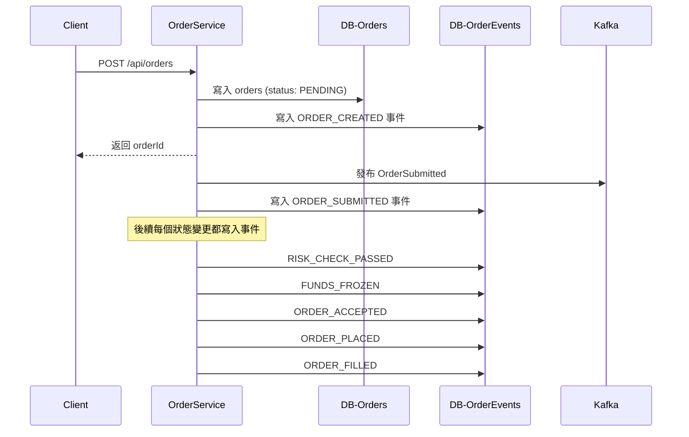

#### 使用示例

**1. 冪等性檢查（避免重複處理 TradeExecuted）**
```sql
-- 檢查 trade 是否已處理
SELECT COUNT(*) FROM order_events
WHERE order_id = ?
  AND reference_type = 'TRADE'
  AND reference_id = ?; -- trade_id

-- 若 COUNT = 0，則處理；否則跳過
```

**2. 計算訂單事件序號**
```sql
-- 插入新事件時自動計算 sequence_number
INSERT INTO order_events (
    event_id, order_id, user_id, instrument_id, event_type,
    payload, actor, occurred_at, sequence_number
)
SELECT
    ?, ?, ?, ?, ?,
    ?, ?, ?,
    COALESCE(MAX(sequence_number), 0) + 1
FROM order_events
WHERE order_id = ?;
```

**3. 查詢訂單完整生命週期**
```sql
SELECT
    event_type,
    payload,
    actor,
    occurred_at,
    sequence_number
FROM order_events
WHERE order_id = ?
ORDER BY sequence_number ASC;
```

**4. 重放事件重建訂單狀態**
```java
public Order rebuildOrderFromEvents(Long orderId) {
    // 按序號順序加載所有事件
    List<OrderEvent> events = jdbcTemplate.query(
        "SELECT * FROM order_events WHERE order_id = ? ORDER BY sequence_number ASC",
        new Object[]{orderId},
        orderEventRowMapper
    );

    // 初始化訂單對象
    Order order = new Order();

    // 逐一應用事件重建狀態
    for (OrderEvent event : events) {
        order.applyEvent(event);
    }

    return order;
}
```

#### 使用範例

**1. 查詢訂單完整歷史**
```sql
SELECT event_type, payload, occurred_at, actor
FROM order_events
WHERE order_id = ?
ORDER BY occurred_at ASC;
```

**2. 重建訂單狀態（事件重播）**
```java
public Order rebuildOrderFromEvents(String orderId) {
    List<OrderEvent> events = orderEventRepository.findByOrderId(orderId);
    Order order = new Order();

    for (OrderEvent event : events) {
        order.apply(event); // 逐一套用事件重建狀態
    }

    return order;
}
```

**3. 風控分析：統計用戶頻繁撤單行為**
```sql
SELECT user_id, COUNT(*) as cancel_count
FROM order_events
WHERE event_type = 'ORDER_CANCEL_REQUESTED'
  AND occurred_at > NOW() - INTERVAL 1 HOUR
GROUP BY user_id
HAVING cancel_count > 10;
```

**4. 合規報表：導出特定時段所有訂單事件**
```sql
SELECT oe.*, o.user_id, o.instrument_id
FROM order_events oe
JOIN orders o ON oe.order_id = o.order_id
WHERE oe.occurred_at BETWEEN '2024-01-01' AND '2024-01-31'
ORDER BY oe.occurred_at;
```

#### 設計原則

1. **不可變性 (Immutable)**：事件一旦寫入，永不修改或刪除
2. **順序性 (Sequential)**：同一訂單的事件按時間順序寫入
3. **冪等性 (Idempotent)**：重複寫入同一事件不影響系統狀態
4. **完整性 (Complete)**：所有狀態變更都必須記錄事件
5. **輕量化 Payload**：只記錄變更部分，避免冗餘完整訂單數據

#### 保留策略

- **熱數據**：最近 3 個月的事件保留在主表
- **冷數據**：3 個月以上的事件歸檔至 `order_events_archive` 表
- **壓縮存儲**：歷史事件可使用 JSON 壓縮存儲節省空間
- **合規要求**：至少保留 7 年的完整交易記錄

## `POST /api/orders` ：建立委託（限價/市價/買賣方向）

### Saga 流程詳解

1.  **快速響應**:
    * `Order` 服務收到請求後，僅做基礎驗證，立即在 `orders` 表中創建一筆 `PENDING` 狀態的訂單。
    * **立刻返回 `orderId` 給用戶**，告知「訂單已提交」，此時用戶體驗延遲極低。
  
2.  **異步執行**:
	-  Order 服務是第一個拿到下單請求的節點，它會根據使用者在 positions 系統裡的現有倉位決定這筆 BUY/SELL 指令是「增加倉位」還是「減倉/平倉」。
		* 開倉
			* `Order` 服務隨後發布 `OrderSubmitted` 事件，啟動後續流程。
			* `Risk-Margin` 消費 `OrderSubmitted`，進行保證金試算。通過則發布 `MarginPreCheckPassed`。
			* `Account-Ledger` 消費 `MarginPreCheckPassed` ，針對新增倉位所需的保證金執行資金凍結；若是純平倉指令則只鎖定倉位、不再額外占用保證金。成功則發布 `FundsFrozen`。
		* 平倉 
			* `Order` 服務會攜帶 `PositionId` (或 userId + instrument + side) 發佈 `PositionReserveRequested`；
			* `positions` 服務確認該倉位可用數量後凍結相同的平倉數量並回覆 `PositionReserved`（失敗則發 `PositionReserveRejected`）。
    *   `Order` 服務消費 `FundsFrozen`、 `PositionReserved`，將訂單狀態更新為 `ACCEPTED`，並最終發布 `OrderCreated` 事件給 `Matching` 撮合引擎。

3.  **補償與失敗處理**:
    *   如果在風控檢查或資金凍結環節失敗，order消費 `MarginPreCheckFailed` 、`PositionReserveRejected`，Saga 將觸發補償流程。
    *   `Order` 服務會將訂單狀態更新為 `FAILED`，並可通過 WebSocket 將失敗原因實時通知給用戶。

    

## `DELETE /api/orders/{orderId}`：撤銷委託

- `order-service` 發送 `OrderCancelRequested`。
- `matching` 接收後從訂單簿移除，發布 `OrderCancelled`。
- `account-ledger` 消費後解凍資金，發布 `FundsUnfrozen`。
    
## `GET /api/orders/{orderId}`：查詢委託狀態與細節

## Event Input：`TradeExecuted` - 更新訂單成交狀態

Order 服務需要消費 Matching 引擎發布的 `TradeExecuted` 事件，以更新訂單的成交狀態、累計成交量、平均成交價格和手續費等關鍵欄位。

### 消費流程

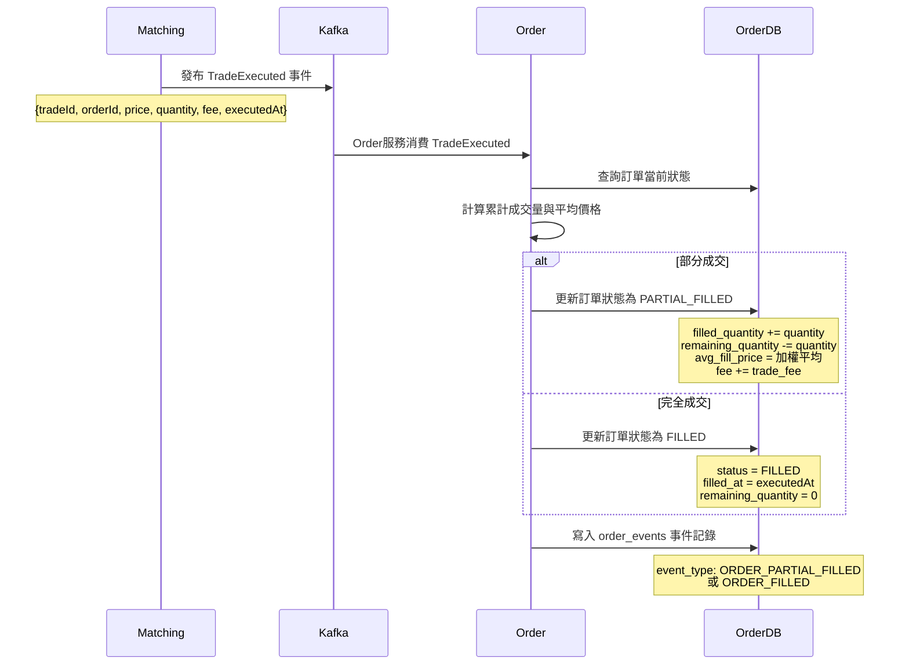

### 更新邏輯

**1. 訂單狀態轉換**
```
SUBMITTED → PARTIAL_FILLED → FILLED
         ↘                 ↗
           (多次部分成交)
```

**2. 累計成交量計算**
```java
order.filled_quantity += trade.quantity;
order.remaining_quantity = order.quantity - order.filled_quantity;
```

**3. 平均成交價格計算（加權平均）**
```java
// 累計成交總金額
total_value += (trade.price * trade.quantity);
// 計算加權平均價格
order.avg_fill_price = total_value / order.filled_quantity;
```

**4. 手續費累計**
```java
order.fee += trade.fee;
```

**5. 時間戳記更新**
- `submitted_at`: 在發布 `OrderCreated` 事件給 Matching 時記錄
- `filled_at`: 當 `remaining_quantity == 0` 時記錄當前時間
- `cancelled_at`: 在處理撤單時記錄

### 冪等性保證

為避免重複消費導致數據錯誤，Order 服務應：

1. **檢查 trade_id**: 在 `order_events` 表中記錄已處理的 `trade_id`
   ```sql
   SELECT COUNT(*) FROM order_events
   WHERE order_id = ? AND reference_id = ?  -- reference_id 存 trade_id
   ```

2. **使用樂觀鎖**: 通過 `version` 欄位或 `updated_at` 確保並發安全
   ```sql
   UPDATE orders
   SET filled_quantity = ?, avg_fill_price = ?, fee = ?, version = version + 1
   WHERE order_id = ? AND version = ?  -- 樂觀鎖
   ```

3. **事務性寫入**: 訂單更新 + 事件記錄必須在同一事務中完成
   ```java
   @Transactional
   public void handleTradeExecuted(TradeExecutedEvent event) {
       // 1. 冪等性檢查
       if (isTradeAlreadyProcessed(event.getTradeId())) {
           return;
       }

       // 2. 更新訂單狀態
       Order order = orderRepository.findById(event.getOrderId());
       order.applyTrade(event);
       orderRepository.save(order);

       // 3. 記錄事件
       orderEventRepository.save(new OrderEvent(
           event.getOrderId(),
           order.isFilled() ? "ORDER_FILLED" : "ORDER_PARTIAL_FILLED",
           event.getTradeId(),
           event.getOccurredAt()
       ));
   }
   ```

### 欄位填充對照表

| 欄位 | 填充時機 | 數據來源 | 說明 |
|------|---------|---------|------|
| `submitted_at` | 發布 OrderCreated 事件時 | Order 服務本地時鐘 | 提交到撮合引擎的時間 |
| `filled_quantity` | 消費 TradeExecuted 事件 | 累加 trade.quantity | 已成交總量 |
| `remaining_quantity` | 消費 TradeExecuted 事件 | quantity - filled_quantity | 剩餘未成交量 |
| `avg_fill_price` | 消費 TradeExecuted 事件 | 加權平均計算 | 平均成交價 |
| `fee` | 消費 TradeExecuted 事件 | 累加 trade.fee | 手續費總額 |
| `filled_at` | 訂單完全成交時 | trade.executedAt | 完全成交時間 |
| `cancelled_at` | 處理撤單請求時 | Order 服務本地時鐘 | 撤單時間 |

### 狀態一致性保證

- **最終一致性**: 訂單狀態通過事件驅動最終與撮合結果保持一致
- **狀態校驗**: 定時任務掃描長時間停留在 `PARTIAL_FILLED` 的訂單
- **對賬機制**: 與 Matching 引擎的 `trade_tickers` 表進行定期對賬


## Event Output：`OrderCreated`、`OrderCancelRequested`
- `OrderCreated`: 資金凍結完成後發布，送至撮合引擎
- `OrderCancelRequested`: 撤單請求
# matching
  - 是撮合核心，維護每個交易對的訂單簿。
  - 主要任務是：接收委託事件 → 進入訂單簿 → 撮合成交 -> 產生成交紀錄與行情報價來源 → **發布所有影響訂單簿的事件**。
  - 將撮合結果推送給 ledger、positions、market-data。

## 資料表DDL
### trade_tickers 表 - 成交紀錄

```sql
CREATE TABLE trade_tickers (
    trade_id                BIGINT          NOT NULL COMMENT '成交ID (Snowflake)',
    instrument_id           BIGINT          NOT NULL COMMENT '交易對ID (外鍵關聯 instruments.id)',
    order_id                BIGINT          NOT NULL COMMENT 'Maker訂單ID (掛單方)',
    counterparty_order_id   BIGINT          NOT NULL COMMENT 'Taker訂單ID (吃單方)',
    maker_user_id           BIGINT          NOT NULL COMMENT 'Maker用戶ID',
    taker_user_id           BIGINT          NOT NULL COMMENT 'Taker用戶ID',
    side                    VARCHAR(10)     NOT NULL COMMENT '成交方向 (Taker 的買賣方向): BUY, SELL',
    price                   DECIMAL(20,8)   NOT NULL COMMENT '成交價格',
    quantity                DECIMAL(20,8)   NOT NULL COMMENT '成交數量',
    maker_fee               DECIMAL(20,8)   NOT NULL DEFAULT 0 COMMENT 'Maker手續費',
    taker_fee               DECIMAL(20,8)   NOT NULL DEFAULT 0 COMMENT 'Taker手續費',
    total_value             DECIMAL(20,8)   NOT NULL COMMENT '成交總價值 (price * quantity)',
    trade_type              VARCHAR(20)     NOT NULL DEFAULT 'NORMAL' COMMENT '成交類型: NORMAL, LIQUIDATION, ADL',
    executed_at             DATETIME        NOT NULL COMMENT '成交時間 (微秒精度)',
    created_at              DATETIME        NOT NULL DEFAULT CURRENT_TIMESTAMP COMMENT '記錄創建時間',
    PRIMARY KEY (trade_id)
) ENGINE=InnoDB DEFAULT CHARSET=utf8mb4 COLLATE=utf8mb4_unicode_ci COMMENT='成交紀錄表 - 撮合輸出供報表與事件回放';

CREATE INDEX idx_instrument_executed ON trade_tickers(instrument_id, executed_at DESC) COMMENT '查詢交易對歷史成交';
CREATE INDEX idx_order_id ON trade_tickers(order_id) COMMENT '查詢特定訂單所有成交';
CREATE INDEX idx_counterparty_order ON trade_tickers(counterparty_order_id) COMMENT '查詢對手訂單成交';
CREATE INDEX idx_maker_user ON trade_tickers(maker_user_id, executed_at DESC) COMMENT '查詢用戶作為Maker的成交';
CREATE INDEX idx_taker_user ON trade_tickers(taker_user_id, executed_at DESC) COMMENT '查詢用戶作為Taker的成交';
CREATE INDEX idx_executed_at ON trade_tickers(executed_at DESC) COMMENT '全市場成交時序查詢';
```

#### taker / maker
Taker / Maker 是撮合時兩種角色的簡單分類。

Maker
- 先把訂單掛在 order book
- 等別人來成交
- 被動
- 提供流動性
- 通常手續費較低或返傭
例
- 我掛一張 LIMIT BUY 100 等人賣給我 → 我是 Maker
Taker
- 主動吃掉 order book 上的訂單
- 立即成交
- 消耗流動性
- 通常手續費較高
例
- 市價買入，撮合到對手價格 → 我是 Taker
- 或用限價單但價格越過行情直接成交 → 還是 Taker
---
判斷方式
- 先在簿上等待 → Maker
- 單子一進場就立即成交 → Taker
關鍵
- **只有 Taker 會決定成交方向**
- Maker 是否買賣不影響 `trade.side` 定義
簡表
- Maker = 掛單
- Taker = 吃單
#### side
成交方向 = 以 **Taker 的買賣方向** 表示這筆成交是 **買入(BUY)** 還是 **賣出(SELL)**。

## Core
### 線程模型
- 高併發下使用 per-instrument 單執行緒模型確保順序與一致性。

### Order Book

訂單簿是撮合引擎的核心數據結構，它實時記錄了特定交易對所有未成交的限價委託。一個訂單簿通常分為買盤 (Bids) 和賣盤 (Asks) 兩部分，分別代表了買方和賣方的掛單意願。

#### 數據結構

每個交易對維護一個獨立的訂單簿，其內部結構通常為兩個有序的價格層級列表：

Ask orders (喊價)
- **賣盤 (Asks)**: 賣方掛單列表，按價格從低到高排序。每個價格層級包含該價格上的總掛單數量和所有訂單的詳細信息。
  ```
  Asks: [
    { price: P_sell_min, quantity: Q_total_sell_min, orders: [Order5, Order6...] },
    { price: P_sell_next, quantity: Q_total_sell_next, orders: [Order7, Order8...] },
    ...
  ]
  ```
Bid orders (出價)
- **買盤 (Bids)**: 買方掛單列表，按價格從高到低排序。每個價格層級包含該價格上的總掛單數量和所有訂單的詳細信息 (如訂單ID、用戶ID、時間戳)。
  ```
  Bids: [
    { price: P_buy_max, quantity: Q_total_buy_max, orders: [Order1, Order2...] },
    { price: P_buy_next, quantity: Q_total_buy_next, orders: [Order3, Order4...] },
    ...
  ]
  ```

#### 核心概念

- **價格層級 (Price Level)**: 訂單簿中特定價格上的所有掛單的集合。
- **最佳買價 (Best Bid)**: 買盤中價格最高的掛單價格。
- **最佳賣價 (Best Ask)**: 賣盤中價格最低的掛單價格。
- **價差 (Spread)**: 最佳賣價與最佳買價之間的差額 (Best Ask - Best Bid)。
- **流動性 (Liquidity)**: 訂單簿中各個價格層級上的掛單數量，反映了市場的深度和交易的便利性。

#### 訂單簿操作

- **掛單 (Place Order)**: 新的限價單進入訂單簿，增加對應價格層級的數量。
- **撤單 (Cancel Order)**: 訂單從訂單簿中移除，減少對應價格層級的數量。
- **撮合 (Match Order)**: 當買賣雙方價格滿足撮合條件時，訂單從訂單簿中移除並生成成交。

訂單簿的實時更新是撮合引擎和行情服務的基礎，確保了交易的公平性和市場信息的透明性。
### 撮合

• 訂單簿與資料取得

  - 每個交易對維護各自的訂單簿，內含買盤（高→低）與賣盤（低→高）的價格層級，層級中記錄總量與同價位的訂單佇列；撮合前先依
    instrumentId 抓出這個結構，才能正確辨識最佳買價/賣價與流動性來源
  - 撮合引擎以價格優先、時間優先處理：同一價格層級內，最早進入的訂單會先被抓出與新來的對手方撮合，確保公平

  判斷撮合或掛單

  - 所有訂單透過 OrderCreated 事件進入撮合層；收到後立即定位訂單簿並依方向（BUY 掛在買盤、SELL 掛在賣盤）放入暫存結構
    design/exchange/整體設計.md:1252.
  - 市價單不檢查價格門檻，直接啟動撮合迴圈；限價單先比較 buy.price ≥ bestSell 或 sell.price ≤ bestBuy，滿足才進入撮合，
    否則在對應價格層級掛單等待 
  - 若掛單，會同步發布 OrderPlaced 事件以便行情/資金系統更新訂單簿視圖 

| 條件                         | 行為   |
| -------------------------- | ---- |
| buy.price ≥ bestSell.price | 成交   |
| sell.price ≤ bestBuy.price | 成交   |
| 其他                         | 掛單等待 |

  撮合迴圈與成交產出

  - 撮合時總是從訂單簿拿「最佳」對手單：BUY 單對上目前最便宜的 ASK；SELL 單對上最貴的 BID。每輪計算 tradeQty = min(新單
    剩餘, 對手單剩餘)，成交價取對手單價格（maker 價），再生成 TradeExecuted 事件與必需的 WAL/DB 記錄 design/exchange/整
    體設計.md:1238、design/exchange/整體設計.md:3037.
  - 對手單被完全吃完即從訂單簿移除並發布 OrderCancelled（表示掛單被撮合完）；新單若還有剩餘，繼續拉下一個價格層級重複迴
    圈，直到新單完全成交或沒有可成交的對手單 design/exchange/整體設計.md:3044.
  - 剩餘未成交部位會以最新剩餘量掛回訂單簿，並依加入時間排在該價位的尾端，待未來對手單補上後再被優先撮合。

撮合演算法
```
while (對手單存在 && 尚未完全成交):
    tradeQty = min(委託剩- 剩餘量, 對手單剩餘量)
    tradePrice = 對手單價格
    生成 TradeExecuted 事件
    更新雙方剩餘量與狀態
    若對手單完成則移出訂單簿
```


  事件與狀態更新

  - 每次進出訂單簿都要發布事件：OrderPlaced（掛單）、OrderCancelled（撤單或被吃完）、TradeExecuted（成交），行情、帳務、
    倉位、風控等模組靠這些事件保持一致性 design/exchange/整體設計.md:1259.
  - TradeExecuted 由 ledger/positions/risk/market-data 並行消費，完成資金扣解凍、倉位調整與行情推播；
    訂單狀態也會從 CREATED → PARTIALLY_FILLED → FILLED 或 CANCELLED 的流程演進
### WAL

撮合引擎是整個交易鏈路的最終事實來源，因此必須在「修改訂單簿之前」先把即將執行的操作寫入 Write-Ahead Log，確保可重放、可追
溯。建議的 WAL 欄位與流程如下：

---

- **序列與事件時間**：WAL `seq` (遞增序號) + `logged_at`，保證跨節點合併時仍能以時間/順序重建訂單簿。

| WAL seq    | 撮合引擎內       | 重建訂單簿 / 撮合步驟順序 |
| ---------- | ----------- | -------------- |
| trade seq  | 撮合引擎 / 成交事件 | 成交事件順序         |
| outbox seq | Outbox      | 事件發布順序         |

WAL seq 應由 **撮合引擎本身產生**
- 單調遞增
- 不可由 DB auto-inc 分散生成
- 不可由多服務共同產生
- 可以是 Snowflake，但要確保時間順序 OK
- 更常見：**全局遞增 long**（match engine 內部計數器）

---

- **動作類型**：`type` 取值 `PLACE`、`MATCH`、`CANCEL`、`REDUCE`，清楚描述該筆操作對訂單簿的影響。

PLACE
→ 對訂單簿：增加掛單

MATCH
撮合發生  
• 撞到對手單  
• 產生成交（trade）  
• 更新成交量與剩餘量
→ 對訂單簿：產生成交 + 更新剩餘掛單

CANCEL
使用者或系統取消訂單  
• 將訂單從簿中移除  
• 更新狀態為 CANCELED
→ 對訂單簿：刪除掛單

REDUCE
部分減少掛單數量  
• 例如下游因可用金額不足而需調整可下單量  
• 或 API 主動 `reduceOnly`  
• 或系統自動減量
→ 對訂單簿：更新掛單剩餘量（非成交）
> 註：`REDUCE` 不等同 `MATCH`  
> Match = 成交造成的數量減少  
> Reduce = 外在原因造成的數量減少

---

- **訂單/交易內容**：記錄 `orderId`、`side`、`price`、`remainingQuantity`，
  若為撮合則附上 `counterOrderId`、`tradeQty`與 `tradePrice`，同時存下 maker/taker userId 方便帳務追溯。

---

- **持久化與刷盤**：寫入 WAL 後才對記憶體訂單簿套用變更

---

- 在成功發布 `TradeExecuted` 事件後標記該 WAL 條目已完成（供 壓縮/截斷）。
---
- checkpoint + 增量 WAL
	- **Checkpoint**：記錄「某時刻整個訂單簿的完整快照」
	- **增量 WAL**：checkpoint 之後產生的 WAL

---

- **重播策略**：撮合服務啟動時先讀 WAL → 重建各交易對訂單簿；
- 若遇到「已寫 WAL 但事件尚未發布」的條目，需重新執行並補發事件，確保下游最終一致。

- **append-only WAL → 啟動時 replay → 還原簿**。
- replay：從 WAL 最前面或 checkpoint，依 seq 遞增重放 PLACE / MATCH / CANCEL / REDUCE，重建 bids / asks 結構
- 壓縮：以 “checkpoint + 增量 WAL” 模式


依此設計，即使撮合進程異常退出或發生主備切換，新的實例也能以 WAL 為基準完成恢復，避免遺失成交或產生雙重撮合。


## Event Input：`OrderCreated`（掛單/撮合）
- 消費 `OrderCreated` 事件。
- 根據 `instrument_id` 取得對應訂單簿。
- 按方向掛入：`BUY` 掛買盤（高價優先），`SELL` 掛賣盤（低價優先）。
- 市價單則立即撮合。

### 核心事件輸出
為確保下游數據的完整性（特別是 `Market-Data` 的深度圖），`Matching` 引擎必須在**任何改變訂單簿狀態的操作**後發布對應事件。

| 事件                   | 觸發時機       | 核心內容                                                        | 主要消費者                                        |
| :------------------- | :--------- | :---------------------------------------------------------- | :------------------------------------------- |
| **`OrderPlaced`**    | 新訂單成功掛入訂單簿 | `orderId`, `side`, `price`, `quantity`                      | `Market-Data`                                |
| **`OrderCancelled`** | 訂單成功從訂單簿移除 | `orderId`                                                   | `Market-Data`, `Account-Ledger`              |
| **`TradeExecuted`**  | 兩筆訂單撮合成交   | `tradeId`, `buyOrderId`, `sellOrderId`, `price`, `quantity` | `Market-Data`, `Account-Ledger`, `Positions` |

### 撮合後事件流

`TradeExecuted` 被多模組平行消費：

| 模組             | 處理                                                                           |
| -------------- | ---------------------------------------------------------------------------- |
| account-ledger | 雙分錄記帳、扣除凍結、計算手續費、發布 `LedgerEntryCreated`                                     |
| positions      | 更新倉位與平均成本、盈虧                                                                 |
| risk-margin    | 更新維持保證金與強平價                                                                  |
| market-data    | **根據 `TradeExecuted` 更新 Ticker；<br>根據 `OrderPlaced`/`OrderCancelled` 更新深度圖** |

### 撮合後資金與狀態演進

開倉

| 階段    | Order 狀態         | Ledger 動作 | Positions |
| ----- | ---------------- | --------- | --------- |
| 下單    | CREATED          | 凍結保證金     | 無         |
| 撮合中   | PARTIALLY_FILLED | 部分扣款與解凍   | 倉位增加      |
| 撮合完成  | FILLED           | 全部結算與解凍   | 倉位完成更新    |
| 撤單或失敗 | CANCELLED        | 解凍保證金     | 不變        |


## Event Output：OrderPlaced、OrderCancelled
## Event Output：`TradeExecuted`（成交事件，含價格/數量/對手單/手續費等）

## ~~（可選）`POST /api/matching/cancel`：撮合層執行撤單~~
- `order-service` 發送 `OrderCancelRequested`。
- `matching` 接收後從訂單簿移除，發布 `OrderCancelled`。
- `account-ledger` 消費後解凍資金，發布 `FundsUnfrozen`。
    
## 撮合引擎結構建議

```
MatchingEngine
 ├─ OrderBookManager
 │   ├─ Map<InstrumentId, OrderBook>
 │   └─ SnapshotService（定期持久化快照）
 ├─ EventListener
 │   └─ consume(OrderCreated)
 ├─ TradePublisher
 │   └─ publish(TradeExecuted)
 └─ Persistence
     └─ trade_tickers 表 (成交紀錄)
```

## 資料一致性與重放
- 撮合結果是唯一真實成交來源。
- `TradeExecuted` 應使用 Kafka exactly-once 模式發布。
- 撮合引擎應保存 WAL（write-ahead log），以便重啟重放。

# account-ledger
  - 以雙分錄維護資產變動，確保借貸平衡並支援審計。
  - 產生結算、利息、資金費率、手續費等財務事件。
## 資料表DDL

### ledger_entries 表 - 雙分錄記帳

```sql
-- 分錄表：移除 book/account_category；修正 counterparty_entry 註解；owner_pk 改 STORED 以利索引與執行計畫穩定
CREATE TABLE ledger_entries (
  entry_id           BIGINT        NOT NULL COMMENT '分錄ID Snowflake',
  owner_type         VARCHAR(10)   NOT NULL COMMENT 'USER / ORG / SYSTEM',
  account_id         BIGINT        NOT NULL COMMENT '帳戶ID 用戶/公司帳戶',
  user_id            BIGINT        NULL     COMMENT '用戶ID 冗餘 公司帳戶NULL',
  org_id             BIGINT        NULL     COMMENT '公司/組織ID 冗餘 個人帳戶NULL',

  asset              VARCHAR(20)   NOT NULL COMMENT 'USDT BTC ETH',
  amount             DECIMAL(20,8) NOT NULL COMMENT '正加 負減',
  direction          VARCHAR(10)   NOT NULL COMMENT 'DEBIT / CREDIT',
  balance_after      DECIMAL(20,8) NOT NULL COMMENT '本次變動後餘額',

  reference_type     VARCHAR(50)   NOT NULL COMMENT '事件來源，同一 reference 事件可拆成多個 entry_type ，例：成交 → 手續費 + 成交結算',
  entry_type         VARCHAR(50)   NOT NULL COMMENT '業務原因分類 TRADE_SETTLEMENT / FEE..',
  reference_id       BIGINT        NOT NULL,
  counterparty_entry BIGINT        NULL     COMMENT '對手分錄ID',
  description        VARCHAR(255)  NULL,
  metadata           JSON          NULL,

  event_time         DATETIME      NOT NULL,
  created_at         DATETIME      NOT NULL DEFAULT CURRENT_TIMESTAMP,

  owner_pk BIGINT GENERATED ALWAYS AS (
    CASE owner_type
      WHEN 'USER' THEN user_id
      WHEN 'ORG'  THEN org_id
      ELSE NULL
    END
  ) STORED,

  PRIMARY KEY (entry_id)
)
ENGINE=InnoDB
DEFAULT CHARSET=utf8mb4
COLLATE=utf8mb4_unicode_ci
COMMENT='雙分錄紀錄表 支持公司帳戶';

CREATE INDEX idx_account_asset ON ledger_entries(account_id, asset, event_time DESC);
CREATE INDEX idx_owner_asset_time ON ledger_entries(owner_type, owner_pk, asset, event_time DESC);
CREATE INDEX idx_user_asset ON ledger_entries(user_id, asset, event_time DESC);
CREATE INDEX idx_org_asset ON ledger_entries(org_id, asset, event_time DESC);
CREATE INDEX idx_reference  ON ledger_entries(reference_type, reference_id);
CREATE INDEX idx_entry_type  ON ledger_entries(entry_type, event_time DESC);
CREATE INDEX idx_counterparty ON ledger_entries(counterparty_entry);
CREATE INDEX idx_event_time  ON ledger_entries(event_time DESC);


```
#### direction

**DEBIT = 借方**  (非指借錢)、**CREDIT = 貸方**  (非指貸款)
- 僅是**左右欄位名稱**
- 是**會計記帳方向**，不是「加減」本身。是否增加或減少，要看是哪一種科目。
- 每筆分錄都必須同時有 DEBIT 與 CREDIT（借貸必相等）。

| 科目  | DEBIT 借 | CREDIT 貸 | 科目  | DEBIT 借 | CREDIT 貸 |
| --- | ------- | -------- | --- | ------- | -------- |
| 資產  | 增       | 減        | 負債  | 減       | 增        |
|     |         |          | 權益  | 減       | 增        |
|     |         |          |     |         |          |
| 費用  | 增       | 減        | 收入  | 減       | 增        |

#### reference_type 與 entry_type
reference_type 事件來源
- TRADE
- ORDER
- DEPOSIT
- WITHDRAWAL
- FUNDING
- LIQUIDATION
- TRANSFER
- SYSTEM
    
 entry_type 業務原因分類
- TRADE_SETTLEMENT
- FEE
- FUNDING_RATE
- LIQUIDATION_PNL
- TRANSFER_IN
- TRANSFER_OUT

##### 二者關係
同一 reference 事件可拆成多個 entry_type  ，例：成交 → 手續費 + 成交結算


##### 用法差異

- reference_type + reference_id  
    查「由這筆事件產生的所有分錄」
- entry_type  
    查「此類財務行為的所有分錄」
### ledger_balances 表 - 帳戶餘額

```sql
CREATE TABLE ledger_balances (
    id                  BIGINT          NOT NULL COMMENT '記錄ID (Snowflake)',
    account_id          BIGINT          NOT NULL COMMENT '帳戶ID',
    user_id             BIGINT          NOT NULL COMMENT '用戶ID',
    asset               VARCHAR(20)     NOT NULL COMMENT '資產類型: USDT, BTC, ETH等',
    balance             DECIMAL(20,8)   NOT NULL DEFAULT 0 COMMENT '總餘額',
    available           DECIMAL(20,8)   NOT NULL DEFAULT 0 COMMENT '可用餘額 (balance - reserved)',
    reserved            DECIMAL(20,8)   NOT NULL DEFAULT 0 COMMENT '凍結餘額 (訂單保證金、風險準備金)',
    total_deposited     DECIMAL(20,8)   NOT NULL DEFAULT 0 COMMENT '累計充值金額',
    total_withdrawn     DECIMAL(20,8)   NOT NULL DEFAULT 0 COMMENT '累計提現金額',
    total_pnl           DECIMAL(20,8)   NOT NULL DEFAULT 0 COMMENT '累計已實現盈虧',
    version             INT             NOT NULL DEFAULT 0 COMMENT '樂觀鎖版本號',
    last_entry_id       BIGINT          NULL     COMMENT '最後更新的分錄ID (冪等性檢查)',
    created_at          DATETIME        NOT NULL DEFAULT CURRENT_TIMESTAMP COMMENT '帳戶創建時間',
    updated_at          DATETIME        NOT NULL DEFAULT CURRENT_TIMESTAMP ON UPDATE CURRENT_TIMESTAMP COMMENT '最後更新時間',
    PRIMARY KEY (id),
    UNIQUE KEY uk_account_asset (account_id, asset) COMMENT '每個帳戶每種資產唯一'
) ENGINE=InnoDB DEFAULT CHARSET=utf8mb4 COLLATE=utf8mb4_unicode_ci COMMENT='帳戶餘額表 - 提供資產查詢與風控試算';

CREATE INDEX idx_user_asset ON ledger_balances(user_id, asset) COMMENT '查詢用戶所有資產';
CREATE INDEX idx_available ON ledger_balances(asset, available DESC) COMMENT '按資產排序可用餘額';
CREATE INDEX idx_updated_at ON ledger_balances(updated_at DESC) COMMENT '最近更新的帳戶';
```

### platform_accounts  平台科目表（便於管控平台帳戶清單與類別）
`platform_accounts` 是平台「自己」的帳戶（會計科目）清單。  
用來代表：保險基金、平台收入、手續費池、熱錢包、清算科目等。  
不屬於用戶。
```
CREATE TABLE platform_accounts (
  account_id     BIGINT       NOT NULL COMMENT '平台科目ID',
  account_code   VARCHAR(64)  NOT NULL COMMENT '科目代碼（唯一）',
  category       VARCHAR(32)  NOT NULL COMMENT 'ASSET LIABILITY REVENUE EXPENSE EQUITY',
  name           VARCHAR(128) NOT NULL COMMENT '顯示名稱',
  status         VARCHAR(16)  NOT NULL DEFAULT 'ACTIVE / INACTIVE',
  created_at     DATETIME     NOT NULL DEFAULT CURRENT_TIMESTAMP,
  PRIMARY KEY (account_id),
  UNIQUE KEY uk_code (account_code)
) ENGINE=InnoDB DEFAULT CHARSET=utf8mb4 COLLATE=utf8mb4_unicode_ci COMMENT='平台科目清單';

```

#### account_code

平台科目代碼。  唯一。  
例
- EXCHANGE_LIABILITY
- HOT_WALLET
- INSURANCE_FUND
- FEE_REVENUE

#### category
分類。  
會計科目類型：
- ASSET
- LIABILITY
- REVENUE
- EXPENSE
- EQUITY
    

根據 category 決定借貸方向  

```
User: CREDIT  USDT
Platform FEE_REVENUE: DEBIT
```

```
User: DEBIT  USDT
Platform EXCHANGE_LIAB: CREDIT
```
#### name
顯示名稱。  
例
`平台欠用戶 平台熱錢包 保險基金 平台手續費收入`


#### 範例
| account_code     | category  | name       |
| ---------------- | --------- | ---------- |
| HOT_WALLET       | ASSET     | 鏈上熱錢包      |
| COLD_WALLET      | ASSET     | 鏈上冷錢包      |
| EXCHANGE_LIAB    | LIABILITY | 平台欠用戶      |
| INSURANCE_FUND   | ASSET     | 強平保險基金     |
| FEE_REVENUE      | REVENUE   | 手續費收入      |
| FUNDING_CLEARING | ASSET     | Funding 清算 |
| PNL_CLEARING     | ASSET     | 損益清算       |
| TREASURY         | ASSET     | 平台庫存       |
### platform_balances表 - 平台餘額

```sql
-- 平台餘額彙總：公司/保險基金/費用收入等平台科目
CREATE TABLE platform_balances (
  id               BIGINT        NOT NULL COMMENT '主鍵 Snowflake',
  account_id       BIGINT        NOT NULL COMMENT '平台科目ID（對應維表 platform_accounts.account_id）',
  account_code     VARCHAR(64)   NOT NULL COMMENT '平台科目代碼 例: EXCHANGE_LIABILITY INSURANCE_FUND FEE_REVENUE HOT_WALLET',
  asset            VARCHAR(20)   NOT NULL COMMENT 'USDT BTC ..',
  balance          DECIMAL(38,18) NOT NULL DEFAULT 0 COMMENT '餘額',
  reserved         DECIMAL(38,18) NOT NULL DEFAULT 0 COMMENT '凍結金額（若需）',
  version          INT           NOT NULL DEFAULT 0 COMMENT '樂觀鎖版本',
  last_entry_id    BIGINT        NULL     COMMENT '最後套用的分錄ID',
  created_at       DATETIME      NOT NULL DEFAULT CURRENT_TIMESTAMP,
  updated_at       DATETIME      NOT NULL DEFAULT CURRENT_TIMESTAMP ON UPDATE CURRENT_TIMESTAMP,
  PRIMARY KEY (id),
  UNIQUE KEY uk_platform_account_asset (account_id, asset),
  KEY idx_code_asset (account_code, asset)
) ENGINE=InnoDB DEFAULT CHARSET=utf8mb4 COLLATE=utf8mb4_unicode_ci COMMENT='Platform 餘額彙總（公司/基金/科目）';

```
### ~~funding_rates 表 - 資金費率~~

```sql
CREATE TABLE funding_rates (
    id                  BIGINT          NOT NULL COMMENT '記錄ID (Snowflake)',
    instrument_id       BIGINT          NOT NULL COMMENT '交易對ID (外鍵關聯 instruments.id)',
    rate                DECIMAL(10,6)   NOT NULL COMMENT '資金費率 (正數為多頭付空頭, 負數反之)',
    premium_index       DECIMAL(10,6)   NOT NULL DEFAULT 0 COMMENT '溢價指數',
    interest_rate       DECIMAL(10,6)   NOT NULL DEFAULT 0 COMMENT '利率',
    mark_price          DECIMAL(20,8)   NOT NULL COMMENT '結算時的標記價格',
    index_price         DECIMAL(20,8)   NOT NULL COMMENT '結算時的指數價格',
    funding_interval    INT             NOT NULL DEFAULT 8 COMMENT '資金費率結算間隔 (小時)',
    effective_at        DATETIME        NOT NULL COMMENT '生效時間',
    calculated_at       DATETIME        NOT NULL COMMENT '計算時間',
    settled             BOOLEAN         NOT NULL DEFAULT FALSE COMMENT '是否已結算',
    settled_at          DATETIME        NULL     COMMENT '結算完成時間',
    created_at          DATETIME        NOT NULL DEFAULT CURRENT_TIMESTAMP COMMENT '記錄創建時間',
    PRIMARY KEY (id),
    UNIQUE KEY uk_instrument_effective (instrument_id, effective_at) COMMENT '每個交易對每個時間點唯一'
) ENGINE=InnoDB DEFAULT CHARSET=utf8mb4 COLLATE=utf8mb4_unicode_ci COMMENT='資金費率表 - 供費率結算與倉位估值';

CREATE INDEX idx_instrument_effective ON funding_rates(instrument_id, effective_at DESC) COMMENT '查詢交易對歷史費率';
CREATE INDEX idx_effective_settled ON funding_rates(effective_at, settled) COMMENT '查詢待結算費率';
CREATE INDEX idx_settled_at ON funding_rates(settled_at DESC) COMMENT '結算歷史查詢';
```

## Core
### 分錄範例

以下給「**最小化、平台常用（只記 User 資產側）**」的 **借貸方向**。  
重點：**User Balance = 資產科目 → DEBIT=增加，CREDIT=減少**  
平台側（對手科目）給簡化名稱即可。

---

#### TRADE_SETTLEMENT

撮合成交後結算

買家
- **DEBIT** Asset（標的）
- **CREDIT** Asset（報價幣）
    

賣家
- **DEBIT** Asset（報價幣）
- **CREDIT** Asset（標的）
    

> 現貨例：買 BTC、付 USDT

|動作|借 DEBIT|貸 CREDIT|
|---|---|---|
|買家|BTC +|USDT –|
|賣家|USDT +|BTC –|

---

#### FEE

（Maker/Taker 手續費）

|動作|借 DEBIT|貸 CREDIT|
|---|---|---|
|用戶手續費|費用（Fee）+|User Balance –|
|平台收入|User Balance –|平台收入 +|

若簡化 **只記 User side**：  
→ **CREDIT User Balance**（減少）

---

#### FUNDING_RATE

永續合約 Funding

多付空

|動作|借 DEBIT|貸 CREDIT|
|---|---|---|
|多方|Funding Expense +|User Balance –|
|空方|User Balance +|Funding Income +|

若只記 User Balance：
- 多方 → **CREDIT User**
- 空方 → **DEBIT User**
    

---

#### DEPOSIT

入金

|動作|借 DEBIT|貸 CREDIT|
|---|---|---|
|用戶入金|User Balance +|Exchange Liability +|

若只記 User side：  
→ **DEBIT User Balance**

---

#### WITHDRAWAL

出金

|動作|借 DEBIT|貸 CREDIT|
|---|---|---|
|用戶提現|Exchange Liability –|User Balance –|

若只記 User side：  
→ **CREDIT User Balance**

---

#### LIQUIDATION

強平

整體：
- 強平成立 → 損失、保證金被扣
- 若有盈餘 → 返還
- 欠損 → 進保險基金
    

|動作|借 DEBIT|貸 CREDIT|
|---|---|---|
|用戶損失|Liquidation Expense +|User Balance –|
|用戶盈餘返還|User Balance +|Liquidation Income +|
|欠損入保險基金|Insurance Fund +|User Balance –|

若只記 User side：
- 損 → **CREDIT User**
- 贏 → **DEBIT User**
    

---

#### TRANSFER

帳戶間轉移（現貨→合約）

|動作|借 DEBIT|貸 CREDIT|
|---|---|---|
|User Spot → User Futures|Futures Balance +|Spot Balance –|

只記 User：
- From 帳戶：**CREDIT**
- To 帳戶：**DEBIT**
    

---

#### ✅ 超簡版（只記 User Balance）

|分錄類型|User DEBIT(+增)|User CREDIT(–減)|
|---|---|---|
|TRADE_SETTLEMENT|買家得資產 / 賣家得貨幣|買家付貨幣 / 賣家付資產|
|FEE|–|手續費扣減|
|FUNDING_RATE|收方|付方|
|DEPOSIT|入金|–|
|WITHDRAWAL|–|出金|
|LIQUIDATION|盈者|虧者|
|TRANSFER|轉入|轉出|

> 交易所內部多數系統 **只記 user balance side**  
> → DEBIT=加，CREDIT=減

---

#### ✅ 總結
- **資產科目（User Balance）**  
    → **DEBIT = 增**  
    → **CREDIT = 減**
- TRADE → 買入加/付出減
- FEE → 扣用戶
- FUNDING → 多付空、空付多
- DEPOSIT → +
- WITHDRAWAL → –
- LIQUIDATION → 虧– / 贏+
- TRANSFER → From – / To +
    

這即可直接實作。

## Saga event
### Event Input：MarginPreCheckPassed

### Event Output：FundsFrozen

### Event Output：FundsUnfrozen

## Event Input：`TradeExecuted`（記帳）
來源事件：`TradeExecuted`（由 matching 發布）  

事件內容包括：
- `instrumentId`
- `buyOrderId`, `sellOrderId`
- `price`, `quantity`
- `buyerUserId`, `sellerUserId`
- `fee`
- `executedAt`
    
`account-ledger` 消費這個事件後，開始進行「雙分錄」結算。

---
處理目標
- 對買賣雙方進行資金移轉（可用 → 實際結算）
- 扣除或返還凍結資金
- 記錄手續費、盈虧
- 發布新的「資產異動事件」供倉位與風控更新
    
---
處理步驟

接收事件
Kafka consumer 收到 `TradeExecuted` → 開啟交易（@Transactional）

---
讀取基礎資料
- 查詢雙方的帳戶餘額 (`ledger_balances`)
- 查詢交易商品參數 (`instrument_metadata`)
- 驗證撮合結果是否已處理過（根據 tradeId 去重，確保冪等）
---
計算資金變化

以 BTCUSDT 永續合約為例：

| 角色   | 動作     | 資金方向    | 備註             |
| ---- | ------ | ------- | -------------- |
| 開倉   | 支付成交金額 | 扣除 USDT | 使用凍結保證金結算      |
| 平倉   | 收到成交金額 | 增加 USDT | 結算入帳           |
| 系統帳戶 | 收取手續費  | 增加 USDT | maker/taker 費率 |

---

### 執行雙分錄記帳

以「借貸必平衡」原則進行三組分錄：

**1. 資金結算**

---

**雙方開倉** 

多方（開多）

```
借：保證金 reserved 減少
貸：持倉 margin_used 增加
```

空方（開空）

```
借：保證金 reserved 減少 
貸：持倉 margin_used 增加
```
→ 二邊都「增加持倉佔用額」，但這是各自帳內的轉換，沒有對方參與。

---

**平倉或強平時才有對向結算**

假設多方平倉時價格高於開倉價（盈利）：

```
借：Short margin_used 減少（虧損方） 
貸：Long margin_used 減少（盈利方） 
貸：Buyer available 增加（實現收益）
```

相反，若多方虧損、空方盈利，方向對調。  
這時才會發生「盈虧轉移」，即從虧損方的保證金扣減，轉給盈利方。


**2. 手續費**

```
借：Buyer or Seller 帳戶（依角色扣費）
貸：Exchange Fee 帳戶（平台收入）
```

**3. 解凍 / 結餘調整**  
若委託未全成交或撤單，將剩餘凍結部分解凍：

```
借：保證金 reserved 減少
貸：保證金 available 增加
```

---

### 更新餘額表
- `ledger_balances`：更新 balance / available / reserved 欄位。
- `ledger_entries`：插入雙分錄交易明細。  

    欄位示例：
    
    ```
    entry_id, account_id, asset, amount, direction, reference_type='TRADE',
    reference_id=tradeId, event_time=executedAt
    ```
    

---

### 發布資產異動事件

每筆交易完成後，發出：

```
LedgerEntryCreated {
  userId,
  instrumentId,
  asset,
  deltaAvailable,
  deltaReserved,
  balanceAfter,
  referenceType = TRADE,
  referenceId = tradeId
}
```

供下游模組使用：
- `risk-margin` 更新風險與維持保證金；
- `reporting` 寫入審計或報表。
    

---

### 提交交易
- 整個過程包在同一個資料庫交易中。
- 成功後提交並確認事件 Outbox → Kafka（確保 exactly-once）。
- 若中途失敗則 rollback，確保資產不亂動。
    

---

### 關鍵要點
- `account-ledger` 是整個系統的**資產真實源**（source of truth）。
- 每個事件皆以**雙分錄**確保會計平衡。
- 結算與發佈事件需使用 Outbox 以保證最終一致性。
- 所有金額欄位需使用 Decimal128 或 BigDecimal 精確運算。

## Event Input：OrderCancelled
## ~~Event Input：FundingRateUpdated~~

## Event Output：`LedgerEntryCreated`（資產異動事件）


## `GET /api/ledger/balances?userId=`：查詢餘額/可用資金（供前端或風控使用）


# positions
- `positions` 模組負責維護每個用戶在各交易對 (`instrument_id`) 上的**持倉、平均成本、未實現盈虧、強平價、破產價**等資訊。   它不處理金流，只根據成交與資產事件來更新倉位。  

| 類別   | 功能                                                                     |
| ---- | ---------------------------------------------------------------------- |
| 狀態維護 | 維護每個用戶在各交易對的倉位方向、數量、均價、未實現損益、強平價                                       |
| 事件驅動 | 消費 `TradeExecuted`、`LedgerEntryCreated`、`MarkPriceUpdated` 等事件來更新倉位與盈虧 |
| 風險回饋 | 將更新後的風險指標（margin ratio、liquidation price）發送給 `risk-margin`             |
| 倉位溯源 | 維護 `position_events` 表供稽核與重放                                           |
|      |                                                                        |

## 資料表DDL
### positions 表

```sql
CREATE TABLE positions (
    position_id         BIGINT          NOT NULL COMMENT '倉位ID (Snowflake)',
    user_id             BIGINT          NOT NULL COMMENT '用戶ID (外鍵關聯 users.id)',
    instrument_id       BIGINT          NOT NULL COMMENT '交易對ID (外鍵關聯 instruments.id)',
    
    side                VARCHAR(10)     NOT NULL COMMENT '倉位方向: LONG, SHORT',
    quantity            DECIMAL(20,8)   NOT NULL DEFAULT 0 COMMENT '持倉數量 (絕對值)',
    closing_reserved_quantity DECIMAL(20,8) NOT NULL DEFAULT 0 COMMENT '預先凍結用於平倉的數量',
    entry_price         DECIMAL(20,8)   NOT NULL COMMENT '平均開倉價格',
    
    mark_price          DECIMAL(20,8)   NOT NULL COMMENT '標記價格 (用於計算未實現盈虧)',
    liquidation_price   DECIMAL(20,8)   NULL     COMMENT '預估強平價格',
    bankruptcy_price    DECIMAL(20,8)   NULL     COMMENT '破產價格',
    unrealized_pnl      DECIMAL(20,8)   NOT NULL DEFAULT 0 COMMENT '未實現盈虧',
    realized_pnl        DECIMAL(20,8)   NOT NULL DEFAULT 0 COMMENT '已實現盈虧 (累計)',
    
    leverage            INT             NOT NULL DEFAULT 1 COMMENT '槓桿倍數',
    margin              DECIMAL(20,8)   NOT NULL DEFAULT 0 COMMENT '倉位保證金',
    margin_ratio        DECIMAL(10,4)   NOT NULL DEFAULT 0 COMMENT '保證金率 (margin / position_value)',
    
    status              VARCHAR(20)     NOT NULL DEFAULT 'ACTIVE' COMMENT '倉位狀態: ACTIVE, LIQUIDATING, CLOSED',
    last_trade_id       BIGINT          NULL     COMMENT '最後影響倉位的成交ID (用於冪等性)',
    version             INT             NOT NULL DEFAULT 0 COMMENT '樂觀鎖版本號',
    created_at          DATETIME        NOT NULL DEFAULT CURRENT_TIMESTAMP COMMENT '開倉時間',
    updated_at          DATETIME        NOT NULL DEFAULT CURRENT_TIMESTAMP ON UPDATE CURRENT_TIMESTAMP COMMENT '最後更新時間',
    closed_at           DATETIME        NULL     COMMENT '平倉時間',
    PRIMARY KEY (position_id),
    UNIQUE KEY uk_user_instrument (user_id, instrument_id, side) COMMENT '每個用戶每個交易對每個方向只能有一個倉位'
) ENGINE=InnoDB DEFAULT CHARSET=utf8mb4 COLLATE=utf8mb4_unicode_ci COMMENT='倉位主檔 - 倉位快照與估值資料';

CREATE INDEX idx_user_status ON positions(user_id, status) COMMENT '查詢用戶活動倉位';
CREATE INDEX idx_instrument_status ON positions(instrument_id, status) COMMENT '查詢交易對活動倉位';
CREATE INDEX idx_margin_ratio ON positions(margin_ratio ASC) COMMENT '風控監控低保證金率倉位';
CREATE INDEX idx_status_updated ON positions(status, updated_at DESC) COMMENT '查詢特定狀態倉位';
```

### position_events 表 - 倉位事件溯源

```sql
CREATE TABLE position_events (
    event_id            BIGINT          NOT NULL COMMENT '事件ID (Snowflake)',
    position_id         BIGINT          NOT NULL COMMENT '倉位ID (外鍵關聯 positions.position_id)',
    user_id             BIGINT          NOT NULL COMMENT '用戶ID (冗餘欄位便於查詢)',
    instrument_id       BIGINT          NOT NULL COMMENT '交易對ID (冗餘欄位便於查詢)',
    event_type          VARCHAR(50)     NOT NULL COMMENT '事件類型: POSITION_OPENED, POSITION_INCREASED, POSITION_DECREASED, POSITION_RESERVED, POSITION_CLOSED, LIQUIDATION_TRIGGERED, MARK_PRICE_UPDATED',
    delta_quantity      DECIMAL(20,8)   NOT NULL DEFAULT 0 COMMENT '數量變化 (正數增加, 負數減少)',
    delta_pnl           DECIMAL(20,8)   NOT NULL DEFAULT 0 COMMENT '盈虧變化',
    new_quantity        DECIMAL(20,8)   NOT NULL COMMENT '事件後的新數量',
    new_reserved_quantity DECIMAL(20,8) NOT NULL COMMENT '事件後的預留平倉凍結數量',
    new_entry_price     DECIMAL(20,8)   NOT NULL COMMENT '事件後的新均價',
    new_unrealized_pnl  DECIMAL(20,8)   NOT NULL COMMENT '事件後的未實現盈虧',
    reference_id        BIGINT          NULL     COMMENT '關聯ID (trade_id, liquidation_id等)',
    reference_type      VARCHAR(50)     NULL     COMMENT '關聯類型: TRADE, LIQUIDATION, MARK_PRICE_UPDATE',
    metadata            JSON            NULL     COMMENT '額外元數據 (事件詳情)',
    occurred_at         DATETIME        NOT NULL COMMENT '事件發生時間',
    created_at          DATETIME        NOT NULL DEFAULT CURRENT_TIMESTAMP COMMENT '記錄創建時間',
    PRIMARY KEY (event_id)
) ENGINE=InnoDB DEFAULT CHARSET=utf8mb4 COLLATE=utf8mb4_unicode_ci COMMENT='倉位事件溯源表 - 追蹤倉位變化與強平歷程';

CREATE INDEX idx_position_occurred ON position_events(position_id, occurred_at DESC) COMMENT '查詢倉位歷史事件';
CREATE INDEX idx_user_occurred ON position_events(user_id, occurred_at DESC) COMMENT '查詢用戶倉位歷史';
CREATE INDEX idx_event_type ON position_events(event_type, occurred_at DESC) COMMENT '按事件類型查詢';
CREATE INDEX idx_reference ON position_events(reference_type, reference_id) COMMENT '通過關聯ID查找事件';
CREATE INDEX idx_occurred_at ON position_events(occurred_at DESC) COMMENT '時序查詢所有倉位事件';
```

## Core
### 內部邏輯狀態轉換

| 事件       | 狀態變化                        | 說明          |
| -------- | --------------------------- | ----------- |
| 開倉成交     | `NONE` → `OPEN`             | 建立新倉位       |
| 加倉成交     | `OPEN` → `OPEN`             | 增加數量，重算均價   |
| 減倉（平倉部分） | `OPEN` → `PARTIALLY_CLOSED` | 減少數量，部分結算   |
| 全平       | `OPEN` → `CLOSED`           | 倉位清零，記錄實現盈虧 |

### 實現與未實現盈虧計算

未實現盈虧（浮動盈虧）

- 公式：

  ```
  unrealized_pnl = (mark_price - entry_price) * position_qty * contract_size
  ```

- `mark_price` 來自最新的 `MarkPriceUpdated` 事件，`entry_price` 為倉位加權成本；`contract_size` 視永續合約面額決定（例：1 USD 或 0.001 BTC）。
- `positions` 會維護 `MarkPriceCache`，事件到達後立即刷新 `mark_price` 與 `unrealized_pnl`，並將結果寫入資料庫與後續事件。
- 多倉：價格上漲 → 盈利；下跌 → 虧損。
- 空倉：價格上漲 → 虧損；下跌 → 盈利（計算時 `position_qty` 為負值，自然反映方向）。

---

實現盈虧（平倉時）

```
realized_pnl = (close_price - entry_price) * closed_qty
```

更新後：

```
position_qty -= closed_qty
entry_price 保持或重新計算
```


---
### leverage 與 margin_balance、used_margin、margin_ratio、equity、liquidation_price 是如何得到的?

 - positions.`leverage` 是倉位自己的欄位。
	 - 用戶在下單/調整槓桿時會把希望的倍數帶到 order → risk-margin 的預檢流程；
	 - risk-margin 會根據 instrument_metadata.max_leverage 與該交易對的risk_limits.max_leverage 驗證合法性，兩者都定義了每個商品/風險等級允許的最大槓桿 。
	 - 預檢通過後，positions 在建立/調整倉位時就把這個倍數落到 leverage 欄位，
	 - 後續若使用者在 UI 變更槓桿，同樣走預檢並更新這個欄位。
  - 倉位保證金欄位 positions.`margin` 代表實際占用的保證金、`margin_ratio` 保證金率。
	  - 一旦預檢完成且帳本凍結成功，positions 收到成交事件後查倉位、計算新 quantity/entry_price，再依 `used_margin` `=` `abs(entry_price` `*` `quantity)` `/` `leverage` 算出當前應占用的保證金並更新 positions.margin 與 `margin_ratio` `=` `(equity` `/` `notional)` 來衡量槓桿安全度 ； 
- 關於`equity` `=` `margin_balance` `+` `unrealized_pnl`
	- margin_balance 指的是帳戶在 account-ledger 中的「可用/總保證金餘額」，也就是資金帳戶的現金餘額，已包含已實現損益調整。
	- 倉位的 used_margin 則是倉位因槓桿佔用的保證金。它用於計算可用槓桿與風險比率，但不直接加進 equity。
- 當行情 (MarkPriceUpdated) 或倉位 (PositionUpdated) 變更，positions 重新計算 unrealized_pnl、margin_ratio、`liquidation_price`，更新表格並發布 PositionUpdated 供 risk-margin 及報表消費。

  總結：leverage 由用戶選擇且受 risk_limits 驗證後寫進 positions；margin 依 notional/leverage 決定並與帳本凍結同步；
  margin_ratio 則以 margin 與倉位名義價值/權益計算並在每次行情或倉位事件時更新。
## Event Input：`PositionReserveRequested`

平倉委託預先凍結倉位，positions 服務接獲請求後會：

1. 驗證當前倉位可用數量 (`quantity - closing_reserved_quantity`) 是否足夠。
2. 通過樂觀鎖或行級鎖更新 `closing_reserved_quantity`，以記錄本次平倉占用的倉位數量。
3. 在 `position_events` 中新增一筆 `POSITION_RESERVED` 或對應事件，寫入最新的 `new_reserved_quantity`，供之後恢復或稽核。

若平倉委託取消或失敗，Saga/補償流程需要對應釋放 `closing_reserved_quantity`，同樣落庫事件。


## Event Input：`TradeExecuted`: 倉位、數量、開倉價、未實現盈虧、強平價

當 `matching` 撮合成功發布成交事件後，`positions` 消費它來更新倉位：

核心職責: 即時更新倉位的狀態，包括數量和成本。

開平倉處理流程:

   1. 消費事件: positions 服務監聽並接收到 TradeExecuted 事件。
   2. 查找或建立倉位:
       * 根據事件中的 `userId`, `instrument_id` (交易對) 和 `side` (方向，多/空)，查找對應的現有倉位。
       * 如果倉位不存在 (即為開倉交易)，則建立一筆新的倉位紀錄。
   3. 更新倉位細節:
       * 更新數量: 將本次成交數量累加到現有倉位數量上。
           * `新數量` `=` `舊數量` `+` `本次成交數量`
       * 重新計算平均開倉價: 根據新的總數量和總成本，計算加權平均開倉價。
           * `新平均開倉價` `=` `(舊開倉價` `*` `舊數量` `+` `本次成交價` `*` `本次成交數量)` `/` `新數量`
   4. 計算未實現盈虧 (Unrealized PNL):
       * 從本地 `MarkPriceCache` 中讀取最新的標記價格 (`Mark Price`) (該價格由 `MarkPriceUpdated` 事件更新)。
         若暫無資料則保留上一筆標記價，待事件抵達時再刷新。
       * 根據新的倉位狀態計算浮動盈虧。
           * `未實現盈虧` `=` `(標記價格` `-` `新平均開倉價)` `*` `新數量` `*` `合約面值`
   5. 重新計算強平價 (`Liquidation` `Price`): 根據更新後的倉位、槓桿和保證金率，重新計算強平價格。
   6. 持久化儲存:
       * 將更新後的倉位資訊 (數量、均價、未實現盈虧等) 儲存到 `positions` 資料表中。
       * 在 `position_events` 表中新增一筆事件紀錄，用於審計和追蹤。
   7. 發布 `PositionUpdated` 事件: 倉位狀態更新後，發布 PositionUpdated 事件，
      通知 risk-margin (風控) 等下游服務進行相應的風險計算更新。
   8. 平倉時，檢查若倉位數量為0 且 若已消費 `LedgerEntryCreated` 而有已實現盈虧，將該倉位狀態更新為 CLOSED。並發佈 `PositionClosed`  事件

## Event Input：`LedgerEntryCreated`

 此事件由 account-ledger (帳本) 服務在完成一筆交易的資金結算後發布。用於處理平倉和確保與帳務的最終一致性。

核心職責: 確認資金結算的最終結果，並據此更新已實現盈虧、正式關閉倉位。

平倉處理流程:

   1. 消費事件: positions 服務監聽並接收到 `LedgerEntryCreated` 事件。
   2. 確認資金結算: 此事件是對一筆交易資金轉移的最終確認。TradeExecuted 更新了倉位的「狀態」，
      而 LedgerEntryCreated 則確認了其「財務結果」。
   3. 處理平倉邏輯:
       * 更新實現盈虧
           * 已實現盈虧 = (平倉價格 - 平均開倉價) * 平倉數量
       * 如果倉位數量歸零，則將該倉位狀態更新為 CLOSED。這會將其從活躍的盈虧與強平監控中移除。
   4. (可選) 發布 `PositionClosed` 事件: 當倉位完全關閉時，可以發布一個更明確的 PositionClosed
      事件，通知相關服務此倉位生命週期已結束。
---

 資金費率結算 (Funding Fee Settlement)
   * `referenceType`: `FUNDING_FEE`
   * 核心目的: 處理多空雙方之間定期支付的資金費用。這是一筆直接的現金轉移，會直接影響倉位的總盈虧。
   * Positions 服務的處理:
       * 根據事件中的金額 (正數或負數)，直接累加到倉位的已實現盈虧 (`realized_pnl`) 上。
       * 注意: 資金費率不影響倉位的平均開倉價 (entry_price)，但它會改變倉位的總體盈利狀況。
       * 記錄一筆新的 position_events，類型為 FUNDING，並立即標記為 SETTLED。

  強制平倉結算 (Liquidation Settlement)
   * `referenceType`: `LIQUIDATION`
   * 核心目的: 確認一筆強平訂單的最終財務結果，這通常包括額外的強平費用。
   * Positions 服務的處理:
       * 這本質上也是一筆交易，所以會像處理 TRADE 類型一樣，計算已實現盈虧。
       * LedgerEntryCreated 事件會反映出扣除強平費用 (liquidation fee) 後的最終金額。positions 服務應使用這個最終金額來計算
         PNL，以確保數據的準確性。
       * 觸發 tryToClosePosition() 檢查，這幾乎總會導致倉位關閉。

保險基金注入或爪回 (Insurance Fund Activity)
   * `referenceType`: `INSURANCE_FUND`
   * 核心目的: 在發生穿倉損失 (用戶餘額變為負數) 時，由保險基金填補虧損。反之，如果強平後有剩餘，可能會注入保險基金。
   * Positions 服務的處理:
       * 這是一筆直接的 PNL 調整。positions 服務需要根據事件金額，更新倉位的已實現盈虧
         (`realized_pnl`)，以反映這筆來自系統的注入或扣除。

  系統手動調整 (Manual Adjustments / ADL)
   * `referenceType`: `MANUAL_ADJUSTMENT` 或 `ADL`
   * 核心目的: 處理運營人員的手動資金調整，或自動減倉系統 (ADL) 觸發的平倉。
   * Positions 服務的處理:
       * 與其他類型類似，這也是對 PNL 的直接調整。positions 服務必須更新 realized_pnl 以保持與帳本的同步。

## Event Input：`MarkPriceUpdated`

- `positions` 以 `instrument_id` 為 key 消費 `market.mark-price` topic：
    1. 將標記價寫入本地 `MarkPriceCache`，並記錄事件時間（防止舊價覆蓋新價）。
    2. 查詢所有在該 `instrument_id` 上仍為 `OPEN` 的倉位。
    3. 逐筆重算：

        ```
        unrealized_pnl = (mark_price - entry_price) * position_qty * contract_size
        mark_price_field = mark_price
        ```

    4. 更新 `positions` 表與 `position_events`，僅在盈虧或標記價變化超過閾值（如 notional 0.01%）時落庫，以減少寫入壓力。
    5. 發布 `PositionUpdated` 事件（詳見下節）供風控、報表使用。
- 事件處理與成交事件分開執行，確保行情與倉位計算互不阻塞；若行情延遲，倉位會保留上一次標記價與盈虧。


## Event Output：`PositionUpdated`（倉位、市值、未實現損益）

無論是成交事件還是 `MarkPriceUpdated` 事件造成倉位狀態或盈虧變化，只要超過發布閾值即會發布：

```
PositionUpdated {
  userId,
  instrumentId,
  side,
  quantity,
  
  entryPrice,
  markPrice,
  unrealizedPnl,
  liquidationPrice,
  
  timestamp
}
```

消費方：

- **risk-margin**：更新風險係數、強平條件。
- **reporting**：寫入歷史與監控系統。
- **market-data**（可選）：提供倉位聚合資訊（多空比）。

---

## Event Output： `PositionClosed` (倉位、已實現損益)
## `GET /api/positions?userId=`：查詢當前倉位與損益

## 關鍵特性

- 所有倉位狀態源自成交事件，**不依賴帳務表進行計算**。
- 每筆變化寫入 `position_events`，可支援**重放與恢復**。
- 倉位更新為**純計算行為，不進行資金轉移**。
- 與 `ledger`、`risk` 分層隔離：
    - ledger 管金流
    - positions 管數量與盈虧
    - risk 管安全線與槓桿限制
        
簡言之，`positions` 模組是交易引擎的**倉位記錄器**，  
它依據撮合與帳務事件計算每位用戶的持倉與盈虧，  
不動資金、不簽帳，只維護真實狀態與可計算指標，  
並將結果回饋給風控與報表系統形成完整閉環。

# risk-margin
- `risk-margin` 模組負責整個交易系統的**風險計算與保證金控制**，  它連接撮合層與倉位層，是實時監控「每位用戶能否承擔風險」的核心。 在撮合成交後，`risk-margin` 會根據實際成交與倉位變化動態調整各項風險指標。
- 計算保證金與風險指標、提供下單前限額校驗。
- 維護風控規則版本、建立強平佇列與風險告警。
- 執行強平


| 類別     | 職責                                          |
| ------ | ------------------------------------------- |
| **事前** | 下單前預檢（`/api/risk/pre-check`）判斷可否下單、需凍結多少保證金 |
| **事後** | 根據持倉與標記價格即時監控槓桿、維持保證金率與強平條件                 |

## 資料表DDL
### risk_snapshots 表 - 風險指標快照

```sql
CREATE TABLE risk_snapshots (
    id                          BIGINT          NOT NULL COMMENT '記錄ID (Snowflake)',
    user_id                     BIGINT          NOT NULL COMMENT '用戶ID',
    account_id                  BIGINT          NULL     COMMENT '帳戶ID (衍生交易帳本)',
    instrument_id               BIGINT          NOT NULL COMMENT '交易對ID',
	maintenance_margin_rate     DECIMAL(10,4)   NOT NULL COMMENT '維持保證金率快照',
    
    # position 事件更新
    position_id                 BIGINT          NULL     COMMENT '倉位ID (可選, 方便追蹤)',
    notional_value              DECIMAL(30,12)  NOT NULL COMMENT '倉位名義價值',
    used_margin                 DECIMAL(30,12)  NOT NULL COMMENT '實際佔用保證金',
  
    # 即時查詢ledger 更新
    equity                      DECIMAL(30,12)  NOT NULL COMMENT '淨資產 (餘額 + 已/未實現盈虧)',
    
    # 根據行情更新
    margin_ratio                DECIMAL(18,8)   NOT NULL COMMENT '保證金率 (equity / notional)',
    liquidation_price           DECIMAL(30,12)  NULL     COMMENT '預估強平價',
  
    status                      VARCHAR(32)     NOT NULL COMMENT 'NORMAL/ALERT/MARGIN_CALL/LIQUIDATION_PENDING',
    risk_version                BIGINT          NULL     COMMENT '命中的風控規則版本 (risk_limits.id)',
    snapshot_source             VARCHAR(32)     NOT NULL DEFAULT 'POSITION_UPDATED' COMMENT '快照來源事件',
    snapshot_at                 DATETIME        NOT NULL COMMENT '快照時間 (事件時間戳)',
    created_at                  DATETIME        NOT NULL DEFAULT CURRENT_TIMESTAMP COMMENT '創建時間',
    updated_at                  DATETIME        NOT NULL DEFAULT CURRENT_TIMESTAMP ON UPDATE CURRENT_TIMESTAMP COMMENT '更新時間',
    PRIMARY KEY (id),
    UNIQUE KEY uk_user_instrument (user_id, instrument_id) COMMENT '同一用戶+交易對僅保留最新紀錄'
) ENGINE=InnoDB DEFAULT CHARSET=utf8mb4 COLLATE=utf8mb4_unicode_ci COMMENT='保證金與風險指標快照';

CREATE INDEX idx_user_status ON risk_snapshots(user_id, status, snapshot_at DESC) COMMENT '查詢用戶風險狀態';
CREATE INDEX idx_instrument_snapshot ON risk_snapshots(instrument_id, snapshot_at DESC) COMMENT '交易對風險監控';
CREATE INDEX idx_snapshot_source ON risk_snapshots(snapshot_source, snapshot_at DESC) COMMENT '依事件來源追蹤快照';
```

#### status

- NORMAL  
    保證金率高於維持保證金率。安全。
    - 允許下單
	- 允許加倉
	- 不動作
- ALERT  
    保證金率接近維持保證金率。提醒。
    - 允許下單
	- 強制提示
	- 不強平
- MARGIN_CALL  
    保證金率低於維持保證金率。需補保。
    - 禁止加倉
	- 僅允許減倉
	- 提示補保
- LIQUIDATION_PENDING  
    觸發強平。等待處理。
    - 調用清算
	- 必要時部分或全倉強平

### risk_limits 表 - 風控參數

```sql
CREATE TABLE risk_limits (
    id                          BIGINT          NOT NULL COMMENT '記錄ID (Snowflake)',
    instrument_id               BIGINT          NOT NULL COMMENT '交易對ID (外鍵關聯 instruments.id)',
    tier                        INT             NOT NULL COMMENT '風險等級 (1=最高槓桿, 數字越大槓桿越低)',

    # 訂單限制
    initial_margin_rate         DECIMAL(10,4)   NOT NULL COMMENT '初始保證金率 (開倉所需, 如0.01表示1%)',
    max_leverage                INT             NOT NULL COMMENT '最大槓桿倍數',

	# 強平
    maintenance_margin_rate     DECIMAL(10,4)   NOT NULL COMMENT '維持保證金率 (低於此值觸發強平, 如0.005表示0.5%)',
    liquidation_fee_rate        DECIMAL(10,4)   NOT NULL DEFAULT 0.005 COMMENT '強平手續費率',
    
    # 倉位限制
    position_size_min           DECIMAL(20,8)   NOT NULL DEFAULT 0 COMMENT '倉位規模下限 (USDT)',
    position_size_max           DECIMAL(20,8)   NULL     COMMENT '倉位規模上限 (USDT, NULL表示無上限)，限制單帳戶最大持倉量，與價格無關。',
    max_position_value          DECIMAL(20,8)   NULL     COMMENT '單一倉位最大名義價值限制，已有倉位，不因上漲而被強制減倉，禁止再增加倉位',
    max_order_value             DECIMAL(20,8)   NULL     COMMENT '單筆訂單最大名義價值限制',
    
    is_active                   BOOLEAN         NOT NULL DEFAULT TRUE COMMENT '是否啟用',
    effective_from              DATETIME        NOT NULL COMMENT '生效起始時間',
    effective_to                DATETIME        NULL     COMMENT '生效結束時間 (NULL表示長期有效)',
    created_at                  DATETIME        NOT NULL DEFAULT CURRENT_TIMESTAMP COMMENT '創建時間',
    updated_at                  DATETIME        NOT NULL DEFAULT CURRENT_TIMESTAMP ON UPDATE CURRENT_TIMESTAMP COMMENT '更新時間',
    PRIMARY KEY (id),
    UNIQUE KEY uk_instrument_tier (instrument_id, tier) COMMENT '每個交易對每個等級唯一'
) ENGINE=InnoDB DEFAULT CHARSET=utf8mb4 COLLATE=utf8mb4_unicode_ci COMMENT='風控參數表 - 下單前保證金與限額判斷依據';

CREATE INDEX idx_instrument_active ON risk_limits(instrument_id, is_active, effective_from) COMMENT '查詢交易對有效風控參數';
CREATE INDEX idx_effective ON risk_limits(effective_from, effective_to) COMMENT '查詢特定時間有效的風控規則';
CREATE INDEX idx_tier ON risk_limits(tier, instrument_id) COMMENT '按風險等級查詢';
```

### liquidation_queue 表 - 強平佇列

```sql
CREATE TABLE liquidation_queue (
    id                  BIGINT          NOT NULL COMMENT '強平任務ID (Snowflake)',
    position_id         BIGINT          NOT NULL COMMENT '倉位ID (外鍵關聯 positions.position_id)',
    user_id             BIGINT          NOT NULL COMMENT '用戶ID (冗餘欄位便於查詢)',
    instrument_id       BIGINT          NOT NULL COMMENT '交易對ID (冗餘欄位便於查詢)',
    
    # 強平狀態
    status              VARCHAR(20)     NOT NULL DEFAULT 'PENDING' COMMENT '狀態: PENDING, PROCESSING, COMPLETED, FAILED, CANCELLED',
    liquidation_type    VARCHAR(20)     NOT NULL COMMENT '強平類型: MARGIN_CALL, FORCED_LIQUIDATION, ADL',
    priority            INT             NOT NULL DEFAULT 5 COMMENT '優先級 (1-10, 數字越小優先級越高)',
	queued_at           DATETIME        NOT NULL COMMENT '加入佇列時間',
        
    # 強平息息
    trigger_price       DECIMAL(20,8)   NOT NULL COMMENT '觸發強平時的標記價格',
    position_quantity   DECIMAL(20,8)   NOT NULL COMMENT '待強平數量',
    margin_ratio        DECIMAL(10,4)   NOT NULL COMMENT '觸發時的保證金率',
    bankruptcy_price    DECIMAL(20,8)   NULL     COMMENT '破產價格',
    reason              VARCHAR(255)    NOT NULL COMMENT '強平原因',
    
    # 處理信息
    started_at          DATETIME        NULL     COMMENT '開始處理時間',
    processed_at        DATETIME        NULL     COMMENT '完成處理時間',
    liquidation_price   DECIMAL(20,8)   NULL     COMMENT '實際強平成交價格',
    liquidation_pnl     DECIMAL(20,8)   NULL     COMMENT '強平盈虧',
    error_message       TEXT            NULL     COMMENT '失敗原因',
    retry_count         INT             NOT NULL DEFAULT 0 COMMENT '重試次數',
    max_retries         INT             NOT NULL DEFAULT 3 COMMENT '最大重試次數',
    
    created_at          DATETIME        NOT NULL DEFAULT CURRENT_TIMESTAMP COMMENT '記錄創建時間',
    updated_at          DATETIME        NOT NULL DEFAULT CURRENT_TIMESTAMP ON UPDATE CURRENT_TIMESTAMP COMMENT '更新時間',
    PRIMARY KEY (id)
) ENGINE=InnoDB DEFAULT CHARSET=utf8mb4 COLLATE=utf8mb4_unicode_ci COMMENT='強平佇列表 - 追蹤強平排程與處理狀態';

CREATE INDEX idx_status_priority ON liquidation_queue(status, priority ASC, queued_at ASC) COMMENT '強平引擎按優先級處理';
CREATE INDEX idx_position ON liquidation_queue(position_id, status) COMMENT '查詢倉位強平狀態';
CREATE INDEX idx_user_status ON liquidation_queue(user_id, status) COMMENT '查詢用戶強平歷史';
CREATE INDEX idx_instrument_queued ON liquidation_queue(instrument_id, queued_at DESC) COMMENT '查詢交易對強平記錄';
CREATE INDEX idx_queued_at ON liquidation_queue(queued_at DESC) COMMENT '時序查詢強平事件';
```


## risk_limits 表 配置

### 初始保證金  >= 維持保證金率
### 槓桿倍數 max_leverage ≈ 1 / 初始保證金

## `POST /api/risk/pre-check`

請求用於**下單前預檢**，避免下單後才發現保證金不足或超過槓桿限制。整體流程：

1. **接收參數**：`userId, instrumentId, orderType, side, price, quantity, leverage (可選)`，若為市價單則以最新標記價估算名義價值。
2. **鎖定目前風控基準**：
	- 查詢 `risk_limits` 取得對應 `tier` 的 `initial_margin_rate / maintenance_margin_rate / max_leverage`。
	- 讀取最新 `risk_snapshots` 與 `positions`（必要時 `FOR UPDATE`），拿到當前倉位、已佔用保證金與狀態。
3. **計算委託名義價值**：`order_notional = price * quantity`（市價則使用 `mark_price`）。
4. 驗證槓桿倍數：
	- `requested_leverage = max(existing_leverage, clientLeverage)`；若超過 `risk_limits.max_leverage` 立即拒絕。
5. **試算預扣保證金**：
	- `required_margin = order_notional / requested_leverage` 或採 `order_notional * initial_margin_rate`（兩者取高值）。
6. **計算可用資金**：
	- 取 `margin_balance = equity - unrealized_pnl` 或由 `account-ledger` 餘額 API。
	- `available_margin = margin_balance - used_margin`；若 < `required_margin` 回傳 `拒絕` 與缺口。
7. **模擬下單後指標**：
   - 更新 `simulated_notional = current_notional + order_notional`。
   - 重新計算 `simulated_margin_ratio = (equity / simulated_notional)`；若將低於 `maintenance_margin_rate + buffer` 則回拒並回報需調整槓桿或減量。
7. **回傳結果**：
   - `allow=true` 時回覆需凍結保證金、推算後的 `marginRatio / liquidationPrice`。
   - `allow=false` 時給出 `reasonCode`（`INSUFFICIENT_MARGIN`, `LEVERAGE_EXCEEDED`, `RISK_LIMIT_BLOCKED` 等）與建議調整值。

此 API 僅進行試算與鎖定邏輯，不修改資料；資金的實際凍結在 `MarginPreCheckPassed` 事件被 account-ledger 消費時完成。

## Event Input：`PositionUpdated`


```
PositionUpdated 事件發布
   ↓
Risk-Margin 消費事件
   ↓
讀取最新倉位信息
   ↓
計算名義價值與實際保證金佔用
   ↓
更新 risk snapshot、發布 RiskUpdate
```

---

### 接收倉位更新事件 `PositionUpdated`

Kafka Consumer 收到 `PositionUpdated` 後執行：
- 根據 `instrument_id` 查找對應的 `risk_limits`（初始 / 維持保證金率、最大槓桿）。
- 從事件或 positions 查出對應用戶的倉位基礎資訊（`quantity,` `entry_price,` `mark_price,` `leverage,` `unrealized_pnl` ）。
- 再結合既有的保證金餘額快照計算可用槓桿與風險比率。
- **初始化 `risk_snapshots`**：
  1. 以 `user_id + instrument_id` 進行 `SELECT ... FOR UPDATE`；若無資料代表首次接觸該商品。
  2. 依當前倉位計算初始指標：
     - `notional_value = abs(entry_price * quantity)`；若為 0 則設定為 1 以避免除以 0。
     - `used_margin = notional_value / max(leverage, 1)`；若 `leverage` 為 NULL 則以 `risk_limits.max_leverage` 值。
     - `equity = margin_balance + unrealized_pnl`，其中 `margin_balance` 來源為 account-ledger 或 risk 模組維護的錢包快照；查無資料時以 0 並標記 `status = NORMAL`。
     - `margin_ratio = equity / notional_value`；若 `notional_value = 0` 則預設 1。
     - `liquidation_price` 依風控公式計算（可使用 `entry_price * (1 ± (initial_margin_rate - maintenance_margin_rate))`）。
  3. 根據 `margin_ratio` 決定初始狀態：`NORMAL`、`ALERT`（落在 `maintenance_margin_rate * 1.2` 以內）、`MARGIN_CALL` 或 `LIQUIDATION_PENDING`。
  4. 寫入 `risk_snapshots` 新紀錄並把 `risk_version = risk_limits.id`、`snapshot_source = 'POSITION_UPDATED'`、`snapshot_at = eventTimestamp`；之後同一組合即走 `UPDATE` 流程。

---

### 更新佔用保證金與保證金率

| 指標               | 計算方式                          | 含義      |
| ---------------- | ----------------------------- | ------- |
| **notional**     | `abs(entry_price * quantity)` | 倉位名義價值  |
| **used_margin**  | `notional / leverage`         | 倉位佔用保證金 |
| **margin_ratio** | `(equity / notional)`         | 保證金率    |
`equity` = 淨資產值 = 已實現盈虧 + 未實現盈虧 + 餘額


若倉位擴大或槓桿調整：
- 更新該用戶該 `instrument_id` 的 `used_margin`。
- 若超過風控規則（如槓桿上限），標記為 `RISK_ALERT`。

---

### equity 計算
• equity = 已實現盈虧 + 未實現盈虧 + 餘額。已實現盈虧視為已反映在 margin_balance 裡，因此 `equity` `=` `margin_balance` `+` `unrealized_pnl`
  - `margin_balance` 來源是 account-ledger 的「衍生品保證金帳戶」餘額：
      1. 下單或成交後，MarginPreCheckPassed 事件會指示 ledger 凍結或解凍資金；   ledger 底層持續維護 available_balance / frozen_balance / total_balance。
      2. risk-margin 每次做預檢或處理 PositionUpdated 時，會同步呼叫 ledger API（或讀取其快照表）取得最新餘額。
         風控模組也可在 RiskUpdate 後把該數值緩存於 risk_snapshots.margin_balance，以減少重複查詢。
  - `unrealized_pnl` 由 positions 模組計算並帶在 PositionUpdated 事件裡。風控服務消費事件後，直接使用該
    值（或依最新 mark_price 重新計算）即可。
  - 已實現盈虧 會在成交對帳時寫回 ledger，實質上改變 margin_balance，因此 risk-margin 無需額外欄位；若要做更細的追蹤，可
    從 positions 的歷史結算紀錄或報表服務取得。
綜合：risk-margin 先向 account-ledger 取 margin_balance，再加上 PositionUpdated 提供的 unrealized_pnl，即可得出
  equity，後續用於計算 margin_ratio = equity / notional 等風控指標。

### 根據 mark_price 實時更新風險指標 margin_ratio 與 liquidation_price

| 指標                    | 計算公式                                                         | 意義           |
| --------------------- | ------------------------------------------------------------ | ------------ |
| **unrealized_pnl**    | `(mark_price - entry_price) * qty`                           | 未實現盈虧        |
| **margin_ratio**      | `((margin_balance + unrealized_pnl (也等於 equity) / notional)` | 維持比率         |
| **liquidation_price** | `entry_price * (1 ± (initial_margin - maintenance_margin))`  | 強平價（多為減，空為加） |


---

### Liquidation 強平處理

若：

```
margin_ratio <= maintenance_margin_rate
```

**使用情境與強平處理流程**

1. **觸發入列**：risk-margin 判定 `margin_ratio <= maintenance_margin_rate` 或偵測到強平事件時，寫入 `liquidation_queue`，狀態為 `PENDING`，帶上 `trigger_price`、`position_quantity`、`margin_ratio` 等資訊與優先級。
2. **任務提領**：`liquidation-worker` 依 `idx_status_priority` 取出最緊急的 `PENDING` 任務並 `FOR UPDATE` 上鎖，更新為 `PROCESSING`，填寫 `started_at`，避免多實例重複處理。
3. **執行強平**：根據 `liquidation_type` 選擇市價平倉、分批委託或 ADL。worker 會調用 order/matching 產生強平單並持續追蹤成交，必要時同步通知監控與報表。
    - liquidation-worker 送出強平單後會保留 orderId 與 position_id 的映射（可存在 worker 記憶體或 liquidation_queue 的延伸表）。
    - Worker 透過事件匯流排訂閱 order/matching 的 OrderFilled / OrderPartiallyFilled / OrderCancelled（或 REST 查詢作為備援）來追蹤成交進度；每當收到對應 orderId 的事件就更新內部狀態：累積成交量、剩餘數量、平均成交價等。
    - 若在預設的 T+N 秒內未完成，會觸發重試：可撤單後重新下市價、調整批次大小或提高優先級；這些行為都記錄在 liquidation_queue.retry_count。
    - 成交完成或超時失敗後，worker 才寫回佇列記錄（成功→COMPLETED，失敗→FAILED/重試）並發布 LiquidationTriggered/ RiskUpdate，讓 ledger 和報表接續處理。
4. **結果回寫**：處理完成後更新 `liquidation_price`、`liquidation_pnl`、`processed_at`，狀態改為 `COMPLETED`；若失敗則填入 `error_message`、增加 `retry_count`，未超過 `max_retries` 時重新排入（維持 `priority` 以便排序）。
5. **後續事件**：成功或失敗皆會發布 `LiquidationTriggered` / `RiskUpdate`，account-ledger 依結果調整餘額，monitor/reporting 用於對外告警。

此佇列讓判斷邏輯（risk-margin）與執行邏輯（liquidation-worker）解耦，易於水平擴充並可針對不同任務設定優先級與重試策略。

### 更新 risk 狀態表與指標快照

寫入或更新：

```
risk_snapshots {
  user_id,
  instrument_id,
  notional_value,
  used_margin,
  equity,
  margin_ratio,
  liquidation_price,
  status,
  updated_at
}
```

狀態可能為：
- `NORMAL`
- `ALERT`（接近維持保證金）
- `MARGIN_CALL`
- `LIQUIDATION_PENDING`
    

---

### 發布 RiskUpdate 事件

風控結果會以事件形式廣播：

```
RiskUpdate {
  userId,
  instrumentId,
  marginRatio,
  liquidationPrice,
  status,
  timestamp
}
```


下游處理：[STATUS](#STATUS)
消費者：
- **order-service**：若風險過高，暫停新委託。
- **risk-liquidation-worker**：自動強平執行（發起 `liquidation_queue`）。
- **monitor/reporting**：更新風險面板與報表。


## Event Input ：`MarkPriceUpdated`

```
MarkPriceUpdated 事件發布
   ↓
Risk-Margin 消費事件
   ↓
帶入既有倉位快照
   ↓
重新計算未實現損益、維持保證金比率與強平價
   ↓
更新 risk snapshot、發布 RiskUpdate / Liquidation 指令
```

行情事件處理的重點在於「即時調整」：每筆標記價格更新都會重新計算倉位風險，即便倉位數量不變，也能在價格急速變動時觸發強平或通知。


## Event Output：`RiskUpdate`


## Event output：`Liquidation`
## 關鍵特性
- **風險指標來源**：以 `positions` 倉位快照與行情標記價為主，搭配風控模組自身維護的保證金餘額快照。
- **mark_price 驅動**：所有風控以標記價為準。
- **事件驅動更新**：不輪詢，而是消費倉位更新與行情推送。
- **即時警戒**：margin_ratio 低於閾值時可主動通知 order-service 禁止加倉。
- **持久化快照**：所有風險變化寫入 `risk_snapshots`，可回放與監控。
    

# market-data
- `market-data` 模組是整個交易所的**行情引擎與資料分發層**，負責從撮合結果 (`TradeExecuted`) 生成並廣播可觀察行情：最新價、成交量、K 線、深度、Funding Rate 等。 它不參與資金結算，也不直接持倉，只聚焦「市場資訊的生成、儲存與推送」。
- 轉換撮合輸出為行情快照、K 線、深度資料和統計指標。
- 提供 WebSocket / gRPC 串流與快取服務給前端與夥伴。

| 功能類別      | 說明                                                            |
| --------- | ------------------------------------------------------------- |
| **行情生成**  | 從 `TradeExecuted` 事件更新最新價、24h 漲跌、成交量等 Ticker 資訊               |
| **深度圖構建** | **消費 `OrderPlaced` 和 `OrderCancelled` 事件，實時、完整地在內存中重建訂單簿深度圖** |
| **行情快照**  | 以固定頻率寫入 `market_snapshots`（供 REST 查詢）                         |
| **串流分發**  | 將即時行情推送至 WebSocket / gRPC stream                              |
| **衍生資料**  | 針對不同派生資料訂定觸發事件與生成流程（詳見下節）                                     |
| **外部訂閱**  | 為前端、風控、報表模組提供行情訂閱介面                                           |


## 資料表DDL
### market_snapshots 表 - 行情快照


```sql
CREATE TABLE market_snapshots (
    snapshot_id         BIGINT          NOT NULL COMMENT '快照ID (Snowflake)',
    instrument_id       BIGINT          NOT NULL COMMENT '交易對ID (外鍵關聯 instruments.id)',
    
    # 訂單簿
    best_bid_price      DECIMAL(20,8)   NULL     COMMENT '最佳買價',
    best_ask_price      DECIMAL(20,8)   NULL     COMMENT '最佳賣價',
    bid_depth           JSON            NOT NULL COMMENT '買盤深度 (前N檔價格與數量)',
    ask_depth           JSON            NOT NULL COMMENT '賣盤深度 (前N檔價格與數量)',
    
    # 成交統計
    last_price          DECIMAL(20,8)   NOT NULL COMMENT '最新成交價',
    volume_24h          DECIMAL(20,8)   NOT NULL DEFAULT 0 COMMENT '24小時成交量, 張數',
    turnover_24h        DECIMAL(20,8)   NOT NULL DEFAULT 0 COMMENT '24小時成交額, 成交量 × 成交價格',
    high_24h            DECIMAL(20,8)   NULL     COMMENT '24小時最高價',
    low_24h             DECIMAL(20,8)   NULL     COMMENT '24小時最低價',
    open_24h            DECIMAL(20,8)   NULL     COMMENT '24小時開盤價',
    price_change_24h    DECIMAL(20,8)   NULL     COMMENT '24小時價格變化',
    price_change_pct    DECIMAL(10,4)   NULL     COMMENT '24小時漲跌幅 (%)',

	# 衍生資料
    mark_price          DECIMAL(20,8)   NULL     COMMENT '標記價格 (用於合約)',
    index_price         DECIMAL(20,8)   NULL     COMMENT '指數價格',
    funding_rate        DECIMAL(10,6)   NULL     COMMENT '當前資金費率 (合約專用)',

    open_interest       DECIMAL(20,8)   NULL     COMMENT '未平倉量 (合約專用)',

    next_funding_time   DATETIME        NULL     COMMENT '下次資金費率結算時間',
    trades_count_24h    INT             NOT NULL DEFAULT 0 COMMENT '24小時成交筆數',
    captured_at         DATETIME        NOT NULL COMMENT '快照捕獲時間',
    created_at          DATETIME        NOT NULL DEFAULT CURRENT_TIMESTAMP COMMENT '記錄創建時間',
    PRIMARY KEY (snapshot_id)
) ENGINE=InnoDB DEFAULT CHARSET=utf8mb4 COLLATE=utf8mb4_unicode_ci COMMENT='行情快照表 - 提供行情查詢與串流基礎';

CREATE INDEX idx_instrument_captured ON market_snapshots(instrument_id, captured_at DESC) COMMENT '查詢交易對歷史行情';
CREATE INDEX idx_captured_at ON market_snapshots(captured_at DESC) COMMENT '時序查詢所有行情快照';
CREATE INDEX idx_last_price ON market_snapshots(instrument_id, last_price, captured_at DESC) COMMENT '按價格查詢';
CREATE INDEX idx_volume_24h ON market_snapshots(volume_24h DESC, captured_at DESC) COMMENT '成交量排行';
CREATE INDEX idx_price_change_pct ON market_snapshots(price_change_pct DESC, captured_at DESC) COMMENT '漲跌幅排行';

```

### kline_buckets 表 - K線聚合

```sql
CREATE TABLE kline_buckets (
    bucket_id           BIGINT          NOT NULL COMMENT 'K線記錄ID (Snowflake)',
    instrument_id       BIGINT          NOT NULL COMMENT '交易對ID',
    period              VARCHAR(10)     NOT NULL COMMENT '週期: 1m/5m/1h/1d ...',
    bucket_start        DATETIME        NOT NULL COMMENT 'K線時間窗口起始 (含)',
    bucket_end          DATETIME        NOT NULL COMMENT 'K線時間窗口結束 (不含)',

    open_price          DECIMAL(20,8)   NOT NULL COMMENT '開盤價',
    high_price          DECIMAL(20,8)   NOT NULL COMMENT '最高價',
    low_price           DECIMAL(20,8)   NOT NULL COMMENT '最低價',
    close_price         DECIMAL(20,8)   NOT NULL COMMENT '收盤價',
    volume              DECIMAL(30,12)  NOT NULL DEFAULT 0 COMMENT '成交量 (以 base asset 計)',
    turnover            DECIMAL(30,12)  NOT NULL DEFAULT 0 COMMENT '成交額 (以 quote asset 計)',
    trade_count         INT             NOT NULL DEFAULT 0 COMMENT '成交筆數',
    taker_buy_volume    DECIMAL(30,12)  NULL     COMMENT '吃單方成交量 (多頭)',
    taker_buy_turnover  DECIMAL(30,12)  NULL     COMMENT '吃單方成交額 (多頭)',

    is_closed           BOOLEAN         NOT NULL DEFAULT TRUE COMMENT '是否完整收斂 (避免延遲成交補寫)',
    created_at          DATETIME        NOT NULL DEFAULT CURRENT_TIMESTAMP COMMENT '創建時間',
    updated_at          DATETIME        NOT NULL DEFAULT CURRENT_TIMESTAMP ON UPDATE CURRENT_TIMESTAMP COMMENT '更新時間',
    PRIMARY KEY (bucket_id),
    UNIQUE KEY uk_instrument_period_start (instrument_id, period, bucket_start) COMMENT '單商品+週期+起始時間唯一'
) ENGINE=InnoDB DEFAULT CHARSET=utf8mb4 COLLATE=utf8mb4_unicode_ci COMMENT='K線聚合資料表 - 供 REST/WebSocket 查詢的歷史 OHLC';

CREATE INDEX idx_instrument_period ON kline_buckets(instrument_id, period, bucket_start DESC) COMMENT '查詢交易對指定週期歷史K線';
CREATE INDEX idx_period_time ON kline_buckets(period, bucket_start DESC) COMMENT '按週期倒序遍歷';
```
- volume（成交量）表示在該 K 線時間窗內成交了多少「基礎資產」(base asset) 的數量，例如 BTC/USDT 交易對的 volume =12.34567890 就代表 12.34567890 BTC 被成交。
- turnover（成交額）則是將成交量換算成「計價資產」(quote asset) 的金額總和，同樣以 BTC/USDT 為例，若總成交額是 320,000USDT，就會寫在 turnover 欄位。
 - 換言之：volume = Σ成交數量（base），turnover = Σ成交數量 × 成交價（quote）。兩者一起提供 K 線在數量與金額上的衡量。


• taker_buy_* 不是「成交量/額除以 2」，而是專門統計「以吃單方式買入的一方」所貢獻的量與額，常用來觀察主動買盤力道。
  理由：
  - 撮合時會有一方主動（taker）提交可立即成交的委託，另一方被動（maker）掛單等待成交。因此每筆成交都能分辨「是買方吃單」
    還是「賣方吃單」。
  - taker_buy_volume 聚計所有「吃單的買方」成交量，即多頭主動進場的 base asset 數量；若該區間多頭主動性很高，這個值會接
    近甚至超過整體 volume（因為 volume 是多空合計，taker_buy_volume 只計多頭吃單）。
  - 同理，taker_buy_turnover 是吃單買方的 quote 金額；通常也會搭配 taker_sell_volume/turnover（若有）來判斷主動賣壓。
  - 若市場上大部分成交是賣方主動、市場大量賣出，taker_buy_volume 可能遠小於 volume，甚至接近 0；所以它絕不會等於
    volume / 2。
  總結：taker_buy_* 用來衡量主動多頭的行為，不是簡單的總量折半。
## Event Input：消費來自 `Matching` 引擎的全量訂單簿事件 (撮合深度快照)
### 消費事件
- **消費 `TradeExecuted`**:
    - 用於更新 Ticker 資訊：最新成交價、24h 成交量、漲跌幅等。
    - 作為 K 線聚合的數據源。
- **消費 `OrderPlaced` 與 `OrderCancelled`**:
    - 這是構建**實時市場深度 (Order Book)** 的唯一準確數據源。
    - `Market-Data` 在內存中維護每個交易對的訂單簿，收到 `OrderPlaced` 時增加掛單，收到 `OrderCancelled` 或 `TradeExecuted` (導致訂單完成) 時移除掛單。
    - 隨後將更新後的深度圖快照推送給前端。

--- 

### 資料處理主流程

```
Matching Events (OrderPlaced, OrderCancelled, TradeExecuted)
  ↓
Market-Data Consumer
  ↓
更新內存中的訂單簿 (深度圖) 與 Ticker 緩存
  ↓
生成衍生資料 (K 線、指數價、Funding Rate、標記價)
  ↓
更新快照資料庫
  ↓
推送給 WebSocket / gRPC 客戶端
```

---

### 更新內存中訂單簿 、最佳買價/賣價/中間價
- 來源：matching 的掛單簿快照或差分。
- 資料結構：
    
    ```
    bids: [(price, qty)...]  # 高→低
    asks: [(price, qty)...]  # 低→高
    ```
- 每次更新後重新計算
    - 最佳買價 / 賣價 (`best_bid`, `best_ask`)
    - 中間價 (`mid_price = (bid + ask)/2`)
        
--- 

### 更新內存中最新成交價，24H成交量/成交額/最高價/最低價/價格變化

接收到成交後：

```
last_price = trade.price
volume_24h += trade.quantity
turnover_24h += trade.price * trade.quantity
high_24h = max(high_24h, trade.price)
low_24h  = min(low_24h, trade.price)
price_change_24h = (last_price - open_24h) / open_24h
```

結果存入 `ticker_cache[instrument_id]`。

---

### 快照儲存

將 in-memory 行情以固定頻率 flush 到資料庫：

```
market_snapshots (
  snapshot_id,
  instrument_id,
  last_price,
  volume_24h,
  bid_depth,
  ask_depth,
  captured_at
)
```

---

## 衍生資料事件一覽

| 衍生資料類型                | 觸發來源 / 時機                                     | 產出事件與目的                                                                                  |
| --------------------- | --------------------------------------------- | ---------------------------------------------------------------------------------------- |
| **K 線 (Candlestick)** | 每個時間窗（1m/5m/1h…）有成交 (`TradeExecuted`) 聚滿或時間到期 | `KlineClosed` → 寫入 `market.kline` topic，供前端繪圖、歷史回放，並同步 flush 至 `kline_buckets` 資料表       |
| **指數價 (Index Price)** | 外部行情聚合器輪詢/推送新報價或偵測到顯著價差                       | `IndexPriceUpdated` → 廣播於 `market.index-price` topic，作為標記價、清算引擎的基準；同時緩存在 Redis 供即時查詢     |
| **標記價 (Mark Price)**  | 指數價更新或 Premium Index / Funding Basis 變動       | `MarkPriceUpdated`（已含 index/mark/fair price）→ 讓 `positions`/`risk-margin` 重新計算未實現盈虧與保證金率 |
| **Funding Rate**      | 每個結算周期（預設 8h）計算最新資金費率                         | `FundingRateUpdated` → 寫入 `market.funding-rate` topic，供結算服務發放資金費；同時記錄於 `funding_rates` 表 |

--- 

### K 線生成（1m/5m/1h…）

- 每分鐘（或指定周期）將成交聚合為 K 線：

```
open 開盤價  
交易區間內第一筆成交價格。

high 最高價  
區間內最高成交價格。

low 最低價  
區間內最低成交價格。

close 收盤價  
區間內最後一筆成交價格。

volume 成交量  
區間內成交數量總和。
```

1. **收集成交**：`TradeExecuted` 事件一進來就丟進 K 線聚合器的 in-memory bucket（按照 `instrumentId + period` 分桶）並更新：
   - `open`：本桶第一筆成交價。
   - `high/low`：分別取當前最大/最小價。
   - `close`：最新一筆成交價。
   - `volume/turnover/trade_count` 與 `taker_buy_*` 等累計欄位。
1. **時間窗控制**：每個 period 會計算 `bucket_start = floor(tradeTime, period)` 及 `bucket_end = bucket_start + period`。
	- 以 1 分鐘線為例，若 tradeTime = 2024-05-06 12:34:45，向下取整後的 bucket_start 就是 2024-05-06 12:34:00；5 分鐘線則會落在 12:30:00（因為 12:30~12:35 這個窗口內的所有成交都屬於同一根 K 線）。
	- 這樣市埸資料在進入聚合器時，就能依照 instrumentId + period + bucket_start 精準分桶，確保同一時間窗的成交都累積在同一根 K 線。
2. 後台排程（如 Quartz 或 Reactor Scheduler）每分鐘/每 5 分鐘等觸發「收斂」檢查，確保即使沒有新成交也會產生空白 K 線（以上一根 `close` 補平 open/high/low/close，成交量 = 0）。
	 • 當某個時間窗內完全沒有成交（例如 12:35:00–12:35:59 沒任何 TradeExecuted），前端仍期望看到一根連續的 K 線，不要出現缺口
	。因此我們在窗口結束時主動「補」一根空白 K 線：
	  - open/high/low/close 都沿用上一根 K 線的 close 價，表示價格維持不變。
	  - volume、turnover、trade_count 等量化欄位全為 0，代表沒有交易發生。
	  - 這樣繪出的 K 線圖會連續，也能反映“該段時間無成交、價格維持”這件事。
3. **補寫延遲成交**：
	- 撮合到行情傳輸之間可能有延遲，例如 12:34 的成交在 12:35:02 才送到 market-data。此時 12:34 那一根 K 線理論上已經“關閉”了，但為了保持資料正確，我們允許對已關閉的 bucket 進行補寫。
	- 具體做法是：K 線資料表中保留 is_closed 欄位，窗口關閉時先把它設成 FALSE 表示仍可能有補件；若後續收到時間戳屬於該窗口的成交，就重新計算該 bucket 的 open/high/low/close/volume 等欄位並更新資料。等到確認該時間段不會再有延遲成交（例如超過一定緩衝時間）才把 is_closed 設為 TRUE。
	- 這樣不會造成歷史資料缺失或錯誤，同時也避免多次重建整張表，只需針對特定窗口做補寫即可。
4. **持久化**：窗口結束或補寫完成時，把 bucket upsert 到 `kline_buckets`，內容含 `instrument_id, period, bucket_start/end, open/high/low/close, volume, turnover, taker_buy_*` 等欄位。ID 可用 Snowflake 或 `(instrumentId,period,start)` 組合鍵。
5. **事件與推送**：成功寫入後同步：
   - 發布 `KlineClosed` 事件（帶上 OHLCV 與 timestamp）供 reporting/other services 消費。
   - 透過 `/ws/market/kline` 推播最新一根或批量更新給前端。
6. **查詢緩存**：常用週期（1m/5m/1h/1d）會把最近 N 根緩存在 Redis 或本機 LRU，供 REST/WebSocket 查詢時直接返回；當 cache miss 再讀 `kline_buckets`。

上述流程確保每個週期都有準確的 OHLCV，支持延遲補數，並將結果以事件+WebSocket 方式對外同步。


---

### 生成  Index Price / Mark Price，發布事件

1. **擷取外部價格**：行情採集器定期（1s~3s）從多個現貨交易所或化繁為簡的價源拉取 `best bid/ask`、最新成交與成交量，同時帶上時間戳與來源權重；若資料逾時或 API 失敗，會將該來源標記為 `STALE`。
2. **計算指數價 (`index_price`)**：
   - 先對所有有效來源做中位數過濾與偏差剔除（例如偏離中位數 > 1% 的報價視為異常忽略）。
   - 依照配置的 `weight_i`（可依 24h 成交量或流動性占比）進行加權平均：

     $index\_price = \sum_i weight_i * external\_price_i ,\quad \sum_i weight_i = 1$

   - 為降低噪音，再套用 30s~60s 的滑動視窗（如 VWAP 或 EMA）平滑，並在 Redis/本地 cache 中保存 `indexPriceCache[instrument]`。
3. **推導公平價 (`fair_price`)**：
	- fair_price 是為了衡量「本交易所期貨價格」相對於現貨或指數價的合理水準，所以會同時參考兩種內部資訊：
		 - last_trade：最近一筆成交價，代表實際成交的市場價格，但可能受單筆大額交易或瞬間波動影響。
		 - mid_price：訂單簿中最佳買價與最佳賣價的平均，反映當前掛單的「共識價格」，較平滑但不一定立即成交。
		 - α（alpha）是加權參數，通常透過配置或回測來決定，可採以下做法：
			  - 固定配置：依經驗設定在 0.3～0.7，例如 α = 0.6 表示 fair price 更偏向最新成交，但仍保留 40% 的 mid price 平滑度。
			  - 依波動調整：監控最近一段時間的成交頻率/價差，若市場波動大（噪音高）就降低 α 讓 mid price 比重高些，波動平穩時提高 α 以更即時反映成交。
			  - 自動化回測：對歷史行情跑多組 α 值，觀察推導出的 mark price 與實際行情的偏離度與風險事件，挑選最合適區間作為預設。
			  - 不同商品/時段配置：流動性好的主流幣種可用較高 α，冷門品種或夜間時段用較低 α，以避免被單筆成交拉動。
			 - 實作上通常把 α 放在可動態熱更的設定檔（或放入 instrument_metadata.metadata），讓運營可即時微調。
	- 透過 `fair_price = alpha * last_trade + (1 - alpha) * mid_price`，我們把即時成交訊號（last_trade）與訂單簿平衡訊號（mid_price）加權混合，得到一個折衷的「公平價」。
		  - 若 α 接近 1，fair_price 更貼近最新成交（反應更快但可能噪音高）。
		  - 若 α 接近 0，fair_price 更靠近訂單簿中間價（平滑但反應較慢）。這個 fair_price 再拿去與指數價相比，就能算出 premium，進而推導 mark price。
4. **計算 `premium_index`**：
   - `premium_index = clamp((fair_price - index_price)/index_price, -0.0005, 0.0005)`，公式算出百分比差異，再用 clamp(..., -0.0005, 0.0005) 把它限制在 ±0.05% 內，避免因單筆異常成交導致溢價過大。
4. 計算`funding_basis`： funding_basis 主要反映多空資金成本差異，來源可以是：
	1. 利率差：
		- interest_rate：通常指計價資產（如 USDT、USD）的年化利率，可取自外部借貸/理財市場（CeFi/DeFi 借貸平台、Libor/SOFR 之類）或由營運團隊設定的固定值。例如把 USDT 穩定收益率 5%/年換算成每 8 小時一次的利率。
		- borrow_rate：指基礎資產（如 BTC、ETH）的借貸成本，同樣可參考外部借貸市場或平台內部的融資利率，按相同周期折算。公式舉例（以 8 小時資金費為例）：
			- interest_rate = 年化USDT利率 / (365 * 3)
			- borrow_rate   = 年化BTC借貸成本 / (365 * 3)
			- `interest_rate_diff` `=` `interest_rate` `-` `borrow_rate`，代表理論上多頭應支付給空頭的成本。
	2. 預估資金費率：根據最近的未平倉量、基差、溢價走勢等資料，預測下一個 funding interval 的資金費率；
		- 常用公式是 `predicted_funding_rate` `=` `premium_index` `+` `clamp(interest_rate_diff,` `-0.05%,` `0.05%)`。
	3. 營運調整：有些平台會人工或算法調整 funding 以避免極端情況，例如設定最小/最大 funding、或在市場失衡時強制拉回。
		- funding_basis 可以直接採用預估資金費率（或其一部分），再加上 clamp（±0.05%）以防數值過大。實務上會把該值在計算 mark_price 時加入 premium，讓標記價提前反映資金成本方向，避免資金費結算瞬間造成跳動。
5. **得到標記價 (`mark_price`)**：

     $mark\_price = index\_price * (1 + clamp(premium\_index + funding\_basis, -0.005, 0.005))$

   如此在現貨與期貨價差劇烈時也不會瞬間飆升，避免連鎖強平。
6. **一致性與回寫**：將 `index/mark/fair/premium/fundingBasis` 寫入內存與 Redis，並persist 到 `mark_price_snapshots`（如需稽核）。若某價源長時間失聯，告警並調整權重。
7. **事件發布**：當任一欄位變化超過閾值或達到計算頻率，發布 `MarkPriceUpdated`（topic: `market.mark-price`）：

   ```json
   {
     "instrumentId": "BTCUSDT-PERP",
     "indexPrice": 64000.12,
     "markPrice": 63980.45,
     "fairPrice": 63975.60,
     "premiumIndex": -0.0003,
     "fundingBasis": 0.0001,
     "calculatedAt": "2024-05-07T10:15:30.000Z"
   }
   ```

   - 消費方：
     - `positions`：重算 `unrealized_pnl`、`liquidation_price`。
     - `risk-margin`：更新 `margin_ratio`、判斷是否進入 `MARGIN_CALL/LIQUIDATION`。
     - 報表/監控：製作指數價曲線、異常價差告警。

8. **Fallback 機制**：若指數價全部來源失效，暫時退回最近一次有效指數價並設定 `mark_price = fair_price`，同時標記狀態給下游避免依賴；若超過 SLA 時間仍未恢復，暫停高風險操作並提示運維。

---

### 生成 Funding Rate

- 定期（8h 或 1h）計算：
    
    ```
    funding_rate = clamp(premium_index + clamp(interest_rate_diff, -0.05%, 0.05%), -0.75%, +0.75%)
    funding_fee = position_notional * funding_rate
    ```
- 發布事件：
    
    ```
    FundingRateUpdated { instrumentId, rate, effectiveAt }
    ```
- 寫入 `funding_rates` 表。
    

---

## Event Output：`MarkPriceUpdated`
## Event Output：`KlineClosed` 

## Event Output：`FundingRateUpdated`

## WebSocket `GET /ws/market`：推送行情、成交、K 線資料。

WebSocket 頻道範例：

```
/ws/market
  ├─ /tickers
  ├─ /depth
  ├─ /trades
  ├─ /kline
```

推送格式：

```json
{
  "type": "ticker",
  "symbol": "BTCUSDT",
  "last": 64200.5,
  "change24h": 2.31,
  "volume": 11345.8,
  "high": 65000,
  "low": 62500,
  "timestamp": 1730982000000
}
```

---

## REST `GET /api/market/tickers/{instrumentId}`：提供最新行情資訊。


供 REST API 查詢：

```
GET /api/market/tickers/{instrumentId}
GET /api/market/kline?symbol=BTCUSDT&period=1m
```


---

## 模組內部結構建議

```
MarketDataService
 ├─ TickerCache          # 實時最新價與24h統計
 ├─ DepthCache           # 掛單簿快照
 ├─ KlineAggregator      # K線聚合器
 ├─ IndexPriceService    # 指數/標記價計算
 ├─ FundingRateService   # 資金費率計算
 ├─ SnapshotWriter       # 週期性持久化
 └─ WebSocketBroadcaster # 行情推送
```

---

## 與其他模組的互動

|模組|方向|說明|
|---|---|---|
|**matching**|←|提供撮合成交與掛單簿變化|
|**positions**|→|提供 mark_price 更新事件|
|**risk-margin**|→|用於風險計算、強平判斷|
|**gateway**|→|統一轉發給前端客戶端|
|**reporting / BI**|→|提供歷史行情與統計查詢|

---

## 關鍵特性
- **事件驅動**：核心資料皆源自 `撮合引勤`，確保一致性。
- **多層快取**：記憶體快取 + Kafka Stream + 週期快照。
- **防操縱邏輯**：mark_price 與 index_price 分離，防止瞬間成交價觸發強平。
- **低延遲設計**：行情計算與推送走 in-memory，延遲可壓至 <10ms。
- **一致性保障**：所有派生資料均可由原始成交流重放生成。
    
### 總結

`market-data` 模組流程簡述：

```
TradeExecuted
  ↓
更新即時行情與深度
  ↓
聚合生成 K 線 / 指數價 / 資金費率
  ↓
寫入 market_snapshots
  ↓
推送 WebSocket 與發布 MarkPriceUpdated
  ↓
positions / risk-margin 消費更新
```

它是整個交易系統的「行情心臟」，  
負責把撮合結果轉化為市場資訊，驅動用戶端畫面、風控與倉位估值。


# CDC
用**日誌型 CDC**（MySQL binlog，如 Debezium）
- 交易內同時寫：業務表 + `outbox`。
- CDC 監聽 binlog，按行路由到 Topic。
- 去重靠 `event_id` 唯一鍵；順序靠 `seq`。
- 無需自寫發送器與 watermark。


## 事件外送 Outbox 表
    - 用途：將要對外發布的事件與負載持久化，與撮合結果同一事務提交，避免掉事件。     
    - Topic 由 **aggregate_type（或 event_type）→ 規則路由**決定

```sql
CREATE TABLE outbox (
  event_id      VARCHAR(36)  NOT NULL COMMENT 'UUID 去重鍵',
  aggregate_type VARCHAR(100) NOT NULL COMMENT '原始業務事件的類型，目標Topic 由 aggregate_type → 規則路由決定',
  aggregate_id  BIGINT       NOT NULL COMMENT '原始業務事件的ID',
  event_type    VARCHAR(64)  NOT NULL COMMENT '事件類型',
  payload       JSON         NOT NULL COMMENT '事件內容',
  headers       JSON         NULL COMMENT '可選標頭 trace等',
  seq           BIGINT       NOT NULL COMMENT '業務序號 保序/重放基準',
  created_at    DATETIME(6)  NOT NULL DEFAULT CURRENT_TIMESTAMP(6) COMMENT '生成時間',
  PRIMARY KEY (event_id),
  UNIQUE KEY uk_seq(seq),
  KEY idx_created(created_at),
  KEY idx_agg(aggregate_type, aggregate_id)
) ENGINE=InnoDB DEFAULT CHARSET=utf8mb4 COLLATE=utf8mb4_unicode_ci;
```
- 訂單事件
    - aggregate_type = 'order'
    - aggregate_id = order_id
- 成交事件
    - aggregate_type = 'trade'
    - aggregate_id = trade_id
- 倉位事件
    - aggregate_type = 'position'
    - aggregate_id = position_id

## 消費者組偏移量表
- 需要：你要用「業務序號 `seq`」做重放、對賬、校驗，而不是只靠 Kafka offset。
- 不需要：完全依賴 Kafka 自帶 offset 與保留期重放，不做以 `seq` 為準的重放/校驗。
	
```sql
-- 以 consumer_group + topic + partition 為粒度
CREATE TABLE consumer_offsets (
  consumer_group VARCHAR(100) NOT NULL COMMENT '消費者群組',
  topic          VARCHAR(100) NOT NULL COMMENT '來源 Topic',
  partition_id   INT          NOT NULL COMMENT '分片編號',
  last_seq       BIGINT       NOT NULL COMMENT '最後處理的序號',
  updated_at     DATETIME     NOT NULL DEFAULT CURRENT_TIMESTAMP
                               ON UPDATE CURRENT_TIMESTAMP COMMENT '更新時間',
  PRIMARY KEY (consumer_group, topic, partition_id)
) ENGINE=InnoDB DEFAULT CHARSET=utf8mb4 COLLATE=utf8mb4_unicode_ci;
 ```
    
## 死信表
- 需要：你要在資料庫內長期追溯不可處理事件，支持 SQL 查詢、審計、人工修復流程，或下游不走 Kafka。
- 不需要：採用 **Kafka DLQ Topic** 做死信，觀測用 Kafka + APM，即不再落 DB。 (首選)
    
```sql
-- 發送環節或下游無法處理的事件作持久化 避免遺失
CREATE TABLE dead_letters (
  id         BIGINT      NOT NULL PRIMARY KEY COMMENT '死信 ID Snowflake',
  source     VARCHAR(64) NOT NULL COMMENT '來源 例如 outbox matching-engine',
  seq        BIGINT      NULL     COMMENT '撮合序號 可為 NULL',
  outbox_id  BIGINT      NULL     COMMENT '對應 Outbox ID',
  payload    JSON        NOT NULL COMMENT '事件資料內容',
  error      TEXT        NOT NULL COMMENT '錯誤詳細內容',
  created_at DATETIME    NOT NULL DEFAULT CURRENT_TIMESTAMP COMMENT '記錄時間',
  KEY idx_source_time(source, created_at)
) ENGINE=InnoDB DEFAULT CHARSET=utf8mb4 COLLATE=utf8mb4_unicode_ci;
```

# 共用參數

## 資料表DDL

### instrument_metadata 表 - 交易商品設定

```sql
CREATE TABLE instrument_metadata (
    instrument_id       BIGINT          NOT NULL COMMENT '交易對ID (Snowflake)',
    symbol              VARCHAR(50)     NOT NULL COMMENT '交易對代碼 (如 BTCUSDT, ETHUSDT)',
    name                VARCHAR(100)    NOT NULL COMMENT '交易對名稱',
    base_asset          VARCHAR(20)     NOT NULL COMMENT '基礎資產 (如 BTC, ETH)',
    quote_asset         VARCHAR(20)     NOT NULL COMMENT '計價資產 (如 USDT, USD)',
    instrument_type     VARCHAR(20)     NOT NULL COMMENT '商品類型: SPOT(現貨), PERPETUAL(永續合約), FUTURES(期貨), OPTION(選擇權)',
    status              VARCHAR(20)     NOT NULL DEFAULT 'ACTIVE' COMMENT '狀態: ACTIVE, SUSPENDED, DELISTED, COMING_SOON',
    
    # 訂單限制
    tick_size           DECIMAL(20,8)   NOT NULL COMMENT '最小價格變動單位 (如 0.01)',
    lot_size            DECIMAL(20,8)   NOT NULL COMMENT '最小下單數量單位 (如 0.001)',
    min_order_value     DECIMAL(20,8)   NOT NULL COMMENT '最小訂單名義價值 (USDT)',
    max_order_value     DECIMAL(20,8)   NULL     COMMENT '最大訂單名義價值限制',
    
    # 成交
    min_notional        DECIMAL(20,8)   NOT NULL DEFAULT 0 COMMENT '最小成交額 (用於市價單)',
    price_precision     INT             NOT NULL DEFAULT 8 COMMENT '價格小數位數',
    quantity_precision  INT             NOT NULL DEFAULT 8 COMMENT '數量小數位數',
    
    # 手續費
    maker_fee_rate      DECIMAL(10,4)   NOT NULL DEFAULT 0.0002 COMMENT 'Maker手續費率 (如 0.0002 = 0.02%)',
    taker_fee_rate      DECIMAL(10,4)   NOT NULL DEFAULT 0.0005 COMMENT 'Taker手續費率 (如 0.0005 = 0.05%)',
  
    # 合約配置
    contract_size       DECIMAL(20,8)   NULL     COMMENT '合約面值 (合約專用)',
    settlement_asset    VARCHAR(20)     NULL     COMMENT '結算資產 (合約專用)',
    funding_interval    INT             NULL     COMMENT '資金費率結算間隔 (小時, 合約專用)',
    max_leverage        INT             NOT NULL DEFAULT 1 COMMENT '最大槓桿倍數',
    maintenance_margin  DECIMAL(10,4)   NOT NULL DEFAULT 0.005 COMMENT '維持保證金率',
    
    launch_at           DATETIME        NOT NULL COMMENT '上線時間',
    delist_at           DATETIME        NULL     COMMENT '下線時間 (NULL表示未下線)',
    display_order       INT             NOT NULL DEFAULT 0 COMMENT '前端顯示排序 (數字越小越靠前)',
    is_tradable         BOOLEAN         NOT NULL DEFAULT TRUE COMMENT '是否可交易',
    is_visible          BOOLEAN         NOT NULL DEFAULT TRUE COMMENT '是否前端可見',
    description         TEXT            NULL     COMMENT '商品描述',
    metadata            JSON            NULL     COMMENT '額外配置 (風險參數、特殊規則等)',
    created_at          DATETIME        NOT NULL DEFAULT CURRENT_TIMESTAMP COMMENT '創建時間',
    updated_at          DATETIME        NOT NULL DEFAULT CURRENT_TIMESTAMP ON UPDATE CURRENT_TIMESTAMP COMMENT '更新時間',
    PRIMARY KEY (instrument_id),
    UNIQUE KEY uk_symbol (symbol) COMMENT '交易對代碼唯一'
) ENGINE=InnoDB DEFAULT CHARSET=utf8mb4 COLLATE=utf8mb4_unicode_ci COMMENT='交易商品設定表 - 供所有交易模組共用的靜態資訊';

CREATE INDEX idx_status_tradable ON instrument_metadata(status, is_tradable, display_order) COMMENT '查詢可交易商品列表';
CREATE INDEX idx_base_asset ON instrument_metadata(base_asset, status) COMMENT '按基礎資產查詢';
CREATE INDEX idx_quote_asset ON instrument_metadata(quote_asset, status) COMMENT '按計價資產查詢';
CREATE INDEX idx_instrument_type ON instrument_metadata(instrument_type, status) COMMENT '按商品類型查詢';
CREATE INDEX idx_launch_at ON instrument_metadata(launch_at DESC) COMMENT '按上線時間排序';
CREATE INDEX idx_display_order ON instrument_metadata(display_order ASC, symbol) COMMENT '前端顯示排序';
```

# 實作順序

- 共用與基座
    - SDK 
    - 事件總線與 Outbox
- 交易主線
    - account-ledger
    - risk-margin
    - order
    - matching
    - positions
    - market-data
    - gateway 路由與權限調整
    - 前端對接
- 收尾與強化
    - 撤銷與權杖黑名單
    - 回放與補償流程
    - 管理與報表
    - 觀測性 日誌 指標 追蹤


# 
# AI報表：以下由AI維護生成，內容以上方為準

# 服務、API、事件、Job一覽

## API調用者

| 調用方 | 被調用方 | API端點 | 場景 |
|--------|---------|---------|------|
| user | auth | `POST /api/auth/credentials` | 用戶註冊時建立憑證 |
| gateway | auth | `POST /api/auth/login` | 用戶登入 |
| gateway | auth | `POST /api/auth/token/refresh` | Token刷新 |
| gateway | auth | `POST /api/auth/logout` | 用戶登出 |
| gateway | user | `POST /api/users` | 用戶註冊 |
| gateway | user | `GET /api/users/me` | 查詢用戶資料 |
| gateway | order | `POST /api/orders` | 下單 |
| gateway | order | `DELETE /api/orders/{orderId}` | 撤單 |
| gateway | order | `GET /api/orders/{orderId}` | 查詢委託 |
| gateway | positions | `GET /api/positions?userId=` | 查詢倉位 |
| gateway | ledger | `GET /api/ledger/balances?userId=` | 查詢餘額 |
| gateway | market-data | `GET /api/market/tickers/{instrumentId}` | 查詢行情 |
| gateway | market-data | `GET /api/market/kline` | 查詢K線 |
| liquidation-worker | order | `POST /api/orders` | 執行強平委託 (內部) |
| order (可選) | risk-margin | `POST /api/risk/pre-check` | 下單前風險檢查 (內部) |

---
## 
## Gateway 服務
**職責**: 統一入口、JWT驗證、路由轉發

| HTTP Method | Endpoint | 說明 | 轉發至 |
|------------|----------|------|--------|
| - | - | JWT驗證、路由所有請求 | 各微服務 |

---

## Auth 服務
**職責**: 認證、憑證管理、會話管理

| HTTP Method | Endpoint | 說明 | 輸入 | 輸出 | 事件發布 |
|------------|----------|------|------|------|---------|
| POST | `/api/auth/credentials` | 建立憑證 | AuthCredentialCreateRequest | AuthCredentialResponse | - |
| POST | `/api/auth/login` | 登入 | LoginRequest (email, password) | JWT (Access/Refresh Token) | - |
| POST | `/api/auth/token/refresh` | 刷新Token | RefreshToken | JWT (new Access/Refresh Token) | - |
| POST | `/api/auth/logout` | 登出 | - | - | `AuthSessionRevoked` |

**事件發布**:
- `AuthSessionRevoked`: 強制登出或風險事件時發布

---

## User 服務
**職責**: 用戶主檔管理、註冊

| HTTP Method | Endpoint | 說明 | 輸入 | 輸出 | 事件發布 | 調用服務 |
|------------|----------|------|------|------|---------|---------|
| POST | `/api/users` | 用戶註冊 | UserRegisterRequest (email, password) | UserResponse | - | Auth服務 (建立憑證) |
| GET | `/api/users/me` | 查詢當前用戶基本資料 | - | UserResponse | - | - |

**調用其他服務的API**:
- 調用 `auth` 服務的 `POST /api/auth/credentials` 建立憑證

**補償機制**:
- `UserRegistrationResumer` 排程任務：掃描 `user_registration_prepare` 表，重試失敗的憑證建立

---

## Order 服務
**職責**: 委託管理、下單入口

| HTTP Method | Endpoint | 說明 | 輸入 | 輸出 | 事件發布 |
|------------|----------|------|------|------|---------|
| POST | `/api/orders` | 建立委託 | OrderCreateRequest (instrument_id, side, type, price, quantity) | OrderResponse (orderId, status: PENDING) | `OrderSubmitted` → `OrderCreated` |
| DELETE | `/api/orders/{orderId}` | 撤銷委託 | orderId | - | `OrderCancelRequested` |
| GET | `/api/orders/{orderId}` | 查詢委託狀態 | orderId | OrderResponse | - |

**事件發布**:
- `OrderSubmitted`: 下單時立即發布，啟動Saga流程
- `OrderCreated`: 資金凍結完成後發布，送至撮合引擎
- `OrderCancelRequested`: 撤單請求

**事件消費**:
- `MarginPreCheckPassed` (from risk-margin)
- `FundsFrozen` (from account-ledger)

---

## Risk-Margin 服務
**職責**: 風險計算、保證金管理、強平執行

| HTTP Method | Endpoint | 說明 | 輸入 | 輸出 |
|------------|----------|------|------|------|
| POST | `/api/risk/pre-check` | 下單前風險檢查 | userId, instrumentId, quantity, price | 是否允許下單、需凍結保證金金額 |

**事件消費**:
- `OrderSubmitted` (from order): 進行保證金試算
- `PositionUpdated` (from positions): 更新風險指標
- `MarkPriceUpdated` (from market-data): 重新計算維持保證金率與強平價

**事件發布**:
- `MarginPreCheckPassed`: 保證金檢查通過
- `MarginPreCheckFailed`: 保證金檢查失敗
- `RiskUpdate`: 風險狀態更新 (margin_ratio, liquidation_price, status)
- `LiquidationTriggered`: 觸發強平

---

## Account-Ledger 服務
**職責**: 資產管理、雙分錄記帳、資金費率

| HTTP Method | Endpoint | 說明 | 輸入 | 輸出 |
|------------|----------|------|------|------|
| GET | `/api/ledger/balances?userId=` | 查詢餘額/可用資金 | userId | LedgerBalanceResponse |

**事件消費**:
- `MarginPreCheckPassed` (from risk-margin): 凍結資金
- `TradeExecuted` (from matching): 雙分錄記帳、扣除凍結、計算手續費
- `OrderCancelled` (from matching): 解凍資金
- `FundingRateUpdated` (from market-data): 定期結算資金費率

**事件發布**:
- `FundsFrozen`: 資金凍結完成
- `FundsUnfrozen`: 資金解凍完成
- `LedgerEntryCreated`: 資產異動事件 (含已實現盈虧、手續費等)

---

## Matching 服務
**職責**: 撮合引擎、訂單簿管理

| HTTP Method | Endpoint | 說明 | 輸入 | 輸出 | 事件發布 |
|------------|----------|------|------|------|---------|
| (可選) POST | `/api/matching/cancel` | 撮合層執行撤單 | orderId | - | `OrderCancelled` |

**事件消費**:
- `OrderCreated` (from order): 委託進入訂單簿、執行撮合

**事件發布**:
- `OrderPlaced`: 新訂單成功掛入訂單簿
- `OrderCancelled`: 訂單從訂單簿移除
- `TradeExecuted`: 撮合成交 (buyOrderId, sellOrderId, price, quantity, fee)

---

## Positions 服務
**職責**: 倉位管理、盈虧計算

| HTTP Method | Endpoint | 說明 | 輸入 | 輸出 |
|------------|----------|------|------|------|
| GET | `/api/positions?userId=` | 查詢當前倉位與損益 | userId | PositionResponse[] |

**事件消費**:
- `TradeExecuted` (from matching): 更新倉位數量、均價、未實現盈虧、強平價
- `LedgerEntryCreated` (from account-ledger): 確認資金結算、更新已實現盈虧、關閉倉位
- `MarkPriceUpdated` (from market-data): 重新計算未實現盈虧

**事件發布**:
- `PositionUpdated`: 倉位狀態更新 (quantity, entryPrice, markPrice, unrealizedPnl, liquidationPrice)
- `PositionClosed`: 倉位完全關閉

---

## Market-Data 服務
**職責**: 行情生成、深度圖、K線、標記價格、資金費率

| HTTP Method | Endpoint | 說明 | 輸入 | 輸出 |
|------------|----------|------|------|------|
| GET | `/api/market/tickers/{instrumentId}` | 最新行情資訊 | instrumentId | TickerResponse |
| GET | `/api/market/kline` | K線查詢 | symbol, period | KlineResponse[] |
| WebSocket | `/ws/market` | 推送行情、深度、K線 | - | 實時推送 |

**事件消費**:
- `OrderPlaced` (from matching): 更新深度圖
- `OrderCancelled` (from matching): 更新深度圖
- `TradeExecuted` (from matching): 更新Ticker、生成K線

**事件發布**:
- `MarkPriceUpdated`: 標記價格更新 (indexPrice, markPrice, fairPrice)
- `FundingRateUpdated`: 資金費率更新 (rate, effectiveAt)
- `KlineClosed`: K線周期結束

# event 表

| 事件名稱                   | 發布者            | 消費者                                    | Kafka Topic                | 事件內容                                                                                                 |
| ---------------------- | -------------- | -------------------------------------- | -------------------------- | ---------------------------------------------------------------------------------------------------- |
| `AuthSessionRevoked`   | auth           | gateway, 其他服務                          | auth.session-revoked       | sessionId, userId, reason                                                                            |
| `OrderSubmitted`       | order          | risk-margin                            | order.submitted            | orderId, userId, instrumentId, side, type, price, quantity                                           |
| `MarginPreCheckPassed` | risk-margin    | account-ledger                         | risk.margin-check-passed   | orderId, requiredMargin                                                                              |
| `MarginPreCheckFailed` | risk-margin    | order                                  | risk.margin-check-failed   | orderId, reason                                                                                      |
| `FundsFrozen`          | account-ledger | order                                  | ledger.funds-frozen        | orderId, userId, asset, amount                                                                       |
| `FundsUnfrozen`        | account-ledger | -                                      | ledger.funds-unfrozen      | orderId, userId, asset, amount                                                                       |
| `OrderCreated`         | order          | matching                               | order.created              | orderId, userId, instrumentId, side, type, price, quantity                                           |
| `OrderCancelRequested` | order          | matching                               | order.cancel-requested     | orderId                                                                                              |
| `OrderPlaced`          | matching       | market-data                            | matching.order-placed      | orderId, side, price, quantity                                                                       |
| `OrderCancelled`       | matching       | market-data, account-ledger            | matching.order-cancelled   | orderId                                                                                              |
| `TradeExecuted`        | matching       | account-ledger, positions, market-data | matching.trade-executed    | tradeId, buyOrderId, sellOrderId, price, quantity, buyerUserId, sellerUserId, fee, executedAt        |
| `LedgerEntryCreated`   | account-ledger | positions                              | ledger.entry-created       | userId, instrumentId, asset, deltaAvailable, deltaReserved, balanceAfter, referenceType, referenceId |
| `PositionUpdated`      | positions      | risk-margin, reporting                 | positions.updated          | userId, instrumentId, side, quantity, entryPrice, markPrice, unrealizedPnl, liquidationPrice         |
| `PositionClosed`       | positions      | reporting                              | positions.closed           | userId, instrumentId, realizedPnl                                                                    |
| `MarkPriceUpdated`     | market-data    | positions, risk-margin                 | market.mark-price          | instrumentId, indexPrice, markPrice, fairPrice, premiumIndex, fundingBasis, calculatedAt             |
| `FundingRateUpdated`   | market-data    | account-ledger                         | market.funding-rate        | instrumentId, rate, effectiveAt                                                                      |
| `KlineClosed`          | market-data    | reporting, 前端                          | market.kline               | instrumentId, period, open, high, low, close, volume, timestamp                                      |
| `RiskUpdate`           | risk-margin    | order, liquidation-worker, reporting   | risk.update                | userId, instrumentId, marginRatio, liquidationPrice, status                                          |
| `LiquidationTriggered` | risk-margin    | liquidation-worker                     | risk.liquidation-triggered | positionId, userId, instrumentId, reason                                                             |

---

---

# 次流程

## 用戶註冊流程

```mermaid
sequenceDiagram
    participant Client
    participant Gateway
    participant User
    participant Auth
    participant DB-User
    participant DB-Auth
    participant Scheduler

    Client->>+Gateway: POST /api/users
    Gateway->>+User: 轉發註冊請求 (email, password)

    User->>DB-User: 檢查email是否已存在
    alt Email已存在
        User-->>Client: 400 Email already exists
    end

    User->>DB-User: 創建User主檔
    User->>DB-User: 寫入user_registration_prepare (PREPARE狀態)

    User->>+Auth: POST /api/auth/credentials
    Note over User,Auth: AuthCredentialCreateRequest<br/>(userId, type, secret_hash, salt)

    alt Auth服務可用
        Auth->>DB-Auth: 寫入auth_credentials
        Auth-->>User: 201 Created
        User->>DB-User: 更新registration狀態為COMPLETED
        User-->>-Client: 200 OK (UserResponse)
    else Auth服務不可用或失敗
        Auth-->>User: 500/503 Error
        User->>DB-User: 保留PREPARE狀態
        User-->>-Client: 500 RemoteServiceError
    end

    Note over Scheduler: 每分鐘執行
    Scheduler->>DB-User: 掃描PREPARE狀態記錄
    loop 重試邏輯
        Scheduler->>+Auth: POST /api/auth/credentials (重試)
        alt 成功
            Auth-->>Scheduler: 201 Created
            Scheduler->>DB-User: 更新為COMPLETED
        else N次失敗
            Scheduler->>DB-User: 標記為FAILED
            Scheduler->>Scheduler: 發送告警通知營運
        end
    end
```

**涉及的API**:
- `POST /api/users` (user)
- `POST /api/auth/credentials` (auth)

**涉及的表**:
- `users`
- `user_registration_prepare`
- `auth_credentials`

**補償機制**:
- `UserRegistrationResumer` 排程任務

---

## 用戶登入流程

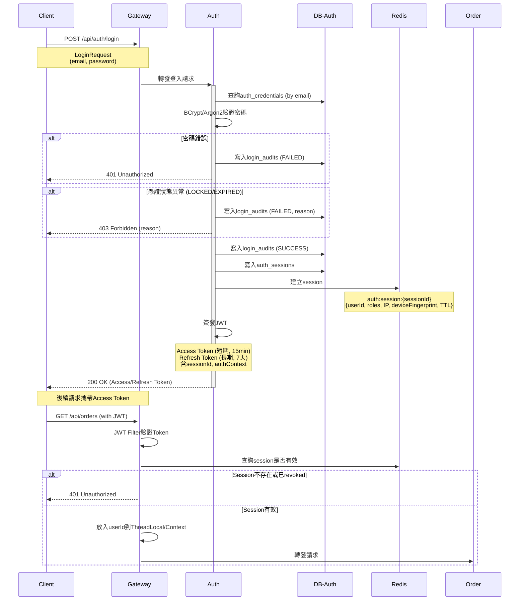

**涉及的API**:
- `POST /api/auth/login` (auth)
- `POST /api/auth/token/refresh` (auth)
- `POST /api/auth/logout` (auth)

**涉及的表**:
- `auth_credentials`
- `login_audits`
- `auth_sessions`
- Redis: `auth:session:{sessionId}`

**事件發布**:
- `AuthSessionRevoked` (登出或強制失效時)

---

## 下單流程 (Saga異步模式)

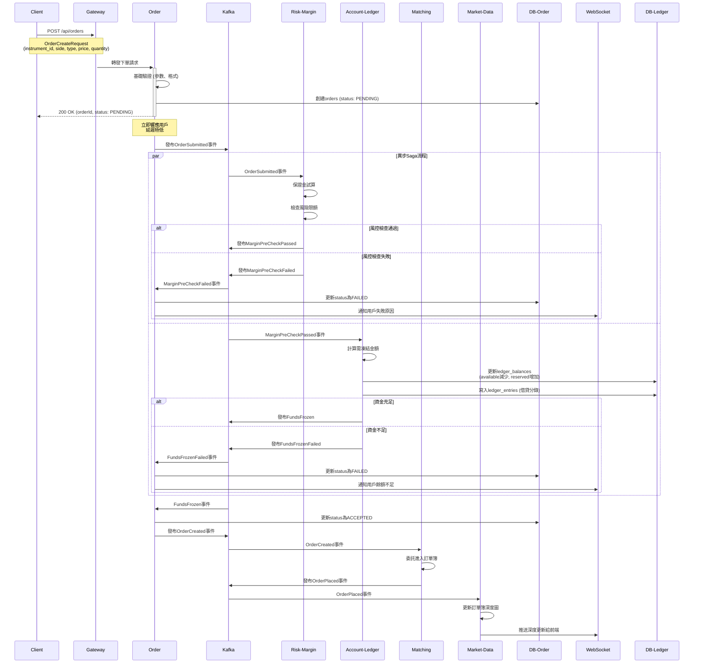

**涉及的API**:
- `POST /api/orders` (order)
- `POST /api/risk/pre-check` (可選，order內部調用)

**涉及的事件**:
1. `OrderSubmitted` (order → risk-margin)
2. `MarginPreCheckPassed` (risk-margin → account-ledger)
3. `MarginPreCheckFailed` (risk-margin → order)
4. `FundsFrozen` (account-ledger → order)
5. `OrderCreated` (order → matching)
6. `OrderPlaced` (matching → market-data)

**涉及的表**:
- `orders`
- `risk_limits`
- `ledger_balances`
- `ledger_entries`
- 內存訂單簿 (matching)

---

## 撤單流程

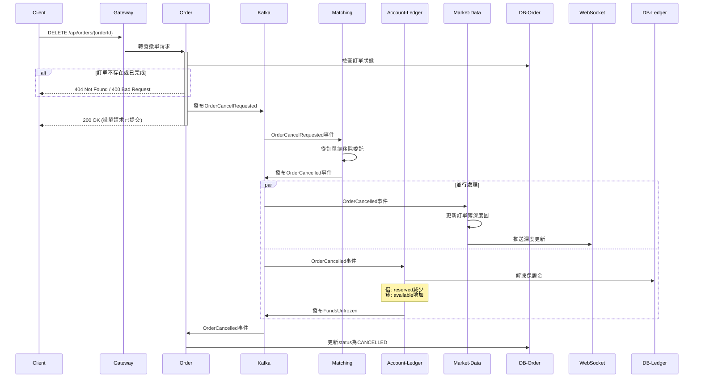

**涉及的API**:
- `DELETE /api/orders/{orderId}` (order)

**涉及的事件**:
1. `OrderCancelRequested` (order → matching)
2. `OrderCancelled` (matching → market-data, account-ledger)
3. `FundsUnfrozen` (account-ledger)

---

## 撮合與成交流程

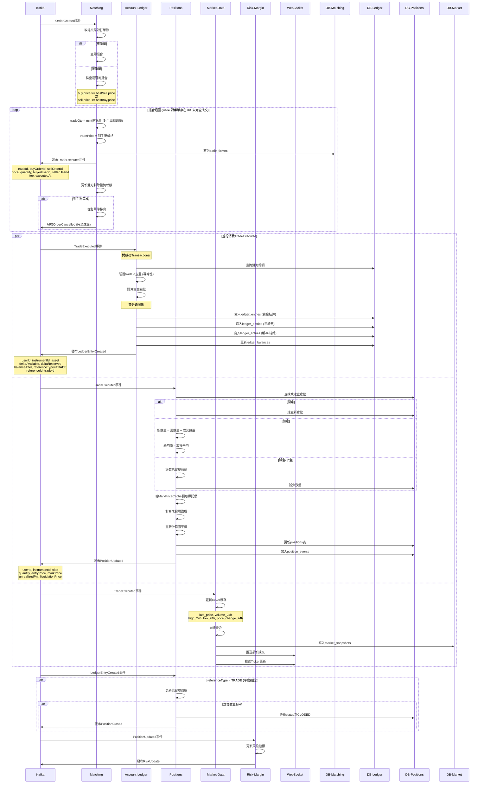

**涉及的事件**:
1. `OrderCreated` (order → matching)
2. `TradeExecuted` (matching → account-ledger, positions, market-data)
3. `LedgerEntryCreated` (account-ledger → positions)
4. `PositionUpdated` (positions → risk-margin)
5. `PositionClosed` (positions)
6. `RiskUpdate` (risk-margin)

**涉及的表**:
- 內存訂單簿 (matching)
- `trade_tickers`
- `ledger_entries`
- `ledger_balances`
- `positions`
- `position_events`
- `market_snapshots`

---

## 倉位更新流程

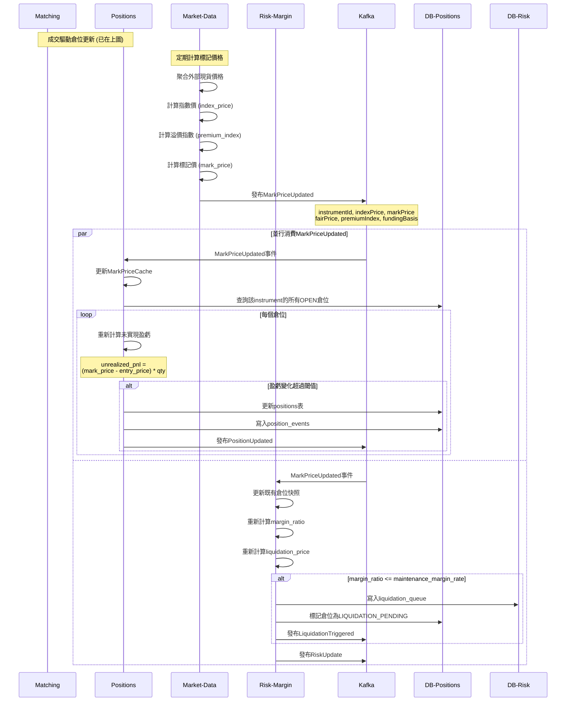

**涉及的事件**:
1. `MarkPriceUpdated` (market-data → positions, risk-margin)
2. `PositionUpdated` (positions → risk-margin)
3. `LiquidationTriggered` (risk-margin)
4. `RiskUpdate` (risk-margin)

---

## 風險管理與強平流程

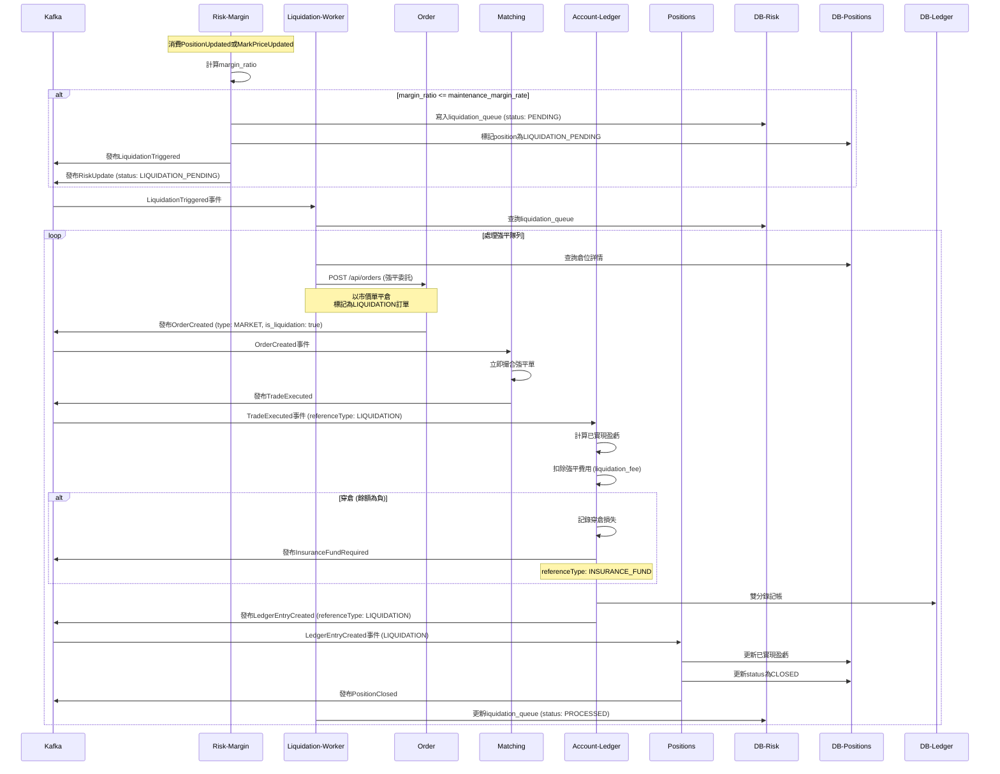

**涉及的API**:
- `POST /api/orders` (強平委託，內部調用)

**涉及的事件**:
1. `LiquidationTriggered` (risk-margin → liquidation-worker)
2. `RiskUpdate` (risk-margin)
3. `OrderCreated` (order → matching, 強平單)
4. `TradeExecuted` (matching)
5. `LedgerEntryCreated` (account-ledger, referenceType: LIQUIDATION)
6. `PositionClosed` (positions)
7. `InsuranceFundRequired` (account-ledger, 穿倉時)

**涉及的表**:
- `liquidation_queue`
- `risk_snapshots`
- `positions`
- `orders`
- `ledger_entries`

---

## 行情數據生成與推送流程

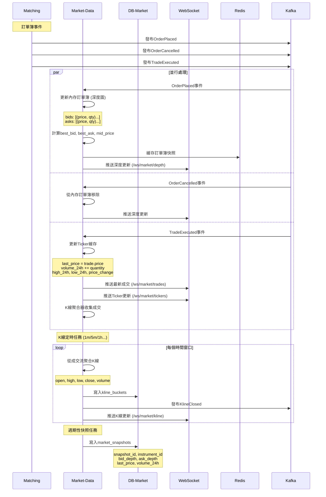

**涉及的事件**:
1. `OrderPlaced` (matching → market-data)
2. `OrderCancelled` (matching → market-data)
3. `TradeExecuted` (matching → market-data)
4. `KlineClosed` (market-data → 前端, reporting)

**涉及的表**:
- 內存 TickerCache
- 內存 DepthCache (訂單簿)
- Redis 快照緩存
- `kline_buckets`
- `market_snapshots`

**WebSocket推送**:
- `/ws/market/tickers` - Ticker更新
- `/ws/market/depth` - 深度圖更新
- `/ws/market/trades` - 最新成交
- `/ws/market/kline` - K線更新

---

## 標記價格與資金費率流程

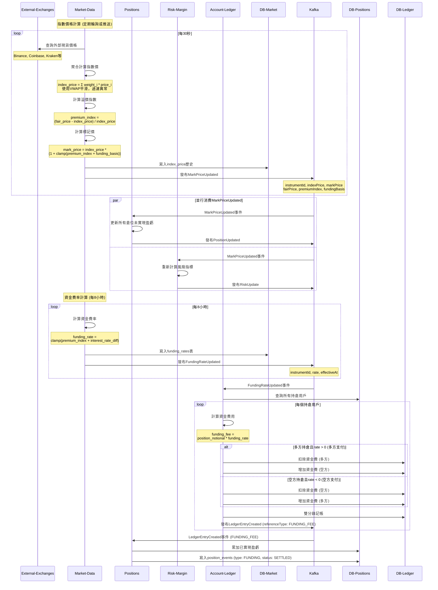

**涉及的事件**:
1. `MarkPriceUpdated` (market-data → positions, risk-margin)
2. `FundingRateUpdated` (market-data → account-ledger)
3. `LedgerEntryCreated` (account-ledger → positions, referenceType: FUNDING_FEE)
4. `PositionUpdated` (positions)
5. `RiskUpdate` (risk-margin)

**涉及的表**:
- `funding_rates`
- `ledger_entries`
- `ledger_balances`
- `positions`
- `position_events`

**外部依賴**:
- 外部交易所API (Binance, Coinbase, Kraken等)

---

# 完整系統事件流圖

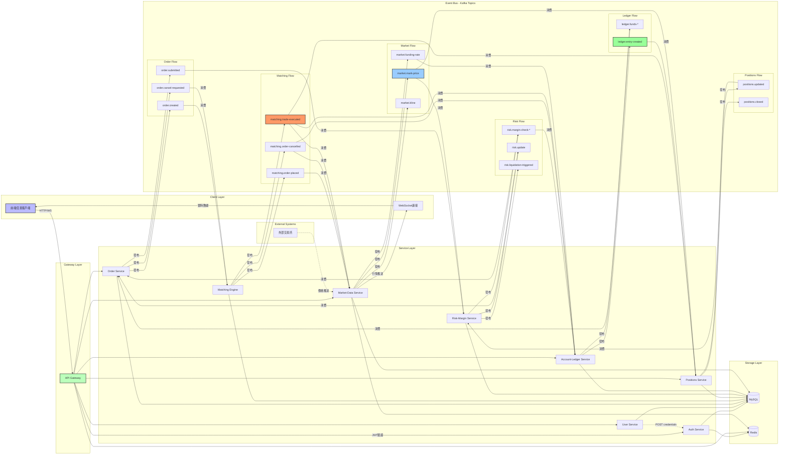
