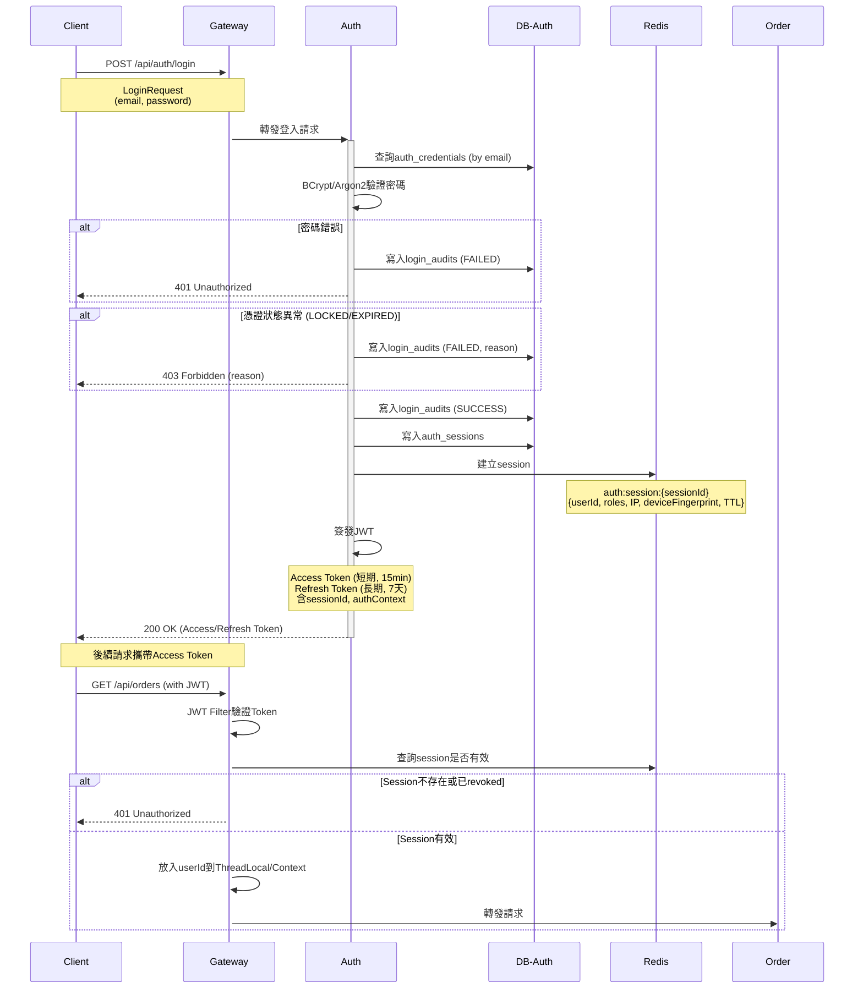
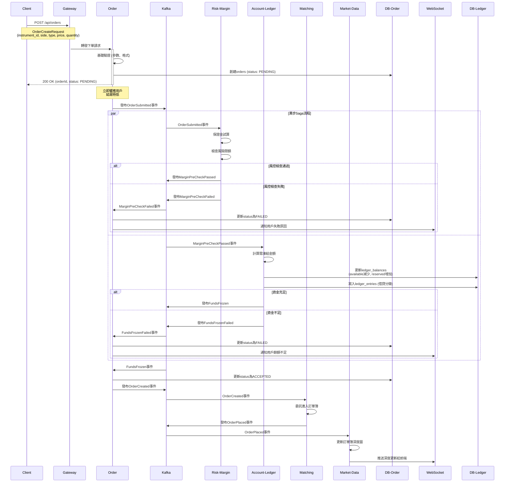
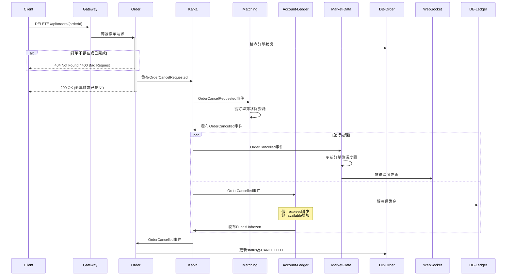
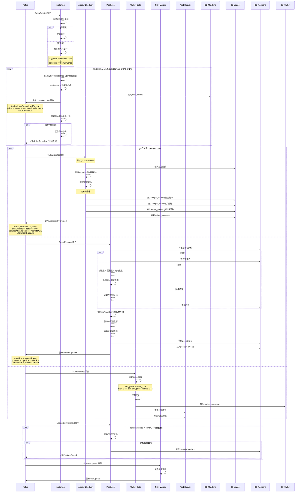
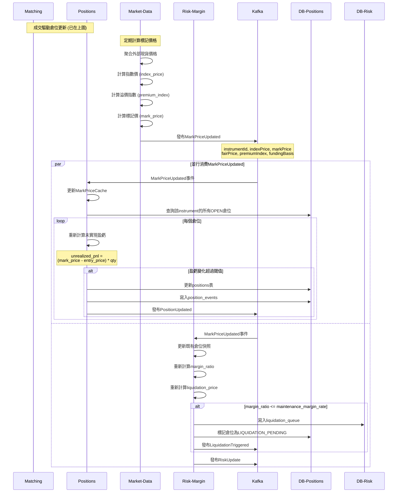
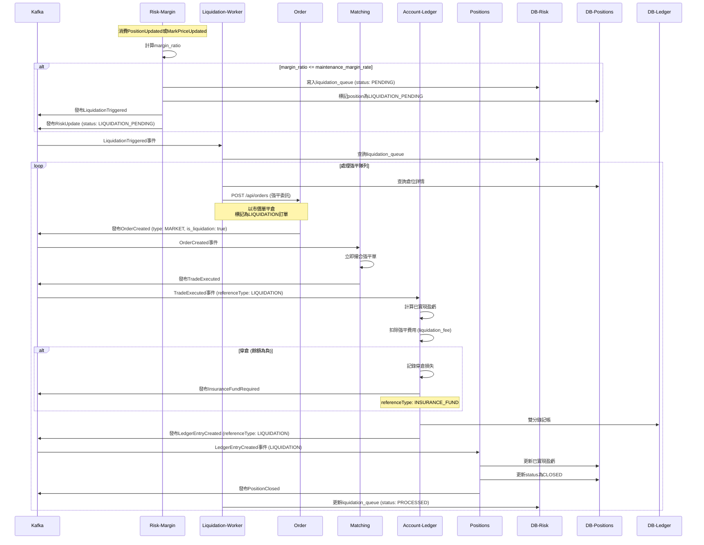
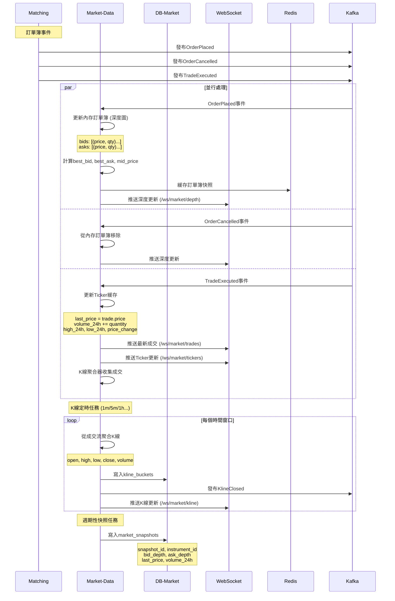
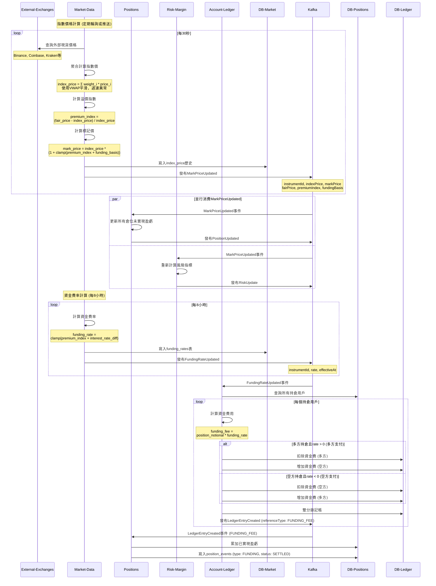
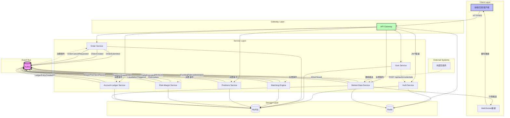

# 交易平台系統流程與接口事件圖

本文件根據整體設計文檔，整理出各流程中涉及的服務、API接口、事件發布與消費關係。


---

## 服務、API、事件、Job一覽

### Gateway 服務
**職責**: 統一入口、JWT驗證、路由轉發

| HTTP Method | Endpoint | 說明 | 轉發至 |
|------------|----------|------|--------|
| - | - | JWT驗證、路由所有請求 | 各微服務 |

---

### Auth 服務
**職責**: 認證、憑證管理、會話管理

| HTTP Method | Endpoint | 說明 | 輸入 | 輸出 | 事件發布 |
|------------|----------|------|------|------|---------|
| POST | `/api/auth/credentials` | 建立憑證 | AuthCredentialCreateRequest | AuthCredentialResponse | - |
| POST | `/api/auth/login` | 登入 | LoginRequest (email, password) | JWT (Access/Refresh Token) | - |
| POST | `/api/auth/token/refresh` | 刷新Token | RefreshToken | JWT (new Access/Refresh Token) | - |
| POST | `/api/auth/logout` | 登出 | - | - | `AuthSessionRevoked` |

**事件發布**:
- `AuthSessionRevoked`: 強制登出或風險事件時發布

---

### User 服務
**職責**: 用戶主檔管理、註冊

| HTTP Method | Endpoint | 說明 | 輸入 | 輸出 | 事件發布 | 調用服務 |
|------------|----------|------|------|------|---------|---------|
| POST | `/api/users` | 用戶註冊 | UserRegisterRequest (email, password) | UserResponse | - | Auth服務 (建立憑證) |
| GET | `/api/users/me` | 查詢當前用戶基本資料 | - | UserResponse | - | - |

**調用其他服務的API**:
- 調用 `auth` 服務的 `POST /api/auth/credentials` 建立憑證

**補償機制**:
- `UserRegistrationResumer` 排程任務：掃描 `user_registration_prepare` 表，重試失敗的憑證建立

---

### Order 服務
**職責**: 委託管理、下單入口

| HTTP Method | Endpoint | 說明 | 輸入 | 輸出 | 事件發布 |
|------------|----------|------|------|------|---------|
| POST | `/api/orders` | 建立委託 | OrderCreateRequest (instrument_id, side, type, price, quantity) | OrderResponse (orderId, status: PENDING) | `OrderSubmitted` → `OrderCreated` |
| DELETE | `/api/orders/{orderId}` | 撤銷委託 | orderId | - | `OrderCancelRequested` |
| GET | `/api/orders/{orderId}` | 查詢委託狀態 | orderId | OrderResponse | - |

**事件發布**:
- `OrderSubmitted`: 下單時立即發布，啟動Saga流程
- `OrderCreated`: 資金凍結完成後發布，送至撮合引擎
- `OrderCancelRequested`: 撤單請求

**事件消費**:
- `MarginPreCheckPassed` (from risk-margin)
- `FundsFrozen` (from account-ledger)

---

### Risk-Margin 服務
**職責**: 風險計算、保證金管理、強平執行

| HTTP Method | Endpoint | 說明 | 輸入 | 輸出 |
|------------|----------|------|------|------|
| POST | `/api/risk/pre-check` | 下單前風險檢查 | userId, instrumentId, quantity, price | 是否允許下單、需凍結保證金金額 |

**事件消費**:
- `OrderSubmitted` (from order): 進行保證金試算
- `PositionUpdated` (from positions): 更新風險指標
- `MarkPriceUpdated` (from market-data): 重新計算維持保證金率與強平價

**事件發布**:
- `MarginPreCheckPassed`: 保證金檢查通過
- `MarginPreCheckFailed`: 保證金檢查失敗
- `RiskUpdate`: 風險狀態更新 (margin_ratio, liquidation_price, status)
- `LiquidationTriggered`: 觸發強平

---

### Account-Ledger 服務
**職責**: 資產管理、雙分錄記帳、資金費率

| HTTP Method | Endpoint | 說明 | 輸入 | 輸出 |
|------------|----------|------|------|------|
| GET | `/api/ledger/balances?userId=` | 查詢餘額/可用資金 | userId | LedgerBalanceResponse |

**事件消費**:
- `MarginPreCheckPassed` (from risk-margin): 凍結資金
- `TradeExecuted` (from matching): 雙分錄記帳、扣除凍結、計算手續費
- `OrderCancelled` (from matching): 解凍資金
- `FundingRateUpdated` (from market-data): 定期結算資金費率

**事件發布**:
- `FundsFrozen`: 資金凍結完成
- `FundsUnfrozen`: 資金解凍完成
- `LedgerEntryCreated`: 資產異動事件 (含已實現盈虧、手續費等)

---

### Matching 服務
**職責**: 撮合引擎、訂單簿管理

| HTTP Method | Endpoint | 說明 | 輸入 | 輸出 | 事件發布 |
|------------|----------|------|------|------|---------|
| (可選) POST | `/api/matching/cancel` | 撮合層執行撤單 | orderId | - | `OrderCancelled` |

**事件消費**:
- `OrderCreated` (from order): 委託進入訂單簿、執行撮合

**事件發布**:
- `OrderPlaced`: 新訂單成功掛入訂單簿
- `OrderCancelled`: 訂單從訂單簿移除
- `TradeExecuted`: 撮合成交 (buyOrderId, sellOrderId, price, quantity, fee)

---

### Positions 服務
**職責**: 倉位管理、盈虧計算

| HTTP Method | Endpoint | 說明 | 輸入 | 輸出 |
|------------|----------|------|------|------|
| GET | `/api/positions?userId=` | 查詢當前倉位與損益 | userId | PositionResponse[] |

**事件消費**:
- `TradeExecuted` (from matching): 更新倉位數量、均價、未實現盈虧、強平價
- `LedgerEntryCreated` (from account-ledger): 確認資金結算、更新已實現盈虧、關閉倉位
- `MarkPriceUpdated` (from market-data): 重新計算未實現盈虧

**事件發布**:
- `PositionUpdated`: 倉位狀態更新 (quantity, entryPrice, markPrice, unrealizedPnl, liquidationPrice)
- `PositionClosed`: 倉位完全關閉

---

### Market-Data 服務
**職責**: 行情生成、深度圖、K線、標記價格、資金費率

| HTTP Method | Endpoint | 說明 | 輸入 | 輸出 |
|------------|----------|------|------|------|
| GET | `/api/market/tickers/{instrumentId}` | 最新行情資訊 | instrumentId | TickerResponse |
| GET | `/api/market/kline` | K線查詢 | symbol, period | KlineResponse[] |
| WebSocket | `/ws/market` | 推送行情、深度、K線 | - | 實時推送 |

**事件消費**:
- `OrderPlaced` (from matching): 更新深度圖
- `OrderCancelled` (from matching): 更新深度圖
- `TradeExecuted` (from matching): 更新Ticker、生成K線

**事件發布**:
- `MarkPriceUpdated`: 標記價格更新 (indexPrice, markPrice, fairPrice)
- `FundingRateUpdated`: 資金費率更新 (rate, effectiveAt)
- `KlineClosed`: K線周期結束

---

## API調用者

| 調用方 | 被調用方 | API端點 | 場景 |
|--------|---------|---------|------|
| user | auth | `POST /api/auth/credentials` | 用戶註冊時建立憑證 |
| gateway | auth | `POST /api/auth/login` | 用戶登入 |
| gateway | auth | `POST /api/auth/token/refresh` | Token刷新 |
| gateway | auth | `POST /api/auth/logout` | 用戶登出 |
| gateway | user | `POST /api/users` | 用戶註冊 |
| gateway | user | `GET /api/users/me` | 查詢用戶資料 |
| gateway | order | `POST /api/orders` | 下單 |
| gateway | order | `DELETE /api/orders/{orderId}` | 撤單 |
| gateway | order | `GET /api/orders/{orderId}` | 查詢委託 |
| gateway | positions | `GET /api/positions?userId=` | 查詢倉位 |
| gateway | ledger | `GET /api/ledger/balances?userId=` | 查詢餘額 |
| gateway | market-data | `GET /api/market/tickers/{instrumentId}` | 查詢行情 |
| gateway | market-data | `GET /api/market/kline` | 查詢K線 |
| liquidation-worker | order | `POST /api/orders` | 執行強平委託 (內部) |
| order (可選) | risk-margin | `POST /api/risk/pre-check` | 下單前風險檢查 (內部) |

---

## event 表

| 事件名稱 | 發布者 | 消費者 | Kafka Topic | 事件內容 |
|---------|--------|--------|-------------|---------|
| `AuthSessionRevoked` | auth | gateway, 其他服務 | auth.session-revoked | sessionId, userId, reason |
| `OrderSubmitted` | order | risk-margin | order.submitted | orderId, userId, instrumentId, side, type, price, quantity |
| `MarginPreCheckPassed` | risk-margin | account-ledger | risk.margin-check-passed | orderId, requiredMargin |
| `MarginPreCheckFailed` | risk-margin | order | risk.margin-check-failed | orderId, reason |
| `FundsFrozen` | account-ledger | order | ledger.funds-frozen | orderId, userId, asset, amount |
| `FundsUnfrozen` | account-ledger | - | ledger.funds-unfrozen | orderId, userId, asset, amount |
| `OrderCreated` | order | matching | order.created | orderId, userId, instrumentId, side, type, price, quantity |
| `OrderCancelRequested` | order | matching | order.cancel-requested | orderId |
| `OrderPlaced` | matching | market-data | matching.order-placed | orderId, side, price, quantity |
| `OrderCancelled` | matching | market-data, account-ledger | matching.order-cancelled | orderId |
| `TradeExecuted` | matching | account-ledger, positions, market-data | matching.trade-executed | tradeId, buyOrderId, sellOrderId, price, quantity, buyerUserId, sellerUserId, fee, executedAt |
| `LedgerEntryCreated` | account-ledger | positions | ledger.entry-created | userId, instrumentId, asset, deltaAvailable, deltaReserved, balanceAfter, referenceType, referenceId |
| `PositionUpdated` | positions | risk-margin, reporting | positions.updated | userId, instrumentId, side, quantity, entryPrice, markPrice, unrealizedPnl, liquidationPrice |
| `PositionClosed` | positions | reporting | positions.closed | userId, instrumentId, realizedPnl |
| `MarkPriceUpdated` | market-data | positions, risk-margin | market.mark-price | instrumentId, indexPrice, markPrice, fairPrice, premiumIndex, fundingBasis, calculatedAt |
| `FundingRateUpdated` | market-data | account-ledger | market.funding-rate | instrumentId, rate, effectiveAt |
| `KlineClosed` | market-data | reporting, 前端 | market.kline | instrumentId, period, open, high, low, close, volume, timestamp |
| `RiskUpdate` | risk-margin | order, liquidation-worker, reporting | risk.update | userId, instrumentId, marginRatio, liquidationPrice, status |
| `LiquidationTriggered` | risk-margin | liquidation-worker | risk.liquidation-triggered | positionId, userId, instrumentId, reason |

---

---

## 流程圖

### 用戶註冊流程

```mermaid
sequenceDiagram
    participant Client
    participant Gateway
    participant User
    participant Auth
    participant DB-User
    participant DB-Auth
    participant Scheduler

    Client->>+Gateway: POST /api/users
    Gateway->>+User: 轉發註冊請求 (email, password)

    User->>DB-User: 檢查email是否已存在
    alt Email已存在
        User-->>Client: 400 Email already exists
    end

    User->>DB-User: 創建User主檔
    User->>DB-User: 寫入user_registration_prepare (PREPARE狀態)

    User->>+Auth: POST /api/auth/credentials
    Note over User,Auth: AuthCredentialCreateRequest<br/>(userId, type, secret_hash, salt)

    alt Auth服務可用
        Auth->>DB-Auth: 寫入auth_credentials
        Auth-->>User: 201 Created
        User->>DB-User: 更新registration狀態為COMPLETED
        User-->>-Client: 200 OK (UserResponse)
    else Auth服務不可用或失敗
        Auth-->>User: 500/503 Error
        User->>DB-User: 保留PREPARE狀態
        User-->>-Client: 500 RemoteServiceError
    end

    Note over Scheduler: 每分鐘執行
    Scheduler->>DB-User: 掃描PREPARE狀態記錄
    loop 重試邏輯
        Scheduler->>+Auth: POST /api/auth/credentials (重試)
        alt 成功
            Auth-->>Scheduler: 201 Created
            Scheduler->>DB-User: 更新為COMPLETED
        else N次失敗
            Scheduler->>DB-User: 標記為FAILED
            Scheduler->>Scheduler: 發送告警通知營運
        end
    end
```

**涉及的API**:
- `POST /api/users` (user)
- `POST /api/auth/credentials` (auth)

**涉及的表**:
- `users`
- `user_registration_prepare`
- `auth_credentials`

**補償機制**:
- `UserRegistrationResumer` 排程任務

---

### 用戶登入流程



**涉及的API**:
- `POST /api/auth/login` (auth)
- `POST /api/auth/token/refresh` (auth)
- `POST /api/auth/logout` (auth)

**涉及的表**:
- `auth_credentials`
- `login_audits`
- `auth_sessions`
- Redis: `auth:session:{sessionId}`

**事件發布**:
- `AuthSessionRevoked` (登出或強制失效時)

---

### 下單流程 (Saga異步模式)



**涉及的API**:
- `POST /api/orders` (order)
- `POST /api/risk/pre-check` (可選，order內部調用)

**涉及的事件**:
1. `OrderSubmitted` (order → risk-margin)
2. `MarginPreCheckPassed` (risk-margin → account-ledger)
3. `MarginPreCheckFailed` (risk-margin → order)
4. `FundsFrozen` (account-ledger → order)
5. `OrderCreated` (order → matching)
6. `OrderPlaced` (matching → market-data)

**涉及的表**:
- `orders`
- `risk_limits`
- `ledger_balances`
- `ledger_entries`
- 內存訂單簿 (matching)

---

### 撤單流程



**涉及的API**:
- `DELETE /api/orders/{orderId}` (order)

**涉及的事件**:
1. `OrderCancelRequested` (order → matching)
2. `OrderCancelled` (matching → market-data, account-ledger)
3. `FundsUnfrozen` (account-ledger)

---

### 撮合與成交流程



**涉及的事件**:
1. `OrderCreated` (order → matching)
2. `TradeExecuted` (matching → account-ledger, positions, market-data)
3. `LedgerEntryCreated` (account-ledger → positions)
4. `PositionUpdated` (positions → risk-margin)
5. `PositionClosed` (positions)
6. `RiskUpdate` (risk-margin)

**涉及的表**:
- 內存訂單簿 (matching)
- `trade_tickers`
- `ledger_entries`
- `ledger_balances`
- `positions`
- `position_events`
- `market_snapshots`

---

### 倉位更新流程



**涉及的事件**:
1. `MarkPriceUpdated` (market-data → positions, risk-margin)
2. `PositionUpdated` (positions → risk-margin)
3. `LiquidationTriggered` (risk-margin)
4. `RiskUpdate` (risk-margin)

---

### 風險管理與強平流程



**涉及的API**:
- `POST /api/orders` (強平委託，內部調用)

**涉及的事件**:
1. `LiquidationTriggered` (risk-margin → liquidation-worker)
2. `RiskUpdate` (risk-margin)
3. `OrderCreated` (order → matching, 強平單)
4. `TradeExecuted` (matching)
5. `LedgerEntryCreated` (account-ledger, referenceType: LIQUIDATION)
6. `PositionClosed` (positions)
7. `InsuranceFundRequired` (account-ledger, 穿倉時)

**涉及的表**:
- `liquidation_queue`
- `risk_snapshots`
- `positions`
- `orders`
- `ledger_entries`

---

### 行情數據生成與推送流程



**涉及的事件**:
1. `OrderPlaced` (matching → market-data)
2. `OrderCancelled` (matching → market-data)
3. `TradeExecuted` (matching → market-data)
4. `KlineClosed` (market-data → 前端, reporting)

**涉及的表**:
- 內存 TickerCache
- 內存 DepthCache (訂單簿)
- Redis 快照緩存
- `kline_buckets`
- `market_snapshots`

**WebSocket推送**:
- `/ws/market/tickers` - Ticker更新
- `/ws/market/depth` - 深度圖更新
- `/ws/market/trades` - 最新成交
- `/ws/market/kline` - K線更新

---

### 標記價格與資金費率流程



**涉及的事件**:
1. `MarkPriceUpdated` (market-data → positions, risk-margin)
2. `FundingRateUpdated` (market-data → account-ledger)
3. `LedgerEntryCreated` (account-ledger → positions, referenceType: FUNDING_FEE)
4. `PositionUpdated` (positions)
5. `RiskUpdate` (risk-margin)

**涉及的表**:
- `funding_rates`
- `ledger_entries`
- `ledger_balances`
- `positions`
- `position_events`

**外部依賴**:
- 外部交易所API (Binance, Coinbase, Kraken等)

---

## 完整系統事件流圖



---

## 總結

本文檔完整呈現了交易平台中：

1. **9個核心服務**及其職責
2. **20+個REST API端點**
3. **18個核心事件**及其發布/消費關係
4. **9個主要業務流程**的完整序列圖

所有流程均採用**事件驅動架構 (EDA)**，通過Kafka實現異步解耦，確保：
- 高性能 (低延遲響應)
- 高可用 (服務解耦，容錯性強)
- 高擴展性 (各服務可獨立擴展)
- 最終一致性 (通過事件溯源與補償機制)

關鍵設計模式：
- **Saga模式** (下單流程)
- **Event Sourcing** (訂單、倉位事件)
- **CQRS** (讀寫分離)
- **雙分錄記帳** (account-ledger)
- **補償機制** (用戶註冊、強平重試)
