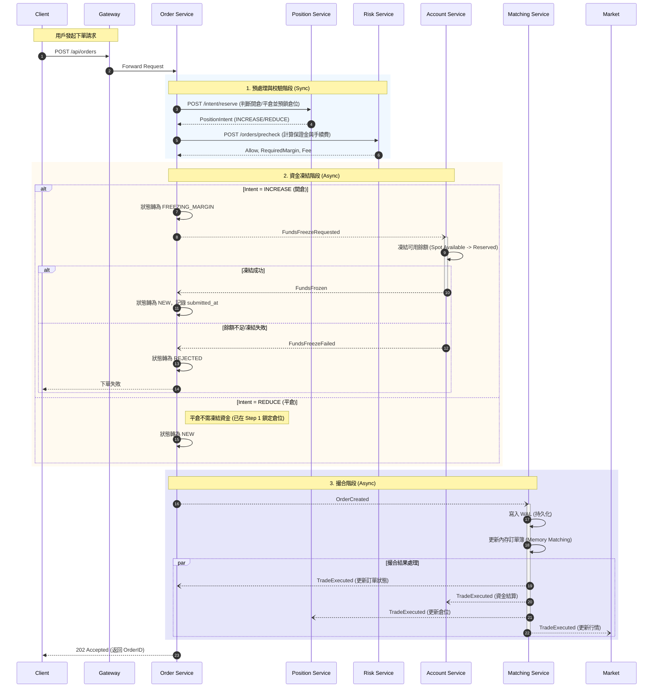

# Order Flow Interactions

## 1. 主交易流程服務交互圖 (Order Placement Flow)

展示從用戶下單到撮合成交的核心流程。

```mermaid
sequenceDiagram
    autonumber
    participant Client
    participant Gateway
    participant Order as Order Service
    participant Position as Position Service
    participant Risk as Risk Service
    participant Account as Account Service
    participant Matching as Matching Service

    Note over Client, Gateway: 用戶發起下單請求

    Client->>Gateway: POST /api/orders
    Gateway->>Order: Forward Request

    rect rgb(240, 248, 255)
        Note over Order, Risk: 1. 預處理與校驗階段 (Sync)
        Order->>Position: POST /intent/reserve (判斷開倉/平倉並預鎖倉位)
        Position-->>Order: PositionIntent (INCREASE/REDUCE)

        Order->>Risk: POST /orders/precheck (計算保證金與手續費)
        Risk-->>Order: Allow, RequiredMargin, Fee
    end

    rect rgb(255, 250, 240)
        Note over Order, Account: 2. 資金凍結階段 (Async)
        alt Intent = INCREASE (開倉)
            Order->>Order: 狀態轉為 FREEZING_MARGIN
            Order--)Account: FundsFreezeRequested
            activate Account
            Account->>Account: 凍結可用餘額 (Spot Available -> Reserved)
            alt 凍結成功
                Account--)Order: FundsFrozen
                deactivate Account
                Order->>Order: 狀態轉為 NEW，記錄 submitted_at
            else 餘額不足/凍結失敗
                Account--)Order: FundsFreezeFailed
                Order->>Order: 狀態轉為 REJECTED
                Order-->>Client: 下單失敗
            end
        else Intent = REDUCE (平倉)
            Note right of Order: 平倉不需凍結資金 (已在 Step 1 鎖定倉位)
            Order->>Order: 狀態轉為 NEW
        end
    end

    rect rgb(230, 230, 250)
        Note over Order, Matching: 3. 撮合階段 (Async)
        Order--)Matching: OrderCreated
        activate Matching
        Matching->>Matching: 寫入 WAL (持久化)
        Matching->>Matching: 更新內存訂單簿 (Memory Matching)

        par 撮合結果處理
            Matching--)Order: TradeExecuted (更新訂單狀態)
            Matching--)Account: TradeExecuted (資金結算)
            Matching--)Position: TradeExecuted (更新倉位)
            Matching--)Market: TradeExecuted (更新行情)
        end
        deactivate Matching
    end

    Order-->>Client: 202 Accepted (返回 OrderID)
```
