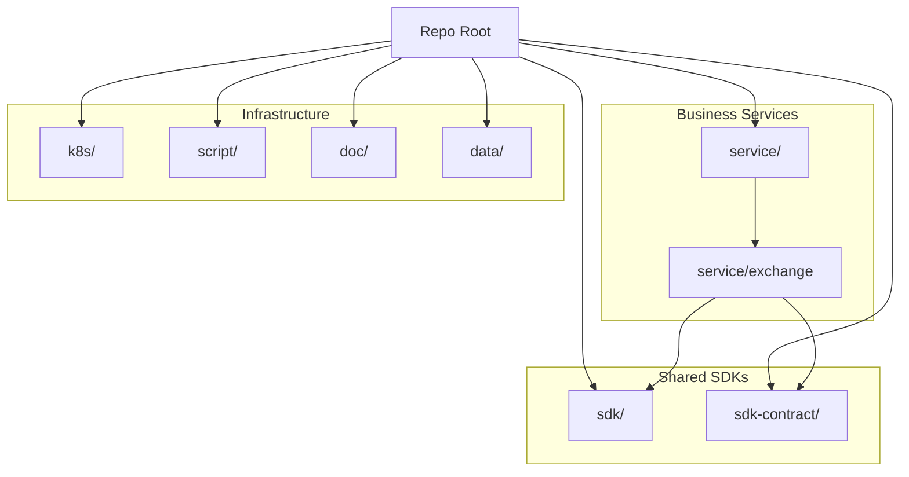

# Project Architecture

## 1. 專案架構圖 (Project Architecture)

展示整體專案模組與依賴關係。

```mermaid
graph TB
    Root[Repo Root]

    subgraph "Shared SDKs"
        SDK[sdk/]
        SDKC[sdk-contract/]
    end

    subgraph "Business Services"
        ServiceRoot[service/]
        Exchange[service/exchange]
    end

    subgraph "Infrastructure"
        K8S[k8s/]
        Scripts[script/]
        Docs[doc/]
        Data[data/]
    end

    Root --> SDK
    Root --> SDKC
    Root --> ServiceRoot
    Root --> K8S
    Root --> Scripts
    Root --> Docs
    Root --> Data

    ServiceRoot --> Exchange
    Exchange --> SDK
    Exchange --> SDKC
```
