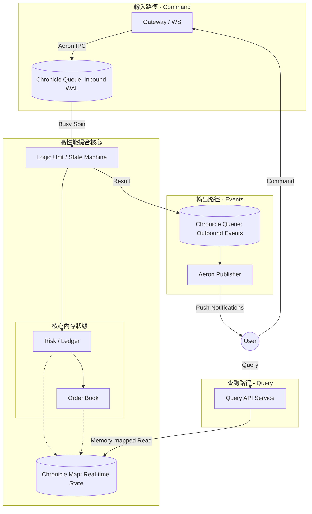

# 超低延遲現貨交易所 (Spot Exchange) 架構設計

本文件定義了一套基於 **Chronicle** (Queue/Map/Wire) 與 **Aeron** (Transport/IPC) 的現代化超低延遲交易所架構。這套設計追求 **最小化開銷** 與 **最大化確定性**，是針對現代高性能交易場景的最小可行方案 (MVP)。

---

## 1. 設計核心原則 (Core Principles)

- **Event Sourcing (事件溯源)**: 系統狀態完全由輸入的序列化事件流決定。
- **Determinisic Execution (確定性執行)**: 相同的輸入序列產生完全相同的狀態輸出。
- **Single-threaded Core (單執行緒核心)**: 核心邏輯在單個隔離執行緒中運行，消除 Lock 與鎖競爭。
- **Zero-GC & Off-heap**: 利用 Chronicle Queue/Map 將數據存在堆外內存映射文件，避免 JVM GC 停頓。

---

## 2. 系統架構圖 (Architecture Overview)



---

## 3. 關鍵組件說明 (Component Definitions)

### 3.1 Sequencer (定序器)
- **技術**: **Chronicle Queue**。
- **職責**: 接收指令，分配全域 Sequence ID 並持久化為 WAL (Write-Ahead Log)。

### 3.2 Logic Unit (撮合與風控核心)
- **職責**: 消耗 Sequencer 事件，執行風控檢查與撮合算法。
- **特點**: 單執行緒、Busy Spin。

### 3.3 Shared State Store (共享狀態存儲)
- **技術**: **Chronicle Map (Shared Memory)**。
- **職責**: 存儲當前所有活躍訂單與用戶資產餘額。
- **特點**: 基於 **Memory-mapped Files**，支援零拷貝跨進程讀取。

### 3.4 Messaging Transport
- **技術**: **Aeron (UDP/IPC)**。
- **職責**: 高速信令傳輸與廣播。

---

## 4. 核心業務流程細節

### 4.1 下單與風控 (Order Entry & Risk Control)
1. **指令接收**: Gateway 接收 WS 指令 -> SBE 編碼 -> Aeron 發送。
2. **同步驗證**: Logic Unit 從內存 `BalanceMap` 讀取餘額並執行扣除/凍結，隨後進入 `OrderBook`。
3. **結果寫入**: 變更同步到 `Shared Map` 並寫入 `Outbound Queue`。

### 4.2 狀態查詢機制 (State Query Mechanism)
- **寫入端**: 由 `Logic Unit` 獨佔 `Chronicle Map` 寫入權。
- **讀取端**: `Query API` 透過 **Memory-mapped File** 唯讀掛載，實現 `O(1)` 時間複雜度的極速查詢。

---

## 5. 帳戶認證與即時初始化 (Auth & JIT Initialization)

系統採用「連線即註冊」模式，極度簡化認證流程。

### 5.1 認證流程
1. **WS Auth 請求**: 用戶發送 `auth` 訊息，直接帶上 `userId`。
2. **核心處理**: 
    - `Logic Unit` 檢查 `BalanceMap` 中是否存在該 `userId`。
    - **不存在**: 立即建立新帳戶並初始化資產為 0。
    - **存在**: 確認狀態。
3. **回報**: 產生 `AUTH_SUCCESS` 事件。

### 5.2 資產充值 (Deposit)
- 外部向 `Inbound Queue` 發送 `DEPOSIT` 指令（需帶 `userId` 與金額）。
- 核心引擎同步更新餘額。

---

## 6. WebSocket 協議與數據結構 (WS Protocol & Data Structures)

### 6.1 通訊基礎
- **格式**: JSON。
- **鑑權**: 連線後首條訊息必須為 `auth` 指令。

### 6.2 用戶指令 (Client -> Server)

#### A. 身份驗證 (Auth)
```json
{
  "op": "auth",
  "args": {
    "userId": "user_001"
  }
}
```

#### B. 限價下單 (New Order)
```json
{
  "op": "order.create",
  "cid": "client_order_001", 
  "params": {
    "userId": "user_001",
    "symbol": "BTC_USDT",
    "side": "BUY",
    "price": "65000.50",
    "size": "0.1"
  }
}
```

### 6.3 執行回報與事件推送 (Server -> Client)
- **execution**: 訂單狀態變更推送。
- **balance**: 資產變動推送。

---

## 7. 異常恢復與數據完整性

- **啟動恢復**: 加載 `Shared State Map` 快照，並從記錄的 Sequence ID 開始重播 `Inbound Chronicle Queue`。
- **數據完整性**: 所有變更均有 WAL 保障。

---

## 8. MVP 實現清單 (MVP Roadmap)

1. **定義 SBE Schema**: 確定核心二進制通訊格式。
2. **實現 Chronicle Sequencer**: 建立 WAL 持久化機制。
3. **單執行緒撮合器**: 實現基礎的 LIMIT 單撮合與內存風控。
4. **Aeron 通信橋接**: 建立 Gateway 與引擎之間的通訊頻道。
5. **快速還原測試**: 驗證崩潰後的狀態恢復機制。
