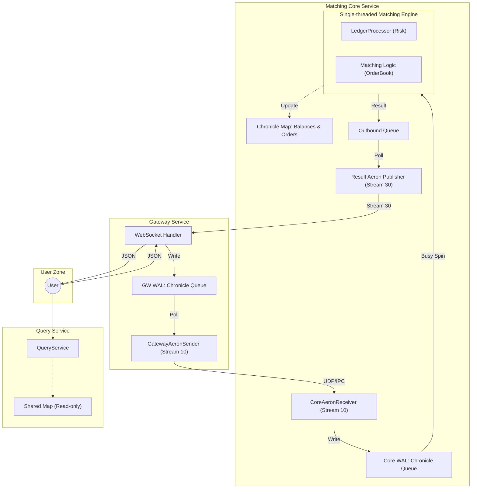

# 超低延遲現貨交易所 (Spot Exchange) 架構設計

本文件定義了一套基於 **Chronicle** (Queue/Map/Wire) 與 **Aeron** (Transport/IPC) 的現代化超低延遲交易所架構。這套設計追求 **最小化開銷** 與 **最大化確定性**，是針對現代高性能交易場景的最小可行方案 (MVP)。

---

## 1. 設計核心原則 (Core Principles)

- **Event Sourcing (事件溯源)**: 系統狀態完全由輸入的序列化事件流決定。
- **Determinisic Execution (確定性執行)**: 相同的輸入序列產生完全相同的狀態輸出。
- **Single-threaded Core (單執行緒核心)**: 核心邏輯在單個隔離執行緒中運行，消除 Lock 與鎖競爭。
- **Zero-GC & Off-heap**: 利用 Chronicle Queue/Map 將數據存在堆外內存映射文件，避免 JVM GC 停頓。

---
## 2. 系統架構圖 (Current Implementation Architecture)




---

## 3. 組件說明 (Component Definitions)

### 3.1 核心邏輯單元 (The Core Logic Unit)
- **職責**: 在單個隔離執行緒中，**先**進行資產風控與凍結，**後**立即進行訂單撮合。
- **優勢**: 
    - **零跨服務延遲**: 風控與撮合之間無 Aeron/網路開銷。
    - **原子性保證**: 訂單處理要麼完全成功（成交/掛單），要麼完全失敗（拒絕），無需分散式交易。

### 3.2 Aeron 通訊管道 (Aeron Streams)
- **Stream 10 (Inbound)**: Gateway 發布原始下單指令。
- **Stream 30 (Result)**: Core Engine 發布成交回報與行情更新。

### 3.3 確定性與持久化 (WAL - Write-Ahead Log)

#### A. Gateway WAL (GW_Q)
- **職責**: 在將訊息發送至 Aeron 之前，Gateway **優先**將接收到的原始 JSON 指令寫入本地 Chronicle Queue。
- **作用**: 
    1. **原始審計 (Raw Audit)**: 記錄用戶最原始的下單意圖，作為交易糾紛（如：用戶聲稱下單價格與實際不符）的最終證據。
    2. **故障補齊 (Gap Fill)**: 若 Aeron 傳輸過程中發生極端異常或 Gateway 崩潰，重啟後可從 GW WAL 恢復並重發未送達的指令。
    3. **異步背壓 (Backpressure)**: 當核心引擎處理速度受限時，GW WAL 充當緩衝區，確保用戶請求先「落地」持久化。

#### B. Core WAL (Core_Q)
- **職責**: 核心引擎從 Aeron 接收指令後，立即持久化為 WAL。
- **作用**: 系統的 **「唯一真實來源 (Single Source of Truth)」**。重播此隊列即可在空機上完整重建所有資產餘額與訂單簿狀態。

### 3.4 效能診斷與指標 (Observability)
透過對比 GW WAL 與 Core WAL 的訊息時間戳，系統可精確度量：
- **Gateway 處理延遲**: (SBE 編碼 + 本地寫入耗時)。
- **傳輸與排隊延遲**: (Aeron 傳輸 + 在 Core Queue 中等待處理的耗時)。
- **核心處理延遲**: (風控檢查 + 撮合計算耗時)。

---

## 4. 核心業務流程細節

### 4.1 下單與風控 (Order Entry & Risk Control)
1. **指令接收**: Gateway 接收 WS 指令 -> SBE 編碼 -> Aeron 發送。
2. **同步驗證**: Logic Unit 從內存 `BalanceMap` 讀取餘額並執行扣除/凍結，隨後進入 `OrderBook`。
3. **結果寫入**: 變更同步到 `Shared Map` 並寫入 `Outbound Queue`。

### 4.2 狀態查詢機制 (State Query Mechanism)
- **寫入端**: 由 `Logic Unit` 獨佔 `Chronicle Map` 寫入權。
- **讀取端**: `Query API` 透過 **Memory-mapped File** 唯讀掛載，實現 `O(1)` 時間複雜度的極速查詢。

---

## 5. 帳戶認證與即時初始化 (Auth & JIT Initialization)

系統採用「連線即註冊」模式，極度簡化認證流程。

### 5.1 認證流程
1. **WS Auth 請求**: 用戶發送 `auth` 訊息，直接帶上 `userId`。
2. **核心處理**: 
    - `Logic Unit` 檢查 `BalanceMap` 中是否存在該 `userId`。
    - **不存在**: 立即建立新帳戶並初始化資產為 0。
    - **存在**: 確認狀態。
3. **回報**: 產生 `AUTH_SUCCESS` 事件。

### 5.2 資產充值 (Deposit)
- 外部向 `Inbound Queue` 發送 `DEPOSIT` 指令（需帶 `userId` 與金額）。
- 核心引擎同步更新餘額。

---

## 6. WebSocket 協議與數據結構 (WS Protocol & Data Structures)

### 6.1 通訊基礎
- **格式**: JSON。
- **鑑權**: 連線後首條訊息必須為 `auth` 指令。

### 6.2 用戶指令 (Client -> Server)

#### A. 身份驗證 (Auth)
```json
{ "op": "auth", "args": { "userId": "user_001" } }
```

#### B. 限價下單 (New Order)
```json
{
  "op": "order.create",
  "cid": "client_order_001", 
  "params": {
    "userId": "user_001",
    "symbol": "BTC_USDT",
    "side": "BUY",
    "price": "65000.50",
    "size": "0.1"
  }
}
```

#### C. 撤單 (Cancel Order)
```json
{
  "op": "order.cancel",
  "params": { "userId": "user_001", "orderId": "123456" }
}
```

#### D. 模擬充值 (Deposit - MVP 專用)
```json
{
  "op": "asset.deposit",
  "params": { "userId": "user_001", "asset": "USDT", "amount": "10000" }
}
```

#### E. 查詢請求 (Queries)
```json
{ "op": "asset.query", "params": { "userId": "user_001" } }
{ "op": "order.query", "params": { "userId": "user_001", "symbol": "BTC_USDT" } }
{ "op": "trade.query", "params": { "userId": "user_001", "limit": 20 } }
```

### 6.3 系統推播與響應 (Server -> Client)

#### A. 執行報告 (Execution Report)
```json
{
  "topic": "execution",
  "data": {
    "userId": "user_001",
    "orderId": "123456",
    "cid": "client_order_001",
    "status": "FILLED",
    "lastQty": "0.05",
    "lastPrice": "65000.50",
    "cumQty": "0.1",
    "avgPrice": "65000.50"
  }
}
```

### 6.4 內存數據結構定義 (In-memory Data Structures)

#### A. 資產餘額表 (BalanceMap)
- **Key**: `userId` (long) + `assetId` (int)
- **Value**: `available` (long), `frozen` (long)

#### B. 活躍訂單表 (OrderMap)
- **Key**: `orderId` (long)
- **Value**: `userId`, `symbolId`, `side`, `price`, `qty`, `status`

---

## 7. 異常恢復與分布式一致性 (Consistency & Recovery)

系統採用「異步持久化 (Asynchronous Flush)」以追求極致延遲。針對極端斷電可能導致的 GW WAL 數據遺失與核心不一致，系統實施以下恢復策略：

### 7.1 下游追蹤上游 (Downstream tracking Upstream) 策略
為了確保 Gateway 與 Core Engine 的執行狀態完全對齊，系統建立了 **Aeron Sequence ID 鏈條**:

1. **ID 綁定 (Binding)**: 
   - Core Engine 在處理每條訊息時，會將該訊息對應的 `Aeron Stream Sequence ID` 記錄在 `Core WAL`。
   - 所有輸出的執行回報 (Execution Report) 必須攜帶該原指令的 `Sequence ID`。
2. **Gateway 重啟對齊 (Alignment)**: 
   - Gateway 在重啟後，首先讀取本地 `GW WAL` 的最後一條記錄 ID。
   - Gateway 向核心引擎查詢「當前已處理的最大 Sequence ID」。
3. **數據補齊 (Gap Fill)**:
   - **不一致場景**: 若核心引擎已處理到 ID 100，但 Gateway 本地磁碟只記錄到 ID 95（發生磁碟數據遺失）。
   - **自動修正**: Gateway 辨識出 ID 96-100 的指令已在核心執行但本地遺失審計。此時 Gateway 會向核心引擎拉取對應的回報，補足本地審計日誌，並記錄一條系統級 `Disk-Data-Loss` 告警。

### 7.2 核心啟動恢復
1. **快照加載**: 加載 `Shared State Map` (磁碟映射文件)。
2. **重播隊列**: 從快照中記錄的最後一個 Sequence ID 開始，重播 `Core WAL` (Chronicle Queue)，補齊所有未寫入磁碟的內存變更。

---

## 8. 為什麼選擇這套架構？ (The "Why")

| 特性 | 傳統微服務 (Kafka + DB) | 低延遲架構 (Chronicle + Aeron) |
| :--- | :--- | :--- |
| **延遲** | 毫秒級 (1ms - 50ms) | **微秒級 (1μs - 50μs)** |
| **持久化** | 資料庫交易 (Blocking) | Memory-mapped File (Async non-blocking) |
| **一致性** | 最終一致性 | **強一致性 (Single Source of Truth)** |
| **垃圾回收** | 頻繁 GC 停頓 | **Zero-GC** (無 GC 負擔) |

---

## 8. MVP 實現清單 (MVP Roadmap)

1. **定義 SBE Schema**: 確定核心二進制通訊格式。
2. **實現 Chronicle Sequencer**: 建立 WAL 持久化機制。
3. **單執行緒撮合器**: 實現基礎的 LIMIT 單撮合與內存風控。
4. **Aeron 通信橋接**: 建立 Gateway 與引擎之間的通訊頻道。
5. **快速還原測試**: 驗證崩潰後的狀態恢復機制。
