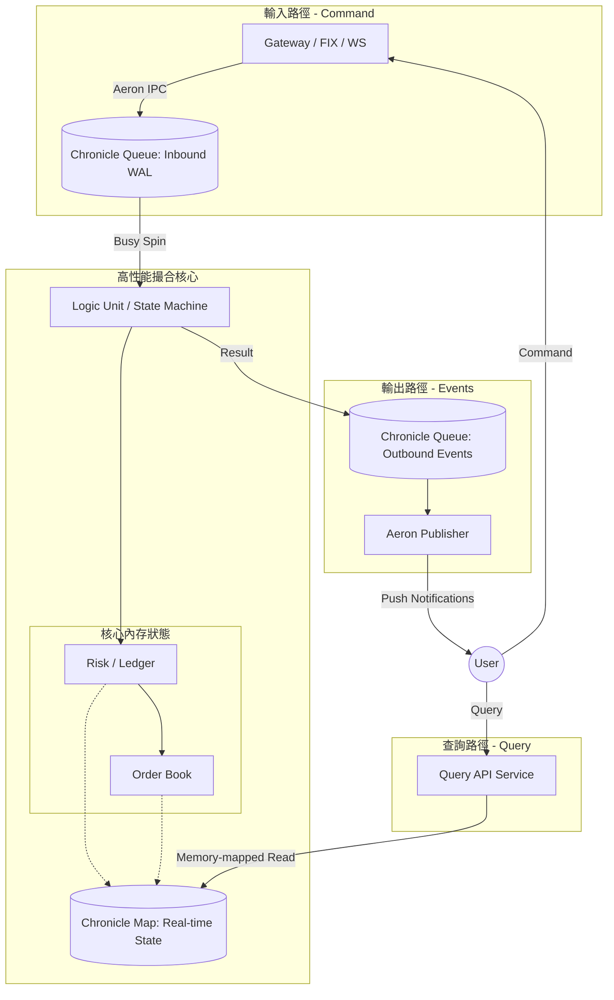

# 超低延遲現貨交易所 (Spot Exchange) 架構設計

本文件定義了一套基於 **Chronicle** (Queue/Map/Wire) 與 **Aeron** (Transport/IPC) 的現代化超低延遲交易所架構。這套設計追求 **最小化開銷** 與 **最大化確定性**，是針對現代高性能交易場景的最小可行方案 (MVP)。

---

## 1. 設計核心原則 (Core Principles)

- **Event Sourcing (事件溯源)**: 系統狀態（餘額、掛單、撮合結果）完全由輸入的序列化事件流（Order, Cancel, Deposit）決定。
- **Determinisic Execution (確定性執行)**: 給定相同的輸入序列，撮合引擎（Matching Engine）必須產生完全相同的狀態輸出。
- **Single-threaded Core (單執行緒核心)**: 核心撮合與風控邏輯在單個隔離執行緒中運行，消除 Lock、CAS 與上下文切換開銷。
- **Zero-GC & Off-heap**: 利用 Chronicle Queue/Map 將數據存在堆外 (Off-heap) 內存映射文件 (Memory-mapped Files)，避免 JVM GC 停頓。
- **Binary Protocols (SBE)**: 使用 Simple Binary Encoding (SBE) 進行訊息編碼，極大化 Aeron 的吞吐量並降低編解碼延遲。

---

## 2. 系統架構圖 (Architecture Overview)

---

## 3. 關鍵組件說明 (Component Definitions)

### 3.1 Sequencer (定序器)
- **技術**: **Chronicle Queue**。
- **職責**: 接收指令，分配全域 Sequence ID 並持久化為 WAL (Write-Ahead Log)。

### 3.2 Logic Unit (撮合與風控核心)
- **職責**: 
    - 消耗 Sequencer 事件。
    - 執行風控試算（餘額檢查）。
    - 執行撮合算法。
- **特點**: 單執行緒、無鎖、Busy Spin，確保極低且穩定的延遲。

### 3.3 Shared State Store (共享狀態存儲)
- **技術**: **Chronicle Map (Shared Memory)**。
- **職責**: 
    - 存儲當前所有活躍訂單 (Active Orders)。
    - 存儲所有用戶的資產餘額 (Balances)。
- **特點**: 
    - 基於 **Memory-mapped Files**，數據持久化在磁碟但以內存速度訪問。
    - **核心引擎 (Writer)**：高性能寫入。
    - **Query API (Reader)**：零拷貝 (Zero-copy) 跨進程讀取。

### 3.4 Messaging Transport
- **技術**: **Aeron (UDP/IPC)**。
- **職責**: 高速信令傳輸，支持廣播成交回報與市場行情。

---

## 4. 核心業務流程細節

### 4.1 下單與風控 (Order Entry & Risk Control)
1. **指令接收**: Gateway 接收 WS 指令 -> SBE 編碼 -> Aeron 發送。
2. **同步驗證**: Logic Unit 接收指令後，立即執行以下原子操作：
    - **餘額檢索**: 從內存 `BalanceMap` 讀取 `available` 餘額。
    - **足額判定**: 
        - 若 `available < order_value` -> 產生 `ORDER_REJECTED(INSUFFICIENT_BALANCE)` 事件。
        - 若 `available >= order_value` -> 
            - 扣除 `available`，增加 `frozen`。
            - 將訂單投遞至 `OrderBook`。
3. **撮合結算**:
    - 若成交：更新 `frozen` (扣除) 與 獲得資產的 `available` (增加)。
    - 若撤單：將 `frozen` 返還至 `available`。

### 4.2 狀態查詢機制 (State Query Mechanism)
系統採用 **CQRS (Command Query Responsibility Segregation)** 模式：
- **寫入端 (Command)**: 由 `Logic Unit` 獨佔 `Chronicle Map` 的寫入權，更新活躍訂單與資產。
- **讀取端 (Query)**: 
    - `Query API` 透過 **Memory-mapped File** 以唯讀模式掛載 `Chronicle Map`。
    - 支援 `O(1)` 時間複雜度的資產與活躍訂單查詢。
    - 數據直接從物理內存讀取，避開了系統呼叫 (System Call) 與上下文切換。

---

## 5. 異常恢復與數據完整性

- **啟動恢復**: 
    1. 加載磁碟上的 `Shared State Map` (快照)。
    2. 從快照標記的最後一個 Sequence ID 開始，重播 `Inbound Chronicle Queue` (WAL)。
    3. 補齊快照之後的所有狀態變更。
- **冷備份**: 可定期對 `Chronicle Map` 的磁碟文件進行物理拷貝。

---

## 5. 為什麼選擇這套架構？ (The "Why")

| 特性 | 傳統微服務 (Kafka + DB) | 低延遲架構 (Chronicle + Aeron) |
| :--- | :--- | :--- |
| **延遲 (Latency)** | 毫秒級 (1ms - 50ms) | 微秒級 (1μs - 50μs) |
| **持久化** | 資料庫交易 (Blocking) | Memory-mapped File (Async non-blocking) |
| **擴展性** | 橫向擴展 (Stateless) | 垂直擴展 / 分片 (Deterministic Sharding) |
| **一致性** | 最終一致性 / 分散式交易 | 強一致性 (Single Source of Truth) |
| **垃圾回收** | 頻繁 GC 停頓 | Off-heap, 幾乎無 GC 負擔 |

---

## 6. MVP 實現清單 (MVP Roadmap)

1. **定義 SBE Schema**: 確定 Order, Cancel, Trade, BalanceUpdate 的二進制格式。
2. **實現 Chronicle Sequencer**: 基礎的事件日誌寫入與讀取。
3. **單執行緒撮合器**:
    - 支持 `LIMIT` 單。
    - 內存 `Map<UserId, AssetBalance>` 進行風控。
4. **Aeron 通信橋接**: 建立 Gateway 與引擎之間的 Aeron 頻道。
5. **快速還原測試**: 驗證當引擎崩潰重啟時，能從 Chronicle Queue 完整還原 Order Book 狀態。
