# 🎥 演示影片

- [Web 交易終端演示 (React / Ant Design)](https://www.youtube.com/watch?v=MYQobecR8DA&t=67s)

# 系統功能

單向持倉
逐倉保證金模式

- order
    - 限價單、市價單
    - 開倉 (多/空)、平倉、撤銷委託
- 帳務
    - 下單預扣
    - 根據成交、強平事件調整帳務。
    - 公司帳目對映會計科目，雙分錄記帳法
- 撮合
    - 每個交易對維護獨立的 Order Book，單線程內存撮合
    - WAL
    - 價格優先、時間優先 (Price-Time Priority) 的撮合算法

- 行情
    - 根據成交與掛撤單事件，更新 Ticker、深度、K 線
    - K 線圖查詢:
        - 提供多種時間週期 (1m, 5m, 1h, 1d 等) 的 K 線數據。
        - 支援 REST API
- 倉位
    - 單向持倉，用戶可以查看所有持倉的詳細資訊，包括倉位數量、開倉均價、未實現/已實現盈虧、保證金、強平價格等。
    - 平倉預扣、槓桿倍數調整接口
    - 消費成交、帳務、行情事件，即時更新倉位信息
    - event sourcing
- 風控
    - 下單預檢，根據倉位大小和槓桿，計算初始保證金與維持保證金。
    - 當用戶的保證金率低於維持保證金率時，系統自動執行強制平倉流程。

暫不實作

- ~~flip 反手開平倉與結算~~
- ~~資金費率~~
- ~~風險準備金（Insurance Fund）~~
- ~~ADL 自動減倉~~
- ~~根據多家外部交易所的現貨價格，計算出公允的指數價格與標記價格，並推送行情事件~~
- ~~採用標記價格觸發強平，以避免市場插針造成的異常波動。~~

# 全域架構與概念 (Architecture Overview)

## 目錄結構

## 服務依賴關係圖

```mermaid
flowchart LR
    Client[前端/交易客戶端]

    subgraph Services[服務群]
        Gateway[Gateway]
        Auth[Auth]
        User[User]
        OrderSvc[Order]
        RiskSvc[Risk]
        LedgerSvc[Ledger]
        PositionsSvc[Positions]
        MarketSvc[Market]
        MatchingSvc[Matching]
    end

    Client -->|HTTP| Gateway
    Gateway -->|REST| Auth
    Gateway -->|REST| User
    Gateway -->|REST| OrderSvc
    Gateway -->|REST| LedgerSvc
    Gateway -->|REST| PositionsSvc
    Gateway -->|REST| MarketSvc

    %% 核心下單鏈路
    OrderSvc -- 1.預檢 --> RiskSvc
    OrderSvc -- 2.鎖倉 --> PositionsSvc
    OrderSvc -- 3.凍結 --> LedgerSvc
    OrderSvc -- 4.撮合 --> MatchingSvc

    %% 撮合後異步事件流
    MatchingSvc -- TradeExecuted --> LedgerSvc
    MatchingSvc -- TradeExecuted --> PositionsSvc
    MatchingSvc -- TradeExecuted --> MarketSvc
    MatchingSvc -- OrderBookUpdated --> MarketSvc

    %% 風控回饋迴圈
    PositionsSvc -- PositionUpdated --> RiskSvc
    MarketSvc -- MarkPriceUpdated --> RiskSvc
    RiskSvc -- LiquidationTriggered --> OrderSvc
```



#    

# 核心業務流程 (Core Business Flows)

# 帳號

## `POST /api/users`：註冊

- 前端呼叫 `POST /api/users`（由 Gateway 轉發）。
- `user-service` 驗證信箱是否已存在，建立 `User` 主檔，與在 `user_registration_prepare` 表寫入一筆 `PREPARE` 狀態的註冊工作（包含
  userId、email、重試次數等欄位）。
- 建立成功後呼叫 `auth` 服務，傳入 `AuthCredentialCreateRequest`（帶入 userId、型別、密碼雜湊與鹽值）；`auth` 寫入
  `auth_credentials`，並回報成功以更新註冊工作狀態為 `COMPLETED`。
- 若憑證建立失敗或 `auth` 暫時不可用，`user-service` 會保留 `PREPARE` 狀態並回傳 `RemoteServiceError`，以便稍後重試。
- **排程補償**：`UserRegistrationResumer`（Spring Scheduling/Quartz Job）每分鐘掃描 `user_registration_prepare`，對停留在
  `PREPARE` 的記錄重新呼叫 `auth` 建憑證；成功後標記 `COMPLETED`，連續 N 次失敗則標記 `FAILED` 並發送告警通知營運處理。

## `POST /api/auth/credentials`：建立憑證

## POST `/api/auth/login`：登入

- 由 `sdk-auth-server` 提供預設實作；服務引入該模組後即可直接啟用。

登入流程

- `POST /api/auth/login`：
    - Gateway 將請求轉給 `auth`。
    - `auth` 依 credential type 讀取 `auth_credentials`，以 `BCrypt`/`Argon2` 驗證密碼並檢查狀態（LOCKED、EXPIRED 等），必要時追加
      OTP/FIDO 二次驗證。
    - 驗證成功後寫入 `login_audits`、`auth_sessions`，並在 Redis 建立 `auth:session:{sessionId}`（含
      userId、roles、IP、裝置指紋、TTL）。
    - 回傳 Access/Refresh Token，JWT 內含 `sessionId`、`authContext`，供下游服務解析。
- 請求授權：後續所有 API 由 Gateway 的 JWT Filter 驗證 Access Token，並以 `sessionId` 查詢 Redis（或本地快取）確認會話仍有效；若不存在或標記
  `revoked` 即拒絕。
- Token 續期：Access Token 過期時，前端呼叫 `POST /api/auth/token/refresh`，`auth` 驗證 Refresh Token 是否仍 active，使用樂觀鎖（
  `refresh_tokens.version`）避免重放，成功則簽發新 Access/Refresh 並延長 Redis session TTL。
- 登出/失效：`POST /api/auth/logout` 或風控事件會標記 Refresh Token 為 `revoked`、刪除 Redis session，並發布
  `AuthSessionRevoked` 事件；Gateway 或服務側可立即終止該會話。
- 下游使用：各服務的安全 Filter 解析 JWT，將 `OpenJwtUser`（userId、roles、scopes、sessionId）放入 ThreadLocal 或 Reactor
  Context，支援審計與授權判定。

## POST `/api/auth/token/refresh`：refresh token

- 使用 Refresh Token 取得新的 Access Token，並延長 Redis session 到期時間。
- 由 `sdk-auth-server` 提供預設實作；服務引入該模組後即可直接啟用。

## POST `/api/auth/logout`：登出

- 作廢 Refresh Token/Session（刪除 Redis session）。
-
    - 由 `sdk-auth-server` 提供預設實作；服務引入該模組後即可直接啟用。

# 槓桿配置

#### POST `/api/risk/precheck/leverage` (風控試算與驗證)

- **Request (`LeveragePrecheckRequest`)**:
    - `userId`, `instrumentId`
    - `targetLeverage` (目標槓桿)
    - `currentPosition` (當前倉位數量、當前 Margin、持倉方向)
    - `markPrice` (最新標記價格)

- **Processing**:

    1. **名義價值檢查**：計算 `notional = size * markPrice`，檢查是否超過 `targetLeverage` 對應的 Tier 上限（例如 100x
       不能開超過 50k USDT）。
    2. 檢查槓桿倍是否符合 risk_limit 配置
    3. **保證金計算**：
        - `newMinMargin = notional / targetLeverage` (新起始保證金)
        - `marginDelta = newMinMargin - currentMargin`
        - _注意：如果 `marginDelta > 0` 代表需補錢；`< 0` 代表退錢。_
    4. **強平價預演 (Critical)**：
        - 試算調整後的強平價 `newLiqPrice`。
        - **檢查**：若做多，`newLiqPrice >= markPrice` 則**拒絕**（一改就爆倉）；若做空，`newLiqPrice <= markPrice` 則**拒絕
          **。

    5. **餘額預檢查 (Optional)**：若是補錢，可先讀取用戶餘額看夠不夠（非強鎖定，僅作 UX 提示）。
- **Response**:
    - `allow`: boolean
    - `marginDelta`: decimal (正數=補保證金, 負數=釋放保證金)
    - `newLiqPrice`: decimal (預估新強平價，供前端展示)
    - `reason`: string (若失敗，返回原因，如 "Instant Liquidation Risk")

---

#### POST `/api/positions/{instrumentId}/leverage` (核心業務)

這是事務的協調入口。

- **流程邏輯**:
    1. **Call Precheck**: 呼叫上述 `/api/risk/precheck/leverage`，獲取 `allow` 和 `marginDelta`。
       若 `allow=false` 直接報錯。
    2. **決策分支**:

    - **分支 A：調低槓桿 (Need to Add Margin, `marginDelta > 0`)**
        - Step 1
            - Position Service 在自己的資料庫 `retry_task`  表寫入一筆 `PENDING` 狀態的任務單
              biz_type = 倉位調低槓桿
              biz_key = 雪花ID
              payload = step 2 的請求參數
            - (Error Handling):  定期掃描 `retry_task`  表 中， biz_type = 倉位調低槓桿，超過一定時間（如 10 秒）仍處於
              `PENDING` 的任務。
              針對這些卡住的任務，用biz_key = 雪花ID，去 Wallet Service 反查交易狀態：
                - **若錢包已扣款**：Position Service 繼續完成倉位更新，將任務改為 `SUCCESS`。
                - **若錢包未扣款**：視情況重試扣款或標記失敗。
        - **Step 2 (RPC):** 同步呼叫 Wallet Service `POST /api/account/balance/transfer`。
            - Action: `DEDUCT` (扣除可用餘額)
            - Amount: `marginDelta`
        - **Step 3 (DB):** 若 Step 1 成功，開啟 DB Transaction：
            - 更新 `positions.leverage = targetLeverage`
            - 更新 `positions.margin = positions.margin + marginDelta`
            - 寫入 `position_events` 一筆槓桿調整紀錄（事件類型沿用 `PositionUpdated`/`MARGIN_ADJUSTED`）
            - (Error Handling):** 若 Step 3 DB 寫入失敗，發起 **補償請求** 呼叫 Wallet Service 把錢退回（Refund）。
    - **分支 B：調高槓桿 (Release Margin, `marginDelta < 0`)**
        - **Step 1 (DB):** 開啟 DB Transaction：
            - 更新 `positions.leverage = targetLeverage`
            - 更新 `positions.margin = positions.margin - abs(marginDelta)`
            - **檢查**：再次確認扣減後的 margin 不會導致立即爆倉 (Double check)。
            - Position Service 在自己的資料庫 `retry_task`  表寫入一筆 `PENDING` 狀態的任務單
              biz_type = 倉位調高槓桿
              biz_key = 雪花ID
              payload = step 2 的請求參數
        - **Step 2 (RPC):** 若 Step 1 成功，同步呼叫 Wallet Service。
            - Action: `ADD` (增加可用餘額)
            - Amount: `abs(marginDelta)`
            - (Error Handling): 若step 2 失敗
              定期掃描 `retry_task`  表 中， biz_type = 倉位調高槓桿，超過一定時間（如 10 秒）仍處於 `PENDING` 的任務。由後台
              Job 無限重試直到錢加給用戶。**（絕對不能回滾 Step 1，否則用戶倉位變危險了錢還沒退出來，或者造成系統少錢）**。

### `POST /api/account/balance/transfer`

- **Request**:
    - `userId`: string
    - `asset`: enum (`AssetSymbol`，與帳本/撮合共用的資產枚舉)
    - `amount`: decimal (絕對值)
    - `type`: enum (`DEDUCT_TO_POSITION`, `RELEASE_FROM_POSITION`)
    - `refId`: string (冪等性 ID)
    - `instrumentId`: string (用於帳單紀錄)
- Wallet Service 的扣款接口必須支援冪等性。即使 Position Service 重啟後重複發送相同的 `request_id` 請求扣款，Wallet
  Service 也不能重複扣錢，而是直接回傳當前的成功狀態。
- **Response**:
    - `success`: boolean
    - `code`: string (e.g., `INSUFFICIENT_BALANCE`)

### `GET` `/api/account/transaction/{refId}`

- 供 Position Service 的 Recovery Job 反查使用。
- 回傳該筆交易的最終狀態（已執行 / 不存在）。

## 事件: PositionUpdated（沿用既有格式）

槓桿/保證金調整完成後，沿用標準 `PositionUpdated` 事件（topic: `positions.updated`）
如需標註原因，可在 metadata/reference 欄位標記（例：`referenceType=調高槓桿 or 調低槓桿`）。

## research

修改合約槓桿（Leverage）的流程，本質上就是 **重新計算並調整「起始保證金（Initial Margin）** 的過程。
對於**逐倉模式（Isolated Mode）來說，這個動作會直接導致資金在「可用餘額」與「倉位保證金」之間流動。
以下我將從**「業務邏輯（交易者視角）」**與**「系統執行邏輯（後端視角）」兩個層面來詳細介紹。

---

### 一、 業務邏輯：調高 vs 調低

修改槓桿主要分為兩個方向，它們對資金的要求截然不同：

#### 1. 調高槓桿（例如 10x → 20x）

- **意義：** 你希望用更少的本金來維持同樣規模的倉位。
- **資金流向：** **釋放保證金（Release Margin）**。
    - 系統會計算出多餘的保證金，將其從「倉位」退回到「錢包可用餘額」。
- **風險變化：** 強平價格會**更靠近**當前市價（更容易爆倉）。
- **限制：**
    - 新的槓桿倍數必須符合該幣種的「持倉分層限制」（Position Tier）。通常持倉量越大，允許的最高槓桿越低。
    - 修改後不能導致立即爆倉（即修改後的強平價不能穿過當前市價）。

#### 2. 調低槓桿（例如 20x → 10x）

- **意義：** 你希望增加投入的本金，讓倉位更安全。
- **資金流向：** **追加保證金（Add Margin）**。
    - 系統需要從你的「錢包可用餘額」中扣除資金，鎖定到「倉位」中。
- **風險變化：** 強平價格會**遠離**當前市價（更不容易爆倉）。
- **限制：**
    - **錢包餘額必須足夠**支付需要追加的保證金差額。如果餘額不足，修改會失敗。

---

### 二、 系統執行流程（Backend Workflow）

如果你正在設計交易系統，處理 `ChangeLeverage` 請求的標準流程如下：

#### 接收請求與驗證

前端傳入參數：`{ symbol, positionSide, newLeverage }`

1. **檢查倉位是否存在：** 確認用戶當前持有該合約的倉位。
2. **檢查最大槓桿限制：** 根據當前「持倉名義價值（Notional Value）」，查詢風險限額表（Risk Limit Table），確認 `newLeverage`
   是否合法。
    - _例如：持倉 100 萬 USDT 的 BTC，可能交易所規定最高只能開 50x，用戶若請求 100x 則拒絕。

#### 試算保證金變化 (Pre-calculation)

系統需計算切換槓桿後的**新保證金需求**：

- **舊保證金** = 持倉數量 × 舊單位保證金
- **新保證金** = 持倉數量 × (開倉均價 / newLeverage)
- **差額 (Delta)** = 新保證金 - 舊保證金

#### **重新計算強平價**

- 使用你剛才提供的公式，帶入新的 `marginPerUnit` 重新計算 `Liquidation Price` 並寫入資料庫。

#### 資金檢查 (Check Balance)

- **如果 Delta > 0（調低槓桿，需補錢）：**
    - 檢查 `User_Available_Balance >= Delta`？
    - 若不足，拋出錯誤 `Insufficient Balance`。
- **如果 Delta < 0（調高槓桿，退錢）：**
    - 通常無資金檢查限制，直接通過。

#### 執行原子操作 (Atomic Execution)

這一步必須在資料庫交易（Transaction）或內存撮合引擎中原子性地執行：

1. **更新倉位信息：** 將倉位的 `leverage` 欄位更新為 `newLeverage`。
2. **更新倉位保證金：** 將倉位的 `margin` 更新為 `新保證金`。
3. **更新錢包餘額：**
    - 若需補錢：`Wallet_Balance` 扣除 `Delta`。
    - 若退錢：`Wallet_Balance` 增加 `abs(Delta)`。

#### 風險檢查 (Post-Check, Optional but Recommended)

- 在提交修改前，系統通常會試算新的強平價。
- 如果 `新強平價` 已經被當前 `Mark Price`（標記價格）觸發，則**禁止修改**。
    - _原因：不能讓用戶修改槓桿後瞬間爆倉，這會導致系統產生壞帳或用戶爭議。_

### race condition

- 注意：分散式事務，必須先扣錢再轉帳。以及補償機制。

# 下單及結算

## `POST /api/orders`

- 請求: 用戶  `POST /api/orders` (instrument_id, side, type, price, quantity)
- 以 `CREATED` 狀態寫入 orders，並紀錄 `intent`
- 調用  `/api/positions/intent/reserve`
    - 取得:  `PositionIntentType`：`INCREASE`（純開倉）、`REDUCE`（部分平倉）、`CLOSE`（全部平倉）。
    - 若為平倉，鎖定平倉數量（預凍結倉位），若凍結失敗，狀態改為 `rejected`，紀錄 rejected_reason。
    - 併發情境:
        - 情境 A：判斷為加倉 (INCREASE) → 實際變成 平倉 (REDUCE) 【安全】
            - **狀態**：用戶持有 `+10 ETH` (多單)。
            - **動作**：用戶下單 `買入 +5 ETH`。
            - **Intent 判斷**：系統認為這是 **加倉 (INCREASE)**。
            - **資金凍結**：因為是加倉，Risk 引擎**凍結了 5 ETH 的保證金**。
            - **並發事件 (The Flip)**：在買單成交前，另一筆市價賣單 `賣出 -20 ETH` 先成交了。
                - 倉位變為 `-10 ETH` (空單)。
            - **結果**：原本的 `買入 +5 ETH` 終於成交了。
                - 因為現在倉位是空單，這筆買單實際上變成了 **平空倉 (REDUCE)**。
            - **系統影響**：
                - **資金**：你預先凍結了保證金（當作開倉），結果發現是平倉（反而釋放保證金）。*
                  *這對系統是安全的（Over-collateralized，超額抵押）**。你只是暫時多凍結了錢，結算時把錢退回給
                  `Spot Available` 即可。
                - **邏輯**：Ledger 收到成交，雖然 Order 標記為 INCREASE，但 Position 發現是平倉，會發出
                  `PositionMarginReleased`，Ledger 執行退款。
            - **結論：
                - 這種情況雖然邏輯變了，但資金是安全的，不需要額外字段去擋。**
                - 但是 flip 需要小心處理這個場景問題 -> [[#Flip 場景]]
        - 情境 B：判斷為平倉 (REDUCE) → 實際變成 加倉 (INCREASE)
            - **狀態**：用戶持有 `+10 ETH` (多單)。
            - **動作**：用戶下單 `賣出 -5 ETH`。
            - **Intent 判斷**：系統認為這是 **平倉 (REDUCE)**。
            - **資金凍結**：因為是平倉，**不凍結保證金**。
            - **並發事件 (The Flip)**：在賣單成交前，另一筆市價賣單 `賣出 -10 ETH` 先成交了。
                - 倉位變為 `0`。
            - **結果**：原本的 `賣出 -5 ETH` 終於成交了。
                - 因為倉位已歸零，這筆賣單變成了 **開空倉 (INCREASE)**。
            - **系統影響**：
                - **資金**：**嚴重問題！** 你當初以為是平倉，所以**沒凍結保證金**。現在變成了開倉，用戶帳戶裡可能根本沒錢！這會導致
                  **穿倉**。

> 			- **解法: 鎖定平倉數量**

- **風控預檢**: Order Svc 呼叫  `/api/risk/orders/precheck`，
    - 若是開倉，計算 requiredMargin 與 fee，fee 先以 Taker fee 預收。成交後再退差價。
    - 若收到 風控拒絕 狀態改為 `rejected`，紀錄 rejected_reason。
- 若 **Intent = INCREASE**
  開倉流程:
    - **資金凍結**:
        - 將狀態改為 `FREEZING_MARGIN` 並發布 `FundsFreezeRequested`，內含 requiredMargin 與 fee。
        - Ledger Svc 消費並執行：`DEBIT Spot Reserved` -> `CREDIT Spot Available`。
          成功發布 `FundsFrozen`，失敗發布 `FundsFreezeFailed`。
        - Order Svc 收到 `FundsFrozen`，將狀態改為 `NEW`，紀錄 submitted_at，發布 `OrderCreated` 給 Matching Svc。
          若收到 `FundsFreezeFailed` 狀態改為 `rejected`，紀錄 rejected_reason。
    - **撮合**:
        - Matching 消費 `OrderCreated` ，撮合成功，發布 `TradeExecuted`。
    - **結算 (異步)**:
        - Ledger Svc 消費 `TradeExecuted`
        - Positions Svc 消費 `TradeMarginSettled` 事件
            - 若遇到 flip，切分為平倉再反向開倉，平倉將觸發 Ledger 釋放保證金
        - Order Svc 消費 `TradeExecuted`
- 若 Intent = REDUCE、CLOSE
  平倉流程:
    - **倉位鎖定**:
        - Order Svc 記錄 submitted_at，將狀態改為 `NEW`，發布 `OrderCreated` 給 Matching Svc。
    - **撮合**:
        - Matching 消費 `OrderCreated` ，撮合成功，發布 `TradeExecuted`。
    - **結算 (異步)**:
        - Positions Svc 消費 `TradeExecuted`
        - Ledger Svc 消費 `PositionMarginReleased`
        - Order Svc 消費 `TradeExecuted`:
- 反手流程 (The Flip - 單向持倉特有)  [不實作]
  場景: 持有 10 多單，賣出 15 空單 (平 10 開 5)

## POST `/api/risk/orders/precheck`

- **Endpoint**：`POST /api/risk/orders/precheck`
- **Request**：
    - `userId`, `instrumentId`
    - `side`: BUY/SELL
    - `type`: LIMIT/MARKET
    - `price`
    - `quantity`
    - `intent`: INCREASE / REDUCE / CLOSE
    - `positionSnapshot`: leverage, margin, quantity, markPrice, unrealizedPnl
- **Response**：
    - `allow`: boolean
    - `requiredMargin`: decimal（本次委託需預扣的保證金）
    - `fee`: decimal（預收手續費，預設以 taker 計算）
    - `reason`: string（拒絕時返回）
- **處理邏輯**：
    1. **基礎驗證**：檢查 Instrument 狀態、Risk Limit（Max Leverage, Max Order Value）。
    2. **名義價值計算**：`order_notional = price * quantity * contract_size`。
    3. **意圖判斷**：
        - **INCREASE (加倉/開倉)**：
            - `requiredMargin = max(order_notional / leverage, order_notional * initial_margin_rate)`。
            - `simulated_notional = current_notional + order_notional`。
        - **REDUCE / CLOSE (減倉/平倉)**：
            - `requiredMargin = 0`。
            - `simulated_notional = max(0, current_notional - order_notional)`。
    4. **費用計算**：`fee = order_notional * taker_fee_rate`。
    5. **模擬強平風險 (Pre-liquidation Check)**：
        - `current_equity = margin + unrealized_pnl`。
        - `simulated_equity = current_equity + requiredMargin - fee`。
        - `simulated_margin_ratio = simulated_equity / simulated_notional`。
        - 若 `simulated_margin_ratio < maintenance_margin_rate`，則拒絕（`allow=false`, reason="Insufficient margin..."）。
    6. 回傳 `requiredMargin` 與 `fee` 供 Order 服務凍結資金。

## position 消費 `TradeMarginSettled`、`TradeExecuted`

- 查找或建立倉位:
    * 根據事件中的 `userId`, `instrument_id` (交易對) 和 `side` (方向，多/空)，查找對應的現有倉位。
    * 如果倉位不存在 (即為開倉交易)，則建立一筆新的倉位紀錄。

* 邏輯分支
    * 若消費 `TradeMarginSettled`
        * 冪等性效驗
        * `quantity` `=` `舊數量` `+` `本次開倉數量`
        * `entry_price` `=` `(舊開倉價` `*` `舊數量` `+` `本次成交價` `*` `本次成交數量)` `/` `新數量`
        * 更新 `margin = 舊 magin + 新增逐倉保證金額 `
        * 累積 cum_fee
        * 累積 cum_realized_pnl (扣除本次開倉手續費)
        * 若遇到 flip，切分為平倉再反向開倉，平倉將觸發 Ledger 釋放保證金

    * 若消費 `TradeExecuted
        * 冪等性效驗
        * `quantity` `=` `舊數量` `-` `本次平倉數量`
        * closing_reserved_quantity 的數量若足夠，就將 quantity 與 closing_reserved_quantity 都扣除平倉數量
          檢查若倉位數量為0 ，將該倉位狀態更新為 CLOSED。
        * 更新 `margin = 舊 magin / 舊數量 * quantity`，將減少的保證金記下來，發出事件給 Ledger 讓其扣除倉位保證金
        * 計算 `Realized PnL`
          已實現盈虧 = (平倉成交價 - 平均開倉價) × 平倉數量 × 合約面值（依多空決定正負）
        * 累積 cum_realized_pnl (扣除本次平倉手續費)
        * 累積 cum_fee

- 計算`未實現盈虧` `(Unrealized` `PNL)、margin_ratio`:
    * 從本地 `MarkPriceCache` 中讀取最新的標記價格 (`Mark Price`) (該價格由 `MarkPriceUpdated` 事件更新)。
    * 若暫無資料則保留上一筆標記價，則不處理，跳過以下計算，待事件抵達時再刷新。
    * 更新mark_price
    * `未實現盈虧` `=` `(標記價格` `-` `新平均開倉價)` `*` `新數量` `*` `合約面值`
    * 計算`margin_ratio`：
      `margin_ratio = (equity / market_notional) = (margin + unrealized_pnl ) / (mark_price * quantity * contract_size)`
- 重新計算強平價 (`Liquidation` `Price`): 根據更新後的倉位、槓桿和保證金率，重新計算強平價格。
    - 每單位保證金金額：marginPerUnit = isolatedMarginAmount / (positionQuantity * contract_size)
    - 多單逐倉倉位的強平價格：liquidationPrice_Long = (entryPrice - marginPerUnit) / (1 - maintenanceMarginRate)
    - 空單強平價格公式：liquidationPrice_Short = (entryPrice + marginPerUnit) / (1 + maintenanceMarginRate)
- 持久化儲存:
    * 將更新後的倉位資訊 (數量、均價、未實現盈虧等) 儲存到 `positions` 資料表中。
    * 在 `position_events` 表中新增一筆事件紀錄，用於審計和追蹤。
- 發布 `PositionUpdated` 事件: 倉位狀態更新後，發布 PositionUpdated 事件，

## account 消費 `TradeExecuted`、`PositionMarginReleased`

## order 消費 `TradeExecuted`

Order 服務需要消費 Matching 引擎發布的 `TradeExecuted` 事件，以更新訂單的成交狀態、累計成交量、平均成交價格和手續費等關鍵欄位。

### 更新邏輯

**1. 訂單狀態轉換**

```
NEW → PARTIALLY_FILLED → FILLED
        ↘                ↗
          (多次部分成交)
```

**2. 累計成交量計算**

```java
order.filled_quantity +=trade.quantity;
order.remaining_quantity =order.quantity -order.filled_quantity;
```

**3. 平均成交價格計算（加權平均）**

```java
// 累計成交總金額
total_value +=(trade.price *trade.quantity);
// 計算加權平均價格
order.avg_fill_price =total_value /order.filled_quantity;
```

**4. 手續費累計**

```java
order.fee +=trade.fee;
```

### 冪等性保證

為避免重複消費導致數據錯誤，Order 服務應：

1. **檢查 trade_id**: 在 `order_events` 表中記錄已處理的 `trade_id`
   ```sql
   SELECT COUNT(*) FROM order_events
   WHERE order_id = ? AND reference_id = ?  -- reference_id 存 trade_id
   ```

2. **使用樂觀鎖**: 通過 `version` 欄位或 `updated_at` 確保並發安全
   ```sql
   UPDATE orders
   SET filled_quantity = ?, avg_fill_price = ?, fee = ?, version = version + 1
   WHERE order_id = ? AND version = ?  -- 樂觀鎖
   ```

3. **事務性寫入**: 訂單更新 + 事件記錄必須在同一事務中完成
   ```java
   @Transactional
   public void handleTradeExecuted(TradeExecutedEvent event) {
       // 1. 冪等性檢查
       if (isTradeAlreadyProcessed(event.getTradeId())) {
           return;
       }

       // 2. 更新訂單狀態
       Order order = orderRepository.findById(event.getOrderId());
       order.applyTrade(event);
       orderRepository.save(order);

       // 3. 記錄事件
       orderEventRepository.save(new OrderEvent(
           event.getOrderId(),
           order.isFilled() ? "ORDER_FILLED" : "ORDER_PARTIALLY_FILLED",
           event.getTradeId(),
           event.getOccurredAt()
       ));
   }
   ```

## Flip 場景

合約交易所，
要如何避免二個開倉委託，一個BUY 5張 一個SELL 10張，BUY 5張成交了，這時用戶又下了三張平倉單，預扣了三張的倉位，SELL 10張
最後成交，發生倉位反轉，這時倉位要先CLOSE，再反向開倉，但是CLOSE 的倉位有三張的預留，沒辦法CLOSE。 這個場景該如何處理?

#### 採用「淨倉位」管理（Netting Mode）❌

如果是標準的反向開倉邏輯（即不支援同時持有多空雙向），
建議在"撮合引擎"底層實施以下規則：

##### 規則：開倉委託與平倉委託的互斥

當 SELL 10 張成交時，系統應檢查當前是否有針對該方向的反向掛單。

- **自動釋放額度：** 如果 SELL 10 的目的是為了反轉倉位，系統應具備「訂單覆蓋」邏輯。
- **邏輯流：**
    - SELL 10 成交 → 觸發平倉程序。
    - 檢查發現 BUY 5 被平倉掛單鎖定了 3 張。
    - 系統自動**失效（Invalidate）**那 3 張平倉單（因為原本要平的對象即將被這筆 SELL 大單「吃掉」了）。
    - 釋放鎖定，順利完成「平 5 開 5」。
- 我： 這一步沒有辦法做到 因為撮合跟 倉位二個服務是分開的，透過KAFKA 發布式事務，要倉位服務接道成交信息，才能知道發生FLIP。

---

#### 委託層級的「只減倉（Reduce-Only）」標籤 ❌

這是目前主流交易所（如 Binance, OKX）最普遍的做法。

- **定義：** 要求用戶在下平倉單時，必須勾選 **Reduce-Only**。
- **處理逻辑：**
    - **Reduce-Only 訂單不允許增加倉位。**
    - 當 SELL 10 張（開倉單）成交並導致倉位反轉為 SELL 5 時，系統會**自動檢索**該幣對下所有的「買入平倉（BUY
      Close）」Reduce-Only 掛單。
    - **自動撤單：** 由於倉位已經變成 SELL，原本用來平掉 BUY 倉位的掛單（那 3 張）已經失去了「減倉」的意義（反而會變成增倉），系統會根據規則
      **自動撤銷**這些不符合 Reduce-Only 條件的單子。
- 我： 一樣有併發 成交時間差問題

#### 採用「雙向獨立額度」與「自動縮量」機制 ✔️

如果撮合引擎與倉位服務分開太遠，無法共享內存，另一種做法是**「成交時修正」**：

當 SELL 10 成交並發送 Kafka 訊息給倉位服務後，倉位服務會發現：

- **狀態 A：** SELL 10 成交（應導致倉位翻轉為 SELL 5）。
- **狀態 B：** 那 3 張平倉單竟然也成交了（Kafka 稍後傳來 3 張單成交的消息）。

**此時系統的「帳務補償」邏輯：** 在 Netting 模式下，這 3 張單雖然「撮合成交」了，但當訊息傳到倉位服務時，倉位服務應判定其為*
*無效成交（Invalid Fill）**。

- **做法：** 系統將這 3 張單視為「開新倉」而非「平倉」。
- **風險：** 這會導致用戶持倉變成 SELL 5 + SELL 3 = SELL 8。
- **對策：** 這是目前大多數交易所的邏輯——**如果平倉單成交時已經沒有倉位可平，則該單自動轉為開倉單（只要保證金足夠）**。
- 發消息給 Account 服務，扣減資金。
- **倉位與預凍結處理：**
    - 倉位翻轉時，`closingReservedQuantity` 僅扣掉被 flip 吃掉的數量（`min(reserved, closedQty)`）。
    - 後續平倉單若已無可平倉位，視為 Invalid Fill 並改為開倉處理。
- **帳務處理：**
    - Account 收到 `positions.close-to-open-compensation` 後，不依賴預扣，直接結算保證金與手續費。
    - 允許餘額為負並記錄原因，用戶需補資金或平倉回正後才可繼續下單。

如果用戶保證金不足以支撐這額外的 3 張 SELL 單，則該成交在結算層級執行**強平或自動撤回（根據交易所風控規則）**。

- 我：正式版本應該觸發強平。這裡只簡單把用戶資金扣成負數，並紀錄原因。用戶下單時，提示原因，並請他們補充資金，或平倉到正數後，才可繼續下單。

---

#### 物理隔絕：利用撮合引擎的「帳戶序列化」✔️

為了徹底解決您的擔心（即撤單失敗），目前的頂尖交易所架構通常採用以下設計：

1. **單一處理線（Single-threaded sequencing）：** 對於同一個用戶、同一個幣對的所有動作（下單、成交、撤單），在撮合引擎中必須是*
   *嚴格串行**的。

2. **前置校驗（Pre-Matching Check）：**
    - 當 SELL 10 準備成交時，引擎先算一下：`Current_Position(5) - Matching_Amount(10) = -5`。
    - 發現方向變了，引擎**原地**執行一個內存動作：`Cancel_All_Opposite_Reduce_Only_Orders`。
    - 因為是在同一個線程內處理，所以這 3 張單「絕對不可能」在這一刻被別人吃掉，因為引擎正在處理這筆 SELL 10，還沒去處理別的單。

# 撮合

## 架構設計 (Architecture)

Matching Service 採用 **高性能單執行緒撮合模型 (LMAX Architecture Style)**，結合 **WAL (Write-Ahead Logging)** 與 *
*異步落庫 (Async Persistence)** 機制，以實現微秒級延遲與高吞吐量。

### 核心設計理念

1. **單執行緒模型 (Thread-per-Instrument)**:
    * 針對單一 `instrument_id` (交易對)，所有撮合邏輯在專屬的單一執行緒中嚴格串行執行，消除鎖競爭與 Context Switch 開銷。
    * 所有熱數據（OrderBook、索引、去重集合）常駐記憶體 (In-Memory)。

2. **WAL 為最高真理 (WAL as Truth)**:
    * 撮合結果不直接寫入資料庫，而是先循序寫入本地磁碟的 WAL 檔案。
    * WAL 落盤成功即視為業務成功 (Commit Point)，確保極致寫入效能。

3. **異步加載與發送 (Async Loader & Outbox)**:
    * 背景執行緒 (Loader) 負責讀取 WAL，將成交紀錄 (Trade) 異步寫入 MySQL。
    * 採用 **CDC Outbox Pattern**：在同一資料庫事務中寫入 `mq_outbox` 表，由 Debezium 捕捉 Binlog 並推送至
      Kafka，確保資料庫與訊息佇列的一致性。

### 撮合處理流程

1. **訂單接收 (Ingress)**:
    * Matching Engine 批量拉取 Kafka `order.created` 事件。
    * 依據 `instrument_id` 路由至對應的 `InstrumentProcessor`。

2. **記憶體撮合 (Matching)**:
    * 執行緒內執行撮合邏輯，更新記憶體中的 OrderBook。
    * 生成 `MatchResult` (包含成交明細 Trade、訂單簿變更 OrderBookUpdate)。

3. **持久化 (Persistence)**:
    * 將 `MatchResult` 序列化並 Append 到本地 WAL 檔案 (`wal-{instrumentId}.wal`)。
    * 定期或定量執行 Snapshot (`snapshot-{instrumentId}.json`) 以加速重啟恢復。

4. **事件發布 (Egress)**:
    * **Loader (獨立執行緒)** 尾隨讀取 WAL 內容。
    * 開啟 DB Transaction：
        * 批量插入 `trade` 表。
        * 將事件 (TradeExecuted, OrderBookUpdated) 寫入 `mq_outbox` 表 (含 Global Sequence)。
    * Commit Transaction。
    * Debezium 捕捉 `mq_outbox` 變更，發送至 Kafka Topics (`matching.trade-executed`, `matching.orderbook-updated`)。

## match 消費 `OrderCreated`

- 消費 `OrderCreated` 事件。
- 寫入 WAL 確保持久化。
- 更新內存訂單簿。
- 撮合結果異步經由 WAL -> Loader -> DB -> CDC -> Kafka 發布 `TradeExecuted` 與 `OrderBookUpdated`。

### 撮合後事件流

`TradeExecuted` 被多模組平行消費：

| 模組        | 處理                                                                       |
|-----------|--------------------------------------------------------------------------|
| account   | 雙分錄記帳、扣除凍結、計算手續費                                                         |
| positions | 更新倉位與平均成本、盈虧                                                             |
| market    | **根據 `TradeExecuted` 更新 Ticker/K 線；<br>根據 `OrderBookUpdated` 更新深度圖與最佳價** |

### 撮合後資金與狀態演進

開倉

| 階段    | Order 狀態         | Ledger 動作 | Positions |
|-------|------------------|-----------|-----------|
| 下單    | CREATED          | 凍結保證金     | 無         |
| 撮合中   | PARTIALLY_FILLED | 部分扣款與解凍   | 倉位增減      |
| 撮合完成  | FILLED           | 全部結算與解凍   | 倉位完成更新    |
| 撤單或失敗 | CANCELLED        | 解凍保證金     | 不變        |

# 撮合後資料流 (Post-Match Data Flow)

當 Matching Svc 產出 `TradeExecuted` 後，系統併行處理：

- **行情 (Market-Data)**:
    - 更新 Ticker (最新價、量)。
    - 更新 K 線 (OHLC)。
    - 更新 Mark Price (若成交價變動)。
- **風險 (Risk-Margin)**:
    - 消費 `MarkPriceUpdated`。
    - 重算所有倉位的 `Margin Ratio`。
    - 若低於 `Maintenance Margin`，觸發 `LiquidationTriggered`。
- position :
    - 消費`MarkPriceUpdated`

## Market 消費 `OrderBookUpdated`

#### 消費事件

- **消費 `OrderBookUpdated`**:
    - 這是構建**實時市場深度 (Order Book)** 的唯一準確數據源。
    - `Market-Data` 在內存中維護每個交易對的訂單簿，收到 `OrderBookUpdated` 時直接覆寫相關 instrument 的 bids/asks 以及
      bestBid/bestAsk/midPrice，避免靠差分推導造成漂移。

--- 

#### 深度資料處理主流程

```
OrderBookUpdated
  ↓
Market-Data Consumer
  ↓
更新內存中的訂單簿 (深度圖)
  ↓
視需求更新行情快取
```

---

#### 更新內存中訂單簿 、最佳買價/賣價/中間價

- 來源：matching 透過 `OrderBookUpdated` 推送的訂單簿快照。
- 資料結構：

    ```
    bids: [(price, qty)...]  # 高→低
    asks: [(price, qty)...]  # 低→高
    ```
- 每次更新
    - 最佳買價 / 賣價 (`best_bid`, `best_ask`)
    - 中間價 (`mid_price = (bid + ask)/2`)

## market 消費：`Matching`

### 消費事件

- **消費 `TradeExecuted`**:
    - 用於更新 Ticker 資訊：最新成交價、24h 成交量、漲跌幅等。
    - 作為 K 線聚合的數據源（不同週期的 open/high/low/close 資料皆由成交事件推導）。

---

### 成交資料處理主流程

```
TradeExecuted
  ↓
Market-Data Consumer
  ↓
更新 Ticker 與成交序列緩存
  ↓
生成衍生資料 (K 線、指數價、Funding Rate、標記價)
  ↓
更新快照資料庫
```

---

### 更新內存中最新成交價、24H 成交量/成交額/高低價

接收到成交後：

```
last_price = trade.price
volume_24h += trade.quantity
turnover_24h += trade.price * trade.quantity
high_24h = max(high_24h, trade.price)
low_24h  = min(low_24h, trade.price)
price_change_24h = (last_price - open_24h) / open_24h
```

結果存入 `ticker_cache[instrument_id]`，供 REST 查詢使用（使用者手動刷新頁面）。

---

### 衍生資料生成

| 衍生資料類型                | 觸發來源 / 時機                                     | 產出事件與目的                                                                                  |
|-----------------------|-----------------------------------------------|------------------------------------------------------------------------------------------|
| **K 線 (Candlestick)** | 每個時間窗（1m/5m/1h…）有成交 (`TradeExecuted`) 聚滿或時間到期 | `KlineClosed` → 寫入 `market.kline` topic，供前端繪圖、歷史回放，並同步 flush 至 `kline_buckets` 資料表       |
| **指數價 (Index Price)** | 外部行情聚合器輪詢/推送新報價或偵測到顯著價差                       | `IndexPriceUpdated` → 廣播於 `market.index-price` topic，作為標記價、清算引擎的基準；同時緩存在 Redis 供即時查詢     |
| **標記價 (Mark Price)**  | 指數價更新或 Premium Index / Funding Basis 變動       | `MarkPriceUpdated`（已含 index/mark/fair price）→ 讓 `positions`/`risk` 重新計算未實現盈虧與保證金率        |
| **Funding Rate**      | 每個結算周期（預設 8h）計算最新資金費率                         | `FundingRateUpdated` → 寫入 `market.funding-rate` topic，供結算服務發放資金費；同時記錄於 `funding_rates` 表 |

--- 

#### K 線生成（1m/5m/1h…），發布事件

1. **定義 K 線桶**：每組 `instrumentId + period` 維護一個 bucket，以 `(instrumentId, period, bucket_start)` 為 key，內含 K
   線欄位：

```
    open_price          DECIMAL(20,8)   NOT NULL COMMENT '開盤價'
    high_price          DECIMAL(20,8)   NOT NULL COMMENT '最高價'
    low_price           DECIMAL(20,8)   NOT NULL COMMENT '最低價'
    close_price         DECIMAL(20,8)   NOT NULL COMMENT '收盤價'
    volume              DECIMAL(30,12)  NOT NULL DEFAULT 0 COMMENT '成交量 (以 base asset 計)'
    turnover            DECIMAL(30,12)  NOT NULL DEFAULT 0 COMMENT '成交額 (以 quote asset 計)'
    trade_count         INT             NOT NULL DEFAULT 0 COMMENT '成交筆數'
    taker_buy_volume    DECIMAL(30,12)  NULL     COMMENT '吃單方成交量 (多頭)'
    taker_buy_turnover  DECIMAL(30,12)  NULL     COMMENT '吃單方成交額 (多頭)'
```

3. **收集成交**：每筆 `TradeExecuted` 依 `instrumentId + period + bucket_start` 投入 in-memory bucket（
   `bucket_start = floor(tradeTime, period)`），即時更新 OHLCV 與量能欄位，確保所有成交按時間窗聚合。

4. **時間窗閉合**：排程於每個 period 結束時檢查 bucket；若該窗無成交，仍補上一根“空白 K 線”（沿用上一根 close 作為
   open/high/low/close，量能為 0）以維持圖表連續。

5. ~~**補寫延遲成交**：bucket 關閉後仍保持 `is_closed = FALSE` 一段緩衝時間，若收到落在該時間窗的延遲成交就重新計算
   OHLCV；確認不再有補件後才設成 TRUE，避免遺漏成交又不必重建整張表。~~

6. **持久化**：當前 bucket 完成（或補寫完成）即 upsert 至 `kline_buckets`，欄位包含
   `instrument_id, period, bucket_start/end, open/high/low/close, volume, turnover, taker_buy_*`，主鍵可用 Snowflake 或
   `(instrumentId, period, bucket_start)`。

7. **事件與快取**：寫入成功後發布 `KlineClosed` 事件供報表/下游重算；常用週期（1m/5m/1h/1d）亦將最近 N 根緩存在 Redis/LRU，供
   REST 查詢時直接讀取（使用者需手動刷新）。

> 以上流程讓每個週期都有一致的 OHLCV，支援延遲補件並以事件 + REST 查詢輸出。


---

#### 內存生成  Mark Price（取最新成交價），發布事件

- **資料來源**：Market 服務消費 `TradeExecuted` 事件後，把該 instrument 的最後成交價寫進 in-memory cache（可為
  `ConcurrentHashMap` 或 Redis）。最新一筆成交價即為該標的的 Mark Price。
- **持久化**：每次收到成交時，若 price 變動或距上一筆超過設定間隔，就把
  `instrumentId / markPrice / tradeId / tradeExecutedAt` upsert 至 `mark_price_snapshots`，保留追溯紀錄。
- **事件推播**：更新成功後發布 `MarkPriceUpdated`（topic: `market.mark-price`），payload 僅包含必要欄位：

```json
{
  "instrumentId": "BTCUSDT-PERP",
  "markPrice": 63980.45,
  "tradeId": 123456789,
  "executedAt": "2024-05-07T10:15:30.000Z"
}
```

- **使用方式**：Positions / Risk 服務僅需取這個最新成交價作為 Mark Price，即可驅動強平或盈虧計算，省去外部指數或 premium
  推導流程。

補償機制

- 若讀取內存時，沒有數據，就查 `mark_price_snapshots` 該 instrumentId 最後一筆數據使用，若沒有最後一筆數據，生成一筆默認數據插入，並使用默認數據。

---

#### ~~生成 Funding Rate，發布事件~~

資金費率的計算是「每個 funding interval（預設 8 小時，可調 1 小時等）」跑一次批次流程，會針對該區間內的行情資料做彙整後再計算：

- premium_index：不是取單一時刻，而是對最近一段時間（常見為最後 1～5 分鐘，或整個 8 小時的加權平均）做平均，讓資料不會被瞬時尖峰影響。實作上可以直接從
  `mark_price_snapshots` 取該區間的 `fair_price、index_price` 計算後平均，或在行情計算階段就持續維護一個滑動平均。
- interest_rate、borrow_rate：通常以外部或內部配置的年化利率為基礎，再換算成本期（8 小時）的值。如果你希望反映過去 8
  小時的市場變化，也可以取該期間的平均利率（例如對每次更新的利率快照做平均），但多數平台直接使用當前配置值即可。
- 以上資料整備好後，就用 `funding_rate` `=` `clamp(premium_index` `+` `clamp(interest_rate_diff,` `…))` 等公式算出本期資金費率，寫入
  funding_rates 並發布 `FundingRateUpdated`。


1. **調度計算**：依 `funding_interval`（預設 8h，可配置 1h）啟動批次任務，收集近期 `mark_price_snapshots`、計算`premium_index`
   平均值
2. **推導利率差**：

    ```
    interest_rate = quote_asset_annual_rate / (365 * 24 / funding_interval_hours)
    borrow_rate   = base_asset_annual_rate / (365 * 24 / funding_interval_hours)
    interest_rate_diff = interest_rate - borrow_rate
    ```

   兩個年化利率來自外部借貸市場或內部設定，可 per instrument 覆寫。

3. **計算資金費率與費用**：

    ```
    funding_rate = clamp(premium_index + clamp(interest_rate_diff, -0.0005, 0.0005), -0.0075, 0.0075)
    funding_fee  = position_notional * funding_rate
    ```

   `premium_index` 取近 1~5 分鐘平均，避免瞬時異常；clamp 數值可依營運策略調整。

4. **寫入 `funding_rates` 表**：
    - Upsert 欄位：
      `instrument_id, rate, premium_index, interest_rate, borrow_rate, mark_price, index_price, effective_at, calculated_at, funding_interval`。
    - 預設 `settled = FALSE`，待 account 完成扣補後由結算服務設為 `TRUE` 並填 `settled_at`。
    - 若輸入不完整，沿用上一期並在紀錄上標記 `source_status = 'DEGRADED'` 以利監控。
5. **發布事件**：

    ```
    FundingRateUpdated {
      instrumentId,
      rate,
      premiumIndex,
      interestRate,
      borrowRate,
      effectiveAt,
      fundingInterval
    }
    ```

   positions、account 消費用於計算用戶應收付資金費；報表/監控則繪製歷史曲線並觸發告警。
6. **對帳與監控**：結算後比對 `funding_rates` 與實際收付，若差異 > X bp 立即告警；同時監控利率資料是否過期，確保下一期計算輸入完整。

## position 消費 `MarkPriceUpdated`

- `positions` 以 `instrument_id` 為 key 消費 `market.mark-price` topic
- 更新緩存的：
    - `mark_price`
    - 將標記價寫入本地 `MarkPriceCache`，並記錄事件時間（防止舊價覆蓋新價）。

- 更新 `instrument_id` 所有仍為 `OPEN`倉位 的：
    * `未實現盈虧` `=` `(標記價格` `-` `新平均開倉價)` `*` `新數量` `*` `合約面值` (
      因開倉價已含手續費成本，故此盈虧為淨值)
    * 計算`margin_ratio`：
      `margin_ratio = (equity / market_notional) = (margin + unrealized_pnl ) / (mark_price * quantity * contract_size)`

- 更新 `positions` 表與 `position_events`，僅在盈虧超過閾值（如 notional 0.01%）時落庫，以減少寫入壓力。
- 發布 `PositionUpdated` 事件供風控、報表使用。
- 事件處理與成交事件分開執行，確保行情與倉位計算互不阻塞；若行情延遲，倉位會保留上一次標記價與盈虧。

# **強平與穿倉 (Liquidation & Bankruptcy)**

- 在平倉計算 PnL 時，如果虧損超過了保證金（穿倉），Position Service 計算出的 `Payout` 會是負數。
- 這時傳給 Account Service 的邏輯不是「從用戶錢包扣錢」（因為逐倉不負債），而是該筆損失需標記為「穿倉損失」，由**風險準備金 (
  Insurance Fund)** 帳戶進行填補，Account Service 僅需將用戶該逐倉保證金歸零即可。

## risk 消費 `MarkPriceUpdated`

```
MarkPriceUpdated 事件發布
   ↓
Risk-Margin 消費事件
   ↓
帶入既有倉位快照
   ↓
重新計算未實現損益、維持保證金比率與強平價
   ↓
更新 risk snapshot、發布 RiskUpdate / Liquidation 指令
```

行情事件處理的重點在於「即時調整」：每筆標記價格更新都會重新計算倉位風險，即便倉位數量不變，也能在價格急速變動時觸發強平或通知。

## risk 消費 `PositionUpdated`

```
PositionUpdated 事件發布
   ↓
Risk-Margin 消費事件
   ↓
讀取最新倉位信息
   ↓
計算名義價值與實際保證金佔用
   ↓
更新 risk snapshot、發布 RiskUpdate
```

---

### 接收倉位更新事件 `PositionUpdated`

Kafka Consumer 收到 `PositionUpdated` 後執行：

- 根據 `instrument_id` 查找對應的 `risk_limits`（初始 / 維持保證金率、最大槓桿）。
- 從事件或 positions 查出對應用戶的倉位基礎資訊（`quantity,` `magin,` `mark_price,` `leverage,` `unrealized_pnl` ）。
- 再結合既有的保證金餘額快照計算可用槓桿與風險比率。
- **初始化 `risk_snapshots`**：
    1. 以 `user_id + instrument_id` 進行 `SELECT ... FOR UPDATE`；若無資料代表首次接觸該商品。
    2. 依當前倉位計算初始指標：
        - `notional_value = abs(mark_price * quantity * contract_size)`（市場名義價值）；若為 0 則設定為 1 以避免除以 0。
        - `used_margin = notional_value / max(leverage, 1)`。
        - `equity = margin_balance + unrealized_pnl`，其中 `margin_balance` 來源為 account 或 risk
          模組維護的錢包快照；查無資料時以 0 並標記 `status = NORMAL`。
        - `margin_ratio = equity / notional_value`；若 `notional_value = 0` 則預設 1。
        - `liquidation_price` 依逐倉公式計算。
    3. 根據 `margin_ratio` 決定初始狀態：`NORMAL`、`ALERT`、`MARGIN_CALL` 或
       `LIQUIDATION_PENDING`。
    4. 寫入 `risk_snapshots` 新紀錄並把 `risk_version = risk_limits.id`、`snapshot_source = 'POSITION_UPDATED'`、
       `snapshot_at = eventTimestamp`；之後同一組合即走 `UPDATE` 流程。

---

### 更新佔用保證金與保證金率

| 指標                  | 計算方式                                         | 含義       |
|---------------------|----------------------------------------------|----------|
| **market_notional** | `abs(mark_price * quantity * contract_size)` | 倉位市場名義價值 |
| **used_margin**     | `market_notional / leverage`                 | 倉位佔用保證金  |
| **margin_ratio**    | `(equity / market_notional)`                 | 保證金率     |

`equity = margin_balance + unrealized_pnl`（逐倉模式下 margin_balance 即該倉位實際佔用的保證金）

若倉位擴大或槓桿調整：

- 更新該用戶該 `instrument_id` 的 `used_margin`。
- 若超過風控規則（如槓桿上限），標記為 `RISK_ALERT`。

---

### 根據 mark_price 實時更新風險指標 margin_ratio 與 liquidation_price

| 指標                    | 計算公式                                                                                                                                                                                       | 意義           |
|-----------------------|--------------------------------------------------------------------------------------------------------------------------------------------------------------------------------------------|--------------|
| **unrealized_pnl**    | `(mark_price - entry_price) * qty * contract_size`                                                                                                                                         | 未實現盈虧        |
| **margin_ratio**      | `(margin_balance + unrealized_pnl) / market_notional`（亦即 `equity / market_notional`）                                                                                                       | 維持比率         |
| **liquidation_price** | 逐倉公式：`Long = (entryPrice - marginPerUnit)/(1 - mmr)`、`Short = (entryPrice + marginPerUnit)/(1 + mmr)`，其中 `marginPerUnit = isolatedMarginAmount / (quantity * contract_size)`、`mmr` 為維持保證金率 | 強平價（依倉位方向計算） |

---

### 更新 risk 狀態表與指標快照

寫入或更新：

```
risk_snapshots {
  user_id,
  instrument_id,
  notional_value,
  used_margin,
  equity,
  margin_ratio,
  liquidation_price,
  status,
  updated_at
}
```

狀態可能為：

- `NORMAL`
- `ALERT`（接近維持保證金）
- `MARGIN_CALL`
- `LIQUIDATION_PENDING`

---

### 發布 RiskUpdate 事件

風控結果會以事件形式廣播：

```
RiskUpdate {
  userId,
  instrumentId,
  marginRatio,
  liquidationPrice,
  status,
  timestamp
}
```

下游處理：[STATUS](#STATUS)
消費者：

- **order-service**：若風險過高，暫停新委託。
- **risk-liquidation-worker**：自動強平執行（發起 `liquidation_queue`）。
- **monitor/reporting**：更新風險面板與報表。

# 撤單

- 撤單是一個涉及 **Order 服務**、**Matching 服務** 和 **Account 服務** 的**分散式事務**
  ，必須確保原子性：撮合引擎停止撮合該訂單，並且凍結的資產（保證金或倉位）得到釋放。
- 流程:
    - 當用戶請求撤銷訂單 (`DELETE /api/orders/{orderId}`) 時，流程會同步或異步地在三個服務間執行：
        - **OrderSvc (協調者):** 接收請求，將訂單狀態標記為 `CANCELLING`，並發布撤單請求事件。
            - 檢查訂單狀態（只能取消 `NEW` 或 `PARTIALLY_FILLED`）
        - **MatchingSvc (事實來源):** 消費事件，原子性地將訂單從 Order Book 中移除，並發布取消成功的事件。
          -
                1. 執行 **原子操作**：從內存 Order Book 中移除訂單。
            -
                2. 記錄到 WAL (動作類型為 `CANCEL`)。
        - **LedgerSvc (結算):** 消費取消成功事件，將已凍結的資金從 `reserved` 轉回 `available`。
        - **OrderSvc (終結者):** 消費成功事件，將訂單最終狀態設為 `CANCELLED`。
- 取消分散式事務的簡化要點
    - 為什麼只能取消 只能取消 NEW 或 PARTIALLY_FILLED ，正在凍結資源時不能取消嗎 ?
        - **只能取消 `NEW` (新訂單) 或 `PARTIALLY_FILLED` (部分成交)** 的訂單，是因為「撤單 (Cancel)」這個動作，*
          *只作用於撮合引擎 (Matching Engine) 內部的「未成交且仍有效」的訂單部分**。
        - 並且 一旦訂單進入 **「鎖定資產階段」**（即 `FREEZING_MARGIN` 或 `LOCKING_POSITION`），您應該**避免**
          讓用戶直接對其發起主動取消請求。
            1. **等待 RPC/事件完成：** 讓正在進行的「鎖定」或「凍結」事務跑完。
            2. **成功進入 `NEW`：** 如果成功，訂單進入 `NEW` 狀態，此時可透過標準流程取消。
            3. **失敗進入 `REJECTED`：** 如果失敗，訂單進入 `REJECTED` 終態，資產將自動回滾或保持原狀，無需取消。
        - **簡而言之，系統的目標是將訂單儘快推進到 `NEW` (可撮合/可取消) 或 `REJECTED` (終態/不可取消)
          狀態，避免複雜的「取消正在進行的分散式事務」邏輯。**
    - Order 可增加字段標記，讓撮合前事務階段可以打上標記，一旦走到NEW時，自動取消。
        - 例如 `auto_cancel_at` 或 `time_in_force` 類型）讓訂單在特定時間後自動取消，並將此作為標準的撤單流程，是一個*
          *在交易系統中非常常見且高效的設計模式**，通常稱為 **Time in Force (TIF) 策略**，例如:
            - `GTC` (Good-Till-Cancelled，永久有效直到手動取消)
            - `IOC` (Immediate-or-Cancel，立即成交否則取消)
            - `FOK` (Fill-or-Kill，全部成交否則取消)
            - `GTD` (Good-Till-Date/Time，有效至指定時間)。
        - 此方案亦可支持順帶支持以上訂單類型。
        - 自動取消流程
            - **進入 `NEW` 狀態：** 訂單成功凍結保證金（離開 `FREEZING_MARGIN` 或 `LOCKING_POSITION`）並進入 `NEW` 狀態。
            - **排程監控：** Order 服務內部運行一個輕量級排程任務，持續掃描：
                - 狀態為 `NEW` 或 `PARTIALLY_FILLED`。
                - `time_in_force` 為 `GTD` 且 `expire_at` 小於當前時間的訂單。
            - **觸發取消：** 對於符合條件的訂單，排程任務將其標記為 `CANCELLING`。
            - **標準撤銷：** 系統發布 `OrderCancelRequested` 事件，觸發 **Matching 服務** 和 **Account 服務**
              執行與手動撤單相同的標準解鎖和狀態更新流程。
- 冪等性與錯誤處理
    - **冪等性 (Idempotency):**
        - **OrderSvc:** 應檢查訂單狀態。若訂單已處於 `CANCELLING` 或 `CANCELLED` 狀態，直接返回成功或當前狀態，避免重複發布
          `OrderCancelRequested`。
        - **MatchingSvc:** 在 Order Book 中移除訂單的操作本身具備冪等性（移除不存在的訂單不產生影響）。WAL 應記錄
          `OrderCancelRequested` 的 `reference_id` 確保不重複處理。
        - **AccountSvc:** 資金解凍操作必須基於唯一的 `reference_id`（例如 `orderId` + `CANCEL` 類型）寫入帳務分錄，防止重複解凍資金。
- **錯誤與補償 (Compensation):**
    - 重試
        - 若 **MatchingSvc 失敗**（如 Order Book 崩潰）：OrderSvc 的訂單狀態會卡在 `CANCELLING`。應有排程任務監控長時間處於
          `CANCELLING` 狀態的訂單，並重新發送 `OrderCancelRequested` 事件。
            - 若 **AccountSvc 失敗**（如資料庫鎖定）：AccountSvc 應有重試機制。
    - 人工處理
        - 若重試仍失敗，OrderSvc 最終狀態無法轉為 `CANCELLED`。但由於資金仍凍結，訂單事實上已被撮合引擎移除，用戶的資產風險是安全的（資金只是被鎖住）。人工介入或後台補償
          job 需強制解凍資金並將訂單狀態轉為 `CANCELLED`。

# 資金費率

## account 消費 FundingRateUpdated

#    

# 微服務規格說明 (Service Specifications)

# Gateway 服務

## API

| HTTP Method | Endpoint | 說明           | 調用者    | 授權  | 轉發至  |
|-------------|----------|--------------|--------|-----|------|
| -           | -        | JWT驗證、路由所有請求 | Client | jwt | 各微服務 |

---

# Auth 服務

## API

| 完成 | HTTP Method | Endpoint                  | 說明      | 調用者     | 授權      |
|----|-------------|---------------------------|---------|---------|---------|
| ✔️ | POST        | `/api/auth/credentials`   | 建立憑證    | user    | private |
| ✔️ | POST        | `/api/auth/login`         | 登入      | gateway | public  |
|    | POST        | `/api/auth/token/refresh` | 刷新Token | gateway | jwt     |
|    | POST        | `/api/auth/logout`        | 登出      | gateway | jwt     |

## event

**事件消費**:

| 完成 | Topic | 事件 | 處理邏輯 | 事件發布 |
|----|-------|----|------|------|

**事件發布**:

| 完成 | 發布場景            | Topic                | 事件名稱                 |
|----|-----------------|----------------------|----------------------|
|    | 使用者主動登出或被風控強制登出 | auth.session-revoked | `AuthSessionRevoked` |

---

## DDL

#### `auth_credentials` - 登入憑證資料

詳細 SQL 請參考 [init.sql](init.sql)

# User 服務

## API

| 完成 | HTTP Method | Endpoint        | 說明         | 調用者     | 授權     |
|----|-------------|-----------------|------------|---------|--------|
| ✔️ | POST        | `/api/users`    | 用戶註冊       | gateway | public |
| ✔️ | GET         | `/api/users/me` | 查詢當前用戶基本資料 | gateway | jwt    |

---

## job

- `RetryTaskScheduler` 排程任務：掃描 `retry_task`，重試 auth credential 建立

## DDL

### `users` - 使用者主檔

詳細 SQL 請參考 [init.sql](init.sql)

# Order 服務

## API

| 完成 | HTTP Method | Endpoint                | 說明   | 調用者                          | 授權            |
|----|-------------|-------------------------|------|------------------------------|---------------|
| ✔️ | POST        | `/api/orders`           | 建立委託 | gateway / liquidation-worker | jwt / private |
| ✔️ | GET         | `/api/orders/{orderId}` | 查詢訂單 | gateway , account            | jwt,private   |

## event

**事件消費**:

| 完成 | Topic                       | 事件                  | 處理邏輯                                 | 事件發布           |
|----|-----------------------------|---------------------|--------------------------------------|----------------|
| ✔️ | account.funds-frozen        | `FundsFrozen`       | 保證金凍結成功，狀態轉 `NEW` 並發布 `OrderCreated` | `OrderCreated` |
| ✔️ | account.funds-freeze-failed | `FundsFreezeFailed` | 保證金凍結失敗，狀態轉 `REJECTED` 並紀錄原因         | -              |
| ✔️ | matching.trade-executed     | `TradeExecuted`     | 訂單更新成交量、均價、手續費與 `filled_at`          | -              |

**事件發布**:

| 完成 | 發布場景             | Topic                        | 事件名稱                   |
|----|------------------|------------------------------|------------------------|
| ✔️ | 收到用戶/強平委託並完成基本校驗 | order.funds-freeze-requested | `FundsFreezeRequested` |
| ✔️ | 保證金凍結成功、委託正式建檔   | order.created                | `OrderCreated`         |

---

## DDL

### orders 表

詳細 SQL 請參考 [init.sql](init.sql)

### order_events 表

詳細 SQL 請參考 [init.sql](init.sql)

##    

## 如何知道開/平倉?

靠倉位判斷。

`orders.side` 只有 BUY/SELL，無法直接表示開倉或平倉。  
必須查既有倉位才能判斷開平倉

## order type

LIMIT  
指定價格或更好價格成交

- 價格 = 使用者指定
- 可掛簿
- 不保證成交

MARKET  
以市場最優價格立即成交

- 價格 = 市價
- 不掛簿
- 保證盡量成交，但最終成交價不確定

STOP_LIMIT  
觸發價 + 限價

- 市價到達「觸發價」時，轉為 LIMIT 單掛出
- 可能因限價成交不到而失效

STOP_MARKET  
觸發價 + 市價

- 市價到達「觸發價」時，轉為 MARKET 單
- 會盡量立即成交

## Order 狀態機

```mermaid
stateDiagram-v2
    [*] --> CREATED : 收到下單請求

    state "資產檢查與鎖定階段 (Pre-Match)" as PreMatch {
        %% 分流邏輯
        state fork_state <<choice>>
        CREATED --> fork_state : 判斷訂單類型
        
        %% 1. 純開倉路徑
        fork_state --> FREEZING_MARGIN : Open (開倉)
        
        note right of FREEZING_MARGIN
            Account服務
            凍結起始保證金
        end note
        
        FREEZING_MARGIN --> REJECTED : 餘額不足
        
        %% 2. 純平倉路徑
        fork_state --> LOCKING_POSITION : Close (平倉)
        
        note right of LOCKING_POSITION
            Position服務
            減少可用持倉
        end note
        
        LOCKING_POSITION --> REJECTED : 持倉不足/重複鎖定

        %% 3. 反手路徑
        fork_state --> FLIP_CALCULATING : Flip (反手)
        FLIP_CALCULATING --> FLIP_LOCKING_ASSETS : 計算需補保證金 & 鎖倉
        
        note right of FLIP_LOCKING_ASSETS
            Position鎖倉
            Account補足差額
        end note
        
        FLIP_LOCKING_ASSETS --> REJECTED : 餘額或持倉不足
    }

    %% 成功鎖定後進入訂單簿
    FREEZING_MARGIN --> NEW : 鎖定成功
    LOCKING_POSITION --> NEW : 鎖定成功
    FLIP_LOCKING_ASSETS --> NEW : 鎖定成功

    state "撮合引擎階段 (Matching Engine)" as Matching {
        %% 這裡定義 NEW 狀態的註解
        note left of NEW
            訂單已進入
            OrderBook
        end note
        
        NEW --> PARTIALLY_FILLED : 部分成交
        PARTIALLY_FILLED --> PARTIALLY_FILLED : 繼續成交
        NEW --> FILLED : 完全成交
        PARTIALLY_FILLED --> FILLED : 完全成交
        
        %% 取消流程
        NEW --> CANCELLING : 用戶請求取消
        PARTIALLY_FILLED --> CANCELLING : 用戶請求取消
        CANCELLING --> CANCELLED : 撮合引擎確認移除
    }

    %% 終態
    REJECTED --> [*]
    FILLED --> [*]
    CANCELLED --> [*]
```



## timestamp

- `submitted_at`: 在 `NEW` 狀態（發布 `OrderCreated` 事件給 Matching）時記錄
- `filled_at`: 當 `remaining_quantity == 0` 時記錄當前時間
- `cancelled_at`: 在處理撤單時記錄

## 一致性效驗

- **最終一致性**: 訂單狀態通過事件驅動最終與撮合結果保持一致
- 最終狀態 FILLED, CANCELLED, REJECTED
- **狀態校驗**: 定時任務掃描長時間停留在 `PARTIALLY_FILLED` 的訂單
- **對賬機制**: 與 Matching 引擎的 `trade` 表進行定期對賬

##    

## Event Sourcing

`order_events` 表實現**事件溯源 (Event Sourcing)** 模式，記錄委託在整個生命週期中的所有狀態變更與關鍵操作。

### 核心職責

1. **完整審計追蹤**：記錄訂單從創建到完成/取消的所有狀態轉換
2. **故障恢復**：系統故障時可從事件流重建訂單狀態
3. **行為分析**：供風控與報表系統分析用戶交易行為
4. **合規要求**：滿足金融監管對交易記錄的完整性要求

### 使用示例

**1. 冪等性檢查（避免重複處理 TradeExecuted）**

```sql
-- 檢查 trade 是否已處理
SELECT COUNT(*)
FROM order_events
WHERE order_id = ?
  AND reference_type = 'TRADE'
  AND reference_id = ?;
-- trade_id

-- 若 COUNT = 0，則處理；否則跳過
```

**2. 計算訂單事件序號**

```sql
-- 插入新事件時自動計算 sequence_number
INSERT INTO order_events (event_id, order_id, user_id, instrument_id, event_type,
                          payload, actor, occurred_at, sequence_number)
SELECT ?,
       ?,
       ?,
       ?,
       ?,
       ?,
       ?,
       ?,
       COALESCE(MAX(sequence_number), 0) + 1
FROM order_events
WHERE order_id = ?;
```

**3. 查詢訂單完整生命週期**

```sql
SELECT event_type,
       payload,
       actor,
       occurred_at,
       sequence_number
FROM order_events
WHERE order_id = ?
ORDER BY sequence_number ASC;
```

**4. 重放事件重建訂單狀態**

```java
public Order rebuildOrderFromEvents(Long orderId) {
    // 按序號順序加載所有事件
    List<OrderEvent> events = jdbcTemplate.query(
            "SELECT * FROM order_events WHERE order_id = ? ORDER BY sequence_number ASC",
            new Object[]{orderId},
            orderEventRowMapper
                                                );
    
    // 初始化訂單對象
    Order order = new Order();
    
    // 逐一應用事件重建狀態
    for (OrderEvent event : events) {
        order.applyEvent(event);
    }
    
    return order;
}
```

### 使用範例

**1. 查詢訂單完整歷史**

```sql
SELECT event_type, payload, occurred_at, actor
FROM order_events
WHERE order_id = ?
ORDER BY occurred_at ASC;
```

**2. 重建訂單狀態（事件重播）**

```java
public Order rebuildOrderFromEvents(String orderId) {
    List<OrderEvent> events = orderEventRepository.findByOrderId(orderId);
    Order order = new Order();
    
    for (OrderEvent event : events) {
        order.apply(event); // 逐一套用事件重建狀態
    }
    
    return order;
}
```

**3. 風控分析：統計用戶頻繁撤單行為**

```sql
SELECT user_id, COUNT(*) as cancel_count
FROM order_events
WHERE event_type = 'ORDER_CANCEL_REQUESTED'
  AND occurred_at > NOW() - INTERVAL 1 HOUR
GROUP BY user_id
HAVING cancel_count > 10;
```

**4. 合規報表：導出特定時段所有訂單事件**

```sql
SELECT oe.*, o.user_id, o.instrument_id
FROM order_events oe
         JOIN orders o ON oe.order_id = o.order_id
WHERE oe.occurred_at BETWEEN '2024-01-01' AND '2024-01-31'
ORDER BY oe.occurred_at;
```

### 設計原則

1. **不可變性 (Immutable)**：事件一旦寫入，永不修改或刪除
2. **順序性 (Sequential)**：同一訂單的事件按時間順序寫入
3. **冪等性 (Idempotent)**：重複寫入同一事件不影響系統狀態
4. **完整性 (Complete)**：所有狀態變更都必須記錄事件
5. **輕量化 Payload**：只記錄變更部分，避免冗餘完整訂單數據

## event_type、reference_type、reference_id、Actor

## 事件保留策略

- **熱數據**：最近 3 個月的事件保留在主表
- **冷數據**：3 個月以上的事件歸檔至 `order_events_archive` 表
- **壓縮存儲**：歷史事件可使用 JSON 壓縮存儲節省空間
- **合規要求**：至少保留 7 年的完整交易記錄

# Matching 服務

## API

Matching Service 不提供外部 HTTP API，主要通過 Kafka 進行非同步通訊。

## event

**事件消費**:

| 完成 | Topic         | 事件             | 處理邏輯                     | 事件發布                                                              |
|----|---------------|----------------|--------------------------|-------------------------------------------------------------------|
| ✔️ | order.created | `OrderCreated` | 將委託放入訂單簿並觸發撮合流程，結果寫入 WAL | 通過 Async Loader 寫入 Outbox -> `OrderBookUpdated` / `TradeExecuted` |

**事件發布 (via CDC Outbox)**:

| 完成 | 發布場景       | Topic                      | 事件名稱               |
|----|------------|----------------------------|--------------------|
| ✔️ | 訂單簿產生任何變化  | matching.orderbook-updated | `OrderBookUpdated` |
| ✔️ | 撮合成交產生成交明細 | matching.trade-executed    | `TradeExecuted`    |

---

## DDL

### trade 表 - 成交紀錄

詳細 SQL 請參考 [init.sql](init.sql)

##    

## Taker / Maker

Taker / Maker 是撮合時兩種角色的簡單分類。

Maker

- 先把訂單掛在 order book
- 等別人來成交
- 被動
- 提供流動性
- 通常手續費較低或返傭
  例
- 我掛一張 LIMIT BUY 100 等人賣給我 → 我是 Maker

  Taker
- 主動吃掉 order book 上的訂單
- 立即成交
- 消耗流動性
- 通常手續費較高
  例
- 市價買入，撮合到對手價格 → 我是 Taker
- 或用限價單但價格越過行情直接成交 → 還是 Taker

---
判斷方式

- 先在簿上等待 → Maker
- 單子一進場就立即成交 → Taker

  關鍵
- **只有 Taker 會決定成交方向**
- Maker 是否買賣不影響 `trade.side` 定義

  簡表
- Maker = 掛單
- Taker = 吃單

## Order Side

在撮合交易的定義中，**成交方向永遠由 Taker（吃單方/主動方）決定**。

- **Taker 是買方 (BUY)**：代表主動買入吃掉掛單，推升價格，這筆成交被定義為 **"BUY"**（綠色）。
- **Taker 是賣方 (SELL)**：代表主動賣出砸盤，壓低價格，這筆成交被定義為 **"SELL"**（紅色）。

例如:
K 線計算：需要計算「主動買入量 (Taker Buy Volume)」與「主動賣出量」。
就可以此字段進行聚合

## Order Book

### 核心概念

- **價格層級 (Price Level)**: 訂單簿中特定價格上的所有掛單的集合。
- **最佳賣價 (Best Ask)**: 賣盤中價格最低的掛單價格。
- **最佳買價 (Best Bid)**: 買盤中價格最高的掛單價格。
- **價差 (Spread)**: 最佳賣價與最佳買價之間的差額 (Best Ask - Best Bid)。
- **流動性 (Liquidity)**: 訂單簿中各個價格層級上的掛單數量，反映了市場的深度和交易的便利性。

### 訂單簿操作

- **掛單 (Place Order)**: 新的限價單進入訂單簿，增加對應價格層級的數量。
- **撤單 (Cancel Order)**: 訂單從訂單簿中移除，減少對應價格層級的數量。
- **撮合 (Match Order)**: 當買賣雙方價格滿足撮合條件時，訂單從訂單簿中移除並生成成交。

##    

## Kafka

- key 用 instrument_id 保序
- batch 拉取
- 異步 ack
- 先寫 WAL 再提交ack

# Market 服務

## API

| 完成 | HTTP Method | Endpoint                                | 說明          | 調用者              | 授權     |
|----|-------------|-----------------------------------------|-------------|------------------|--------|
| ✔️ | GET         | `/api/market/tickers/{instrumentId}`    | 最新行情資訊      | gateway          | public |
| ✔️ | GET         | `/api/market/orderbook/{instrumentId}`  | 當前訂單簿深度與最佳價 | gateway          | public |
| ✔️ | GET         | `/api/market/kline`                     | K線查詢        | gateway          | public |
| ✔️ | GET         | `/api/market/mark-price/{instrumentId}` | 讀取最新標記價     | risk / positions | public |

## event

**事件消費**:

| 完成 | Topic                      | 事件                 | 處理邏輯                                            | 事件發布                               |
|----|----------------------------|--------------------|-------------------------------------------------|------------------------------------|
| ✔️ | matching.orderbook-updated | `OrderBookUpdated` | 重建指定 instrument 的買賣盤深度、bestBid/bestAsk/midPrice | -                                  |
| ✔️ | matching.trade-executed    | `TradeExecuted`    | 更新Ticker、生成K線、推送成交                              | `MarkPriceUpdated` / `KlineClosed` |

**事件發布**:

| 完成 | 發布場景           | Topic                   | 事件名稱                     |
|----|----------------|-------------------------|--------------------------|
| ✔️ | 標記價格重新計算完成     | market.mark-price       | `MarkPriceUpdated`       |
|    | ~~定期產出新的資金費率~~ | ~~market.funding-rate~~ | ~~`FundingRateUpdated`~~ |
|    | ~~K線週期結束~~     | ~~market.kline~~        | ~~`KlineClosed`~~        |

---

## DDL

### kline_buckets 表 - K線

詳細 SQL 請參考 [init.sql](init.sql)

### mark_price_snapshots 表 - index_price / mark_price

詳細 SQL 請參考 [init.sql](init.sql)

# Account 服務設計規格書

## API 介面規格

|    | **HTTP Method** | **Endpoint**                           | **說明**                     | **調用者**            | **授權**       |
|----|-----------------|----------------------------------------|----------------------------|--------------------|--------------|
| ✔️ | **GET**         | `/api/account/balances?userId=&asset=` | 查詢 SPOT/MARGIN 等帳戶的餘額與可用資金 | Gateway, Risk      | JWT, Private |
| ✔️ | **POST**        | `/api/account/deposits`                | 鏈上/法幣儲值入帳 (系統內部調用)         | Wallet-Sync, Admin | Private      |
| ✔️ | **POST**        | `/api/account/withdrawals`             | 出金申請與扣帳                    | Wallet, Admin      | Private      |

---

## 事件驅動架構 (Event Architecture)

### 事件消費 (Consume)

|    | **Topic**                              | **事件名稱**                          | **處理邏輯**                                                                                                             |
|----|----------------------------------------|-----------------------------------|----------------------------------------------------------------------------------------------------------------------|
| ✔️ | `order.funds-freeze-requested`         | `FundsFreezeRequested`            | **預處理資金**：收到下單請求，檢查餘額並執行凍結（更新 `user_accounts` 狀態）。                                                                   |
| ✔️ | `matching.trade-executed`              | `TradeExecuted`                   | **開倉結算**：僅處理 `makerIntent/takerIntent = INCREASE` 的成交；扣除凍結、計算手續費並將 `SPOT Reserved` 轉入 `Isolated Margin`（Maker 退回差額）。 |
| ✔️ | `positions.margin-released`            | `PositionMarginReleased`          | **平倉結算**：將逐倉保證金轉回 `SPOT Available`，並根據已實現盈虧調整餘額。                                                                     |
| ✔️ | `positions.close-to-open-compensation` | `PositionCloseToOpenCompensation` | **補償結算**：平倉成交無可平倉位時，視為開倉；不依賴預扣直接結算保證金/手續費，允許負數並記錄原因。                                                                 |

### 事件發布 (Publish)

|    | **Topic**                      | **事件名稱**             | **發布場景**                      |
|----|--------------------------------|----------------------|-------------------------------|
| ✔️ | `account.funds-frozen`         | `FundsFrozen`        | 開倉前，資金凍結成功，通知 Order 服務推進狀態    |
| ✔️ | `account.funds-freeze-failed`  | `FundsFreezeFailed`  | 開倉前，資金不足或凍結失敗                 |
| ✔️ | `account.trade-margin-settled` | `TradeMarginSettled` | 成交後，完成保證金的結轉（從現貨轉入合約倉位）與手續費扣除 |

---

## 資料庫設計 (DDL)

採用 **平台 (Platform)** 與 **用戶 (User)** 兩套獨立帳本，並區分 **帳戶狀態 (Accounts)** 與 **資金流水 (Journals)**。

### 平台總帳 (`platform_accounts`)

公司的總分類帳 (General Ledger)。

詳細 SQL 請參考 [init.sql](init.sql)

詳細 SQL 請參考 [init.sql](init.sql)

詳細 SQL 請參考 [init.sql](init.sql)

詳細 SQL 請參考 [init.sql](init.sql)

---

## 交易所帳務系統設計原則 (Double-Entry Ledger Principles)

系統採用 **雙視角雙分錄 (Dual-View Double-Entry)** 架構。平台帳與用戶帳邏輯關聯但物理存儲解耦。

### 會計恆等式

$$Asset (資產) + Expense (費用) = Liability (負債) + Equity (權益) + Revenue (收入)$$

移項後 (淨值觀點)：

$$Equity (淨值) = Assets - Liabilities + (Revenue - Expense)$$

### 借貸法則 (Debit & Credit Rules)

| **要素 (Category)**  | **DEBIT (借/左)** | **CREDIT (貸/右)** | **平台帳範例** | **用戶帳範例** |
|--------------------|-----------------|------------------|-----------|-----------|
| **ASSET (資產)**     | **增加 (+)**      | 減少 (-)           | 熱錢包       | 現貨餘額      |
| **EXPENSE (費用)**   | **增加 (+)**      | 減少 (-)           | 返傭支出      | 手續費支出     |
| **LIABILITY (負債)** | 減少 (-)          | **增加 (+)**       | 用戶存款總負債   | 融資借款      |
| **EQUITY (權益)**    | 減少 (-)          | **增加 (+)**       | 風險準備金     | 投入本金、損益   |
| **REVENUE (收入)**   | 減少 (-)          | **增加 (+)**       | 手續費收入     | 資金費收入     |

---

## 關鍵業務場景分錄 (Scenarios)

### 用戶入金 (Deposit)

用戶充值 1000 USDT。

- **用戶側 (`user_journal`)**：
    - 借 (Dr) **Asset** (現貨錢包) +1000
    - 貸 (Cr) **Equity** (投入本金) +1000
    - _說明：用戶資產增加，權益增加。_
- **平台側 (`platform_journal`)**：
    - 借 (Dr) **Asset** (熱錢包) +1000
    - 貸 (Cr) **Liability** (用戶存款負債) +1000
    - _說明：平台持有資產增加，同時對用戶的負債增加。_

### 平台注入風險準備金 (Insurance Fund Injection)

平台將自有資金 5000 USDT 注入準備金。

- **平台側 (`platform_journal`)**：
    - 借 (Dr) **Asset** (準備金錢包) +5000
    - 貸 (Cr) **Equity** (風險準備金) +5000
    - _說明：平台內部權益注資，不涉及用戶負債。_

### 下單預扣 (Order Freezing)

用戶下單，凍結 100 USDT。

- **用戶側 (`user_accounts`)**：
    - 更新狀態：`Available` -100, `Reserved` +100
    - **注意**：通常**不產生** `user_journal` 流水，因為總資產 (Balance) 未變，僅做內部狀態標記。詳細凍結歷程由 `Order` 服務的
      `Event Sourcing` 負責。

### 交易手續費 (Trading Fee)

用戶支付 1 USDT 手續費。

- **用戶側 (`user_journal`)**：
    - 貸 (Cr) **Asset** (現貨錢包) 1.0
    - 借 (Dr) **Expense** (手續費支出) 1.0
    - _說明：用戶資產減少，費用增加（視為權益減少）。_
- **平台側 (`platform_journal`)**：
    - 借 (Dr) **Liability** (用戶存款負債) 1.0
    - 貸 (Cr) **Revenue** (手續費收入) 1.0
    - _說明：平台對用戶的負債減少（因為用戶錢少了），確認為平台收入。_

**結算時**：只有在月底或年底「結帳」時，會計系統才會把所有的 `Expense` 總結，從 `Equity` 中一次扣除。
**如果不這樣做（錯誤示範）：** 如果你直接寫 `Debit Equity`，你就無法統計「這個月手續費花了多少？」、「資金費付了多少？」，因為所有細節都混在權益本金裡了。

### 實現盈虧 (Realized PnL)

用戶平倉獲利 50 USDT。

- **用戶側 (`user_journal`)**：
    - 借 (Dr) **Asset** (保證金餘額) 50
    - 貸 (Cr) **Equity** (已實現盈虧) 50
    - _說明：資產增加，權益（獲利）增加。_
- **平台側 (`platform_journal`)**：
    - 借 (Dr) **Liability** (虧損用戶的保證金) 50
    - 貸 (Cr) **Liability** (獲利用戶的保證金) 50
    - _說明：合約交易為零和遊戲，平台總負債不變，僅是負債對象轉移。_

---

## 報表能力 (Reporting)

基於此架構，系統可直接支援以下財務報表：

- **用戶個人損益表**：統計 `user_journal` 中 `REVENUE` 與 `EXPENSE` 類別的總和。
- **用戶資產負債表**：Asset (存款) = Liability (借款) + Equity (本金+損益)。
- **平台資產負債表 & PoR (儲備證明)**：驗證 `Platform Asset` (錢包餘額) >= `Platform Liability` (用戶總資產)。
- **平台損益表**：統計 `platform_accounts` 中手續費收入與營運支出。

# Positions 服務設計規格書

## 服務啟動與初始化 (Startup & Caching)

Positions 服務必須在啟動時預熱所有交易對的靜態配置與風控參數，以保證高併發下的低延遲計算。

啟動流程

- **監聽啟動事件**：監聽 `ApplicationReadyEvent`。
- **載入基礎配置**：
    - 呼叫 Admin Service (`GET /api/admin/instruments`) 獲取所有交易對狀態。
- **載入Mark Price**：
    - 呼叫 Market Service (`GET /api/market/mark-price/{instrumentId}`) 獲取所有交易對的 Mark Price。
    - 更新 `MarkPriceCache` 與重算所有倉位的 `unrealized_pnl` 與 `liquidation_price`。
- **載入風控配置**：
    - 呼叫 Risk Service (`GET /api/risk/limits/{instrumentId}`) 獲取 `RiskLimitResponse`。
    - 關鍵參數：`initialMarginRate`, `maxLeverage`, `maintenanceMarginRate`, `liquidationFeeRate` 等。
- **建立本地快取**：
    - 使用 Caffeine 或 ConcurrentHashMap 構建兩層 Cache：
        - `instrumentCache`: `Map<Long, InstrumentSummary>`
        - `riskLimitCache`: `Map<Long, RiskLimit>`
- **錯誤處理機制**：
    - 依賴服務不可用時，執行有限次數的指數退避重試。
    - 若初始化失敗率超過閾值（Critical Failure），阻止服務啟動以避免處理錯誤業務。
- **更新策略**：
    - **定時刷新**：每 5 分鐘全量同步一次。
    - **事件驅動**：訂閱 `InstrumentUpdated` 與 `RiskLimitUpdated` 進行即時更新。

---

## API 介面規格

|    | **HTTP Method** | **Endpoint**                             | **說明**                               | **調用者**           | **授權**      |
|----|-----------------|------------------------------------------|--------------------------------------|-------------------|-------------|
| ✔️ | **POST**        | `/api/positions/intent/reserve`          | 判斷交易意圖並凍結（平倉預凍結倉位），回傳 `PositionIntent` | Order Svc         | Private     |
| ✔️ | **GET**         | `/api/positions/{userId}/{instrumentId}` | 查詢單一交易對的即時倉位快照                       | Risk Svc, Gateway | Private/JWT |

---

## 事件驅動架構 (Event Architecture)

### 事件消費 (Consume)

|    | **Topic**                      | **事件名稱**             | **處理邏輯**                                                                                                              |
|----|--------------------------------|----------------------|-----------------------------------------------------------------------------------------------------------------------|
| ✔️ | `account.trade-margin-settled` | `TradeMarginSettled` | **開倉入帳**：建立新倉位或增加持倉。更新 `margin` (從錢包轉入) 與 `entry_price`。                                                              |
| ✔️ | `matching.trade-executed`      | `TradeExecuted`      | **平倉結算**：僅處理 `makerIntent/takerIntent = REDUCE/CLOSE` 的成交；減少持倉、釋放凍結數量、計算 `realized_pnl` 並發布 `PositionMarginReleased`。 |
| ✔️ | `market.mark-price`            | `MarkPriceUpdated`   | **行情更新**：使用最新標記價格重算 `unrealized_pnl` 與 `liquidation_price`。                                                           |

---

### 事件發布 (Publish)

|    | **Topic**                   | **事件名稱**                 | **觸發場景**                     |
|----|-----------------------------|--------------------------|------------------------------|
| ✔️ | `positions.margin-released` | `PositionMarginReleased` | 平倉/減倉完成，通知 Ledger 釋放保證金並結算盈虧 |
| ✔️ | `positions.updated`         | `PositionUpdated`        | 倉位狀態變更（開倉、平倉、強平、行情更新）        |

## 資料庫設計 (DDL Optimized)

詳細 SQL 請參考 [init.sql](init.sql)

詳細 SQL 請參考 [init.sql](init.sql)

---

## 核心業務邏輯 (Business Logic)

### 槓桿與保證金 (Leverage & Margin)

- **預檢與設定**：
    - 用戶請求槓桿倍數需通過 `Risk Service` 檢核 (不超過 `max_leverage`)。
    - 檢核通過後，寫入 `positions.leverage`。
- **初始保證金 (Initial Margin)**：
    - `margin` (倉位保證金) = `cost_basis` / `leverage`
    - `cost_basis` = `abs(entry_price * quantity * contract_size)`
- **保證金率 (Margin Ratio)**：
    - 反映倉位安全程度，即時更新。
    - 公式：`margin_ratio = equity / market_notional`
        - `equity` = `margin` + `unrealized_pnl` (逐倉權益)
        - `market_notional` = `abs(mark_price * quantity * contract_size)` (倉位市值)

### 平均開倉價格 (entry_price)

`entry_price`（平均開倉價格）的計算遵循 **「加權平均法 (Weighted Average Price)」**。

核心原則只有一條：**只有在「倉位增加（開倉/加倉）」時，`entry_price` 才會變動；「倉位減少（平倉/減倉）」時，`entry_price` 保持不變。
**

以下是詳細計算邏輯與場景範例：

#### 1. 計算公式

##### 場景 A：開倉 / 加倉 (Increase Position)

當用戶買入更多合約時，新的均價是「舊倉位成本」加上「新成交成本」的總和，除以「總數量」。

$$NewEntryPrice = \frac{(OldQty \times OldEntryPrice) + (TradeQty \times TradePrice)}{OldQty + TradeQty}$$

或者從資金角度理解：

$$NewEntryPrice = \frac{OldCostBasis + NewTradeNotional}{NewTotalQty}$$

> **注意**：這裡的 `TradePrice` 指的是撮合引擎傳來的成交價（Fill Price），不是標記價。

##### 場景 B：平倉 / 減倉 (Decrease Position)

當用戶賣出部分合約時，剩餘倉位的「單位成本」是不變的。

$$NewEntryPrice = OldEntryPrice$$

> 為什麼不變？
>
> 因為平倉動作是為了「結算盈虧 (Realized PnL)」。你賣出的那部分已經結算了差價，剩下來還沒賣出的部分，其當初買入的成本並沒有因為你賣了別的而改變。

---

#### 2. 數值範例 (Example)

假設用戶交易 **BTCUSDT**，合約面值 1 BTC。

##### 步驟 1：首次開倉 (Open)

- **動作**：以 **$60,000** 買入 **1** 個 BTC 多單。
- **計算**：
    - `entry_price` = **60,000**
    - `quantity` = 1

##### 步驟 2：加倉 (Increase)

- **動作**：價格下跌，用戶以 **$50,000** 加倉買入 **1** 個 BTC。
- **計算**：
    - 舊成本 = $1 \times 60,000 = 60,000$
    - 新成本 = $1 \times 50,000 = 50,000$
    - 總數量 = $1 + 1 = 2$
    - **`entry_price`** = $(60,000 + 50,000) / 2$ = **55,000**
    - _(現在你的持倉均價被拉低到了 55,000)_

##### 步驟 3：部分平倉 (Reduce)

- **動作**：價格反彈到 **$58,000**，用戶賣出 **1** 個 BTC 獲利。
- **計算**：
    - **`entry_price`** = **55,000** (保持不變！)
    - `quantity` = $2 - 1 = 1$
    - **`realized_pnl`** = $(58,000 - 55,000) \times 1$ = **3,000** (獲利)

> 如果平倉時改變了 `entry_price`，會導致剩下的那個倉位成本失真，後續計算盈虧就會出錯。

### 盈虧計算 (PnL Calculation)

- **未實現盈虧 (Unrealized PnL)**
    - 用途：風險評估、強平計算、前端展示。
    - 觸發：`MarkPriceUpdated` 事件。
    - 公式：`(mark_price - entry_price) * quantity * contract_size * direction`
        - Long: `direction = 1`
        - Short: `direction = -1`
- **已實現盈虧 (Realized PnL)**
    - 用途：實際結算、記入帳本。
    - 觸發：`TradeExecuted` (平倉/減倉時)。
    - 公式：`(fill_price - entry_price) * trade_quantity * contract_size * direction`
        - 注意：這裡使用的是 **成交價 (Fill Price)** 而非標記價。
    - 處理：將算出的 PnL 反映在 `positions.cum_realized_pnl`，並記錄於 `position_events.payload` 的 `cumRealizedPnl` 變動。

### 強平邏輯 (Liquidation Logic)

採用 **逐倉保證金 (Isolated Margin)** 模式計算。

- 多單 (Long) 強平價：

  $$LiqPrice_{Long} = \frac{EntryPrice - \frac{Margin}{Quantity \times ContractSize}}{1 - MMR}$$
- 空單 (Short) 強平價：

  $$LiqPrice_{Short} = \frac{EntryPrice + \frac{Margin}{Quantity \times ContractSize}}{1 + MMR}$$
- 變數說明：
    - `MMR`: 維持保證金率 (Maintenance Margin Rate)。
    - `Margin`: 該逐倉倉位的保證金餘額。

---

## 倉位狀態機 (State Machine)

Position 實體的生命週期管理：

| **初始狀態**        | **事件/動作** | **目標狀態**        | **邏輯說明**                                 |
|-----------------|-----------|-----------------|------------------------------------------|
| **(Null)**      | 開倉成交      | **ACTIVE**      | 建立新 `position_id`，初始化 margin 與 quantity。 |
| **ACTIVE**      | 加倉成交      | **ACTIVE**      | `quantity` 增加，`entry_price` 重新加權平均。      |
| **ACTIVE**      | 減倉 (部分平倉) | **ACTIVE**      | `quantity` 減少，釋放部分保證金，`entry_price` 不變。  |
| **ACTIVE**      | 風控觸發      | **LIQUIDATING** | 保證金率 < MMR。倉位被強平引擎接管，禁止用戶操作。             |
| **LIQUIDATING** | 強平結束      | **CLOSED**      | 剩餘資產結算完成。                                |
| **ACTIVE**      | 全平成交      | **CLOSED**      | `quantity` 歸零。記錄 `closed_at`。            |
| **CLOSED**      | (任何動作)    | **(不可變)**       | 歷史倉位不可重用。新開倉必須產生新 ID。                    |

# Risk 服務

## 服務啟動與初始化 (Startup & Caching)

Risk 服務必須在啟動時預熱交易對的配置，以便進行即時風控檢查。

啟動流程

- **監聽啟動事件**：監聽 `ApplicationReadyEvent` (或使用 `CommandLineRunner`)。
- **載入基礎配置**：
    - 呼叫 Admin Service (`GET /api/admin/instruments`) 獲取所有交易對狀態。
- **載入標記價格**：
    - 呼叫 Market Service (`GET /api/market/mark-price/{instrumentId}`) 獲取最新標記價格。
- **建立本地快取**：
    - 使用 ConcurrentHashMap 構建 `instrumentCache`: `Map<Long, InstrumentSummary>`。
    - 使用 ConcurrentHashMap 構建 `markPriceCache`: `Map<Long, BigDecimal>` (消費 `market.mark-price` 更新)。
- **錯誤處理機制**：
    - 若初始化失敗，執行重試或阻止服務啟動。

## API

| 完成 | HTTP Method | Endpoint                          | 說明             | 調用者       | 授權      |
|----|-------------|-----------------------------------|----------------|-----------|---------|
| ✔️ | GET         | `/api/risk/limits/{instrumentId}` | 查詢指定交易對的風險限制配置 | positions | private |
| ✔️ | POST        | `/api/risk/orders/precheck`       | 下單前風控預檢        | order     | private |

## event

**事件消費**:

| 完成 | Topic             | 事件                 | 處理邏輯           | 事件發布                                  |
|----|-------------------|--------------------|----------------|---------------------------------------|
|    | positions.updated | `PositionUpdated`  | 更新用戶風險指標與狀態    | `RiskUpdate`                          |
|    | market.mark-price | `MarkPriceUpdated` | 重新計算維持保證金率與強平價 | `RiskUpdate` / `LiquidationTriggered` |

**事件發布**:

| 完成 | 發布場景     | Topic                      | 事件名稱                   |
|----|----------|----------------------------|------------------------|
|    | 重新計算風險指標 | risk.update                | `RiskUpdate`           |
|    | 觸發強平流程   | risk.liquidation-triggered | `LiquidationTriggered` |

---

## DDL

詳細 SQL 請參考 [init.sql](init.sql)

僅提供查詢
寫入用SQL人工插入

詳細 SQL 請參考 [init.sql](init.sql)

詳細 SQL 請參考 [init.sql](init.sql)

##    

## 風控狀態 status

- NORMAL  
  保證金率高於維持保證金率。安全。
    - 允許下單
    - 允許加倉
    - 不動作
- ALERT  
  保證金率接近維持保證金率。提醒。
    - 允許下單
    - 強制提示
    - 不強平
- MARGIN_CALL  
  保證金率低於維持保證金率。需補保。
    - 禁止加倉
    - 僅允許減倉
    - 提示補保
- LIQUIDATION_PENDING  
  觸發強平。等待處理。
    - 調用清算
    - 必要時部分或全倉強平

## risk_limits 表 配置規則

### 初始保證金  >= 維持保證金率

### 槓桿倍數 max_leverage ≈ 1 / 初始保證金

- 這句話的意思是：當商品設定的初始保證金率（Initial Margin Rate）為 IMR（例如 5%），同一檔商品所允許的最大槓桿 max_leverage
  會近似等於 1 / IMR（約 20倍）。
- 實際上可以保留緩衝（例如max_leverage <= 0.9 / IMR），或讓不同風險分層調整比例，但在設計上用這個關係方便直觀地推導可用的槓桿上限。

##    

# Admin 服務

## endpoint

| 完成 | HTTP Method | Endpoint                                | 說明        | 調用者                              | 授權     |
|----|-------------|-----------------------------------------|-----------|----------------------------------|--------|
| ✔️ | GET         | `/api/admin/instruments`                | 查詢可交易商品列表 | order / risk / market / matching | public |
| ✔️ | GET         | `/api/admin/instruments/{instrumentId}` | 查詢單一商品細節  | order / risk / market / matching | public |

> **運維說明**: 目前 Admin 服務僅提供查詢功能；Instrument 的新增/異動/下線透過 DBA 直接操作資料庫，並由變更流程控管。

## DDL

詳細 SQL 請參考 [init.sql](init.sql)

#### 假數據示例（PERPETUAL 合約）

```sql
INSERT INTO instrument (instrument_id, symbol ,name, base_asset, quote_asset, instrument_type, status,  
                        maker_fee_rate, taker_fee_rate, contract_size, default_leverage,  
                        launch_at, delist_at, display_order, is_tradable, is_visible, description, metadata,  
                        created_at, updated_at)  
VALUES (10001, 'BTCUSDT-PERP', 'BTCUSDT', 'BTC', 'USDT', 'PERPETUAL', 'ACTIVE',  
        0.0002, 0.0005, 1, 4,  
        NOW(), NULL, 1, TRUE, TRUE, 'Demo perpetual pair', '{"funding_interval":8}',  
        NOW(), NOW());
```
