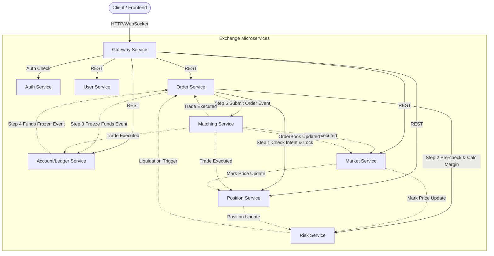

展示各微服務之間的調用關係與數據流向。

```mermaid
flowchart TB
    Client(["Client / Frontend"])

    subgraph "Exchange Microservices"
        Gateway[Gateway Service]
        Auth[Auth Service]
        User[User Service]
        Order[Order Service]
        Risk[Risk Service]
        Account["Account/Ledger Service"]
        Position[Position Service]
        Market[Market Service]
        Matching[Matching Service]
    end

    %% Client Access
    Client -->|HTTP/WebSocket| Gateway
    Gateway -->|Auth Check| Auth
    Gateway -->|REST| User
    Gateway -->|REST| Order
    Gateway -->|REST| Account
    Gateway -->|REST| Position
    Gateway -->|REST| Market

    %% Core Trading Flow (Sync/REST)
    Order -->|Step 1 Check Intent & Lock| Position
    Order -->|Step 2 Pre-check & Calc Margin| Risk

    %% Core Trading Flow (Async/Event)
    Order -.->|Step 3 Freeze Funds Event| Account
    Account -.->|Step 4 Funds Frozen Event| Order
    Order -.->|Step 5 Submit Order Event| Matching

    %% Post-Matching Flow (Async/Event)
    Matching -.->|Trade Executed| Account
    Matching -.->|Trade Executed| Position
    Matching -.->|Trade Executed| Market
    Matching -.->|Trade Executed| Order
    Matching -.->|OrderBook Updated| Market

    %% Feedback Loops & Risk Control
    Market -.->|Mark Price Update| Position
    Market -.->|Mark Price Update| Risk
    Position -.->|Position Update| Risk
    Risk -.->|Liquidation Trigger| Order
```
