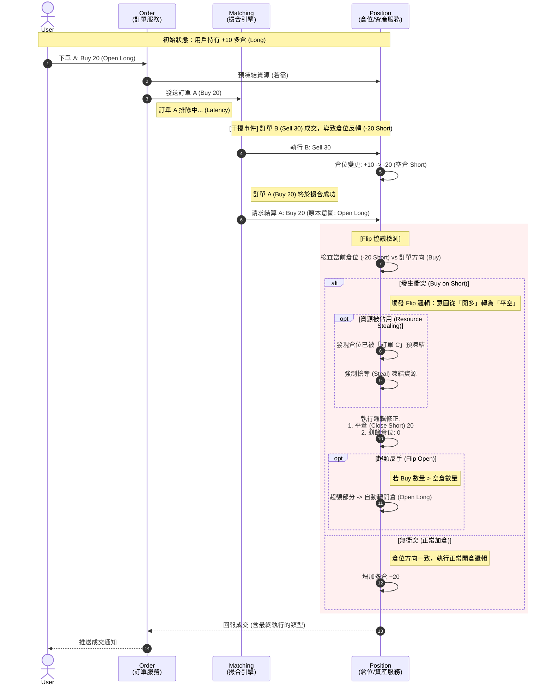

# 影片開場 PPT 設計 (Single Slide Strategy)

此頁面用於影片開頭，依照影片敘事順序，條列式介紹本集將探討的核心主題。

## Option A: Chinese Version (中文版)

> **標題 (Title):** Open Exchange Core: 架構與 SDK 設計揭秘
> **副標題 (Subtitle):** 打造微秒級高頻交易系統的核心技術
>
> **本集大綱 (Agenda):**
1.  核心架構：LMAX 無鎖架構與微秒級確定性延遲:
		全鏈路異步事件驅動 / LMAX 無鎖架構 + 內存佇列定序 + WAL 順序持久化，消除隨機 IO 抖動，確保微秒級確定性延遲。
		徹底解除傳統資料庫鎖 (Lock) 與隨機 I/O 的效能枷鎖。
2.  CQRS 分離與分場景極致優化:
		Matching 服務: 單執行緒批次處理 + 順序 I/O；採用預匹配 (Pre-match) 機制，將整批訂單 WAL 寫入精簡至單次 IO，將硬體性能發揮至極限。
		Market Data 服務: 基於撮合引擎輸出的深度訂單簿與即時 K 線統計，構建 L1/L2 多級緩存矩陣，從容應對百萬級行情風暴。
3.  帳戶與風控體系：嚴守會計準則與複式記帳鐵律:
		帳戶: 堅守複式記帳法鐵律；支援任意時刻的資產負債表快照重建，確保 100% 財務數據完整性，使體系內每一筆金流的會計操作皆精確可追溯。
		風控: 嚴格事前風控 (Pre-Trade Check) 與即時動態保證金計算，預防平台與用戶權益損失，大幅減少異常補償的操作耗損。
4.  分佈式一致性：根除資源搶奪與自動補償:
		Flip 協議: 擴展分佈式事務機制，根除多節點資源搶奪 (Anti-Stealing) 與超賣風險。
		異常處理: 內建自動補償 (Compensation) 流程，處理分佈式事務併發異常下的最終一致性。
5.  彈性擴展策略：無限水平擴容與線性增長:
		無狀態層: 網關與查詢服務具備無限水平擴容能力，彈性應對流量洪峰。
		有狀態核心: 透過交易對精確分片 (Sharding)，實現吞吐量與性能的線性增長。

## Option B: English Version (英文版)

> **Title:** Open Exchange Core: Architecture & SDK Design
> **Subtitle:** Building the Core of a Microsecond-Level HFT System
>
> **Agenda:**
1.  Core Architecture: LMAX Lock-free Architecture & Microsecond Deterministic Latency:
		Full-link Asynchronous Event-Driven / LMAX Lock-free Arch + Memory Queue Sequencing + WAL Sequential Persistence; eliminating random IO jitter for Microsecond Deterministic Latency.
		Shattering the performance shackles of traditional DB locks and random I/O.
2.  CQRS & Scenario-Based Extreme Optimization:
		Matching Service: Single-threaded batching & Sequential I/O; utilizing Pre-match mechanism to consolidate WAL writes into a single IO per batch, maximizing hardware limits.
		Market Data Service: Based on high-depth Orderbooks and real-time K-line statistics output from the matching engine, constructing a L1/L2 Multi-Level Caching Matrix to effortlessly handle million-scale traffic storms.
3.  Accounts & Risk: Strict Accounting Compliance & Double-Entry Iron Law:
		Accounts: Adhering to the Double-Entry Iron Law; enabling instant balance sheet reconstruction at any moment, ensuring 100% financial integrity and full traceability for every accounting operation within the financial flow.
		Risk: Strict Pre-Trade Checks and dynamic margin calculation; safeguarding equity and minimizing performance overhead from anomaly compensation.
4.  Distributed Consistency: Eradicating Contention & Auto-Compensation:
		Flip Protocol: Extending distributed transaction mechanism; eradicating multi-node Resource Contention (Anti-Stealing) and overselling risks.
		Error Handling: Built-in Auto-Compensation flow; handling eventual consistency under concurrent distributed transaction anomalies.
5.  Scalability Strategy: Unlimited Horizontal Scaling & Linear Growth:
		Stateless Layer: Unlimited Horizontal Scaling to elastically absorb traffic spikes.
		Stateful Core: Linear performance growth via precise Symbol Sharding and resource isolation.

---

# Open Exchange Core - 技術展示系列 Ep.1：系統架構與 SDK 設計

**影片長度：** 約 4 - 4.5 分鐘
**核心亮點：** CQRS、LMAX、WAL、Flip 分佈式事務協議、多級緩存

---

## 1. 系統架構總覽 (System Architecture Overview)

**目標：** 深入剖析為何傳統架構無法支撐金融級高頻交易，並展示 Open Exchange Core 如何透過架構創新解決此問題。

| 時間   | 畫面 (Visual)                                                                                                                                                                                 | 旁白腳本 (Audio)                                                                                                                                                              | 執行建議 |
| :--- | :------------------------------------------------------------------------------------------------------------------------------------------------------------------------------------------ | :------------------------------------------------------------------------------------------------------------------------------------------------------------------------ | :--- |
| 0:00 | **[對比動畫：傳統 vs 現代]** 左邊顯示「傳統架構」：大量請求擠向一個 Database 圖示，DB 出現紅色鎖頭 (Lock)。 右邊顯示「Open Exchange Core」：數據像流水一樣通過管道 (Kafka)。                                                                   | 傳統金融系統往往受限於資料庫的 ACID 鎖機制。當海量訂單湧入時，行級鎖會導致嚴重的資源競爭。Open Exchange Core 徹底摒棄了這種依賴，採用了**全異步的事件驅動架構**。                                                                           |      |
| 0:25 | **[架構特寫：LMAX 核心思想]** 畫面顯示一個類似 CPU 管道的圖示。 標註：**Disruptor Pattern / Memory Queue Sequencing**。 數據單向流動，無鎖競爭。                                                                          | 我們借鑒了 **LMAX Disruptor** 的架構思想，並結合了**內存佇列定序**機制。在最核心的撮合環節，我們完全移除了隨機磁碟 I/O 與鎖競爭，確保了微秒級的確定性延遲。                                                                              |      |
| 0:40 | **[深度解析：WAL 與預匹配機制]** 畫面顯示一個 **File** 圖示，數據以 **Batch** 的形式快速寫入。 標註：**Sequential Write / Pre-match Optimization**。 動畫：整批訂單在內存預匹配後，合併為單次 WAL 寫入。 然後演示系統崩潰 (Crash) 與快速恢復 (Replay)。 | 為了確保數據絕對安全，我們實現了 **WAL (Write-Ahead Logging)**。更進一步地，我們採用了**預匹配 (Pre-match)** 機制，將整批訂單的處理與寫入精簡至**單次順序 I/O**——這徹底解除了傳統資料庫隨機 I/O 的效能枷鎖。即便系統瞬間斷電，也能透過重放 WAL 日誌，在毫秒內精確恢復內存狀態。 |      |

---

## 2. 領域服務架構特寫 (Domain Service Architecture)

**目標：** 針對不同服務屬性 (寫入密集、查詢密集、計算密集) 展示差異化的架構設計。

| 時間   | 畫面 (Visual)                                                                                                                                                                                | 旁白腳本 (Audio)                                                                                                                                                                                                                                                                                                                                                                     | 執行建議                     |
| :--- | :----------------------------------------------------------------------------------------------------------------------------------------------------------------------------------------- | :------------------------------------------------------------------------------------------------------------------------------------------------------------------------------------------------------------------------------------------------------------------------------------------------------------------------------------------------------------------------------- | :----------------------- |
| 1:15 | **[CQRS 宏觀視角]** 畫面將服務分為兩群： ⬅️ **Command Side (寫):** Order, Matching (紅色) ➡️ **Query Side (讀):** Market, History (藍色)                                                              | 整個系統遵循 **CQRS (命令查詢職責分離)** 原則。針對不同的業務型態，我們採用了截然不同的優化策略。                                                                                                                                                                                                                                                                                                                          | 引入 CQRS 概念。              |
| 1:25 | **[Matching & Order (寫入極致)]** 特寫撮合引擎。 關鍵字：**Pre-match**, **Batching**, **Single-Thread**。                                                                                            | 對於寫入密集的 **Matching Service**，我們追求極致的低延遲。透過單執行緒無鎖設計與**預匹配 (Pre-match)** 技術，我們將硬體性能發揮至極限，確保每一筆訂單都能在微秒級完成定序、撮合與 WAL 寫入。                                                                                                                                                                                                                                                             | 總結寫入端特點。                 |
| 1:40 | **[Market Data (查詢與緩存)]** 特寫行情服務。 畫面顯示：Request -> **L1 Cache (Local)** -> **L2 Cache (Redis)**。 內容：深度訂單簿 (Orderbook) 與即時 K 線統計。                                                   | 對於查詢密集的 **Market Data Service**，挑戰在於海量數據的頻繁讀取。我們構建了 **L1/L2 多級緩存矩陣**，基於撮合引擎輸出的**深度訂單簿**與**即時 K 線統計**，讓系統能從容應對百萬級的行情風暴。                                                                                                                                                                                                                                                           |                          |
| 2:00 | **[Asset & Risk (帳戶與風控)]** 特寫資產與風控模組。 Asset 顯示：**Double-Entry (複式記帳)** 與 **Accounting Compliance**。 Risk 顯示：**Pre-Trade Check (事前風控)**。                                           | 對於最核心的 **Asset (帳戶)** 與 **Risk (風控)**，我們嚴守**會計準則與複式記帳鐵律**。資產層能隨時重建任意時刻的資產負債表快照，確保 100% 財務數據完整性，使體系內每一筆金流的操作皆精確可追溯。而風控則採用**事前檢查模型 (Pre-Trade Check)**，在即時保障用戶與平台權益的同時，極大化減少了因異常補償帶來的效能損耗。                                                                                                                                                                                         |                          |
| 2:20 | **[分佈式事務：Flip 協議]** 畫面顯示兩個節點同時嘗試扣款。 出現 **Flip Protocol** 的動畫： 1. **Try Flip**: 嘗試翻轉狀態。 2. **Confirm/Cancel**: 成功則提交，失敗則回滾。 關鍵字：**Anti-Stealing**, **Eventual Consistency**。 |   「在分佈式環境下，最難處理的就是『意圖與現實的落差』。   舉個例子：用戶原本持有多倉並下單買入，但當這筆訂單真正成交時，他的倉位可能因為其他交易已經變成了空倉。這時候，原本的『加倉買入』必須瞬間變成『平倉買回』，甚至如果買得夠多，還得再轉回『做多』。      更棘手的是，如果這時候倉位額度已經被其他還沒成交的訂單鎖住了怎麼辦？ 我們設計了 Flip 分佈式事務協議。它賦予了『已成交訂單』最高權限，能即時搶奪 (Steal) 被預佔的資源，並讓被搶奪的訂單在未來成交時自動進行邏輯修正。這套機制完美解決了多節點間的資源競爭與超賣風險，確保了極端併發下的帳務準確性。」  另外當發生異常時，系統會自動觸發**補償機制 (Compensation)**，回滾已執行的操作，確保最終一致性。 | **(新增重點)** Flip 協議與補償機制。 |
| 2:50 | **[彈性擴展總結]** 畫面縮小回全景。 Gateway, Market, Asset像細胞分裂一樣快速複製 (Stateless/DB-Backed)。 Matching 則依據幣種分片 (Stateful In-Memory)。                                                            | 正因如此，我們的擴展策略也是分層的：Gateway、Market 甚至 Asset Service 等服務，因為不持有內存狀態，可以無限水平擴展以應對流量；而唯獨擁有核心內存狀態的 Matching Engine，透過**交易對分片 (Sharding)** 來實現資源隔離與線性擴容。                                                                                                                                                                                                                                  |                          |

---

## 4. 總結 (Wrap-up)

| 時間   | 畫面 (Visual)                                                                                                | 旁白腳本 (Audio)                                                                                                                                         | 執行建議 |
| :--- | :--------------------------------------------------------------------------------------------------------- | :--------------------------------------------------------------------------------------------------------------------------------------------------- | :--- |
| 4:05 | **[回到全景架構圖 + 關鍵字]** 文字依序浮現： 1. **CQRS & LMAX** 2. **Flip Protocol** 3. **Multi-Level Caching** | Open Exchange Core 的架構哲學很簡單：透過 CQRS 分離讀寫，透過LMAX架構處理寫入密集型任務，透過 Flip 協議與補償確保一致性，透過資產帳戶體系設計掌握每一分金流與稽核，透過Risk模塊保障用戶與平台權益，透過多級緩存極大化吞吐。這是一個為速度與準確性而生的金融核心。 |      |

## 附錄：Flip 協議時序圖 (Mermaid)

